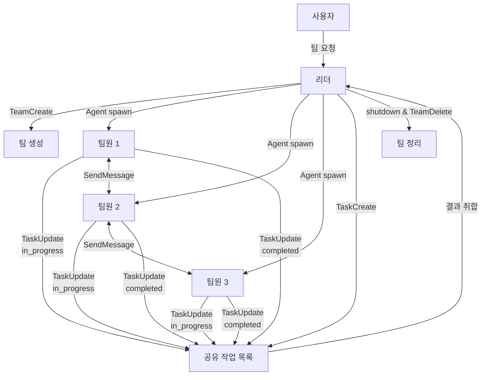
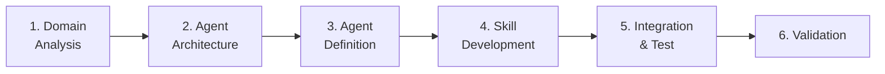

> Agent Teams + tmux + revfactory/harness를 활용한 Claude Code 다중 에이전트 협업 완전 정복

## 이 가이드에 대하여

이 가이드는 Claude Code에서 **여러 AI 에이전트를 팀으로 조직하여 협업**하는 방법을 처음부터 차근차근 설명합니다. 세 가지 핵심 주제를 다룹니다:

| 주제 | 역할 |
|------|------|
| **Agent Teams** | Claude Code 내장 다중 에이전트 협업 시스템 |
| **tmux** | 터미널 분할 도구, Agent Teams의 시각적 표시에 활용 |
| **revfactory/harness** | 에이전트 팀 설계를 자동화하는 Claude Code 플러그인 |

> **Tip**: 이 가이드 자체가 Agent Teams를 사용하여 작성되었습니다. 3명의 팀원이 각 섹션을 병렬로 작성했습니다.

---

## Part 1: Agent Teams 기초

### 1.1 Agent Teams란?

Agent Teams는 여러 Claude Code 인스턴스를 하나의 **팀(Team)** 으로 조율하여 함께 작동하게 하는 기능입니다.

```
┌─────────────────────────────────────────────┐
│                  사용자                       │
│                    │                          │
│              ┌─────▼─────┐                   │
│              │   리더     │ ← 메인 세션       │
│              │Team Leader │                   │
│              └──┬───┬───┬┘                   │
│                 │   │   │                     │
│          ┌──────▼┐ ┌▼───┐ ┌▼──────┐         │
│          │팀원 A │ │팀원B│ │팀원 C  │         │
│          │       │↔│    │↔│       │         │
│          └───────┘ └────┘ └───────┘         │
│            ← 서로 직접 통신 가능 →            │
└─────────────────────────────────────────────┘
```

**핵심 특징**:
- **리더(Team Leader)**: 팀을 만들고 조율하는 메인 세션
- **팀원(Teammates)**: 독립적으로 작동하는 별도의 Claude 인스턴스
- **공유 작업 목록**: 팀원들이 요청하고 완료하는 작업 항목
- **직접 통신**: 리더를 거치지 않고 팀원 간 직접 메시지 전송 가능

### 1.2 Subagents vs Agent Teams — 무엇을 써야 할까?

| 구분 | Subagents | Agent Teams |
|------|-----------|-------------|
| **통신** | 메인 에이전트에게만 결과 보고 | 팀원들이 서로 직접 메시지 전송 |
| **조율** | 메인 에이전트가 모든 작업 관리 | 공유 작업 목록으로 자체 조율 |
| **토큰 비용** | 낮음 (결과가 메인 컨텍스트로 요약) | 높음 (각 팀원이 별도 인스턴스) |
| **최적 사례** | 결과만 중요한 집중된 작업 | 논의와 협업이 필요한 복잡한 작업 |

**선택 기준**:
- **Subagents**: "이 파일에서 버그 찾아줘" → 결과만 받으면 됨
- **Agent Teams**: "프론트엔드, 백엔드, 보안 전문가가 함께 PR 리뷰해줘" → 서로 논의 필요

### 1.3 활성화하기

Agent Teams는 **기본적으로 비활성화**된 실험적 기능입니다. 환경변수로 활성화합니다.

**방법 1: 셸에서 직접 설정**
```bash
export CLAUDE_CODE_EXPERIMENTAL_AGENT_TEAMS=1
```

**방법 2: settings.json에 영구 설정**
```json
{
  "env": {
    "CLAUDE_CODE_EXPERIMENTAL_AGENT_TEAMS": "1"
  }
}
```

**방법 3: Claude Code 실행 시 설정**
```bash
CLAUDE_CODE_EXPERIMENTAL_AGENT_TEAMS=1 claude
```

### 1.4 팀 시작하기

자연어로 Claude에게 원하는 작업을 설명하면 자동으로 팀을 구성합니다.

**예시 1: 다각도 PR 리뷰**
```
Create an agent team to review PR #142. Spawn three reviewers:
- One focused on security implications
- One checking performance impact
- One validating test coverage
Have them each review and report findings.
```

**예시 2: 병렬 모듈 리팩토링**
```
Create a team with 3 teammates to refactor these modules in parallel.
Use Sonnet for each teammate.
```

**예시 3: 경쟁 가설로 디버깅**
```
Users report the app exits after one message. Spawn 3 agent teammates
to investigate different hypotheses. Have them debate to find the root cause.
```

### 1.5 팀 워크플로우



### 1.6 작업 관리

| 도구 | 용도 |
|------|------|
| `TaskCreate(subject, description)` | 새 작업 생성 (상태: pending) |
| `TaskList()` | 모든 작업 조회 |
| `TaskUpdate(taskId, status, owner)` | 작업 상태/담당자 업데이트 |
| `TaskGet(taskId)` | 특정 작업 상세 조회 |

**작업 상태 흐름**:
```
pending → in_progress → completed
                    └→ deleted
```

**작업 종속성 설정**:
- `blocks`: 이 작업이 완료되어야 다른 작업 시작 가능
- `blockedBy`: 다른 작업이 완료되어야 이 작업 시작 가능

### 1.7 메시징 시스템

```
SendMessage(to, message)
```

- `to`: 팀원 이름 (예: "researcher") 또는 `"*"` (전체 브로드캐스트)
- `message`: 전송할 내용

**특징**:
- 자동 전달: 수신자가 메시지를 자동으로 받음
- 유휴 알림: 팀원이 작업 완료 후 리더에게 자동 알림
- 브로드캐스트: `"*"`로 모든 팀원에게 전송 (비용 증가하므로 드물게 사용)

### 1.8 모범 사례

**적절한 사용 사례**:
- 여러 팀원이 문제의 다양한 측면을 동시에 조사
- 팀원들이 각각 별도의 모듈/기능을 소유하여 간섭 없이 작업
- 경쟁 가설을 병렬로 테스트하여 빠르게 수렴
- 프론트엔드, 백엔드, 테스트에 걸친 교차 계층 변경

**부적절한 사용 사례**:
- 순차적 작업, 동일 파일 편집, 많은 종속성이 있는 작업
- 일상적이고 단순한 작업 (단일 세션이 더 효율적)

**팀 규모 가이드라인**:
- 권장 시작 규모: **3-5명**
- 팀원당 **5-6개** 작업 유지
- 3명의 집중된 팀원이 5명의 산만한 팀원을 능가

**비용 관리 팁**:
- 각 팀원은 자체 **컨텍스트 윈도우**(AI가 기억하는 대화 범위)를 사용 → **토큰**(AI 사용량 단위) 비용이 팀원 수만큼 증가
- 활성 팀원은 작업이 없어도(유휴 상태) 토큰 소비
- 코디네이션 작업에 비용이 낮은 Sonnet 모델 사용
- 작업 완료 후 즉시 팀 정리

> **Warning**: 두 팀원이 동일한 파일을 편집하면 덮어쓰기 발생. 각 팀원이 **다른 파일 집합**을 소유하도록 작업을 분할하세요.

### 1.9 제한 사항 (현재 실험 단계)

| 제한 사항 | 설명 |
|-----------|------|
| 세션 재회 미지원 | `/resume`, `/rewind`가 팀원을 복원하지 않음 |
| 세션당 1팀 | 리더는 한 번에 하나의 팀만 관리 가능 |
| 중첩 팀 불가 | 팀원은 자신의 팀 생성 불가 |
| 리더 고정 | 팀 생성 세션이 수명 동안 리더 |
| 권한 생성 시점 설정 | 팀원별 모드를 생성 시점에 개별 설정 불가 |

### 1.10 키보드 단축키 (In-process 모드)

> **Note**: tmux 없이 일반 터미널에서 Agent Teams를 사용하는 기본 모드입니다. `Shift+Down`으로 팀원들을 순환하며 확인합니다.

| 단축키 | 기능 |
|--------|------|
| `Shift+Down` | 팀원 순환 (마지막 팀원 후 리더로 복귀) |
| `Enter` | 팀원 세션 내용 보기 |
| `Escape` | 현재 턴 중단 |
| `Ctrl+T` | 작업 목록 토글 |

> **Tip**: 일반 터미널에서는 팀원을 순환하며 봐야 합니다. **모든 팀원을 한 화면에서 동시에 보려면** Part 2의 tmux를 설정하세요.

---

## Part 2: tmux — 터미널 멀티플렉서

### 2.1 tmux란?

**tmux**(Terminal Multiplexer)는 하나의 터미널을 여러 개로 분할하고, 세션을 백그라운드에서 유지할 수 있게 해주는 도구입니다.

**Agent Teams에서의 역할**: 팀원 각각이 자신의 터미널 창을 가져 **모든 출력을 한 번에 볼 수 있는 split-pane 모드**를 제공합니다.

```
tmux 없이 (In-process 모드):
┌─────────────────────────┐
│  리더 (Shift+Down으로    │
│  팀원 순환하며 확인)     │
└─────────────────────────┘

tmux 사용 (Split-pane 모드):
┌────────┬────────────────┐
│ 리더   │  팀원 A        │
│        │                │
│        ├────────────────┤
│        │  팀원 B        │
│        │                │
│        ├────────────────┤
│        │  팀원 C        │
└────────┴────────────────┘
```

### 2.2 설치

```bash
# macOS
brew install tmux

# Ubuntu/Debian
sudo apt install tmux

# 버전 확인
tmux -V
```

### 2.3 핵심 개념

tmux는 3가지 계층 구조로 이루어집니다:

```
Session (세션)
  └── Window (윈도우 = 탭)
        └── Pane (패널 = 분할된 영역)
```

| 개념 | 설명 | 비유 |
|------|------|------|
| **Session** | tmux의 최상위 단위. detach/attach 가능 | 브라우저 창 |
| **Window** | 세션 내의 탭 | 브라우저 탭 |
| **Pane** | 윈도우 내 분할 영역 | 탭 내 분할 화면 |

### 2.4 자주 사용하는 단축키

> tmux의 모든 단축키는 **prefix 키(`Ctrl+b`)**를 먼저 누른 후 입력합니다.

#### 세션 관리

| 단축키 | 기능 | 명령어 |
|--------|------|--------|
| `Ctrl+b` → `d` | 세션 분리 (detach) | `tmux detach` |
| — | 세션 목록 | `tmux ls` |
| — | 세션 재연결 | `tmux attach -t 이름` |
| — | 새 세션 생성 | `tmux new -s 이름` |
| — | 세션 종료 | `tmux kill-session -t 이름` |

#### 윈도우 관리

| 단축키 | 기능 |
|--------|------|
| `Ctrl+b` → `c` | 새 윈도우 생성 |
| `Ctrl+b` → `n` | 다음 윈도우로 이동 |
| `Ctrl+b` → `p` | 이전 윈도우로 이동 |
| `Ctrl+b` → `w` | 윈도우 목록 |
| `Ctrl+b` → `&` | 현재 윈도우 종료 |
| `Ctrl+b` → `,` | 윈도우 이름 변경 |

#### 패널 관리

| 단축키 | 기능 |
|--------|------|
| `Ctrl+b` → `%` | 좌우 분할 |
| `Ctrl+b` → `"` | 상하 분할 |
| `Ctrl+b` → `방향키` | 패널 간 이동 |
| `Ctrl+b` → `x` | 현재 패널 종료 |
| `Ctrl+b` → `z` | 현재 패널 전체화면 토글 |
| `Ctrl+b` → `q` | 패널 번호 표시 (번호 눌러 이동) |

#### 기타

| 단축키 | 기능 |
|--------|------|
| `Ctrl+b` → `?` | 모든 단축키 도움말 |
| `Ctrl+b` → `[` | 복사 모드 (스크롤 가능, `q`로 종료) |

### 2.5 Claude Code와 tmux 연동

#### 왜 tmux가 필요한가?

Agent Teams의 **split-pane 모드**를 사용하려면 tmux(또는 iTerm2)가 필요합니다. split-pane 모드에서는:
- 각 팀원이 자신의 터미널 창을 가짐
- 모든 출력을 한 번에 볼 수 있음
- 창을 클릭하여 직접 상호작용 가능

#### 설정 방법

**1. 환경변수 설정**
```bash
export CLAUDE_CODE_EXPERIMENTAL_AGENT_TEAMS=1
```

**2. settings.json에 표시 모드 설정**
```json
{
  "teammateMode": "tmux"
}
```

**3. tmux 세션에서 Claude Code 실행**
```bash
# tmux 세션 생성
tmux new -s agent-team

# 세션 내에서 Claude Code 실행
claude
```

> **Tip**: `teammateMode`를 `"auto"`(기본값)로 설정하면, tmux 세션 내에서 실행 중이면 자동으로 split-pane 모드, 아니면 in-process 모드를 사용합니다.

#### 실제 사용 워크플로우

```bash
# 1. tmux 세션 시작
tmux new -s my-project

# 2. 세션 내에서 Claude Code 실행
claude

# 3. Agent Team 요청
> "Create an agent team with 3 teammates to refactor the API module"

# 4. 각 팀원이 자동으로 tmux pane에 배치됨
# 5. 마우스 클릭 또는 Ctrl+b+방향키로 패널 전환

# 6. 작업 완료 후 팀 정리
> "Clean up the team"

# 7. tmux 세션 종료
exit  # 또는 Ctrl+b → d로 detach
```

#### 표시 모드 비교

| 모드 | 장점 | 단점 | 요구사항 |
|------|------|------|----------|
| **In-process** | 모든 터미널에서 작동 | 팀원을 순환하며 봐야 함 | 없음 |
| **Split-pane** | 모든 출력 동시 확인 | 추가 도구 필요 | tmux 또는 iTerm2 |

### 2.6 tmux 유용한 팁

**세션 백그라운드 유지**:
```bash
# SSH 연결이 끊겨도 tmux 세션은 유지됨
tmux new -s work      # 세션 생성
# ... 작업 수행 ...
Ctrl+b → d            # detach (세션 유지)
# 나중에 재연결
tmux attach -t work   # 세션 재연결
```

**고아 세션 정리**:
```bash
# 세션 목록 확인
tmux ls

# 특정 세션 종료
tmux kill-session -t session-name

# 모든 세션 종료
tmux kill-server
```

---

## Part 3: revfactory/harness — 에이전트 팀 자동 설계

### 3.1 Harness란?

**revfactory/harness**는 Claude Code 플러그인으로, 도메인에 특화된 에이전트 팀을 **자동으로 설계하고 생성**합니다. 수동으로 에이전트 정의를 작성하는 대신, 자연어로 요구사항을 설명하면 최적의 팀 구조를 자동 생성합니다.

```
수동 방식:
  사용자 → 직접 .claude/agents/ 파일 작성 → 에이전트 정의

Harness 방식:
  사용자 → 자연어로 요구사항 설명 → Harness가 자동으로 에이전트 팀 생성
```

**핵심 가치**:
- 도메인 분석부터 에이전트 정의까지 **6단계 자동화**
- 6가지 검증된 아키텍처 패턴 제공
- A/B 테스트에서 **+60% 품질 향상**, 15개 태스크 **100% 승률** 입증

### 3.2 설치

**방법 1: 마켓플레이스 (권장)**
```bash
# Claude Code 내에서 실행
/plugin marketplace add revfactory/harness
```

**방법 2: 직접 복사**
```bash
# GitHub에서 클론 후 skills/harness 디렉토리를 프로젝트에 복사
git clone https://github.com/revfactory/harness.git
cp -r harness/skills/harness .claude/skills/
```

### 3.3 6가지 아키텍처 패턴

Harness는 6가지 검증된 팀 아키텍처 패턴을 제공합니다. 작업 성격에 맞는 패턴을 선택하세요.

#### 1. Pipeline (파이프라인)

```
입력 → [에이전트 A] → [에이전트 B] → [에이전트 C] → 출력
```

- **특징**: 순차적 처리 체인. 각 단계의 출력이 다음 단계의 입력
- **적합한 경우**: 데이터 변환 파이프라인, 빌드 프로세스, 콘텐츠 생성
- **예시**: 원문 → 번역 에이전트 → 교정 에이전트 → 포맷팅 에이전트

#### 2. Fan-out/Fan-in (병렬 분산-취합)

```
         ┌→ [에이전트 A] →┐
입력 → [분배]                [취합] → 출력
         └→ [에이전트 B] →┘
```

- **특징**: 작업을 병렬로 분산 후 결과를 취합
- **적합한 경우**: 독립적인 하위 작업이 많은 경우, 대규모 코드 리뷰
- **예시**: 코드베이스를 3개 영역으로 나누어 병렬 리뷰 후 결과 취합

#### 3. Expert Pool (전문가 풀)

```
요청 → [라우터] → 가장 적합한 전문가 선택 → 결과
         ↑
   [전문가 A] [전문가 B] [전문가 C]
```

- **특징**: 전문가 풀에서 요청에 가장 적합한 에이전트를 동적 선택
- **적합한 경우**: 다양한 유형의 요청을 처리해야 하는 경우
- **예시**: 질문 분류 → 보안/성능/스타일 전문가 중 적합한 에이전트 배정

#### 4. Producer-Reviewer (생성자-검토자)

```
[생성자] → 산출물 → [검토자] → 피드백 → [생성자] → 개선된 산출물
```

- **특징**: 생성과 검토를 번갈아 수행하며 품질 향상
- **적합한 경우**: 코드 작성, 문서 생성, 디자인 등 품질 검증이 중요한 작업
- **예시**: 코드 생성 → 보안 검토 → 피드백 반영 → 재검토

#### 5. Supervisor (감독자)

```
[감독자]
  ├── [워커 A]
  ├── [워커 B]
  └── [워커 C]
```

- **특징**: 감독자가 작업을 분배하고 진행 상황을 모니터링
- **적합한 경우**: 복잡한 작업의 체계적 관리가 필요한 경우
- **예시**: 프로젝트 매니저가 프론트엔드/백엔드/테스트 팀에 작업 분배

#### 6. Hierarchical Delegation (계층적 위임)

```
[리더]
  ├── [매니저 A]
  │     ├── [워커 A1]
  │     └── [워커 A2]
  └── [매니저 B]
        ├── [워커 B1]
        └── [워커 B2]
```

- **특징**: 리더 → 매니저 → 워커의 계층 구조로 대규모 작업 관리
- **적합한 경우**: 대규모 프로젝트, 다층적 결정이 필요한 복잡한 작업
- **예시**: CTO → 테크리드(프론트/백엔드) → 개발자

### 3.4 사용 방법

Harness를 설치하면 Claude Code 내에서 자연어로 에이전트 팀을 설계할 수 있습니다.

**기본 사용**:
```
Design an agent team for code review that:
- Analyzes code quality, security, and performance
- Provides actionable feedback
- Supports multiple programming languages
```

**아키텍처 패턴 지정**:
```
Design a Pipeline pattern agent team for processing customer support tickets:
- Classify incoming tickets
- Route to appropriate handler
- Generate response draft
- Quality check before sending
```

**프로젝트 컨텍스트 제공**:
```
Analyze this project's domain and design an agent team for automated testing:
- The project is a Spring Boot REST API
- Focus on integration tests and API contract tests
- Use the Producer-Reviewer pattern
```

### 3.5 Harness 워크플로우 (6단계)



| 단계 | 설명 | 출력 |
|------|------|------|
| **1. Domain Analysis** | 프로젝트 도메인 분석 | 도메인 모델, 핵심 개념 |
| **2. Agent Architecture** | 최적 아키텍처 패턴 선택 | 팀 구조도, 역할 정의 |
| **3. Agent Definition** | 에이전트 정의 파일 생성 | `.claude/agents/` 디렉토리 |
| **4. Skill Development** | 스킬 정의 파일 생성 | `.claude/skills/` 디렉토리 |
| **5. Integration** | 통합 및 테스트 | 연동 테스트 결과 |
| **6. Validation** | 검증 및 문서화 | 최종 산출물 |

### 3.6 생성되는 파일 구조

Harness를 실행하면 프로젝트에 다음 파일들이 생성됩니다:

```
.claude/
├── agents/
│   ├── code-reviewer.md      # 코드 리뷰 에이전트 정의
│   ├── security-analyst.md   # 보안 분석 에이전트 정의
│   ├── test-validator.md     # 테스트 검증 에이전트 정의
│   └── team-coordinator.md   # 팀 코디네이터 정의
└── skills/
    ├── code-review.md        # 코드 리뷰 스킬 정의
    ├── security-scan.md      # 보안 스캔 스킬 정의
    └── test-generation.md    # 테스트 생성 스킬 정의
```

### 3.7 실제 사용 사례

**사례 1: 자동 코드 리뷰 시스템**
```
Design an agent team for PR review using Producer-Reviewer pattern:
- Security expert checks for vulnerabilities
- Performance analyst reviews efficiency
- Style checker ensures code conventions
- All findings are consolidated into one report
```

**사례 2: 문서 자동 생성**
```
Design a Pipeline pattern agent team for API documentation:
- API endpoint extractor
- Example generator
- Documentation formatter
- Quality reviewer
```

**사례 3: 대규모 리팩토링**
```
Design a Hierarchical Delegation agent team for module refactoring:
- Architecture lead decides refactoring strategy
- Module managers handle individual modules
- Worker agents implement changes
- Integration tests verify no regressions
```

---

## Part 4: 종합 실습 — 가이드 작성을 팀으로 진행하기

이 가이드 자체가 Agent Teams를 사용하여 작성되었습니다. 실제 진행 과정을 공유합니다.

### 4.1 팀 구성

```
리더 (team-lead)
  ├── teams-writer  → Part 1: Agent Teams 기초 섹션 작성
  ├── tmux-writer   → Part 2: tmux 섹션 작성
  └── harness-writer → Part 3: Harness 섹션 작성
```

### 4.2 진행 과정

**Phase 1: 팀 생성**
```
사용자: "Agent Teams, tmux, harness를 포괄하는 초보자 가이드를
        에이전트 팀을 구성하여 작성해 주세요."

리더: TeamCreate(team_name="guide-writers")
```

**Phase 2: 팀원 생성 (병렬)**
```
리더: Agent(name="teams-writer", prompt="Agent Teams 섹션 작성...")
리더: Agent(name="tmux-writer", prompt="tmux 섹션 작성...")
리더: Agent(name="harness-writer", prompt="harness 섹션 작성...")
```

**Phase 3: 작업 할당**
```
리더: TaskCreate("Agent Teams 섹션 작성") → teams-writer
리더: TaskCreate("tmux 섹션 작성") → tmux-writer
리더: TaskCreate("Harness 섹션 작성") → harness-writer
```

**Phase 4: 병렬 작업 수행**
- 각 팀원이 독립적으로 자신의 섹션을 작성
- 서로 다른 파일/섹션을 담당하여 충돌 없이 병렬 진행

**Phase 5: 결과 취합 및 정리**
```
리더: 팀원들의 결과를 하나의 가이드로 취합
리더: SendMessage(shutdown_request) → 모든 팀원
리더: TeamDelete()
```

### 4.3 교훈

| 측면 | 결과 |
|------|------|
| **병렬 처리** | 3개 섹션이 동시에 작성되어 시간 단축 |
| **독립성** | 각 팀원이 다른 주제를 담당하여 충돌 없음 |
| **품질** | 전문화된 프롬프트로 각 섹션의 품질 향상 |
| **비용** | 3개의 독립 컨텍스트로 토큰 비용 증가 |

---

## Part 5: 빠른 시작 체크리스트

### 5.1 환경 준비

- [ ] Claude Code 설치 (`npm install -g @anthropic-ai/claude-code`)
- [ ] tmux 설치 (`brew install tmux` 또는 `sudo apt install tmux`)
- [ ] 환경변수 설정 (`CLAUDE_CODE_EXPERIMENTAL_AGENT_TEAMS=1`)
- [ ] tmux 세션에서 Claude Code 실행

### 5.2 첫 팀 만들기

```bash
# 1. tmux 세션 시작
tmux new -s my-first-team

# 2. Claude Code 실행
claude

# 3. 환경변수 확인 (Claude Code 내에서)
> echo $CLAUDE_CODE_EXPERIMENTAL_AGENT_TEAMS

# 4. 팀 구성 요청
> "Create an agent team with 2 teammates to explore
    this codebase from different angles"

# 5. 팀원 순환하며 결과 확인 (in-process)
Shift+Down

# 6. 작업 완료 후 정리
> "Clean up the team"
```

### 5.3 Harness로 자동 설계

```bash
# 1. Harness 설치
/plugin marketplace add revfactory/harness

# 2. 프로젝트에 맞는 팀 설계 요청
> "Design an agent team for this project's specific needs"

# 3. 생성된 에이전트와 스킬 확인
# .claude/agents/ 와 .claude/skills/ 디렉토리 확인

# 4. 생성된 팀으로 작업 시작
> "Use the generated agent team to implement feature X"
```

---

> 축하합니다! 이 가이드를 통해 다음을 배웠습니다:
> 1. **Agent Teams** — 여러 AI 에이전트를 팀으로 조직하는 방법
> 2. **tmux** — 팀원들을 한 화면에서 동시에 보는 방법
> 3. **Harness** — 프로젝트에 맞는 팀 구조를 자동으로 설계하는 방법

---

## 참고 문서

- [Claude Code Agent Teams 공식 문서](https://docs.anthropic.com/en/docs/claude-code/agent-teams)
- [revfactory/harness GitHub](https://github.com/revfactory/harness)
- [tmux 공식 문서](https://github.com/tmux/tmux)
