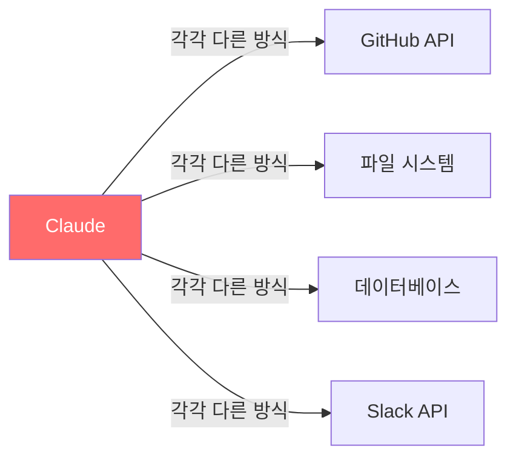
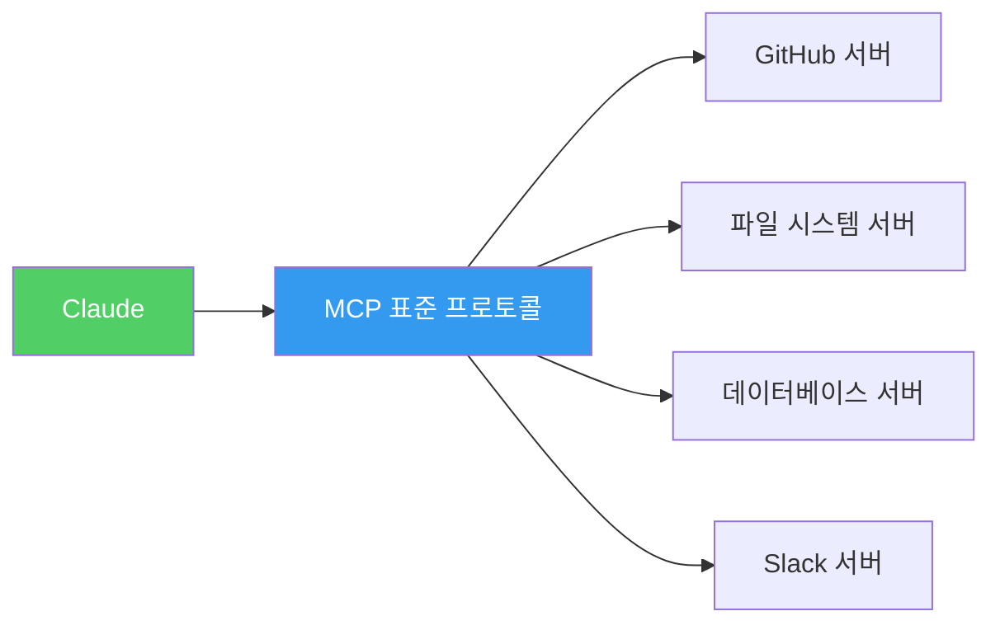
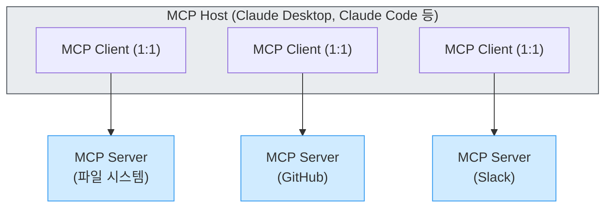
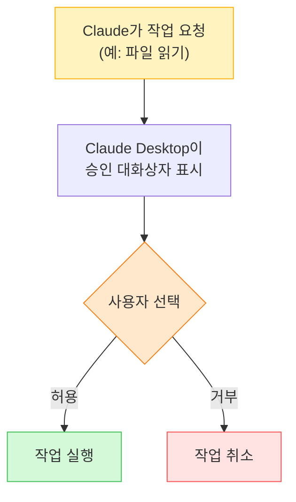

> AI 애플리케이션과 외부 도구를 연결하는 표준 프로토콜, MCP의 핵심 개념부터 실전 설정까지 한 번에 정복

## 이 가이드에 대하여

이 가이드는 **MCP (Model Context Protocol)** 가 무엇인지, 왜 필요한지, 그리고 어떻게 사용하는지를 처음부터 차근차근 설명합니다.

| 주제 | 내용 |
|------|------|
| **MCP란?** | AI 애플리케이션과 외부 시스템을 연결하는 오픈 표준 프로토콜 |
| **왜 중요한가?** | "AI를 위한 USB-C 포트" — 하나의 표준으로 모든 도구 연결 |
| **무엇을 할 수 있나?** | 파일 시스템 접근, 웹 검색, 데이터베이스 쿼리, API 호출 등 |

---

## Part 1: MCP란 무엇인가?

### 1.1 한 줄 요약

**MCP (Model Context Protocol)** 는 AI 애플리케이션이 외부 데이터 소스, 도구, 서비스와 연결되는 방식을 표준화하는 오픈소스 프로토콜입니다.

Anthropic이 2024년 말에 발표했으며, 현재 Claude Desktop, Claude Code, ChatGPT 등 주요 AI 클라이언트에서 지원됩니다.

### 1.2 "AI를 위한 USB-C" 비유

MCP를 이해하는 가장 쉬운 방법은 **USB-C**에 비유하는 것입니다:

| USB-C | MCP |
|-------|-----|
| 다양한 전자기기를 하나의 케이블로 연결 | 다양한 외부 시스템을 하나의 프로토콜로 연결 |
| 충전기, 모니터, 저장소 모두 호환 | 파일 시스템, 데이터베이스, API 모두 호환 |
| 표준 규격으로 생태계가 확장 | 오픈 표준으로 생태계가 확장 |

### 1.3 MCP가 없다면?

MCP가 없을 때의 문제를 살펴보겠습니다:

**MCP 도입 전 — 도구마다 별도 통합 필요:**



**MCP 도입 후 — 하나의 표준으로 모든 도구 연결:**



---

## Part 2: MCP 핵심 아키텍처

### 2.1 세 가지 핵심 구성 요소

MCP는 **클라이언트-서버 아키텍처**를 사용합니다:



| 구성 요소 | 역할 | 예시 |
|-----------|------|------|
| **Host** | LLM 애플리케이션. 연결을 시작하는 주체 | Claude Desktop, Claude Code, IDE |
| **Client** | Host 내부에서 Server와 1:1 연결을 유지 | 프로토콜 핸들러 |
| **Server** | 외부 도구/데이터에 접근하는 기능을 제공 | 파일 시스템 서버, GitHub 서버 |

### 2.2 세 가지 핵심 기능 (Primitives)

MCP Server는 세 가지 유형의 기능을 제공합니다:

| 기능 | 설명 | 예시 |
|------|------|------|
| **Tools (도구)** | AI 모델이 실행할 수 있는 함수 | 파일 읽기, 웹 검색, DB 쿼리 |
| **Resources (리소스)** | AI 모델이 읽을 수 있는 데이터 소스 | 파일 내용, API 응답, DB 스키마 |
| **Prompts (프롬프트)** | 재사용 가능한 프롬프트 템플릿 | 코드 리뷰 템플릿, 요약 프롬프트 |

### 2.3 통신 방식

MCP는 **JSON-RPC 2.0**을 사용하여 메시지를 교환합니다:

| 전송 방식 | 용도 | 특징 |
|-----------|------|------|
| **Stdio** | 로컬 프로세스 통신 | 표준 입력/출력 사용, 가장 간단 |
| **Streamable HTTP** | 원격 통신 | HTTP + SSE, 서버 배포 가능 |

---

## Part 3: 실전 — Claude Desktop에 MCP 연결하기

### 3.1 사전 준비

| 준비물 | 설명 |
|--------|------|
| Claude Desktop | 최신 버전 설치 (macOS / Windows) |
| Node.js | LTS 버전 권장 (`node --version`으로 확인) |

### 3.2 Filesystem Server 연결하기

가장 기본적인 MCP Server인 **Filesystem Server**를 연결해보겠습니다. 이 서버는 Claude가 로컬 파일 시스템에 접근할 수 있게 해줍니다.

**Step 1: 설정 파일 열기**

Claude Desktop의 설정 파일 위치:

| OS | 경로 |
|----|------|
| macOS | `~/Library/Application Support/Claude/claude_desktop_config.json` |
| Windows | `%APPDATA%\Claude\claude_desktop_config.json` |

**Step 2: 설정 파일 편집**

```json
{
  "mcpServers": {
    "filesystem": {
      "command": "npx",
      "args": [
        "-y",
        "@modelcontextprotocol/server-filesystem",
        "/Users/사용자이름/Desktop",
        "/Users/사용자이름/Documents"
      ]
    }
  }
}
```

> **주의**: `사용자이름`을 실제 macOS 사용자 이름으로 변경하세요. 경로는 Claude가 접근을 허용할 디렉토리입니다.

**Step 3: Claude Desktop 재시작**

설정 파일을 저장한 후 Claude Desktop을 완전히 종료하고 다시 실행합니다.

**Step 4: 연결 확인**

Claude Desktop에서 다음과 같이 물어보세요:

- "내 바탕화면에 어떤 파일이 있어?"
- "Documents 폴더 안의 파일 목록을 보여줘"

### 3.3 승인(Acceptance) 흐름

MCP의 모든 작업은 **사용자의 명시적인 승인**이 필요합니다:



---

## Part 4: Claude Code에서 MCP 사용하기

### 4.1 Claude Code MCP 설정

Claude Code CLI에서 MCP 서버를 설정하려면 프로젝트 루트에 `.claude/settings.json`을 편집합니다:

```json
{
  "mcpServers": {
    "filesystem": {
      "command": "npx",
      "args": [
        "-y",
        "@modelcontextprotocol/server-filesystem",
        "/Users/사용자이름/projects"
      ]
    },
    "github": {
      "command": "npx",
      "args": [
        "-y",
        "@modelcontextprotocol/server-github"
      ],
      "env": {
        "GITHUB_PERSONAL_ACCESS_TOKEN": "ghp_여러분의토큰"
      }
    }
  }
}
```

### 4.2 인기 MCP 서버 목록

공식 및 커뮤니티에서 제공하는 대표적인 MCP 서버들:

| 서버 | 기능 | 설치 명령어 |
|------|------|------------|
| **filesystem** | 파일 시스템 읽기/쓰기 | `@modelcontextprotocol/server-filesystem` |
| **github** | GitHub API 연동 | `@modelcontextprotocol/server-github` |
| **git** | Git 작업 | `@modelcontextprotocol/server-git` |
| **fetch** | 웹 페이지 가져오기 | `@modelcontextprotocol/server-fetch` |
| **memory** | 지식 그래프 저장 | `@modelcontextprotocol/server-memory` |
| **sequential-thinking** | 단계적 사고 | `@modelcontextprotocol/server-sequential-thinking` |
| **time** | 시간 정보 | `@modelcontextprotocol/server-time` |

---

## Part 5: 나만의 MCP 서버 만들기

### 5.1 TypeScript로 간단한 서버 만들기

가장 간단한 MCP 서버를 직접 만들어봅시다:

```typescript
import { Server } from "@modelcontextprotocol/sdk/server/index.js";
import { StdioServerTransport } from "@modelcontextprotocol/sdk/server/stdio.js";
import {
  ListToolsRequestSchema,
  CallToolRequestSchema,
} from "@modelcontextprotocol/sdk/types.js";

// 1. 서버 생성
const server = new Server(
  {
    name: "my-first-mcp-server",
    version: "1.0.0",
  },
  {
    capabilities: {
      tools: {},
    },
  }
);

// 2. 도구 목록 정의
server.setRequestHandler(ListToolsRequestSchema, async () => {
  return {
    tools: [
      {
        name: "hello",
        description: "인사말을 반환합니다",
        inputSchema: {
          type: "object",
          properties: {
            name: {
              type: "string",
              description: "인사할 대상 이름",
            },
          },
          required: ["name"],
        },
      },
    ],
  };
});

// 3. 도구 실행 처리
server.setRequestHandler(CallToolRequestSchema, async (request) => {
  if (request.params.name === "hello") {
    const { name } = request.params.arguments;
    return {
      content: [
        {
          type: "text",
          text: `안녕하세요, ${name}님! MCP 서버에 오신 것을 환영합니다.`,
        },
      ],
    };
  }
  throw new Error("알 수 없는 도구입니다.");
});

// 4. 서버 시작
const transport = new StdioServerTransport();
await server.connect(transport);
```

### 5.2 서버 실행 및 등록

**package.json 설정:**

```json
{
  "name": "my-first-mcp-server",
  "version": "1.0.0",
  "type": "module",
  "dependencies": {
    "@modelcontextprotocol/sdk": "^1.0.0"
  }
}
```

```bash
# 의존성 설치
npm install

# 서버 실행 테스트
node index.ts
```

**Claude Desktop에 등록:**

```json
{
  "mcpServers": {
    "my-server": {
      "command": "node",
      "args": ["/절대경로/to/my-server/index.ts"]
    }
  }
}
```

---

## Part 6: MCP 도구 고급 기능

### 6.1 도구 어노테이션 (Tool Annotations)

MCP 도구에는 동작을 설명하는 어노테이션을 추가할 수 있습니다:

| 어노테이션 | 타입 | 기본값 | 설명 |
|-----------|------|--------|------|
| `title` | string | - | UI에 표시할 이름 |
| `readOnlyHint` | boolean | false | 읽기 전용 여부 (환경 변경 없음) |
| `destructiveHint` | boolean | true | 파괴적 작업 여부 |
| `idempotentHint` | boolean | false | 동일 요청 반복 시 동일 결과 |
| `openWorldHint` | boolean | true | 외부 시스템과 상호작용 여부 |

```typescript
// 읽기 전용 검색 도구
{
  name: "search_files",
  description: "파일 내용 검색",
  inputSchema: {
    type: "object",
    properties: {
      query: { type: "string" }
    },
    required: ["query"]
  },
  annotations: {
    title: "파일 검색",
    readOnlyHint: true,      // 환경 변경 없음
    openWorldHint: false      // 외부 시스템 접근 없음
  }
}
```

### 6.2 에러 처리

MCP에서는 에러를 프로토콜 수준이 아닌 **결과 객체 내에** 보고합니다:

```typescript
try {
  const result = performOperation();
  return {
    content: [
      { type: "text", text: `성공: ${result}` }
    ]
  };
} catch (error) {
  return {
    isError: true,
    content: [
      { type: "text", text: `에러: ${error.message}` }
    ]
  };
}
```

> **왜 이렇게 할까?** LLM이 에러를 인식하고 스스로 대응하거나 사용자에게 도움을 요청할 수 있도록 하기 위해서입니다.

---

## Part 7: 보안 모범 사례

### 7.1 핵심 원칙

| 원칙 | 설명 |
|------|------|
| **최소 권한** | MCP 서버에 필요한 최소한의 디렉토리만 접근 허용 |
| **입력 검증** | 모든 매개변수를 스키마에 대해 검증 |
| **경로 정규화** | 파일 경로 조작 공격 방지 |
| **속도 제한** | 리소스 집약적 작업에 대한 요청 제한 |
| **에러 주의** | 내부 에러 메시지에 민감한 정보 노출 금지 |

### 7.2 실전 체크리스트

- [ ] 설정 파일에 민감한 정보(API 키 등)가 환경 변수로 관리되는가?
- [ ] 파일 시스템 접근이 필요한 최소 디렉토리로 제한되는가?
- [ ] 원격 서버 연결 시 TLS가 적용되는가?
- [ ] 도구 어노테이션이 실제 동작을 정확히 반영하는가?

---

## Part 8: 요약 및 다음 단계

### 핵심 요약

```
MCP = AI를 위한 USB-C

1. 표준 프로토콜로 AI와 외부 도구를 연결
2. Host → Client → Server 아키텍처
3. 세 가지 Primitives: Tools, Resources, Prompts
4. Stdio (로컬) 또는 HTTP (원격) 통신
5. 모든 작업에 사용자 승인 필요
```

### 다음 단계

| 단계 | 내용 |
|------|------|
| **1단계** | 공식 서버 (filesystem, github) 연결해보기 |
| **2단계** | 커뮤니티 MCP 서버 탐색하기 |
| **3단계** | 나만의 MCP 서버 직접 만들어보기 |
| **4단계** | 팀에서 사용할 내부 MCP 서버 개발하기 |

### 참고 자료

- [MCP 공식 문서](https://modelcontextprotocol.io/)
- [MCP GitHub 조직](https://github.com/modelcontextprotocol)
- [공식 MCP 서버 모음](https://github.com/modelcontextprotocol/servers)
- [Anthropic MCP 소개 블로그](https://www.anthropic.com/news/model-context-protocol)
