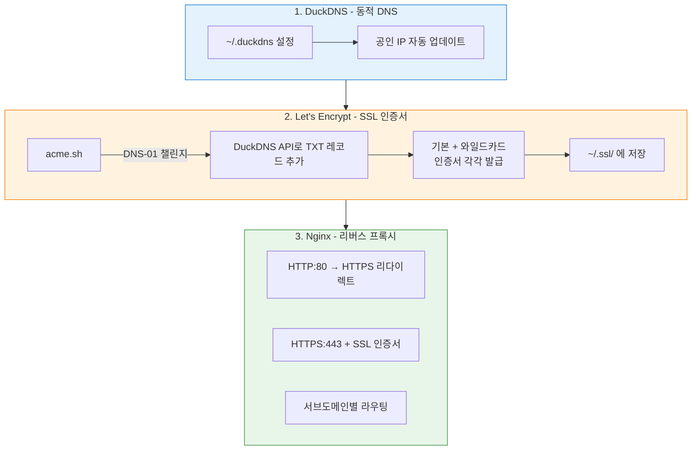
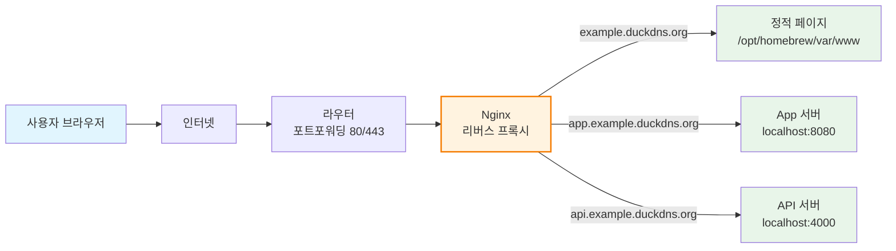
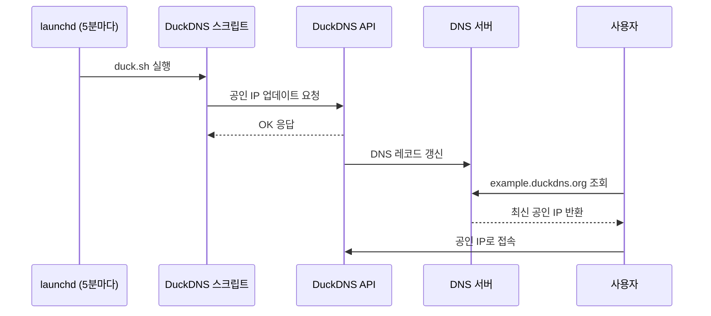
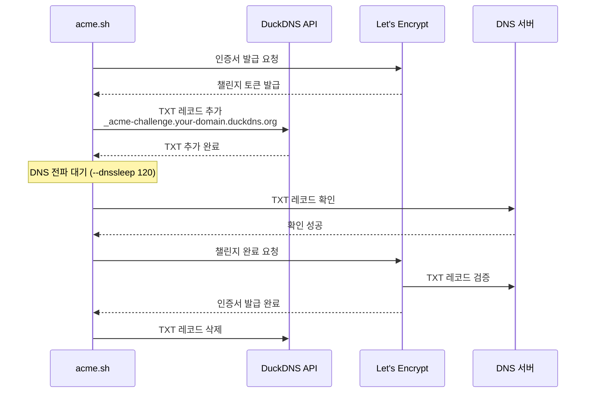
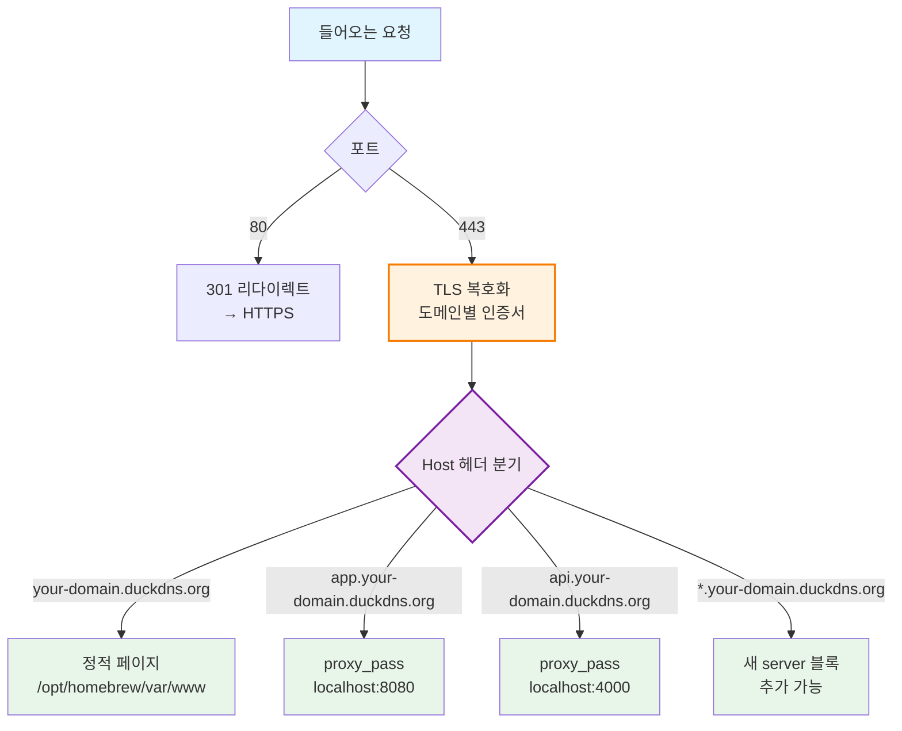

> 공인 IP가 바뀌는 환경에서도, 무료 도메인 + 와일드카드 SSL + 리버스 프록시로 여러 서비스를 서브도메인으로 운영하는 방법을 정리한다.

## 전체 구성도





---

## 1. DuckDNS — 무료 동적 DNS 구성

[DuckDNS](https://www.duckdns.org)는 무료 동적 DNS(DDNS) 서비스다. 공인 IP가 변경되더라도 도메인으로 접속할 수 있게 해준다.

### 동작 구조



### 1-1. Homebrew로 DuckDNS 설치

```bash
brew tap jzelinskie/duckdns
brew install duckdns
```

### 1-2. 설정 파일 작성

`~/.duckdns` 파일을 생성한다.

```
DOMAIN="your-domain"
TOKEN="<your-duckdns-token>"
```

> 토큰은 [duckdns.org](https://www.duckdns.org)에 로그인하면 확인할 수 있다.

### 1-3. 서비스 시작 (로그인 시 자동 실행)

```bash
brew services start jzelinskie/duckdns/duckdns

# 서비스 상태 확인
brew services list | grep duckdns
```

### 1-4. 동작 확인

```bash
curl -s "https://www.duckdns.org/update?domains=your-domain&token=<your-duckdns-token>&ip="
# OK 가 출력되면 정상

# DNS 리졸브 확인
nslookup your-domain.duckdns.org
```

### 1-5. 와일드카드 리졸브 확인

DuckDNS는 모든 서브도메인을 동일 IP로 리졸브한다.

```bash
nslookup www.your-domain.duckdns.org
nslookup app.your-domain.duckdns.org
nslookup api.your-domain.duckdns.org
# 모두 동일한 IP가 반환됨
```

---

## 2. Let's Encrypt SSL 인증서 발급

acme.sh의 `dns_duckdns` 플러그인을 사용하여 **포트 80 개방 없이** DNS-01 챌린지 방식으로 Let's Encrypt 인증서를 발급받는다.

> **주의**: DuckDNS는 TXT 레코드를 하나만 저장하므로, 기본 도메인과 와일드카드를 **하나의 인증서로 동시 발급할 수 없다**. 따라서 각각 별도로 발급하여 관리한다.
>
> - 인증서 1 (기본 도메인): `your-domain.duckdns.org`
> - 인증서 2 (와일드카드): `*.your-domain.duckdns.org`
> - 인증서 유효기간: 90일 (60일마다 자동 갱신)

### DNS-01 챌린지 인증 흐름



### 2-1. acme.sh 설치

```bash
curl https://get.acme.sh | sh -s email=<your-email>
```

### 2-2. Let's Encrypt를 기본 CA로 설정

```bash
~/.acme.sh/acme.sh --set-default-ca --server letsencrypt --accountkeylength ec-256
~/.acme.sh/acme.sh --register-account -m <your-email> --server letsencrypt
```

### 2-3. 인증서 발급

DuckDNS 토큰을 환경변수로 설정한 뒤 발급한다.

**기본 도메인 인증서:**

```bash
export DuckDNS_Token="<your-duckdns-token>"
~/.acme.sh/acme.sh --issue --dns dns_duckdns -d your-domain.duckdns.org --server letsencrypt --dnssleep 120
```

**와일드카드 인증서:**

```bash
export DuckDNS_Token="<your-duckdns-token>"
~/.acme.sh/acme.sh --issue --dns dns_duckdns -d '*.your-domain.duckdns.org' --server letsencrypt --dnssleep 120
```

> 포트 80 개방이 필요 없다. DuckDNS API를 통해 TXT 레코드를 자동으로 추가/삭제하여 도메인 소유권을 증명한다.
>
> `*.your-domain.duckdns.org` 와일드카드 인증서로 `api.`, `app.`, `blog.` 등 모든 서브도메인을 커버한다. 단, 기본 도메인(`your-domain.duckdns.org`)은 포함되지 않으므로 별도 발급이 필요하다.

### 2-4. 인증서 설치

**기본 도메인:**

```bash
mkdir -p ~/.ssl/your-domain-base.duckdns.org

~/.acme.sh/acme.sh --install-cert -d your-domain.duckdns.org --ecc \
  --key-file ~/.ssl/your-domain-base.duckdns.org/key.pem \
  --fullchain-file ~/.ssl/your-domain-base.duckdns.org/fullchain.pem \
  --reloadcmd "nginx -s reload"
```

**와일드카드:**

```bash
mkdir -p ~/.ssl/your-domain.duckdns.org

~/.acme.sh/acme.sh --install-cert -d '*.your-domain.duckdns.org' --ecc \
  --key-file ~/.ssl/your-domain.duckdns.org/key.pem \
  --fullchain-file ~/.ssl/your-domain.duckdns.org/fullchain.pem \
  --reloadcmd "nginx -s reload"
```

### 2-5. 인증서 파일 경로

| 용도 | 파일 | 경로 |
|------|------|------|
| 기본 도메인 | 인증서 | `~/.ssl/your-domain-base.duckdns.org/fullchain.pem` |
| 기본 도메인 | 개인키 | `~/.ssl/your-domain-base.duckdns.org/key.pem` |
| 와일드카드 | 인증서 | `~/.ssl/your-domain.duckdns.org/fullchain.pem` |
| 와일드카드 | 개인키 | `~/.ssl/your-domain.duckdns.org/key.pem` |

### 2-6. 인증서 체크 방법

```bash
# 기본 도메인 인증서
openssl x509 -in ~/.ssl/your-domain-base.duckdns.org/fullchain.pem -noout -subject -issuer -dates

# 와일드카드 인증서
openssl x509 -in ~/.ssl/your-domain.duckdns.org/fullchain.pem -noout -subject -issuer -dates
```

원격 서버 인증서 확인 (Nginx 구동 후):

```bash
# 기본 도메인
openssl s_client -connect your-domain.duckdns.org:443 -servername your-domain.duckdns.org </dev/null 2>/dev/null | openssl x509 -noout -dates

# 서브도메인 (예: www)
openssl s_client -connect www.your-domain.duckdns.org:443 -servername www.your-domain.duckdns.org </dev/null 2>/dev/null | openssl x509 -noout -dates
```

갱신 테스트 (dry-run):

```bash
~/.acme.sh/acme.sh --renew -d your-domain.duckdns.org --ecc --force --test
~/.acme.sh/acme.sh --renew -d '*.your-domain.duckdns.org' --ecc --force --test
```

### 2-7. 자동 갱신

- acme.sh 설치 시 cron job이 자동 등록된다.
- 인증서는 **90일 유효**하며, **60일마다 자동 갱신**된다.
- DuckDNS 토큰은 acme.sh 설정에 저장되어 갱신 시에도 자동으로 사용된다.

```bash
# 등록된 cron job 확인
crontab -l | grep acme
```

---

## 3. Nginx 리버스 프록시 설정

Nginx를 리버스 프록시로 사용하여 서브도메인별로 다른 로컬 포트로 라우팅한다.

### 요청 처리 흐름



### 3-1. Nginx 설치

```bash
brew install nginx
```

### 3-2. 설정 파일

설정 파일 위치: `/opt/homebrew/etc/nginx/nginx.conf`

```nginx
worker_processes  auto;

error_log  /opt/homebrew/var/log/nginx/error.log;
pid        /opt/homebrew/var/run/nginx.pid;

events {
    worker_connections  1024;
}

http {
    include       mime.types;
    default_type  application/octet-stream;

    log_format  main  '$remote_addr - $remote_user [$time_local] "$request" '
                      '$status $body_bytes_sent "$http_referer" '
                      '"$http_user_agent" "$http_x_forwarded_for"';

    access_log  /opt/homebrew/var/log/nginx/access.log  main;

    sendfile        on;
    tcp_nopush      on;
    tcp_nodelay     on;

    keepalive_timeout  65;
    gzip  on;

    # --- 공통 SSL 설정 (와일드카드 인증서 - 서브도메인용) ---
    ssl_certificate      /Users/username/.ssl/your-domain.duckdns.org/fullchain.pem;
    ssl_certificate_key  /Users/username/.ssl/your-domain.duckdns.org/key.pem;
    ssl_protocols        TLSv1.2 TLSv1.3;
    ssl_ciphers          HIGH:!aNULL:!MD5;
    ssl_prefer_server_ciphers  on;
    ssl_session_cache    shared:SSL:10m;
    ssl_session_timeout  10m;

    # --- HTTP → HTTPS 리다이렉트 ---
    server {
        listen 80;
        server_name _;
        return 301 https://$host$request_uri;
    }

    # --- 기본 도메인: 전용 인증서 사용 ---
    server {
        listen 443 ssl;
        server_name your-domain.duckdns.org;
        ssl_certificate     /Users/username/.ssl/your-domain-base.duckdns.org/fullchain.pem;
        ssl_certificate_key /Users/username/.ssl/your-domain-base.duckdns.org/key.pem;

        location / {
            root   /opt/homebrew/var/www;
            index  index.html index.htm;
        }
    }

    # --- 서브도메인 리버스 프록시 ---
    # 아래 예시를 복사/수정하여 사용

    # app.your-domain.duckdns.org → localhost:8080
    # server {
    #     listen 443 ssl;
    #     server_name app.your-domain.duckdns.org;
    #
    #     location / {
    #         proxy_pass         http://127.0.0.1:8080;
    #         proxy_set_header   Host              $host;
    #         proxy_set_header   X-Real-IP         $remote_addr;
    #         proxy_set_header   X-Forwarded-For   $proxy_add_x_forwarded_for;
    #         proxy_set_header   X-Forwarded-Proto $scheme;
    #     }
    # }

    # api.your-domain.duckdns.org → localhost:4000
    # server {
    #     listen 443 ssl;
    #     server_name api.your-domain.duckdns.org;
    #
    #     location / {
    #         proxy_pass         http://127.0.0.1:4000;
    #         proxy_set_header   Host              $host;
    #         proxy_set_header   X-Real-IP         $remote_addr;
    #         proxy_set_header   X-Forwarded-For   $proxy_add_x_forwarded_for;
    #         proxy_set_header   X-Forwarded-Proto $scheme;
    #     }
    # }

    include servers/*;
}
```

> 공통 SSL 블록(http 레벨)에 와일드카드 인증서를 설정하면, 명시적으로 `ssl_certificate`를 지정하지 않은 server 블록은 모두 이 인증서를 상속받는다. 기본 도메인 server 블록만 별도의 전용 인증서를 지정하면 된다.

### 3-3. 서비스 시작

```bash
brew services start nginx
```

### 3-4. 설정 문법 검사 & 리로드

```bash
# 문법 검사
nginx -t

# 설정 변경 후 리로드 (재시작 불필요)
nginx -s reload
```

### 3-5. 서브도메인 추가 방법

새 서비스를 추가하려면 `nginx.conf`에 새 server 블록을 추가한다.

```nginx
# 예: blog.your-domain.duckdns.org → localhost:3000
server {
    listen 443 ssl;
    server_name blog.your-domain.duckdns.org;

    location / {
        proxy_pass         http://127.0.0.1:3000;
        proxy_set_header   Host              $host;
        proxy_set_header   X-Real-IP         $remote_addr;
        proxy_set_header   X-Forwarded-For   $proxy_add_x_forwarded_for;
        proxy_set_header   X-Forwarded-Proto $scheme;
    }
}
```

추가 후 리로드:

```bash
nginx -t && nginx -s reload
```

> 별도 DNS/SSL 설정이 필요 없다. DuckDNS가 자동으로 리졸브하고, 와일드카드 인증서가 모든 서브도메인을 커버한다.

### 3-6. 동작 확인

```bash
# HTTP → HTTPS 리다이렉트 확인
curl -s -o /dev/null -w "%{http_code}" http://your-domain.duckdns.org
# 301 반환

# HTTPS 확인
curl -sk -o /dev/null -w "%{http_code}" https://your-domain.duckdns.org
# 200 반환
```

### 3-7. 로그 확인

```bash
# 접근 로그
tail -f /opt/homebrew/var/log/nginx/access.log

# 에러 로그
tail -f /opt/homebrew/var/log/nginx/error.log
```

### 3-8. 정적 페이지 경로

메인 도메인의 정적 파일은 아래 경로에 위치한다.

```
/opt/homebrew/var/www/
```

`index.html`을 생성하면 `https://your-domain.duckdns.org`에서 바로 확인할 수 있다.

---

## 정리

| 구성 요소 | 역할 |
|-----------|------|
| DuckDNS | 무료 DDNS. 공인 IP 변경 시 자동 업데이트 |
| acme.sh | Let's Encrypt 인증서 발급/갱신 자동화 (DNS-01 챌린지) |
| Nginx | 리버스 프록시. 서브도메인별 라우팅 + HTTPS 종단 |

**핵심 포인트:**

- DuckDNS는 TXT 레코드를 하나만 지원하므로 기본 도메인과 와일드카드 인증서를 **각각 발급**해야 한다
- Nginx http 레벨에 와일드카드 인증서를 공통으로 설정하고, 기본 도메인 server 블록에만 전용 인증서를 지정하는 방식으로 관리한다
- 서브도메인 추가 시 DNS나 SSL 설정 변경 없이 nginx server 블록만 추가하면 된다
