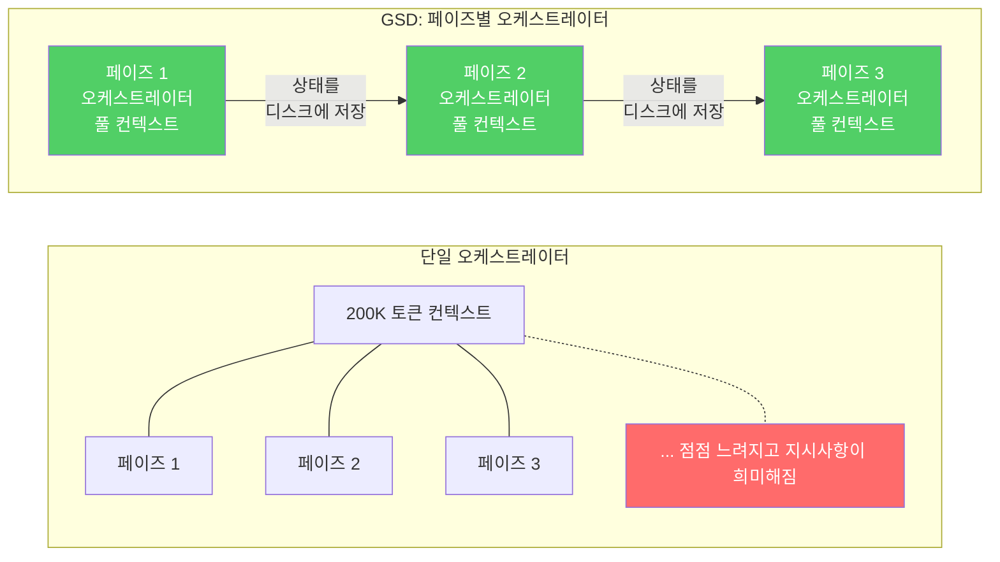
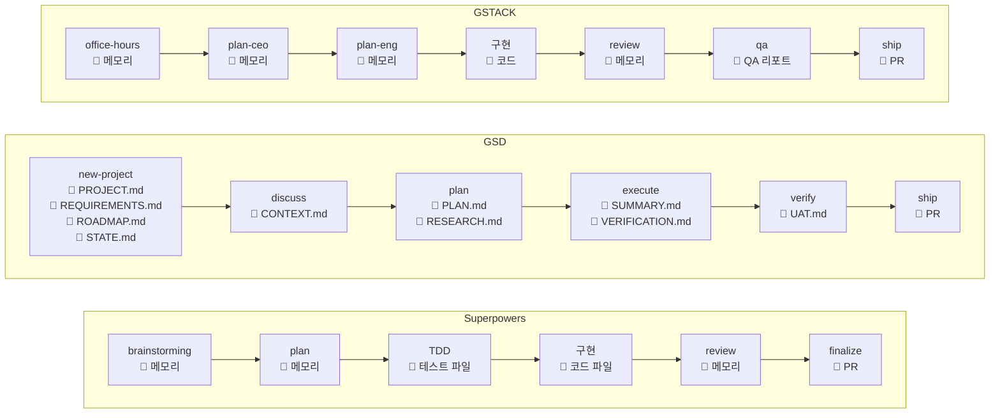
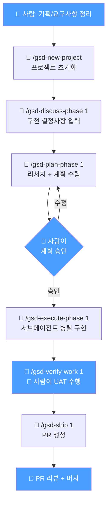
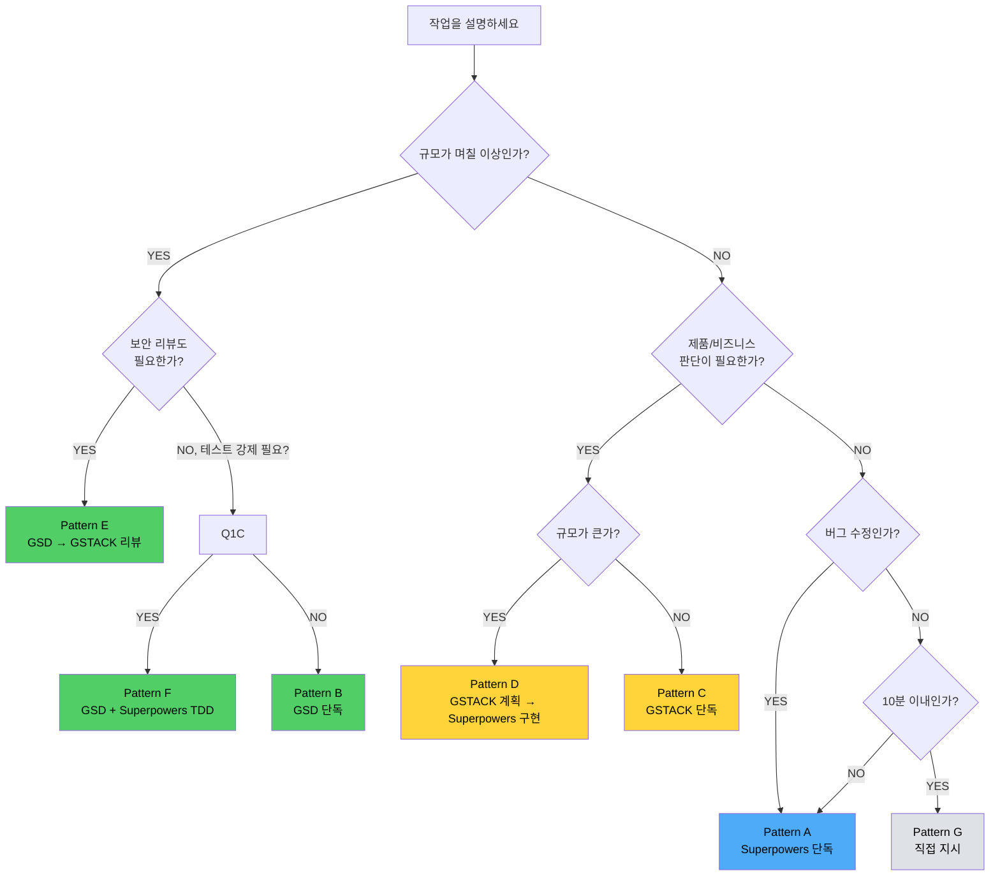

> 원문: [Superpowers, GSD, and GSTACK: Picking the Right Framework for Your Coding Agent](https://www.pulumi.com/blog/claude-code-orchestration-frameworks/) (Pulumi Blog, 2026.04.13)

## 들어가며

AI 코딩 에이전트(Claude Code, Cursor, Codex, Windsurf 등)는 처음 30분은 놀라울 정도로 잘 동작한다. 하지만 시간이 지날수록 예측 가능하게 무너진다. 세 개의 독립적인 팀이 **같은 문제를 해결하기 위해** 각각 프레임워크를 만들었다. 이 글에서는 이 세 프레임워크의 핵심을 정리하고, **개발자와 기획자**가 실제로 어떻게 활용할 수 있는지 살펴본다.

---

## AI 코딩 에이전트의 3가지 공통 문제

### 1. 컨텍스트 부패 (Context Rot)

모든 LLM에는 컨텍스트 윈도우가 있다. 윈도우가 채워질수록 **초기 지시사항의 영향력이 약해진다**.

> 처음에 "AES-256 암호화, 적절한 ACL, 접근 로깅이 포함된 S3 버킷"을 요청했다. 2시간, 200K 토큰 뒤에 에이전트가 만든 새 버킷에는 그 요구사항 중 아무것도 없었다.

### 2. 테스트 부재 (No Test Discipline)

에이전트가 작성한 코드는 "그럴듯해 보인다". 컴파일도 되고, 잠시는 동작한다. 하지만 **테스트 없는 코드는 부채**다. 에이전트가 기능을 하나 추가하면서 조용히 다른 두 개를 망가뜨려도 아무도 모른다.

### 3. 범위 확장 (Scope Drift)

VPC 3개 서브넷을 요청했는데, 에이전트가 NAT Gateway, Transit Gateway, VPN Endpoint, Custom DNS Resolver까지 추가한다. 이론적으로는 도움이 되지만, **요청하지 않은 인프라를 이해하지 못한 채 매월 비용을 지불**하게 된다.

---

## Superpowers: TDD 규율 강제기

| 항목 | 내용 |
|------|------|
| **작성자** | Jesse Vincent |
| **GitHub Stars** | 149K+ |
| **핵심 철학** | 실패하는 테스트 없이 프로덕션 코드를 작성할 수 없다 |
| **지원 에이전트** | Claude Code, Cursor, Codex, OpenCode, GitHub Copilot CLI, Gemini CLI |

### 7단계 워크플로우

Superpowers는 강제적인 7단계 워크플로우를 따른다. 단계를 건너뛸 수 없다.

| 스킬 | 단계 | 역할 |
|------|------|------|
| `brainstorming` | 설계 | 소크라테스 질문으로 아이디어 정제, 설계 문서 저장 |
| `writing-plans` | 계획 | 2~5분 단위 태스크로 분할, 정확한 파일 경로와 코드 포함 |
| `test-driven-development` | 구현 | **RED-GREEN-REFACTOR**: 실패 테스트 먼저 → 최소 코드 → 커밋 |
| `subagent-driven-development` | 구현 | 태스크별 서브에이전트 파견, 2단계 리뷰 |
| `requesting-code-review` | 리뷰 | 계획 대비 리뷰, 치명적 이슈 발견 시 진행 차단 |
| `finishing-a-development-branch` | 마무리 | 테스트 통과 확인, merge/PR/keep/discard 옵션 제시 |

### 실제 성과

chardet maintainer가 Superpowers로 chardet v7.0.0을 처음부터 재작성했다. **41배 성능 향상** (41%가 아니다). 모든 코드 변경이 테스트를 통과해야 하므로 에이전트가 안전망을 믿고 공격적으로 최적화할 수 있었다.

### 트레이드오프

- 단일 메가 오케스트레이터 패턴이므로, 매우 긴 세션에서는 오케스트레이터 자체가 컨텍스트 한계에 도달할 수 있다
- 대부분의 프로젝트에서는 문제되지 않지만, 수십 개 파일을 다루는 마라톤 세션에서는 유의

---

## GSD (Get Shit Done): 컨텍스트 부패 방지

| 항목 | 내용 |
|------|------|
| **작성자** | Lex Christopherson |
| **GitHub Stars** | 51K+ |
| **핵심 철학** | 각 페이즈마다 새로운 오케스트레이터를 할당하여 컨텍스트를 항상 신선하게 유지 |
| **지원 에이전트** | 14개 이상 (가장 폭넓은 지원) |

### 핵심 아키텍처: 페이즈별 오케스트레이터

GSD는 단일 메가 오케스트레이터를 사용하지 않는다. 대신 **각 작업 페이즈에 별도의 오케스트레이터**를 할당한다.

- 각 오케스트레이터는 **컨텍스트 용량의 50% 이하**로 유지
- 페이즈 완료 시 상태를 디스크의 Markdown 파일로 저장
- 새로운 오케스트레이터가 이전 상태를 이어받아 작업 계속



### 주요 명령어

| 명령어 | 역할 |
|--------|------|
| `/gsd-new-project` | 프로젝트 전체 초기화: 질문, 리서치, 요구사항, 로드맵 |
| `/gsd-discuss-phase` | 구현 결정사항을 계획 전에 기록 |
| `/gsd-plan-phase` | 단일 페이즈에 대한 리서치, 계획, 검증 |
| `/gsd-execute-phase` | 병렬 웨이브로 모든 계획 실행, 완료 후 검증 |
| `/gsd-verify-work` | 수동 사용자 수용 테스트 |
| `/gsd-ship` | 검증된 페이즈 작업으로 PR 생성 (본문 자동 생성) |
| `/gsd-fast` | 사소한 태스크는 계획을 건너뛰고 바로 실행 |

### 트레이드오프

- 다른 두 프레임워크보다 **의식적인 절차(ceremony)**가 많다
- 빠른 스크립트나 단일 파일 변경에는 과한 면이 있다
- **여러 파일, 여러 세션, 여러 날에 걸친 프로젝트**에서 진가를 발휘한다

---

## GSTACK: 23명 팀으로 일하기

| 항목 | 내용 |
|------|------|
| **작성자** | Garry Tan (Y Combinator CEO) |
| **GitHub Stars** | 71K+ |
| **핵심 철학** | 단일 에이전트를 규율하는 것이 아니라 **23명의 전문가 팀**을 모델링 |
| **지원 에이전트** | Claude Code, Codex CLI, OpenCode, Cursor, Factory Droid, Slate, Kiro |

### 5가지 제약 레이어

1. **역할 집중 (Role Focus)** - 각 전문가는 자기 레인만 담당
2. **데이터 흐름 (Data Flow)** - 역할 간 정보 전달 통제
3. **품질 관문 (Quality Gates)** - 핸드오프 지점에서 기준 보장
4. **호수 끓이기 (Boil the Lake)** - 완벽하게 할 수 있는 것만 하고, 못 하는 것은 건너뛰기
5. **단순성 (Simplicity)** - 불필요한 복잡성에 저항

### 핵심 원칙: "Boil the Lake"

> 대부분의 에이전트는 모든 것을 시도하고 **평범한 결과물**을 만든다. GSTACK은 "더 적은 것을 하되, 제대로 하라"고 말한다.

### 역할 격리

- 엔지니어 역할은 제품 로드맵을 보지 못한다
- QA 역할은 구현 세부사항을 보지 못한다
- 각 역할은 자기 일에 필요한 컨텍스트만 받는다
- 이것이 "모든 것을 아는 에이전트가 모든 것을 하려는" 범위 확장을 방지한다

### 주요 명령어

| 명령어 | 역할 | 기능 |
|--------|------|------|
| `/office-hours` | YC 파트너 | 코드 작성 전 제품을 재구성하는 6가지 질문 |
| `/plan-ceo-review` | CEO | 4가지 모드: 범위 확장, 선택적 확장, 유지, 축소 |
| `/plan-eng-review` | 엔지니어링 매니저 | 아키텍처 고정, 데이터 흐름 매핑, 엣지 케이스 나열 |
| `/review` | 시니어 엔지니어 | CI는 통과하지만 프로덕션에서 깨지는 버그 발견 |
| `/qa` | QA 리드 | 실제 Playwright 브라우저 테스트 (시뮬레이션 아님) |
| `/ship` | 릴리스 엔지니어 | 커버리지 감사 포함 1명령 배포 |
| `/cso` | 보안 책임자 | OWASP 및 STRIDE 보안 감사 |

---

## 세 프레임워크 비교

|  | Superpowers | GSD | GSTACK |
|---|---|---|---|
| **잠그는 대상** | 개발 프로세스 자체 | 실행 환경 | 누가 무엇을 결정하는가 |
| **오케스트레이션** | 단일 오케스트레이터 | 페이즈별 오케스트레이터 | 23개 전문가 역할 |
| **컨텍스트 관리** | 하나의 윈도우 | 디스크 상태 저장, 페이즈별 갱신 | 역할 범위 핸드오프 |
| **강점** | TDD, 서브에이전트 위임, 규율 있는 계획 실행 | 장기 세션, 병렬 작업, 충돌 복구 | 제품 전략, 다각도 리뷰, 실제 브라우저 QA |
| **약점** | 빌드 페이즈 이후에는 한계 | 작은 태스크에 과함, 역할 분리 없음 | 실제 코드 작성 부분 |
| **추천 대상** | 테스트 규율이 필요한 개발자 | 며칠~몇 주 걸리는 복잡한 프로젝트 | 제품을 만드는 창업자-엔지니어 |

### 무엇이 자주 고장 나는가에 따라 선택하라

| 문제 | 추천 프레임워크 | 이유 |
|------|----------------|------|
| 코드가 오늘 되는데 내일 깨진다 | **Superpowers** | 모든 변경이 실패하는 테스트를 먼저 통과해야 함 |
| 1시간 뒤 품질이 떨어진다 | **GSD** | 페이즈별 새 컨텍스트, 이전 것을 그대로 유지하지 않음 |
| 요청하지 않은 기능이 계속 추가된다 | **GSTACK** | 엔지니어링 전 제품 리뷰 |
| 위 셋 다 문제다 | **GSTACK → GSD + Superpowers TDD** | GSTACK으로 방향 잡기 → GSD로 장기 구현 → Superpowers로 테스트 규율, 단일 프레임워크로는 커버 불가 |

### 작업 유형별 추천 (원문 작성자)

| 작업 유형 | 추천 | 이유 |
|----------|------|------|
| **애플리케이션 코드** (단위 테스트 가능) | Superpowers | TDD 사이클이 자연스럽게 적용됨 |
| **인프라 프로비저닝** (긴 세션, 수십 개 리소스) | GSD | 컨텍스트 부패가 가장 치명적, 페이즈별 상태 저장이 필수 |
| **SaaS 플랫폼** (제품 비전 + 인프라) | GSTACK | 제품적 사고와 엔지니어링의 연결이 필요 |
| **인프라 테스트** | Superpowers (제한적) | IAM 정책이 실제 권한을 부여하는지는 단위 테스트로 검증 불가, 실제 검증은 `pulumi preview` / `pulumi up` 에서 발생 |

> **작성자의 솔직한 결론**: "My honest take: **none of these is universally best.** Knowing your failure mode is the real decision." — 하나를 골라 프로젝트에 적용해 보라. 1시간 안에 그게 내 문제를 해결하는지 알 수 있다.

---

> **아래부터는 원문 블로그를 기반으로 한 작성자의 실무 시나리오 분석입니다.**

## 실제로 어떻게 사용해야 할까?

개발자와 기획자가 실무에서 마주하는 시나리오별로, 어떤 프레임워크가 맞는지 정리한다.

### 시나리오 1: 버그 수정 — Superpowers 추천

**대상**: 개발자
**상황**: 프로덕션에서 특정 조건의 결제가 실패하는 버그, 폼 제출 시 화면이 깨지는 버그 등

```
워크플로우:
1. brainstorming → 버그 원인 가설 수립
2. writing-plans → 재현 단계와 수정 계획 작성
3. TDD → 실패하는 테스트 먼저 작성 (버그 재현 테스트)
4. 구현 → 테스트를 통과하도록 코드 수정
5. review → 기존 기능이 깨지지 않았는지 확인
6. finalize → PR 생성
```

**왜 Superpowers인가**: 버그 수정은 정확히 "코드가 오늘 되는데 내일 깨진다"의 사례다. 실패하는 테스트로 버그를 먼저 재현하고, 수정 후에도 기존 테스트가 모두 통과하는지 보장해야 한다.

### 시나리오 2: 대규모 리팩토링 / 시스템 개편 — GSD 추천

**대상**: 개발자
**상황**: 데이터 모델 개편, 프론트엔드 프레임워크 마이그레이션, API 버전 업그레이드 등 며칠~몇 주 걸리는 작업

```
워크플로우:
1. /gsd-new-project → 프로젝트 전체 요구사항 정리
2. /gsd-discuss-phase → 페이즈별 구현 결정사항 논의
3. /gsd-plan-phase → 변경 범위, 마이그레이션 전략 등 계획
4. /gsd-execute-phase → 병렬로 구현 진행
5. /gsd-verify-work → 각 페이즈 검증
6. /gsd-ship → PR 생성
```

**왜 GSD인가**: 대규모 작업은 여러 파일, 여러 모듈에 걸쳐 진행된다. 단일 컨텍스트로 모든 것을 기억할 수 없다. 페이즈별 오케스트레이터가 상태를 디스크에 저장하고 다음 페이즈에서 신선한 컨텍스트로 이어받는 방식이 필수적이다.

### 시나리오 3: 신규 기능 / 서비스 기획 → 개발 — GSTACK 추천

**대상**: 기획자 + 개발자
**상황**: 새로운 서비스 기획, 사용자 피드백 기반 기능 추가, 프로모션 시스템 구축 등 제품적 판단이 필요한 작업

```
기획 단계 (기획자 + Claude Code):
1. /office-hours → "정말 이 기능이 필요한가?" 6가지 질문으로 재검토
2. /plan-ceo-review → 범위 결정 (MVP 수준인지, 풀 스펙인지)
3. /plan-design-review → UI/UX 관점 리뷰
4. /plan-eng-review → 기술 아키텍처, 엣지 케이스 정리

개발 단계 (개발자 + Claude Code):
5. 구현
6. /review → 시니어 엔지니어 관점 코드 리뷰
7. /qa → 실제 브라우저 테스트
8. /cso → 보안 감사
9. /ship → 배포
```

**왜 GSTACK인가**: 신규 기능은 "요청하지 않은 것까지 만드는" 범위 확장의 위험이 크다. `/office-hours` 가 기획 단계에서 제품의 본질을 질문해주고, CEO/디자이너/엔지니어 관점의 리뷰가 순차적으로 들어간다. 기획자가 `/office-hours` 로 방향을 잡고, 개발자가 `/plan-eng-review` 부터 이어서 작업하는 것도 가능하다.

### 시나리오 4: 간단한 작업 — Superpowers 또는 GSD-fast

**대상**: 개발자
**상황**: 기존 패턴의 API 추가, 설정 파일 변경, 간단한 스크립트 작성

```
Superpowers:
1. brainstorming → 간단히 설계
2. TDD → 테스트 작성
3. 구현 → 테스트 통과
4. finalize → PR

GSD-fast:
/gsd-fast → 계획 단계 생략, 바로 구현
```

**추천**: 규모가 작으면 Superpowers의 TDD 사이클이나 GSD-fast로 충분하다. 프레임워크의 의식적인 절차가 오버헤드가 되지 않도록 태스크 규모에 맞춰 선택하자.

### 시나리오 5: 트러블슈팅 / 장애 대응 — Superpowers의 brainstorming + TDD

**대상**: 개발자
**상황**: 프로덕션 에러, 타임아웃, 성능 저하 등 긴급 이슈 분석

```
1. brainstorming → 원인 가설 수립 (Socratic questioning)
2. TDD → 가설을 검증하는 테스트 작성
3. 구현 → 수정
4. review → 사이드 이펙트 확인
```

**팁**: 트러블슈팅에서 가장 중요한 것은 "수정이 다른 곳을 망가뜨리지 않았는지" 검증이다. Superpowers의 TDD 사이클이 이것을 강제한다.

### 시나리오 6: 프로토타입 / MVP 제작 — GSTACK 또는 GSD-quick

**대상**: 기획자 + 개발자
**상황**: 아이디어 검증용 프로토타입, 핵만 빠르게 만들어야 하는 MVP

```
GSD-quick:
/gsd-quick → "로그인 + 대시보드 + 알림 기능 MVP 만들어줘"
→ 계획 → 구현 → 검증을 빠르게 반복

GSTACK:
/design-shotgun → 여러 UI 안을 빠르게 생성하고 비교
/design-html → 선택한 안을 바로 동작하는 HTML로 변환
```

**팁**: 기획자가 `/design-shotgun` 으로 UI 방향을 시각적으로 탐색하고, 개발자가 `/gsd-quick` 으로 백엔드를 빠르게 구현하는 분업도 가능하다.

### 시나리오 7: 대규모 신규 서비스 개발 — GSTACK → GSD + Superpowers (세 프레임워크 전체 조합)

**대상**: 기획자 + 개발자
**상황**: 새로운 커머스 플랫폼, 결제 시스템, 통합 관리자 등 며칠~몇 주 걸리며 제품적 판단, 장기 구현, 테스트 규율이 **모두** 필요한 작업

```
기획 단계 — GSTACK (세션 1):
1. /office-hours → "정말 이 서비스가 필요한가?" 제품 본질 질문
2. /plan-ceo-review → 범위 결정 (MVP vs 풀 스펙)
3. /plan-design-review → UI/UX 방향 수립
4. /plan-eng-review → 아키텍처, 데이터 흐름, 엣지 케이스 정리
→ 산출물: CLAUDE.md에 gstack 섹션 저장, .gstack/에 학습 데이터

구현 단계 — GSD + Superpowers TDD (세션 2~N):
5. /gsd-new-project → GSTACK 산출물 기반으로 프로젝트 초기화
6. /gsd-plan-phase → 페이즈별 계획 수립
7. /gsd-execute-phase → 각 페이즈 내에서 Superpowers TDD 적용:
   - brainstorming → 해당 페이즈 설계
   - TDD → 실패 테스트 먼저 작성
   - 구현 → 테스트 통과
   - review → 기존 기능 회귀 확인
8. /gsd-verify-work → 각 페이즈 사용자 검증
9. /gsd-ship → PR 생성

리뷰/배포 단계 — GSTACK (세션 N+1):
10. /review → 시니어 엔지니어 관점 코드 리뷰
11. /qa → Playwright 실제 브라우저 테스트
12. /cso → OWASP + STRIDE 보안 감사
13. /ship → 배포
```

**왜 세 개를 모두 쓰는가**: 대규모 신규 서비스는 세 가지 문제가 **동시에** 발생한다.
- **컨텍스트 부패**: 며칠 걸리는 작업에서 초기 지시사항이 희미해짐 → GSD의 페이즈별 오케스트레이터로 해결
- **테스트 부재**: 에이전트가 "그럴듯한 코드"를 만들고 기존 기능을 조용히 망가뜨림 → Superpowers TDD로 해결
- **범위 확장**: 요청하지 않은 기능이 계속 추가됨 → GSTACK의 제품 리뷰 + 역할 격리로 해결

**주의**: 세 프레임워크를 **같은 세션에서 동시에 로드하지 않는다**. 세션 1(GSTACK 기획) → 세션 2~N(GSD + Superpowers 구현) → 세션 N+1(GSTACK 리뷰)으로 나누고, 각 세션 전환 시 마크다운 파일로 상태를 전달한다.

---

## 세 프레임워크를 모두 사용할 때의 디렉토리 구조

세 프레임워크를 모두 설치하면 **글로벌(시스템 전체) 설정**과 **프로젝트 로컬 설정** 두 가지 레벨로 파일이 분산된다.

### 글로벌 설치 위치 (`~/.claude/`)

Claude Code의 글로벌 설정 디렉토리에 세 프레임워크가 나란히 위치한다.

```
~/.claude/
├── skills/
│   ├── superpowers/                          # Superpowers 플러그인
│   │   └── skills/
│   │       ├── brainstorming/SKILL.md        # 소크라테스 질문으로 설계 정제
│   │       ├── writing-plans/SKILL.md        # 2~5분 단위 태스크 분할
│   │       ├── test-driven-development/SKILL.md  # RED-GREEN-REFACTOR
│   │       ├── subagent-driven-development/SKILL.md  # 서브에이전트 파견
│   │       ├── executing-plans/SKILL.md      # 배치 실행 + 체크포인트
│   │       ├── systematic-debugging/SKILL.md # 4단계 근원 원인 분석
│   │       ├── requesting-code-review/SKILL.md  # 계획 대비 코드 리뷰
│   │       ├── finishing-a-development-branch/SKILL.md  # merge/PR/keep/discard
│   │       ├── using-git-worktrees/SKILL.md  # 격리된 워크트리 브랜치
│   │       ├── using-superpowers/SKILL.md    # 스킬 시스템 소개
│   │       └── writing-skills/SKILL.md       # 새 스킬 작성 가이드
│   │
│   ├── gsd-agents/ → (skills symlink)        # GSD 에이전트
│   │   └── SKILL.md
│   ├── gsd-new-project/SKILL.md              # 프로젝트 초기화 커맨드
│   ├── gsd-discuss-phase/SKILL.md            # 페이즈 논의
│   ├── gsd-plan-phase/SKILL.md               # 페이즈 계획
│   ├── gsd-execute-phase/SKILL.md            # 페이즈 실행
│   ├── gsd-verify-work/SKILL.md              # 작업 검증
│   ├── gsd-ship/SKILL.md                     # PR 생성
│   ├── gsd-fast/SKILL.md                     # 빠른 실행
│   ├── gsd-quick/SKILL.md                    # 애드혹 태스크
│   ├── gsd-next/SKILL.md                     # 다음 단계 자동 감지
│   ├── gsd-help/SKILL.md                     # 도움말
│   ├── gsd-progress/SKILL.md                 # 진행 상황
│   ├── gsd-settings/SKILL.md                 # 설정
│   ├── gsd-review/SKILL.md                   # 코드 리뷰
│   ├── gsd-debug/SKILL.md                    # 디버깅
│   ├── gsd-map-codebase/SKILL.md             # 기존 코드베이스 분석
│   ├── gsd-spike/SKILL.md                    # 실험적 프로토타이핑
│   ├── gsd-sketch/SKILL.md                   # HTML 목업 생성
│   └── ... (약 40개+ GSD 스킬 파일)
│
├── gstack/                                   # GSTACK 메인 디렉토리
│   ├── setup                                 # 설치 스크립트
│   ├── bin/                                  # CLI 바이너리
│   │   ├── gstack-team-init
│   │   ├── gstack-uninstall
│   │   ├── gstack-model-benchmark
│   │   ├── gstack-taste-update
│   │   └── gstack-analytics
│   └── skills/                               # 23개 전문가 스킬
│       ├── office-hours/SKILL.md             # YC 오피스 아워
│       ├── plan-ceo-review/SKILL.md          # CEO 리뷰
│       ├── plan-eng-review/SKILL.md          # 엔지니어링 매니저 리뷰
│       ├── plan-design-review/SKILL.md       # 디자인 리뷰
│       ├── plan-devex-review/SKILL.md        # DX 리뷰
│       ├── design-consultation/SKILL.md      # 디자인 시스템 구축
│       ├── design-shotgun/SKILL.md           # 다수 목업 변형 탐색
│       ├── design-html/SKILL.md              # 프로덕션 HTML 변환
│       ├── review/SKILL.md                   # 시니어 엔지니어 리뷰
│       ├── investigate/SKILL.md              # 체계적 디버깅
│       ├── design-review/SKILL.md            # 라이브 디자인 감사
│       ├── devex-review/SKILL.md             # 라이브 DX 감사
│       ├── qa/SKILL.md                       # Playwright 브라우저 테스트
│       ├── qa-only/SKILL.md                  # QA 리포트만
│       ├── ship/SKILL.md                     # 릴리스 엔지니어
│       ├── land-and-deploy/SKILL.md          # 배포+프로덕션 검증
│       ├── canary/SKILL.md                   # 배포 후 모니터링
│       ├── benchmark/SKILL.md                # 성능 베이스라인
│       ├── document-release/SKILL.md         # 문서 업데이트
│       ├── cso/SKILL.md                      # 보안 감사 (OWASP+STRIDE)
│       ├── autoplan/SKILL.md                 # 자동 리뷰 파이프라인
│       ├── browse/SKILL.md                   # 실제 브라우저 제어
│       ├── careful/SKILL.md                  # 파괴적 명령 경고
│       ├── freeze/SKILL.md                   # 파일 편집 잠금
│       ├── guard/SKILL.md                    # careful + freeze
│       ├── learn/SKILL.md                    # 세션 간 학습 메모리
│       ├── retro/SKILL.md                    # 주간 회고
│       ├── pair-agent/SKILL.md               # 멀티 에이전트 조정
│       ├── codex/SKILL.md                    # OpenAI Codex 교차 리뷰
│       └── ...
│
├── office-hours → gstack/skills/office-hours # GSTACK 스킬 심볼릭 링크들
├── review → gstack/skills/review
├── ship → gstack/skills/ship
├── qa → gstack/skills/qa
└── ... (각 GSTACK 스킬별 심볼릭 링크)

~/.gstack/                                    # GSTACK 글로벌 상태
├── config.yaml                               # 글로벌 설정 (자동 업데이트 등)
├── learnings/                                # 세션 간 학습 데이터
└── analytics/                                # 사용 통계 (옵트인)
```

### 프로젝트 로컬 위치 (프로젝트 루트)

실제 개발하는 프로젝트 내부에 생성되는 파일들이다.

```
my-project/
├── CLAUDE.md                                 # 세 프레임워크 모두 참조하는 프로젝트 지침
│                                             # Superpowers: 자동 감지하여 스킬 활성화
│                                             # GSD: 프로젝트 설정 포함 가능
│                                             # GSTACK: gstack 섹션 + 스킬 목록 필요
│
├── .claude/
│   ├── settings.json                         # Claude Code 프로젝트 설정
│   │                                         # GSD 권한 허용 목록 포함 가능
│   ├── skills/                               # 프로젝트 로컬 스킬 (옵션)
│   │   ├── gsd-*/SKILL.md                    # GSD 로컬 설치 시
│   │   └── gstack → ~/.claude/skills/gstack  # GSTACK 팀 모드 시 심볼릭 링크
│   ├── commands/gsd/                         # GSD 레거시 명령어 (구버전)
│   └── hooks/                                # GSD 훅 (컨텍스트 경고 등)
│
├── .planning/                                # ★ GSD의 핵심 작업 디렉토리
│   ├── config.json                           # 프로젝트 설정 (모드, 세분성, 모델 프로필)
│   ├── PROJECT.md                            # 프로젝트 비전 (항상 로드됨)
│   ├── REQUIREMENTS.md                       # v1/v2 범위 요구사항 + 페이즈 추적
│   ├── ROADMAP.md                            # 페이즈 로드맵, 완료 상태
│   ├── STATE.md                              # 결정사항, 블로커, 현재 위치
│   │
│   ├── research/                             # 리서치 결과
│   │   ├── 01-RESEARCH.md                    # 페이즈 1 리서치
│   │   └── 02-RESEARCH.md
│   │
│   ├── 01-user-model/                        # 페이즈 1 (예시: 유저 모델)
│   │   ├── 1-CONTEXT.md                      # discuss-phase 결과
│   │   ├── 1-RESEARCH.md                     # 리서치 결과
│   │   ├── 1-PLAN.md                         # XML 구조 실행 계획
│   │   ├── 2-PLAN.md                         # 병렬 실행용 추가 계획
│   │   ├── 1-SUMMARY.md                      # 실행 결과 요약
│   │   ├── 2-SUMMARY.md
│   │   └── 1-VERIFICATION.md                 # 자동 검증 결과
│   │
│   ├── 02-product-api/                       # 페이즈 2 (예시: 상품 API)
│   │   ├── 1-CONTEXT.md
│   │   ├── 1-RESEARCH.md
│   │   ├── 1-PLAN.md
│   │   └── ...
│   │
│   ├── quick/                                # /gsd-quick 결과물
│   │   └── 001-add-dark-mode/
│   │       ├── PLAN.md
│   │       └── SUMMARY.md
│   │
│   ├── todos/                                # 캡처된 아이디어
│   ├── threads/                              # 세션 간 지속 컨텍스트
│   ├── seeds/                                # 마일스톤에 따라 나타나는 아이디어
│   └── workstreams/                          # 병렬 워크스트림 상태
│
├── .gstack/                                  # GSTACK 프로젝트 상태
│   ├── learnings/                            # 프로젝트별 학습 데이터
│   ├── taste/                                # 디자인 취향 프로필 (취향 감쇠 5%/주)
│   └── reviews/                              # 리뷰 결과 아카이브
│
├── src/                                      # 실제 프로젝트 코드
├── tests/
└── ...
```

### 각 파일의 역할 요약

#### GSD `.planning/` 파일들

| 파일 | 역할 | 언제 생성/갱신되는가 |
|------|------|---------------------|
| `PROJECT.md` | 프로젝트 비전, 항상 에이전트에 로드 | `/gsd-new-project` 시 생성 |
| `REQUIREMENTS.md` | v1/v2 범위 구분, 페이즈 추적 가능 | `/gsd-new-project` 시 생성 |
| `ROADMAP.md` | 페이즈별 로드맵, 완료 상태 추적 | `/gsd-new-project` 시 생성 |
| `STATE.md` | 결정사항, 블로커, 현재 위치 (세션 간 메모리) | 매 페이즈 완료 시 갱신 |
| `{N}-CONTEXT.md` | 페이즈별 구현 결정사항 (사용자 입력) | `/gsd-discuss-phase` 시 생성 |
| `{N}-RESEARCH.md` | 페이즈별 리서치 결과 | `/gsd-plan-phase` 시 생성 |
| `{N}-{M}-PLAN.md` | XML 구조의 개별 실행 계획 | `/gsd-plan-phase` 시 생성 |
| `{N}-{M}-SUMMARY.md` | 개별 계획의 실행 결과 요약 | `/gsd-execute-phase` 시 생성 |
| `{N}-VERIFICATION.md` | 자동 검증 결과 | `/gsd-execute-phase` 시 생성 |
| `{N}-UAT.md` | 사용자 수용 테스트 결과 | `/gsd-verify-work` 시 생성 |
| `config.json` | 모드, 세분성, 모델 프로필 등 설정 | `/gsd-new-project` 또는 `/gsd-settings` |

#### GSTACK 파일들

| 파일/디렉토리 | 역할 | 언제 사용되는가 |
|--------------|------|----------------|
| `~/.claude/skills/gstack/` | 23개 스킬 + 바이너리 | 설치 시 |
| `~/.gstack/config.yaml` | 글로벌 설정 | 최초 실행 시 |
| `~/.gstack/learnings/` | 세션 간 학습 데이터 | `/learn` 사용 시 |
| `.gstack/taste/` | 디자인 취향 프로필 | `/design-shotgun` 사용 시 |
| CLAUDE.md gstack 섹션 | 스킬 목록 + 브라우저 지침 | 팀 모드 설정 시 |

#### Superpowers 파일들

| 파일/디렉토리 | 역할 | 언제 사용되는가 |
|--------------|------|----------------|
| `~/.claude/skills/superpowers/skills/` | 12개 스킬 파일 | 플러그인 설치 시 |
| `CLAUDE.md` | 프로젝트별 지침 (Superpowers 자동 감지) | 자동으로 참조 |
| Git worktree | 병렬 개발용 격리 브랜치 | `using-git-worktrees` 스킬 시 |

### 세 프레임워크의 파일 생성 시점 비교



> 📍 = 컨텍스트 윈도우(메모리)에만 유지, 💾 = 디스크에 영구 저장, 🔗 = 원격(PR)

**핵심 차이**: GSD는 모든 중간 산출물을 디스크에 영구 저장하므로 세션이 끊겨도 복구 가능. Superpowers와 GSTACK은 주로 메모리(컨텍스트 윈도우)에 유지하며, 세션이 끊기면 재시작해야 한다.

---

## 세 프레임워크 조합 전략

> 원문 "Combining frameworks with Pulumi workflows" 섹션 요약. 프레임워크는 "어떻게(HOW)" 오케스트레이션할지, 스킬은 "무엇(WHAT)"을 할지 각각 해결하며 둘은 상호 보완 관계다.

원문은 **조합을 권장**한다. 하나를 선택하고 영원히 쓸 필요 없다:

- **GSD + 인프라**: GSD의 state-to-disk 방식은 stack outputs과 자연스럽게 연결된다. 네트워킹 페이즈에서 VPC를 프로비저닝하고, 컴퓨트 페이즈에서 subnet ID를 참조하는 것이 컨텍스트 윈도우 조작 없이 가능하다.
- **Superpowers + 인프라 검증**: TDD 사이클이 인프라 검증에 매핑된다 — 실패하는 테스트(예상 인프라 형태) → `pulumi preview`(RED) → `pulumi up`(GREEN). 완벽한 비유는 아니지만 "다음으로 넘어가기 전에 검증"하는 규율은 그대로 적용된다.
- **문제가 여러 개면 조합**: "All of the above" → GSTACK으로 방향을 잡고, GSD로 장기 구현을 관리하며, Superpowers TDD를 끼워 넣는다. 단일 프레임워크로 모든 것을 커버하긴 아직 이르다.
- **세 프레임워크 전체 조합**: GSTACK(제품 방향 + 설계) → GSD(페이즈별 장기 구현) → Superpowers TDD(각 페이즈 내 테스트 규율) → GSTACK(보안/QA/배포 리뷰). 대규모 신규 서비스에서 세 가지 문제(컨텍스트 부패 + 테스트 부재 + 범위 확장)가 동시에 발생할 때 사용한다.

> 원문: "You do not have to pick one framework and commit forever. Try GSD for a long multi-stack project. Try Superpowers for a focused library."

### 작업 상태 추적 비교

| 프레임워크 | 상태 추적 방식 | 세션 끊김 시 복구 |
|-----------|--------------|-----------------|
| **Superpowers** | 컨텍스트 윈도우 메모리 | 복구 불가 — 세션 끊기면 처음부터 |
| **GSD** | `.planning/STATE.md`, `ROADMAP.md` 디스크 영구 저장 | **완전 복구** — `/gsd-resume-work` 로 이어서 작업 |
| **GSTACK** | 컨텍스트 윈도우 + `/learn` 학습 데이터 | 부분 복구 — 학습 데이터는 남지만 진행 상태는 손실 |

### 실무 팁: 조합 시 세션 관리

200K 컨텍스트 윈도우는 공유 자원이므로 **같은 세션에서 여러 프레임워크를 동시에 로드하는 것은 주의**가 필요하다. 조합 시에는 아래 [Framework Router의 세션 전환 규칙](#조합-시-세션-전환-규칙)을 따르는 것이 안전하다.

---

> **아래부터는 원문 블로그를 기반으로 한 작성자의 실무 적용 가이드입니다.**

## 실전: 기획부터 구현까지 Claude Code 워크플로우

"프로모션 이벤트 페이지"를 실제 개발한다고 가정하고, 사람과 에이전트가 어떻게 협업하는지 전체 흐름을 보여준다. GSD 단독 사용 기준.

### 전체 흐름도



### Step 1: 사람이 기획서를 준비한다

기획서는 정해진 양식이 없다. 자연어로 작성하면 Claude Code가 알아서 필요한 것을 질문한다.

```markdown
# 프로모션 이벤트 페이지

## 배경
마케팅팀에서 프로모션 이벤트용 랜딩 페이지 + 쿠폰 발급 기능이 필요하다고 요청.
기간: 2025년 5월 프로모션 시즌

## 요구사항
- 이벤트 랜딩 페이지 (반응형, 이미지 갤러리, 타이머)
- 관리자가 쿠폰 템플릿을 생성할 수 있어야 함 (할인 금액, 유효기간, 발급 수량 제한)
- 사용자가 쿠폰을 발급받을 수 있어야 함 (1인 1장 제한)
- 쿠폰 사용 이력을 조회할 수 있어야 함
```

### Step 2: Claude Code 세션에서 프로젝트 초기화

```bash
# Claude Code 실행
claude

# 프로젝트 초기화 명령어 입력
> /gsd-new-project
```

**Claude Code의 반응** (실제 대화 예시):

```
Claude: 프로모션 이벤트 페이지를 만들고 싶으시군요. 몇 가지 질문을 드리겠습니다.

Q1: 쿠폰 발급 시 동시성 제어는 어떻게 하시겠습니까?
    - Redis 분산 락
    - DB 비관적 락
    - Redis Lua 스크립트 (원자적 연산)

Q2: 랜딩 페이지 디자인은?
    - 다크 테마, 이벤트 느낌
    - 라이트 테마, 깔끔한 느낌
    - 기획팀에서 Figma 시안 전달 예정

Q3: 최대 발급 수량 도달 시 어떻게 처리할까요?
    - 에러 응답 (410 Gone)
    - 대기열 등록
    - 즉시 실패 + 품절 표시

You: Redis Lua 스크립트로 할게요. 디자인은 Figma 시안이 올라올 예정이고,
     수량 초과하면 품절 표시로 해주세요.

Claude: 알겠습니다. 추가로...
        [계속 질문하며 요구사항을 명확히 정제]
```

이 과정이 끝나면 `.planning/` 에 다음 파일들이 생성된다:

```
.planning/
├── PROJECT.md           # "프로모션 이벤트 시스템 - 랜딩 페이지 + 쿠폰 발급..."
├── REQUIREMENTS.md      # v1: 랜딩 페이지 + 쿠폰 발급 / v2: 대기열, 통계 대시보드
├── ROADMAP.md           # 4개 페이즈로 분할됨
├── STATE.md             # "초기화 완료, 페이즈 1 논의 대기"
└── config.json          # { "mode": "interactive", "granularity": "standard" }
```

### Step 3: 페이즈 1 논의 + 계획

```
> /gsd-discuss-phase 1
```

Claude Code가 페이즈 1(예: "랜딩 페이지 레이아웃 + 데이터 모델")에 대한 구현 결정사항을 물어본다:

```
Claude: 페이즈 1 "랜딩 페이지 + 데이터 모델"을 논의하겠습니다.

[1] 랜딩 페이지 구성:
    - 히어로 섹션 (타이머 + CTA 버튼)
    - 이벤트 상세 섹션
    - 쿠폰 발급 폼
    이 구성 괜찮으시나요?

[2] 프레임워크:
    - React + Next.js
    - Vue + Nuxt
    - 순수 HTML + CSS (빠른 프로토타입)

You: 구성 좋아요. 프레임워크는 React + Next.js로 해주세요.
```

논의 완료 후 계획 수립:

```
> /gsd-plan-phase 1
```

```
Claude: 페이즈 1 리서치를 시작합니다...
        [서브에이전트 4개가 병렬로 리서치: Next.js 랜딩 페이지 패턴,
         쿠폰 API 설계, 반응형 레이아웃, 테스트 전략]

Claude: 리서치 완료. 실행 계획을 수립합니다.

Plan 1: 랜딩 페이지 UI
  - 히어로 섹션 + 카운트다운 타이머 컴포넌트
  - 반응형 레이아웃 (모바일/태블릿/데스크톱)
  - 쿠폰 발급 폼 컴포넌트
  - 검증: 스토리북으로 컴포넌트 단위 테스트

Plan 2: 데이터 모델 + API
  - 쿠폰 템플릿/발급 데이터 모델 설계
  - REST API 엔드포인트 구현
  - 동시성 제어 로직
  - 검증: API 통합 테스트

이 계획으로 진행할까요? [Y/n]
```

`.planning/01-landing-page/` 에 파일들이 생성된다:

```
.planning/01-landing-page/
├── 1-CONTEXT.md         # 논의에서 결정한 내용 (React+Next.js, 레이아웃 구성 등)
├── 1-RESEARCH.md        # 리서치 결과
└── 1-PLAN.md            # XML 구조의 실행 계획
```

### Step 4: 실행 — 사람은 여기서 손을 뗀다

```
> /gsd-execute-phase 1
```

**핵심**: 이 순간부터 사람이 개입하지 않아도 된다. GSD가 서브에이전트를 파견하여 병렬로 구현한다.

```
Claude: 페이즈 1 실행을 시작합니다.

Wave 1 (병렬):
  [Subagent-1] Plan 1: 랜딩 페이지 UI 구현 중...
  [Subagent-2] Plan 2: 데이터 모델 + API 구현 중...
                    ↓
  [Subagent-1] 완료: 히어로, 카운트다운, 폼 컴포넌트 생성됨
                   커밋: feat(01-01): add landing page components
  [Subagent-2] 완료: 데이터 모델, API 엔드포인트, 동시성 제어 구현됨
                   커밋: feat(01-02): add coupon data model and API

검증 중...
  ✓ 컴포넌트 스토리북 테스트 통과 (6/6)
  ✓ API 통합 테스트 통과 (4/4)
  ✓ 반응형 레이아웃 3개 뷰포트 확인

페이즈 1 실행 완료.
```

서브에이전트는 **각자 독립된 200K 컨텍스트**를 사용한다. 메인 세션의 컨텍스트는 30-40% 수준을 유지한다.

### Step 5: 검증 — 사람이 직접 확인

```
> /gsd-verify-work 1
```

```
Claude: 페이즈 1 검증을 시작합니다.

[자동 검증]
  ✓ 랜딩 페이지 컴포넌트가 존재함
  ✓ API 엔드포인트가 존재함
  ✓ 테스트 10개 모두 통과

[수동 검증 - 확인해 주세요]
1. 랜딩 페이지 레이아웃이 기획서와 일치하나요?
2. 모바일에서 타이머와 폼이 정상 표시되나요?

You: 네 맞아요. 추가로 로딩 스피너도 넣어주면 좋겠어요.

Claude: 로딩 스피너 추가를 다음 페이즈 계획에 반영하겠습니다.
```

### Step 6: PR 생성 + 리뷰

```
> /gsd-ship 1
```

```
Claude: PR을 생성합니다.

Title: feat: 프로모션 이벤트 랜딩 페이지 및 쿠폰 API
Body:
  ## 변경사항
  - 랜딩 페이지 UI 컴포넌트 추가 (히어로, 카운트다운, 폼)
  - 쿠폰 데이터 모델 및 REST API 추가
  - 동시성 제어 로직 추가

  ## 테스트
  - 컴포넌트 스토리북 테스트 6/6 통과
  - API 통합 테스트 4/4 통과

  PR: github.com/team/project/pull/42
```

### Step 7: 반복 — 다음 페이즈로

```
> /gsd-next
```

Claude Code가 현재 상태를 읽고 다음 단계를 자동으로 판단한다:

```
Claude: 현재 상태: 페이즈 1 완료 (shipped)
다음 단계: 페이즈 2 논의

/gsd-discuss-phase 2 를 실행하시겠습니까? [Y/n]
```

### 세션을 나눠서 작업하는 경우 (다음 날 이어서)

```bash
# 다음 날, 새 Claude Code 세션 시작
claude

> /gsd-resume-work
```

```
Claude: 이전 세션 상태를 복원합니다.

프로젝트: 프로모션 이벤트 시스템
현재 위치: 페이즈 2 "쿠폰 발급 기능" 계획 완료, 실행 대기
완료된 페이즈: 1 (shipped)
진행 중인 페이즈: 2 (planned)
블로커: 없음

/gsd-execute-phase 2 를 실행하시겠습니까?
```

디스크에 저장된 `STATE.md`, `ROADMAP.md` 를 읽어서 **정확히 어디까지 했는지** 파악하고 이어서 작업한다.

### 팀원에게 에이전트 작업을 넘기는 방법

#### Case A: 다른 팀원이 GSD 프로젝트를 이어받는 경우

GSD의 `.planning/` 디렉토리가 Git에 커밋되어 있으므로, 팀원이 clone 후 바로 이어서 작업할 수 있다:

```bash
# 팀원이 저장소를 clone
git clone <repo-url>
cd project

# Claude Code 실행 후 상태 확인
claude

> /gsd-progress
```

```
Claude: 프로젝트 상태:
  페이즈 1: ✅ Shipped (PR #42 merged)
  페이즈 2: 🔵 Planned (실행 대기)
  페이즈 3: ⬜ Not started
  페이즈 4: ⬜ Not started

  다음 단계: /gsd-execute-phase 2
```

#### Case B: 다른 에이전트(Cursor, Gemini CLI)로 전환하는 경우

GSD는 14개 에이전트를 지원하므로, 같은 `.planning/` 디렉토리를 공유한다:

```
개발자 A: Claude Code로 페이즈 1-2 완료
                    ↓ (.planning/ 이 Git에 커밋됨)
개발자 B: Cursor에서 페이즈 3 시작
                    ↓
개발자 C: Gemini CLI에서 페이즈 4 시작
```

각 에이전트가 같은 `.planning/PROJECT.md`, `ROADMAP.md`, `STATE.md` 를 읽으므로 일관성이 유지된다.

#### Case C: 코드 리뷰만 GSTACK을 사용하는 경우

구현은 GSD로, **리뷰만** GSTACK의 전문가 스킬을 사용하는 패턴:

```
# GSD로 구현 완료 후
> /gsd-ship 1          # PR 생성

# GSTACK으로 리뷰 (별도 세션에서)
> /review              # 시니어 엔지니어 관점 코드 리뷰
> /cso                 # 보안 감사 (API 키, 권한 체크)
> /qa                  # Playwright 브라우저 테스트
```

**핵심**: 같은 세션에서 두 프레임워크를 돌리지 않는다. GSD 세션으로 구현을 완료하고 PR을 만든 뒤, **새 세션**에서 GSTACK 리뷰 스킬만 사용하는 방식이 안전하다.

---

## Framework Router 스킬 — 상황에 맞게 자동 선택

세 프레임워크를 상황에 따라 조합해서 사용할 수 있도록, **어떤 패턴을 쓸지 결정해 주는 메타 스킬**을 만들었다. 작업 설명만 하면 진단 → 패턴 선택 → 워크플로우 출력까지 자동으로 진행된다.

### 7가지 조합 패턴

| 패턴 | 구성 | 언제 사용하는가 |
|------|------|----------------|
| **A** | Superpowers 단독 | 버그 수정, 소규모 기능, 시간 단위 작업 |
| **B** | GSD 단독 | 며칠 이상 프로젝트, 대규모 리팩토링 |
| **C** | GSTACK 단독 | 신규 기능, 제품적 판단 필요, 보안 중요 |
| **D** | GSTACK → Superpowers | 제품 판단 + TDD 규율 둘 다 필요 |
| **E** | GSD → GSTACK 리뷰 | 장기 구현 후 보안/QA 종합 리뷰 |
| **F** | GSD + Superpowers TDD | 장기 프로젝트 + 모든 변경에 테스트 강제 |
| **G** | 프레임워크 없음 | 10분 이내 간단 작업 |

### 의사결정 트리 (빠른 참조)



### 조합 시 세션 전환 규칙

프레임워크를 조합할 때 반드시 지켜야 할 **3가지 규칙**:

1. **프레임워크당 하나의 세션** — 절대 같은 컨텍스트에 두 프레임워크 지침을 로드하지 않는다
2. **핸드오프는 파일로** — 세션 간 전달은 마크다운 파일(PLAN.md, DESIGN.md 등)로만 수행
3. **전환 시 새 세션** — `/clear` 가 아니라 완전히 새 Claude Code 세션을 시작

---

## 설치 방법 (Claude Code 기준)

```bash
# Superpowers
/plugin install superpowers@claude-plugins-official

# GSD (인스톨러가 에이전트 선택 및 글로벌/로컬 설치 여부를 물어봄)
npx get-shit-done-cc@latest

# GSTACK
git clone --single-branch --depth 1 https://github.com/garrytan/gstack.git ~/.claude/skills/gstack \
  && cd ~/.claude/skills/gstack && ./setup

# Framework Router (메타 스킬 — 세 프레임워크 조합 자동 추천)
mkdir -p ~/.claude/skills/framework-router
cp Framework_Router_Skill.md ~/.claude/skills/framework-router/SKILL.md
```

> 각 저장소의 README에서 Cursor, Codex, Windsurf 등 다른 에이전트 설치 방법을 확인할 수 있다.

---

## 핵심 요약

1. **프레임워크는 도구다, 종교가 아니다** — 하나를 선택하고 영원히 쓸 필요 없다. 프로젝트 성격에 따라 다르게 선택하라.
2. **무엇이 자주 고장 나는지 아는 것이 진짜 결정 기준** — 테스트 없이 망가진다면 Superpowers, 컨텍스트가 부패한다면 GSD, 범위가 확장된다면 GSTACK.
3. **1시간 안에 알 수 있다** — 하나를 골라 프로젝트에 적용해 보면, 그것이 내 문제를 해결하는지 금방 알 수 있다.

---

## 참고 링크

- [원문: Superpowers, GSD, and GSTACK - Pulumi Blog](https://www.pulumi.com/blog/claude-code-orchestration-frameworks/)
- [Superpowers GitHub](https://github.com/obra/superpowers) - TDD 규율 강제기 (149K+ stars)
- [GSD GitHub](https://github.com/gsd-build/get-shit-done) - 컨텍스트 부패 방지 (51K+ stars)
- [GSTACK GitHub](https://github.com/garrytan/gstack) - 23역할 거버넌스 (71K+ stars)
