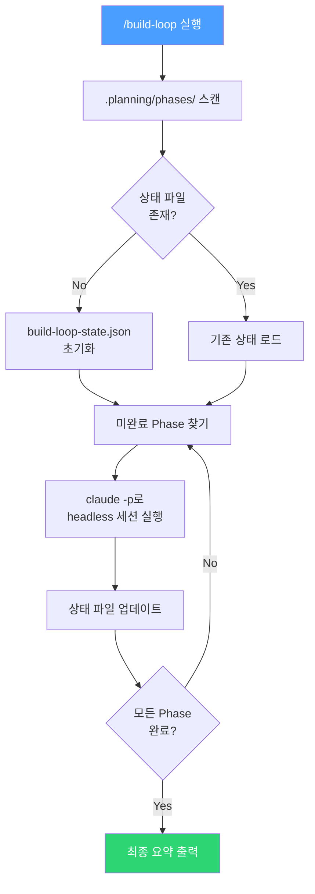

> **관련 글**: [GStack + GSD + Superpowers 워크플로우 정리]()

---

## Build Loop란?

GSD(Get Shit Done)로 분해한 Phase를 `claude -p` 헤드리스 세션으로 **자동 연속 실행**하는 Claude Code 커스텀 스킬이다. Ralph Wiggum Loop 패턴을 GSD 워크플로우에 맞게 적용한 것이다.

### 왜 필요한가?

GSD는 프로젝트를 여러 Phase로 나누지만, 각 Phase를 수동으로 하나씩 실행해야 한다:

```bash
# 수동 실행 — Phase가 10개면 10번 반복
$ claude -p "$(cat .planning/phases/01/01-01-PLAN.md)"
$ claude -p "$(cat .planning/phases/02/02-01-PLAN.md)"
$ claude -p "$(cat .planning/phases/03/03-01-PLAN.md)"
# ...
```

Build Loop는 이 과정을 **자동화**한다.

---

## 설치

### 방법 1: skills CLI (권장)

```bash
# build-loop 스킬 설치
npx skills add pallidev/agent-skills --skill build-loop

# 글로벌 설치 (모든 프로젝트에서 사용)
npx skills add pallidev/agent-skills --skill build-loop -g

# 전체 스킬 설치
npx skills add pallidev/agent-skills
```

> [skills.sh](https://skills.sh)는 Vercel Labs에서 만든 오픈소스 스킬 패키지 매니저다. 자세한 내용은 [skills.sh/docs/cli](https://skills.sh/docs/cli) 참고.

### 방법 2: 수동 설치

```bash
mkdir -p ~/.claude/skills/build-loop
# SKILL.md 파일을 ~/.claude/skills/build-loop/ 에 저장
```

---

## 동작 원리



핵심 아이디어:

1. **Orchestrator**는 코드를 직접 짜지 않고 Phase만 위임
2. 각 Phase는 **별도의 독립 세션**(새 컨텍스트 윈도우)에서 실행
3. 상태는 **디스크 파일**(`build-loop-state.json`)로 유지
4. Orchestrator의 컨텍스트 소모는 **~10%** 에 불과

---

## 상태 파일 형식

`.planning/build-loop-state.json`:

```json
{
  "project": "TodoApp",
  "startedAt": "2026-05-04T00:00:00Z",
  "updatedAt": "2026-05-04T01:30:00Z",
  "phases": [
    {
      "id": "01-project-setup",
      "name": "프로젝트 세팅 & DB 스키마",
      "status": "complete",
      "startedAt": "2026-05-04T00:00:00Z",
      "completedAt": "2026-05-04T00:15:00Z"
    },
    {
      "id": "02-crud-api",
      "name": "CRUD API 엔드포인트",
      "status": "in_progress",
      "startedAt": "2026-05-04T00:15:00Z",
      "completedAt": null
    },
    {
      "id": "03-frontend",
      "name": "React 프론트엔드",
      "status": "pending",
      "startedAt": null,
      "completedAt": null
    }
  ]
}
```

Phase의 `status`는 `pending` → `in_progress` → `complete`로 전이한다.

---

## 사용법

### 1. GSD로 Phase 분해 (선행 작업)

```bash
# GSD로 프로젝트 초기화 & Phase 분해
> /gsd:new-project
> /gsd:discuss-phase 1
> /gsd:plan-phase 1
# ... 각 Phase에 대해 반복
```

`.planning/phases/` 디렉토리에 Phase별 파일이 생성된다:

```
.planning/
├── PROJECT.md
├── REQUIREMENTS.md
├── ROADMAP.md
└── phases/
    ├── 01-project-setup/
    │   ├── 01-CONTEXT.md
    │   └── 01-01-PLAN.md
    ├── 02-crud-api/
    │   ├── 02-CONTEXT.md
    │   └── 02-01-PLAN.md
    └── 03-frontend/
        └── ...
```

### 2. Build Loop 실행

```bash
> /build-loop
```

스킬이 자동으로:

1. `.planning/phases/`를 스캔하여 모든 Phase를 탐색
2. 상태 파일이 없으면 초기화
3. 미완료 Phase 중 가장 번호가 작은 것을 찾음
4. 해당 Phase의 PLAN.md를 읽어 `claude -p`로 실행
5. 완료되면 상태 파일 업데이트 → 다음 Phase
6. 모든 Phase가 완료되면 종료

### 3. 중간에 재시작

세션이 끊어져도 상태 파일이 남아있으므로, 다시 `/build-loop`를 실행하면 **중단된 Phase부터 재개**된다.

---

## Ralph Loop와의 관계

Build Loop는 Ralph Wiggum Loop 패턴을 GSD 워크플로우에 특화시킨 것이다:

| 구분 | Ralph Wiggum Loop | Build Loop (이 스킬) |
|------|-------------------|---------------------|
| 목적 | 범용 자율 실행 | GSD Phase 연속 실행 |
| 상태 관리 | PRD JSON (userStories) | GSD의 `.planning/` 폴더 구조 |
| 실행 단위 | 임의 태스크 | GSD Phase |
| 중단/재개 | PRD의 `passes` 필드 | `build-loop-state.json` |
| 프롬프트 소스 | 단일 PROMPT.md | 각 Phase의 PLAN.md |

---

## 주의사항

- **GSD 선행 필요**: `.planning/phases/` 구조가 있어야 동작한다
- **Phase 실패 시 수동 개입**: 실행이 실패하면 사용자에게 알리고 다음 Phase로 넘어갈지 묻는다
- **API 비용**: Phase당 여러 에이전트가 실행되므로 토큰 소모가 크다
- **Greenfield 프로젝트에 추천**: 기존 프로젝트(Brownfield)에는 오버킬일 수 있다

---

## 참고 자료

- [GStack + GSD + Superpowers 워크플로우 정리]()
- [Ralph Wiggum Loop — Geoffrey Huntley](https://ghuntley.com/ralph/)
- [snarktank/ralph](https://github.com/snarktank/ralph) — Ralph Wiggum Loop 독립 구현체
- [GSD GitHub](https://github.com/gsd-build/get-shit-done) — Phase 분해 & 컨텍스트 관리 프레임워크
