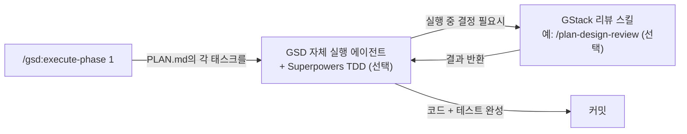
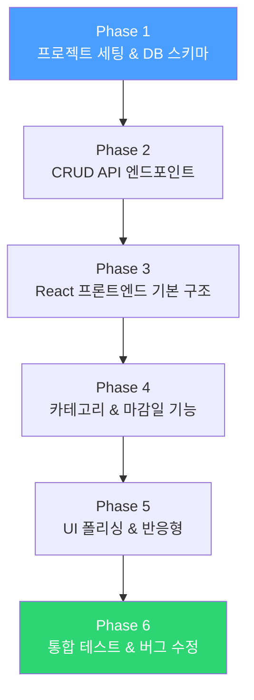
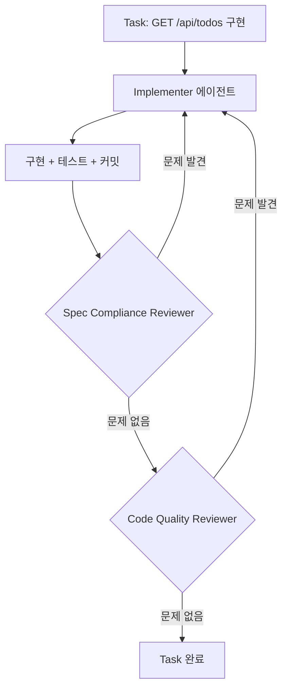
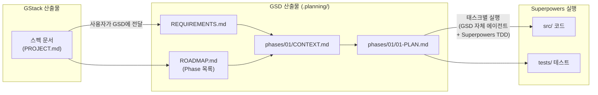

> **출처**: Eric Tech — "GStack + GSD + Superpowers Workflow Is Insane!"
> [영상 링크](https://www.youtube.com/watch?v=BlTpG51x94w)
> - [GStack](https://github.com/garrytan/gstack)
> - [Superpowers](https://github.com/obra/superpowers)
> - [GSD](https://github.com/gsd-build/get-shit-done)

---

## 전제조건

| 항목 | 요구사항 |
|------|---------|
| Claude Code | 최신 버전 권장 (`claude --version` 확인) |
| API 요금제 | `claude -p` (헤드리스 실행) 사용 가능한 플랜 필요 |
| 병렬 에이전트 | Claude Code의 Agent 도구(Subagent) 기본 지원 — 별도 설정 불요 |
| 디스크 | 프로젝트당 `.planning/` 폴더 생성 (수십 개 파일) |

---

## 상황별 추천 조합

> **먼저 확인하세요** — 모든 상황에서 세 개를 다 쓸 필요는 없습니다. 프로젝트 규모에 따라 조합하세요.

| 상황 | 추천 조합 | 이유 |
|------|----------|------|
| 기존 프로젝트에 작은 기능 추가 | **Superpowers 단독** | TDD만으로 충분 |
| 중간 규모 새 프로젝트 | **GStack + Superpowers** | 설계 토론 + TDD |
| 처음부터 만드는 대규모 프로젝트 | **GStack + GSD + Superpowers 전체** | 모든 강점 활용 |

---

## 핵심 한 줄 요약

세 프레임워크에서 **각자 가장 좋은 것만 뽑아서** 하나의 워크플로우로 합치면, Claude Code가 **혼자서 밤새 앱을 만들 수 있다**.

## 왜 이 세 개를 합쳐야 하나?

각 프레임워크는 "spec-driven(명세 기반) 개발"이라는 같은 목표를 가지지만, **강점이 다르다**:

| 프레임워크 | 담당 단계 | 핵심 강점 | 비유 |
|-----------|----------|----------|------|
| **GStack** | 스펙 작성 + 리뷰 | 23개 전문가 스킬(CEO, 디자이너, EM, QA, 보안 등)이 순차 리뷰 | 가상 엔지니어링 팀 |
| **GSD** | Phase 분해 | 큰 프로젝트를 작은 단계로 쪼개서 컨텍스트 로트 회피 | 마라톤을 구간별로 뛰는 릴레이 |
| **Superpowers** | 코드 실행 | TDD(테스트 주도 개발) 강제 — 테스트 먼저, 코드 나중 | 안전장치가 달린 공장 |

> **컨텍스트 로트(Context Rot)란?** Claude와 대화가 길어질수록(컨텍스트 윈도우 50% 초과) **정확도가 떨어지는 현상**. GSD는 이것을 방지한다.

---

## 실제로 어떻게 시작하나? (설치 & 적용)

> **먼저 알아둘 것** — 세 프레임워크 모두 Claude Code의 **커스텀 스킬/명령어** 형태로 동작한다. 각 저장소를 클론해서 설치한다.

### 각 프레임워크 설치 방법

**GStack** (한 줄 설치):

```bash
git clone --single-branch --depth 1 https://github.com/garrytan/gstack.git ~/.claude/skills/gstack && cd ~/.claude/skills/gstack && ./setup
```

설치 후 CLAUDE.md에 사용 가능한 스킬 목록을 추가해야 한다.

**GSD** (npx 설치):

```bash
npx get-shit-done-cc@latest
```

인터랙티브 설치 관리자가 실행되며, 런타임(Claude Code, OpenCode 등)과 설치 위치(전역/프로젝트)를 선택할 수 있다.

**Superpowers** (플러그인 마켓플레이스):

```bash
/plugin install superpowers@claude-plugins-official
```

설치 후 스킬이 **자동으로 활성화**된다. 별도 설정 없이 코딩 시작 시 자동으로 브레인스토밍 → 계획 → TDD 실행 사이클이 적용된다.

### 세 프레임워크가 실행 중에 어떻게 연결되나?

> **핵심 착각 주의** — GSD는 **자체 실행 에이전트**(`gsd-executor.md`)와 **wave 기반 병렬 실행** 파이프라인을 갖추고 있다. 즉, GSD만으로도 실행이 가능하다. Superpowers를 추가하면 GSD의 실행 과정에 **TDD 사이클이 강제**되는 이점이 생긴다.



연결 구조 (수동 조립):

1. **GSD가 실행을 주도** — `/gsd:execute-phase`를 치면 GSD가 PLAN.md를 읽고 자체 에이전트로 태스크를 실행
2. **Superpowers는 실행 품질을 보강** — GSD의 CLAUDE.md나 프롬프트에 Superpowers TDD 규칙을 포함시키면, 실행 과정에서 테스트 우선 작성이 강제됨
3. **GStack은 결정이 필요할 때 개입** — 실행 중 설계/아키텍처 질문이 생기면 GStack의 리뷰 스킬(`/plan-ceo-review`, `/plan-design-review` 등)을 호출 (CLAUDE.md 설정 필요)

> **연결은 자동인가 수동인가?** 세 프레임워크를 같이 설치해도 **자동으로 연결되지 않는다**. CLAUDE.md에 "실행 시 Superpowers TDD 규칙을 따르고, 결정이 필요하면 GStack 리뷰 스킬을 사용해" 같은 지시어를 직접 작성해야 연결된다. 처음에는 수동으로 각 단계를 실행하면서 연결 구조를 이해하는 것을 추천.

---

## 1단계: GStack — "가상 엔지니어링 팀으로 스펙 작성"

### 무엇을 하는가?

> **영상과 실제의 차이** — 영상에서는 GStack을 "여러 페르소나가 투표하는 시스템"이라고 설명하지만, **실제로는 투표 메커니즘이 없다**. 대신 각 역할별 **별도의 슬래시 명령어**가 있고, 순차적으로 리뷰를 진행한다.

GStack은 23개 전문가 스킬로 구성된 **가상 엔지니어링 팀**이다. 스펙 작성 단계에서 주로 사용하는 스킬:

| 명령어 | 역할 | 하는 일 |
|--------|------|---------|
| `/office-hours` | **YC Office Hours** | 시작점. 제품 아이디어를 6개 질문으로 재구성. 프레이밍에 도전하고 전제를 검증 |
| `/plan-ceo-review` | **CEO / 창업자** | 문제를 재고민. 10-star 제품을 찾기 위해 스코프를 확장/축소/유지 중 선택 |
| `/plan-eng-review` | **엔지니어링 매니저** | 아키텍처, 데이터 흐름, 엣지 케이스, 테스트 커버리지 락인 |
| `/plan-design-review` | **시니어 디자이너** | 각 디자인 차원을 0-10으로 평가, 10점이 되려면 어떻게 해야 하는지 제시 |
| `/plan-devex-review` | **DX 리드** | 개발자 경험 관점 리뷰. 경쟁사 대비 TTHW(처음 사용까지 걸리는 시간) 벤치마크 |
| `/autoplan` | **리뷰 파이프라인** | CEO → 디자인 → 엔지니어링 리뷰를 자동으로 순차 실행 |

### 실제 사용법

```bash
# 1. 아이디어 브레인스토밍 — 항상 여기서 시작
> /office-hours

# 2. CEO 리뷰 — 제품 스코프 검증
> /plan-ceo-review

# 3. 엔지니어링 리뷰 — 아키텍처 확정
> /plan-eng-review

# 4. 디자인 리뷰 — UI/UX 품질 검증 (필요시)
> /plan-design-review

# 또는 한 번에 전체 자동 실행
> /autoplan
```

### 구체적인 예시: "Todo 앱 만들기"

```
# /office-hours 실행
나: "Todo 앱을 만들고 싶어. React + Node.js + SQLite 스택으로."

GStack (YC Office Hours):
"Todo 앱이라고 하셨는데, 지금 설명하신 건 사실 '개인 비서 AI'에 가깝네요.
다섯 가지 기능을 뽑아봤습니다:
1. 할 일 관리 (말씀하신 것)
2. 캘린더 연동 (언급하셨지만 인식 못하심)
3. 스마트 우선순위 (암묵적 요구)
4. 반복 작업 자동화
5. 팀 공유

이 중에서 MVP에 들어갈 것을 선택하세요."

# /plan-ceo-review 실행 — 스코프 결정
GStack (CEO): "전체 비전은 3개월 프로젝트입니다. 내일 배포할 수 있는 가장 좁은 웨지부터 시작하세요."

# /plan-eng-review 실행 — 아키텍처 확정
GStack (EM): "SQLite는 MVP에 충분합니다. 하지만 나중에 PostgreSQL로 마이그레이션할 수 있도록
DB 추상화 레이어를 지금 설계에 넣어야 합니다."
```

### 산출물

이 단계가 끝나면 **스펙 문서**가 완성된다. 예:

```markdown
# Todo 앱 스펙
## 기능
- 할 일 CRUD (생성, 조회, 수정, 삭제)
- 카테고리 분류
- 마감일 설정
- 반응형 UI (모바일/데스크톱)

## 기술 스택
- Frontend: React + Tailwind CSS
- Backend: Node.js + Express
- DB: SQLite (나중에 PostgreSQL 마이그레이션 가능하도록 설계)

## 비기능 요구사항
- 오프라인 미지원 (MVP)
- 페이지 로드 2초 이내
```

---

## 2단계: GSD — "스펙을 실행 가능한 단계로 쪼개기"

### 무엇을 하는가?

스펙을 **여러 Phase(단계)** 로 나눈다. 각 Phase는 Claude의 **컨텍스트 윈도우 50%를 넘지 않도록** 설계된다.

### 실제 사용법

```bash
# 1. 프로젝트 초기화 — 아이디어 입력, 자동 리서치, 요구사항 추출
> /gsd:new-project

# 2. 각 Phase별 논의 — 구현 전 결정사항 정리
> /gsd:discuss-phase 1

# 3. 각 Phase별 계획 — 원자적 태스크 계획 수립
> /gsd:plan-phase 1

# 4. 각 Phase별 실행 — 병렬 에이전트로 실제 구현
> /gsd:execute-phase 1

# 5. 검증 — 사용자 수용 테스트
> /gsd:verify-work 1

# 반복: Phase 2, 3, ... 에 대해 2~5 반복
```

### 구체적인 예시: Todo 앱 Phase 분해



각 Phase는 일반적으로 **같은 Claude 세션의 Subagent**로 실행된다. Build Loop(`claude -p`)를 사용하면 각 Phase가 **별도의 독립 세션**에서 실행되어 컨텍스트 로트를 완벽히 회피할 수 있다. 화살표는 실행 순서(의존 관계)를 나타낸다.

### GSD가 만드는 폴더 구조

```
.planning/
├── PROJECT.md                  ← 프로젝트 비전
├── REQUIREMENTS.md             ← 요구사항 (REQ-001 형식)
├── ROADMAP.md                  ← Phase 분해 상태
├── STATE.md                    ← 현재 진행 상태 메모리
└── phases/
    └── 01-project-setup/
        ├── 01-CONTEXT.md       ← 이 Phase의 결정사항
        ├── 01-01-PLAN.md       ← 원자적 태스크 계획
        └── 01-VERIFICATION.md  ← 완료 후 검증 결과
```

### GSD가 만드는 작업 단위의 예시 (Phase 2)

```xml
<task type="auto">
  <name>POST /api/todos 엔드포인트 생성</name>
  <files>src/routes/todos.ts</files>
  <action>
    Express 라우터에 POST 엔드포인트 추가.
    요청 body에서 title, category, dueDate를 검증.
    SQLite에 INSERT 후 201 응답.
  </action>
  <verify>curl -X POST localhost:3000/api/todos -d '{"title":"테스트"}' 가 201 반환</verify>
  <done>유효한 데이터는 201, 누락 필드는 400 반환</done>
</task>
```

---

## 3단계: Superpowers — "테스트 먼저, 코드 나중"

### 무엇을 하는가?

각 Phase를 실행할 때 **반드시 테스트를 먼저 작성**한다. 이것이 핵심이다.

### 실제 사용법

```bash
# 방식 1: Superpowers 스킬 직접 호출
> /brainstorming          # 설계 브레인스토밍
> /writing-plans          # 구현 계획 수립
> /executing-plans        # 계획 실행
> /test-driven-development  # TDD 강제 모드
> /subagent-driven-development  # 병렬 에이전트 + 2단계 리뷰

# 방식 2: 플러그인 설치 후 자동 활성화
# Superpowers는 설치만 하면 코딩 시작 시 자동으로 브레인스토밍 → TDD 사이클이 적용됨
# 별도 명령어나 hooks 설정 불필요
```

### RED-GREEN-REFACTOR 사이클 (구체적 예시)

**Phase 2의 "GET /api/todos" 엔드포인트를 만든다고 가정:**

#### RED (테스트 먼저 작성 — 실패해야 함)

```javascript
// tests/todos.test.js
test("GET /api/todos가 빈 배열을 반환해야 한다", async () => {
  const res = await request(app).get("/api/todos");
  expect(res.status).toBe(200);
  expect(res.body).toEqual([]);
});
```

→ 아직 코드가 없으니 **실패**한다. (이것이 정상!)

#### GREEN (최소한의 코드 작성 — 통과하게 만들기)

```javascript
// src/routes/todos.ts
router.get("/todos", async (req, res) => {
  const todos = await db.query("SELECT * FROM todos");
  res.json(todos);
});
```

→ 테스트가 **통과**한다.

#### REFACTOR (코드 정리)

에러 핸들링 추가, 타입 정리 등 개선.

### Superpowers의 병렬 에이전트 구조



하나의 Task에 대해:

1. **Implementer** — 코드 + 테스트 작성
2. **Spec Compliance Reviewer** — "요구사항대로 만들었나?" 검사
3. **Code Quality Reviewer** — "코드 품질이 좋은가?" 검사

문제가 발견되면 Implementer가 수정하고 다시 검사받는다.

---

## 전체 데이터 흐름



**요약**: GStack(`/office-hours` → `/plan-ceo-review` → `/plan-eng-review`)이 쓴 스펙 → 사용자가 스펙을 GSD에 전달 → GSD가 `.planning/` 폴더에 Phase별 파일로 분해 → GSD 에이전트(+ Superpowers TDD)가 각 Phase의 PLAN.md를 읽고 실행

---

## 4단계: Build Loop — "Phase를 자동으로 연속 실행"

### 문제: 6~8개 Phase를 수동으로 하나씩 실행하기 귀찮다

### 해결: Orchestrator가 Phase를 연속 실행

```bash
# Orchestrator = 메인 Claude 세션 (직접 코드를 짜지 않음)
# claude -p = 백그라운드에서 프롬프트를 실행하는 Claude Code 기본 기능

# Phase 1 위임
$ claude -p "Phase 1 실행: 프로젝트 세팅 & DB 스키마 구현"
# → 백그라운드에서 완료, 결과 요약만 반환

# Phase 2 위임 (Phase 1 완료 후)
$ claude -p "Phase 2 실행: CRUD API 엔드포인트 구현"
# → 새 백그라운드 세션에서 실행

# ... 이것을 자동으로 반복하는 것이 Build Loop
```

### 핵심 포인트

| 개념 | 설명 |
|------|------|
| `claude -p` | Claude Code의 기본 기능. 대화형 세션 대신 **백그라운드에서 프롬프트 실행** |
| Orchestrator | 메인 세션. 직접 코드를 짜지 않고 **Phase만 위임** |
| Headless 세션 | 각 Phase를 실행하는 **독립적인 Claude 세션** (새 컨텍스트 윈도우) |
| 컨텍스트 소모 | Orchestrator는 ~10%만 사용 (실제 작업은 Headless가 처리) |

### Ralph Wiggum Loop (자동 Build Loop)

> **Ralph Wiggum Loop란?** **Geoffrey Huntley**가 창작한 자율 실행 패턴. 심슨의 Ralph Wiggum 캐릭터에서 따온 이름으로, 끈기 있게 반복 실행한다는 의미다. Eric Tech는 이 기법을 유튜브에서 소개한 크리에이터일 뿐, 창작자가 아니다.

핵심 원리는 **bash `while` 무한 루프**로 `claude -p`를 반복 실행하는 것이다:

```bash
# Ralph Wiggum Loop의 본질 (한 줄)
while :; do cat PROMPT.md | claude -p; done
```

매 반복마다 **새 세션**(새 컨텍스트 윈도우)으로 실행되며, 상태는 **디스크 파일**(코드, git 히스토리, 계획 파일)로 유지된다. 이전 대화 기록이 아닌 파일에서 자신의 작업을 읽어온다.

#### 주요 구현체

| 구현체 | 형태 | 특징 |
|--------|------|------|
| **Anthropic 공식 플러그인** | `/ralph-loop` 슬래시 명령어 | Claude Code에 내장. Stop Hook 기반으로 동작 |
| **[snarktank/ralph](https://github.com/snarktank/ralph)** | 독립 bash 스크립트 + PRD JSON | GitHub 10k+ 스타, 가장 인기 있는 독립 구현체 |
| **[PageAI-Pro/ralph-loop](https://github.com/PageAI-Pro/ralph-loop)** | npm 패키지, Docker 샌드박스 | 격리된 환경에서 실행 |

#### Anthropic 공식 플러그인 사용법

```bash
# Claude Code 세션 안에서
> /ralph-loop "PROMPT.md를 읽고 모든 태스크를 완성해" --completion-promise "COMPLETE" --max-iterations 50
> /cancel-ralph  # 중단 시
```

- Stop Hook 방식: Claude가 종료하려고 하면 훅이 이를 가로채고 동일한 프롬프트를 재전송
- `<promise>COMPLETE</promise>` 태그가 출력에 나타나면 완료로 판단
- 종료 코드: 0=완료, 1=최대 반복 도달, 2=차단됨, 3=결정 필요

#### snarktank/ralph 상태 파일 예시 (PRD JSON)

```json
{
  "project": "TodoApp",
  "branchName": "ralph/todo-crud",
  "description": "Todo CRUD 기능 구현",
  "userStories": [
    {
      "id": "US-001",
      "title": "할 일 생성 API",
      "acceptanceCriteria": ["POST /api/todos가 201 반환", "title 필수 필드 검증"],
      "priority": 1,
      "passes": false
    }
  ]
}
```

각 반복: 미완료 태스크 찾기 → `claude -p`로 실행 → 테스트/린트 확인 → 커밋 → 상태 업데이트 → 다음 태스크

### Ralph Loop 없이 수동으로 돌리는 방법

Ralph Loop가 없어도 동일한 결과를 얻을 수 있다. 차이는 **수동으로 Phase를 하나씩 실행**해야 한다는 것뿐이다:

```bash
# 수동 Build Loop — 터미널에서 직접 실행

# Phase 1
$ claude -p "$(cat .planning/phases/01/01-01-PLAN.md)"

# 완료 확인 후 Phase 2
$ claude -p "$(cat .planning/phases/02/02-01-PLAN.md)"

# ... 각 Phase 완료 후 다음 것 실행
```

> **요약**
> - **Ralph Loop 사용** → 밤새 100% 자동, 상태 파일 기반 관리
> - **수동 실행** → Phase마다 `claude -p` 직접 실행
> - 결과물은 동일. 차이는 자동화 정도뿐
> - Anthropic 공식 플러그인, snarktank/ralph 등 여러 성숙한 오픈소스 구현체가 존재

---

## 실행 중 결정이 필요한 경우

CLAUDE.md에 설정해두면, 실행 중 설계 관련 질문이 생겼을 때 GStack의 리뷰 스킬을 호출할 수 있다:

```
실행 에이전트: "Todo 항목을 리스트로 보여줄까, 카드로 보여줄까?"

→ /plan-design-review 호출 (CLAUDE.md에 설정 필요)
→ GStack의 디자이너 리뷰가 0-10 평가 후 권고안 제시
→ "카드 뷰 권장 (평가: 8/10)" 결정
→ 실행 에이전트가 계속 진행
```

> **영상과 실제의 차이** — 영상에서는 "페르소나가 자동으로 투표한다"고 설명하지만, 실제로는 GStack의 각 리뷰 스킬이 **순차적으로 평가**를 수행한다. 자동 연결은 CLAUDE.md 설정이 필요하며, 기본적으로는 수동으로 해당 스킬을 호출해야 한다.

---

## 데모 결과 (참고)

한 프로젝트를 이 워크플로우로 실행한 결과:

| 항목 | 결과 |
|------|------|
| 총 Phase 수 | 16개 |
| 백그라운드 세션 | 100+ 개 |
| Orchestrator 컨텍스트 | 10% 소모 |
| 실행 방식 | 밤새 자동 (overnight) |
| 결과 | 전체 스펙이 코드로 구현 완료 |

---

## 최종 산출물 예시 (Todo 앱 기준)

모든 Phase가 완료되면 다음과 같은 프로젝트가 생성된다:

```
todo-app/
├── src/
│   ├── routes/
│   │   ├── todos.ts          ← Phase 2 (CRUD API)
│   │   └── categories.ts     ← Phase 4 (카테고리)
│   ├── db/
│   │   └── schema.ts         ← Phase 1 (DB 스키마)
│   ├── components/
│   │   ├── TodoList.tsx       ← Phase 3 (프론트엔드)
│   │   ├── TodoCard.tsx       ← Phase 4
│   │   └── CategoryFilter.tsx ← Phase 4
│   └── app.tsx                ← Phase 3
├── tests/
│   ├── todos.test.ts          ← Phase 2 (Superpowers TDD)
│   ├── categories.test.ts     ← Phase 4
│   └── integration.test.ts    ← Phase 6 (통합 테스트)
├── .planning/                 ← GSD 관리 파일들
│   └── phases/                ← 각 Phase의 CONTEXT, PLAN, VERIFICATION
└── package.json
```

---

## 현실적 주의사항

**자동화가 100% 보장되지는 않는다**
- 에이전트 간 자동 소통(GStack↔Superpowers)이 항상 올바르게 작동하지 않을 수 있음
- Phase 실행이 실패하면 수동 개입이 필요할 수 있음
- Ralph Loop는 Anthropic 공식 플러그인을 포함해 여러 오픈소스 구현체가 존재 (snarktank/ralph, PageAI-Pro/ralph-loop 등)

**컨텍스트 로트 방지가 핵심이지만 완벽하지 않다**
- GSD가 Phase를 쪼개지만, Phase 자체가 너무 크면 여전히 문제 발생 가능
- 각 Phase의 범위를 신중하게 설정해야 함

**신규 프로젝트(Greenfield)에만 추천**
- 기존 프로젝트(Brownfield)에는 오버킬
- 기존 프로젝트는 상황별 추천 조합 표를 참고

**비용 고려**
- 16개 Phase × 여러 에이전트 = **API 비용이 상당할 수 있음**
- 밤새 돌린다는 건 그만큼 토큰을 소모한다는 뜻

---

## 참고 자료

- [GStack GitHub](https://github.com/garrytan/gstack) — 가상 엔지니어링 팀 (23개 전문가 스킬: 브레인스토밍, CEO/EM/디자인 리뷰, QA, 보안, 배포 등)
- [Superpowers GitHub](https://github.com/obra/superpowers) — TDD 기반 개발 프레임워크
- [GSD GitHub](https://github.com/gsd-build/get-shit-done) — Phase 분해 & 컨텍스트 관리 프레임워크
- [Spec Driven Playlist](https://www.youtube.com/playlist?list=PLm7xfhMOszqw2bbEYOVTdXn0Ou3wpNLHS)
- [Ralph Wiggum Loop — Geoffrey Huntley](https://ghuntley.com/ralph/) — 창작자의 공식 설명
- [snarktank/ralph](https://github.com/snarktank/ralph) — 가장 인기 있는 독립 구현체 (10k+ 스타)
- [Anthropic 공식 플러그인](https://github.com/anthropics/claude-code/blob/main/plugins/ralph-wiggum/README.md) — Claude Code 내장 Ralph Loop
