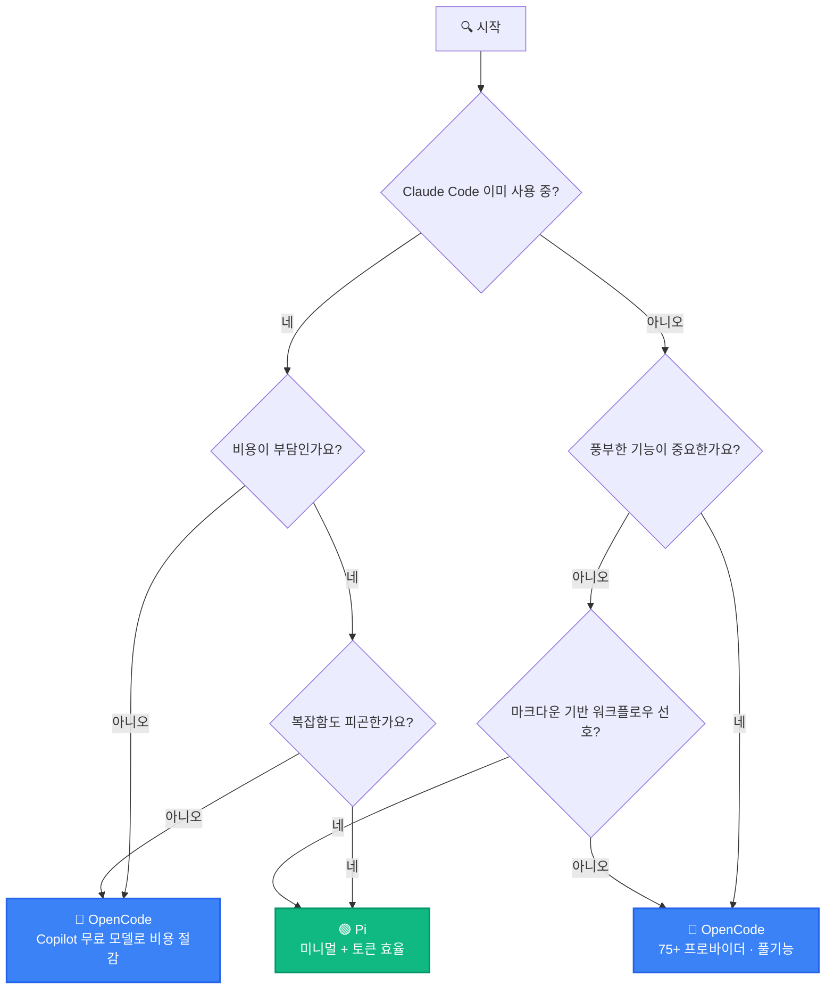

> **TL;DR** — Pi를 추천한다. 이유: (1) 숨겨진 컨텍스트 주입 없이 예측 가능 (2) 시스템 프롬프트 1/10로 API 비용 절감 (3) 필요한 기능만 확장으로 추가 (4) Pi 스스로 확장을 작성하는 자가 수정 가능. 즉시 풍부한 기능이 필요하면 OpenCode가 대안.
>
> **빠른 시작:**
> ```bash
> npm install -g @earendil-works/pi-coding-agent   # 설치
> cd /path/to/project && pi && /login               # 실행 + 인증
> npx @robzolkos/lazypi                             # 확장 한번에 설치 (선택)
> ```

---

## 한눈에 보기 — 철학 스펙트럼

<video autoplay loop muted playsinline width="100%" style="max-width: 1280px; border-radius: 8px; box-shadow: 0 2px 8px rgba(0,0,0,0.15);">
  <source src="/assets/videos/philosophy-spectrum.webm" type="video/webm">
</video>

| | Claude Code | OpenCode | Pi |
|---|---|---|---|
| **개발** | Anthropic | anomalyco (커뮤니티) | Mario Zechner |
| **오픈소스** | 아니오 | 네 (100%) | 네 |
| **비용** | $20/월 + API | API 비용만 | API 비용만 |

- **Claude Code** — Anthropic 생태계에 깊이 통합. 강력한 기본값, 낮은 설정 부담, 벤더 종속.
- **OpenCode** — Claude Code의 오픈소스 미러. provider 무관, TUI/데스크톱/모바일 클라이언트, Client/Server 아키텍처. neovim 유저와 terminal.shop 제작자가 개발.
- **Pi** — "반대 방향". 최소한의 코어, 모든 추가 기능은 사용자가 선택해 확장. 예측 가능하고 토큰 효율적.

---

## 기능 비교 — 레이더 차트

<video autoplay loop muted playsinline width="100%" style="max-width: 1280px; border-radius: 8px; box-shadow: 0 2px 8px rgba(0,0,0,0.15);">
  <source src="/assets/videos/feature-radar.webm" type="video/webm">
</video>

| | Claude Code | OpenCode | Pi |
|---|---|---|---|
| **기본 툴** | 풀셋 | 풀셋 | 4개 (read, write, edit, bash) |
| **시스템 프롬프트** | ~10k 토큰 | ~10k 토큰 | <1,000 토큰 |
| **Provider** | Anthropic 전용 | 75+ 프로바이더 | 20+ 내장 + 커스텀 |
| **Plan 모드** | 없음 | 내장 (Tab) | 확장으로 추가 |
| **MCP** | 내장 | 내장 | 확장 (`pi-mcp-adapter`) |
| **Sub-agent** | 내장 | 내장 (`@general`) | 확장 (`pi-subagents`) |
| **LSP** | 없음 | 옵트인 | 없음 |
| **메모리** | 없음 | 없음 | 확장 (`pi-memory-md`) |
| **데스크톱 앱** | 네 | 네 (베타) | 아니오 |
| **GitHub Copilot** | 아니오 | 네 (무료 모델) | 네 |
| **확장 시스템** | MCP + hooks | 설정 + rules | TypeScript 확장 |
| **테마** | 없음 | 내장 | 2 내장 + 76 커뮤니티 |

---

## 비용 비교 (월 기준)

<video autoplay loop muted playsinline width="100%" style="max-width: 1280px; border-radius: 8px; box-shadow: 0 2px 8px rgba(0,0,0,0.15);">
  <source src="/assets/videos/cost-comparison.webm" type="video/webm">
</video>

| 사용 패턴 | Claude Code | OpenCode + OpenRouter | Pi + OpenRouter |
|---|---|---|---|
| 가벼운 사용 | $20 + ~$5 API | ~$5-10 | ~$3-8 |
| 일일 사용 | $20 + ~$20 API | ~$15-30 | ~$10-20 |
| 고강도 사용 | $20 + ~$50+ API | ~$30-60 | ~$20-40 |

> Pi의 토큰 효율(<1k 시스템 프롬프트)로 동일 작업 대비 API 비용이 절감된다.

---

## 어떤 걸 골라야 할까?



---

## Pi를 1순위로 추천하는 이유

### 1. 예측 가능성

대부분의 harness(에이전트 프레임워크)는 사용자 모르게 컨텍스트에 규칙, 예시, 안전 지침 등을 주입한다. Pi의 창작자 Mario Zechner도 Claude Code를 쓰다가 이 문제 때문에 Pi를 만들었다. Pi는 1,000토큰 미만의 시스템 프롬프트만으로 구동하며, 매 요청마다 같은 조건에서 작동한다.

### 2. 토큰 효율

OpenCode나 Claude Code는 시스템 프롬프트에 ~10k 토큰을 소모한다. Pi는 이를 1/10 수준으로 유지해서 같은 비용으로 더 많은 "생각"을 얻을 수 있다.

### 3. 점진적 복잡성

Pi는 기본 4개 툴(read, write, edit, bash)만 제공한다. MCP, 메모리, 서브에이전트 등은 모두 확장으로 추가한다. 필요한 것만 골라 쓰면 되고, 불필요한 기능으로 인한 혼란이 없다.

### 4. 자가 수정

Pi는 TypeScript 확장 시스템을 갖추고 있어, Pi 스스로에게 "이 확장을 만들어줘"라고 요청할 수 있다. Pi가 Pi 자신의 기능을 확장하는 셈이다.

---

## Pi 설치 및 추천 설정

### 설치

```bash
# npm (공식)
npm install -g @earendil-works/pi-coding-agent

# curl
curl -fsSL https://pi.dev/install.sh | sh
```

### 인증

**구독 로그인** (Claude Pro/Max, ChatGPT Plus/Pro, GitHub Copilot):
```
pi
/login
```

**API 키** (직접):
```bash
export ANTHROPIC_API_KEY=sk-ant-...
# 또는 ~/.pi/agent/auth.json에 저장
```

### 프로젝트 설정

`AGENTS.md` 파일로 프로젝트별 지침 제공:
- `~/.pi/agent/AGENTS.md` — 글로벌 지침
- 프로젝트 루트의 `AGENTS.md` 또는 `CLAUDE.md` — 프로젝트 지침

### 추천 확장

| 확장 | 역할 |
|------|------|
| `pi-memory-md` | 세션 간 지속 메모리 (마크다운 파일) |
| `pi-mcp-adapter` | MCP 서버 연결 (GitHub, Playwright 등) |
| `pi-subagents` | 병렬 서브에이전트 |
| `pi-plan` | 읽기전용 계획 모드 |
| `pi-web-access` | 웹 검색 및 URL 가져오기 |
| `pi-powerbar` | 상태바 (모델명, 토큰 사용량) |
| `pi-usage-extension` | API 비용 추적 |

**LazyPi**로 한번에 설치하려면:
```bash
npx @robzolkos/lazypi
```
60+ 스킬, 76 테마, MCP 지원, 메모리, 서브에이전트, 비용 추적 등을 한번에 추가할 수 있다. LazyPi는 설치 도구일 뿐, 설치된 확장은 독립적으로 동작하므로 나중에 LazyPi를 지워도 된다.

### 자주 쓰는 명령

| 명령 | 설명 |
|------|------|
| `pi` | 대화형 세션 시작 |
| `pi -c` | 최근 세션 이어서 |
| `pi -r` | 이전 세션 탐색 |
| `pi -p "프롬프트"` | 비인터랙티브 모드 |
| `@파일명` | 에디터에서 파일 참조 |
| `!명령어` | 쉘 명령 실행 (결과를 모델에 전송) |
| `/model` 또는 `Ctrl+L` | 모델 전환 |
| `/reload` | 확장 리로드 |

---

## 결론

즉시 사용 가능한 풍부한 기능이 필요하면 **OpenCode**가 더 나은 선택이다. 하지만 예측 가능성, 토큰 효율, 점진적 복잡성을 중시한다면 **Pi**가 Claude Code를 대체할 가장 강력한 후보다.

---

**참고 자료:**
- [Pi 공식 사이트](https://pi.dev/)
- [Pi Quickstart 가이드](https://pi.dev/docs/latest/quickstart)
- [anomalyco/opencode GitHub](https://github.com/anomalyco/opencode)
- [BitDoze: Pi Coding Agent Setup Guide](https://www.bitdoze.com/pi-coding-agent-setup-guide/)
- [XDA: I ditched Claude Code and OpenCode for Pi](https://www.xda-developers.com/replaced-claude-code-and-opencode-with-pi/)
- [Mario Zechner: What I learned building Pi](https://mariozechner.at/posts/2025-11-30-pi-coding-agent/)
- [Pragmatic Engineer: Building Pi](https://newsletter.pragmaticengineer.com/p/building-pi-and-what-makes-self-modifying)
