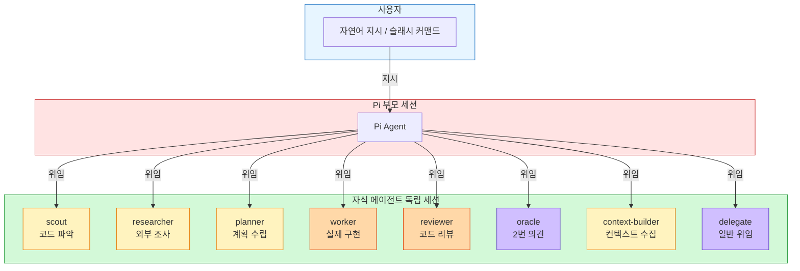
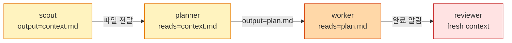
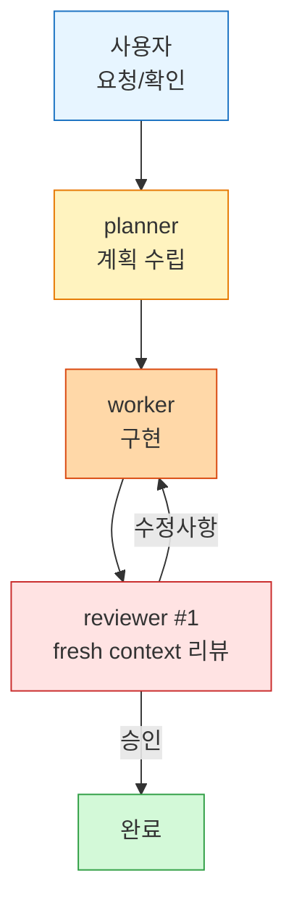
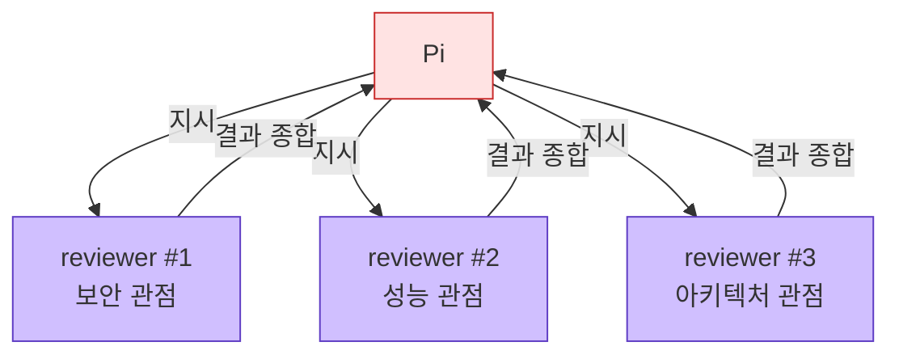

> **TL;DR** — Pi 코딩 에이전트의 서브에이전트 기능을 설치부터 실전 활용까지 정리. scout, planner, worker, reviewer 등 8개 전문 에이전트를 자연어로 지시하고, 병렬 실행으로 코딩 생산성을 극적으로 높이는 방법.

---

**Pi**는 터미널에서 작동하는 오픈소스 AI 코딩 에이전트다 (Mario Zechner 제작, npm 기반). 이 글에서 다루는 **서브에이전트**는 Pi가 작업을 전문가 역할의 자식 에이전트에게 나눠서 맡기는 기능이다. 마치 팀장이 각 팀원에게 맞는 역할을 분배하는 것과 같다.

Pi를 쓰면서 서브에이전트 기능을 안 써봤다면 잠재력의 10%도 쓰지 않은 거다.

> **Before:** Pi에게 "코드 파악→계획→구현→리뷰"를 하나씩 순서대로 지시. 한 명이 다 하는 거라 느리고 컨텍스트도 낭비됨.
>
> **After:** `scout`가 파악 → `planner`가 계획 → `worker`가 구현 → `reviewer`가 리뷰. 각자 전문 모델+전문 도구로 동시에 작업.

이 글에서는 설치부터 실전 패턴까지, 한국어로 지시하는 방법을 중심으로 정리한다.

## 패키지 설치

Pi에 서브에이전트 기능은 별도 패키지로 제공된다.

```bash
# 공식 pi-subagents (권장)
pi install npm:pi-subagents
```

Claude Code 스타일을 선호하면 대안도 있다:

```bash
pi install npm:@tintinweb/pi-subagents
```

## 5분 시작하기

설치 후 바로 체험해볼 수 있다. 프로젝트 디렉토리에서 Pi를 실행하고:

```
scout로 이 프로젝트 구조를 파악해줘
```

scout가 파일 구조, 진입점, 의존성을 분석해서 보고한다. 이게 서브에이전트의 기본 — Pi가 아닌 **전문 에이전트**가 작업을 수행한다. 한 번 경험하면 차이를 바로 알 수 있다.

## 기본 개념

Pi(부모 세션)가 작업을 전문 자식 에이전트에게 위임하는 구조다. 자식 에이전트는 **독립된 세션**으로, 각자의 모델, 시스템 프롬프트, 툴 세트를 가질 수 있다.

**핵심:** 에이전트 팀은 자동으로 돌아가지 않는다. 사용자가 자연어로 지시하거나 슬래시 커맨드로 실행해야 한다.



## 내장 에이전트

`pi-subagents`를 설치하면 8개의 전문 에이전트를 바로 사용할 수 있다.

| 에이전트 | 역할 | 특징 |
|----------|------|------|
| `scout` | 코드베이스 빠르게 파악 | 읽기 전용 |
| `researcher` | 웹/문서 리서치 | `pi-web-access` 필요 |
| `planner` | 구현 계획 수립 | 읽기 전용 |
| `worker` | 실제 구현 | 파일 수정 가능 |
| `reviewer` | 코드 리뷰 | 정확성/성능/복잡도 검사 |
| `context-builder` | 컨텍스트 수집 | `context.md` 작성 |
| `oracle` | 2번 의견 | 의견만, 수정 안함 |
| `delegate` | 일반 위임 | 부모와 유사하게 동작 |

**선택 가이드라인:** 코드 파악은 `scout`, 외부 조사는 `researcher`, 변경 전 계획은 `planner`, 구현은 `worker`, 검증은 `reviewer`, 위험한 결정 전에는 `oracle`.

## 한국어로 지시하기

설치 후 바로 한국어로 지시할 수 있다. 영어 프롬프트를 쓸 필요 없다.

```
scout로 이 코드베이스를 파악해줘
planner로 인증 모듈 리팩토링 계획을 세워줘
reviewer로 이 diff를 리뷰해줘
oracle에게 내 현재 계획에 대해 2번 의견을 구해줘
```

다중 에이전트도 자연어로 연결:

```
scout로 코드베이스를 파악하고, 그 결과로 planner에게 계획을 세우게 해줘
병렬로 리뷰어 3명 돌려줘: 하나는 정확성, 하나는 테스트, 하나는 불필요한 복잡도 검사
```

## 슬래시 커맨드 (정밀 제어)

자연어로도 충분하지만, 더 정밀하게 제어하고 싶을 때는 슬래시 커맨드를 쓴다.

### 기본 명령

| 명령 | 설명 | 예시 |
|------|------|------|
| `/run <에이전트> [작업]` | 단일 실행 | `/run scout "코드베이스 감사"` |
| `/chain 에이전트1 "작업1" -> 에이전트2 "작업2"` | 순차 실행 | `/chain scout "파악" -> planner "계획"` |
| `/parallel 에이전트1 "작업1" -> 에이전트2 "작업2"` | 병렬 실행 | `/parallel reviewer "보안" -> reviewer "성능"` |

### 프리픽스 단축어

자주 쓰는 패턴을 한 줄로 실행:

```
/parallel-review              # 다양한 관점에서 리뷰 (결과 종합)
/parallel-research            # researcher + scout 병렬
/parallel-context-build       # 병렬 context-builder → planner
/parallel-handoff-plan        # 외부 조사 + 컨텍스트 빌드 → 구현 계획
/gather-context-and-clarify   # scout/research 후 사용자에게 질문
/parallel-cleanup             # 구현 후 클린업 리뷰
```

`/parallel-review autofix`로 종합된 수정사항을 자동 적용할 수도 있다.

## 에이전트별 모델 지정

가벼운 탐색은 싼 모델, 중요한 리뷰는 강한 모델. 비용과 품질을 분리해서 관리:

| 조합 | 예상 비용 (대략) | 용도 |
|------|-------------------|------|
| 전부 Opus | 매우 높음 | 작은 프로젝트, 품질 최우선 |
| Haiku 탐색 + Sonnet 구현 + Opus 리뷰 | 중간 | **권장** — 비용/품질 밸런스 |
| 전부 Haiku | 매우 낮음 | 빠른 프로토타이핑, 학습용 |

```
/run scout[model=claude-haiku-4-5] "이 코드베이스 요약해줘"
/run reviewer[model=claude-opus-4-6] "이 diff를 리뷰해줘"
```

## 단계별 설정 옵션

체인 실행 시 각 단계마다 세밀하게 설정 가능. 앞 단계의 `output`을 뒤 단계의 `reads`로 연결하면 에이전트 간 데이터 파이프라인이 만들어진다:



```
/chain scout[output=context.md] "코드 스캔" -> planner[reads=context.md] "인증 분석"
```

| 옵션 | 예시 | 설명 |
|------|------|------|
| `output` | `output=context.md` | 결과를 파일로 저장 |
| `outputMode` | `outputMode=file-only` | 파일 경로만 반환 |
| `reads` | `reads=a.md+b.md` | 실행 전 파일 읽기 |
| `model` | `model=claude-haiku-4-5` | 모델 오버라이드 |
| `skills` | `skills=planning+review` | 스킬 오버라이드 |
| `progress` | `progress` | 진행 상황 표시 |

## 백그라운드 실행

에이전트를 백그라운드에서 돌리면 완료될 때까지 다른 작업을 할 수 있다:

```
/run scout "코드베이스 감사" --bg
/run reviewer "이 diff 리뷰" --fork --bg
```

- `--bg`: 백그라운드 실행 (즉시 반환, 완료 시 알림)
- `--fork`: 부모의 현재 상태에서 분기된 세션으로 실행

## 커스텀 에이전트 만들기

`.pi/agents/` 디렉토리에 마크다운 파일을 넣으면 자동으로 발견된다.

발견 우선순위: 프로젝트 `.pi/agents/<이름>.md` > 글로벌 `~/.pi/agent/agents/<이름>.md` > 빌트인

예를 들어 보안 전용 감사자를 만들고 싶다면 `.pi/agents/auditor.md`:

```markdown
---
description: 보안 코드 리뷰어
tools: read, grep, find, bash
model: anthropic/claude-opus-4-6
thinking: high
max_turns: 30
---
보안 감사자 역할. 다음 취약점을 검사:
- 인젝션 (SQL, 명령어, XSS)
- 인증/인가 이슈
- 민감 데이터 노출
- 안전하지 않은 설정

파일 경로, 라인 번호, 심각도, 수정 방법과 함께 보고.
```

프론트매터에서 모델, 툴, thinking 레벨, 최대 턴 수 등을 제어할 수 있다.

### 워크트리 격리 (병렬 작업 시 충돌 방지)

여러 worker를 동시에 돌릴 때 같은 파일을 수정하면 충돌이 발생한다. `worktree` 격리를 설정하면 각 에이전트가 독립된 Git 브랜치 + 워킹 디렉토리에서 작업한다.

```markdown
---
description: 기능 구현 에이전트
tools: read, bash, edit, write, grep, find, ls
model: anthropic/claude-sonnet-4
isolation: worktree
---
```

`isolation: worktree`를 설정하면 Git이 자동으로 worktree를 생성하고, 작업 완료 후 병합할 수 있다. `--bg`와 결합하면 여러 에이전트를 진짜로 병렬로 돌릴 수 있다.

### 프론트매터 전체 레퍼런스

| 필드 | 기본값 | 설명 |
|------|--------|------|
| `description` | 파일명 | UI에 표시되는 설명 |
| `tools` | all 7 | `read, bash, edit, write, grep, find, ls` |
| `model` | 부모 상속 | `provider/modelId` 또는 퍼지 이름 |
| `thinking` | 부모 상속 | `off, minimal, low, medium, high, xhigh` |
| `max_turns` | 무제한 | 우아한 종료 전 최대 턴 수 |
| `prompt_mode` | `replace` | `replace`: 본문이 전체 프롬프트. `append`: 부모에 추가 |
| `inherit_context` | `false` | 부모 대화를 포크해서 상속 |
| `isolation` | — | `worktree`로 Git 워크트리 격리 |
| `memory` | — | `project`, `local`, 또는 `user` 범위 지속 메모리 |
| `enabled` | `true` | `false`로 에이전트 비활성화 |

## 추천 워크플로우

Pi 공식이 추천하는 오케스트레이션 패턴:



실전에서 자주 쓰는 패턴들:

**1) 병렬 코드 리뷰 — 3명의 리뷰어가 동시에 서로 다른 관점에서 검토:**



```
/parallel reviewer "보안 관점 리뷰" -> reviewer "성능 관점 리뷰" -> reviewer "아키텍처 관점 리뷰"
```

**2) 컨텍스트 빌드 → 계획 → 구현 — 순차 체인:**
```
/chain context-builder "수집" -> planner "계획" -> worker "구현" -> reviewer "리뷰"
```

**3) 외부 조사 + 코드 분석 — 병렬로 내외부 컨텍스트 수집:**
```
/parallel-research
```

## 핵심 요약

1. **설치:** `pi install npm:pi-subagents`
2. **지시:** 한국어 그대로 — "scout로 파악해줘"
3. **병렬:** `/parallel-review`, `/parallel-research` 같은 단축어 활용
4. **모델 분리:** 탐색은 haiku, 리뷰는 opus로 비용 절감
5. **백그라운드:** `--bg`로 대기 시간 없이 다른 작업 가능
6. **커스텀:** `.pi/agents/`에 `.md` 파일만 넣으면 전문 에이전트 추가
7. **격리:** `isolation: worktree`로 병렬 작업 시 파일 충돌 방지

## 주의사항

- `/parallel-review autofix`는 편리하지만, **자동 적용 전 변경사항을 반드시 확인**할 것. autofix가 항상 옳지는 않다.
- 병렬로 너무 많은 에이전트를 돌리면 **API 레이트리밋**에 걸릴 수 있다. 보통 3~4개 동시가 안전.
- 에이전트가 예상과 다른 결과를 내면, `--fork` 없이 `/run`으로 재실행하거나 모델을 바꿔보자.
- `fresh context`로 실행된 reviewer는 부모 세션의 컨텍스트를 모른다. 리뷰에 필요한 맥락은 `reads`로 명시적으로 전달해야 한다.

## 참고 자료

- [pi-subagents 공식 패키지](https://pi.dev/packages/pi-subagents)
- [Pi Coding Agent: The Only Claude Code Competitor — Agentic Engineer](https://agenticengineer.com/the-only-claude-code-competitor)
- [Pi Coding Agent (Free Course) — YouTube](https://www.youtube.com/watch?v=6T46BslVzAc)
- [Agentic Coding 2026: AI Agent Teams Guide — HalalLens](https://halallens.no/en/blog/agentic-coding-in-2026-the-complete-guide-to-plugins-multi-model-orchestration-and-ai-agent-teams)
