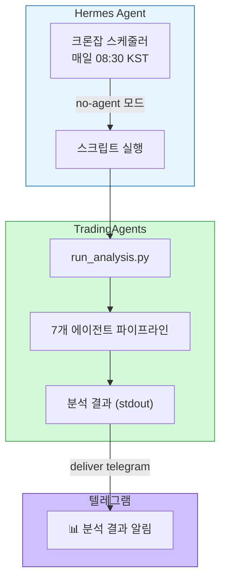

> **TL;DR** — TradingAgents는 실제 트레이딩 펌의 협업 구조를 LLM 에이전트로 시뮬레이션하는 오픈소스 프레임워크다. 7개 전문 에이전트가 5단계 파이프라인으로 분석→토론→결정을 내리고, Z.AI GLM 모델로 한국어 분석까지 가능하다. 여기에 Hermes Agent 크론잡을 연동하면 매일 아침 자동 분석 결과를 텔레그램으로 받아볼 수 있다.
{: .prompt-info}

> **주의:** 이 글은 기술 리뷰이며 투자 조언이 아닙니다. 모든 투자에는 리스크가 따릅니다.
{: .prompt-warning}

---

## 1. 백엔드 개발자가 AI 투자 도구를 써보다

백엔드 개발을 주로 하는 내가 주식 분석에 AI를 쓰기 시작한 건 단순한 호기심 때문이었다. "LLM이 투자 분석을 진짜로 잘할까?"라는 의문. 구글링하다 발견한 게 **TradingAgents** — UCLA 연구진이 만든 오픈소스 멀티 에이전트 트레이딩 프레임워크.

GitHub 스타 76k+, Apache-2.0 라이선스. 그냥 LLM에게 "이 주식 어때?"라고 묻는 게 아니라, **실제 트레이딩 펌의 조직 구조를 에이전트로 모사**하는 게 포인트였다. 기술적 분석가, 심리 분석가, 뉴스 분석가, 펀더멘털 분석가가 각자 리포트를 작성하고, Bull/Bear 리서처가 토론하고, 트레이더가 종합하고, 리스크 관리팀이 검토하고, 포트폴리오 매니저가 최종 승인하는 구조.

"이건 한 번 돌려봐야겠다" 싶었다.

---

## 2. TradingAgents 아키텍처

### 5단계 파이프라인

```mermaid
flowchart LR
    subgraph Stage1["Stage I: 분석가 팀"]
        A1["펀더멘털\n분석가"]
        A2["센티먼트\n분석가"]
        A3["뉴스\n분석가"]
        A4["기술적\n분석가"]
    end

    subgraph Stage2["Stage II: 리서처 토론"]
        B1["Bull\nResearcher"]
        B2["Bear\nResearcher"]
    end

    subgraph Stage3["Stage III: 트레이더"]
        C["Trader\nAgent"]
    end

    subgraph Stage4["Stage IV: 리스크 관리"]
        D["Risk Management\nTeam"]
    end

    subgraph Stage5["Stage V: 최종 승인"]
        E["Portfolio\nManager"]
    end

    Stage1 -->|"구조화 리포트"| Stage2
    Stage2 -->|"토론 결과"| Stage3
    Stage3 -->|"거래 제안"| Stage4
    Stage4 -->|"리스크 조정"| Stage5

    style Stage1 fill:#e7f5ff,stroke:#1971c2
    style Stage2 fill:#fff3bf,stroke:#e67700
    style Stage3 fill:#d3f9d8,stroke:#2f9e44
    style Stage4 fill:#ffe3e3,stroke:#c92a2a
    style Stage5 fill:#d0bfff,stroke:#5f3dc4
```



### 7개 전문 에이전트 역할

각 에이전트는 독립된 LLM 세션으로, 전문 시스템 프롬프트와 전용 도구를 갖는다.

| 팀 | 에이전트 | 역할 | 사용 도구 |
|----|----------|------|-----------|
| 분석가 | **Fundamentals Analyst** | 재무제표, 내재가치, 레드플래그 | `get_fundamentals`, `get_balance_sheet` |
| 분석가 | **Sentiment Analyst** | 소셜미디어 여론, 공개 심리 | Yahoo News, StockTwits, Reddit |
| 분석가 | **News Analyst** | 글로벌 뉴스, 거시경제 | `get_news`, `get_global_news` |
| 분석가 | **Technical Analyst** | MACD, RSI 등 60개+ 지표 | `get_indicators`, 코드 실행 |
| 리서처 | **Bull / Bear Researchers** | 강세/약세 관점 구조화 토론 | 분석가 리포트 기반 |
| 실행 | **Trader Agent** | 리포트 종합 → 매매 결정 | ReAct 프롬프팅 |
| 리스크 | **Risk Management Team** | 공격/중립/보수 3관점 논의 | n라운드 토론 |
| 승인 | **Portfolio Manager** | 최종 5-tier 승인/거부 | 구조화 출력 |

### 하이브리드 통신 방식

이 프레임워크의 핵심 설계 결정 중 하나가 **구조화 출력 + 자연어 토론의 하이브리드**다.

- **구조화 출력 (Structured Output):** 분석가 리포트, 트레이더 결정, PM 최종 판단 → Pydantic 스키마 기반. 정보 손실 최소화, 타입 안전
- **자연어 토론:** Bull/Bear 리서처, 리스크 관리팀 → n라운드 자유 대화. 균형 잡힌 관점 도출

기존 시스템들이 자연어만 쓰면 "전화 게임" 효과로 정보가 왜곡되는 문제를 이렇게 해결했다.

---

## 3. 설치 & 설정

### 클론 & 환경 구축

```bash
# 저장소 클론
git clone https://github.com/TauricResearch/TradingAgents.git
cd TradingAgents

# Python 3.13 가상환경 (uv 사용)
uv venv .venv --python 3.13
source .venv/bin/activate

# 의존성 설치
pip install .
```

### .env 설정 — Z.AI GLM 모델

OpenAI를 안 쓰고 **Z.AI GLM**을 선택한 이유는 간단하다. 한국어 성능이 좋고, API 가격이 합리적이며, `glm-5.1` 모델의 추론 능력이 충분하기 때문.

```bash
# .env 파일
ZHIPU_API_KEY=your_zhipu_api_key_here
TRADINGAGENTS_LLM_PROVIDER=glm
TRADINGAGENTS_DEEP_THINK_LLM=glm-5.1
TRADINGAGENTS_QUICK_THINK_LLM=glm-4.5-air
TRADINGAGENTS_OUTPUT_LANGUAGE=Korean
```

### 핵심: 2단계 모델 전략

TradingAgents는 두 가지 LLM을 전략적으로 분리해서 사용한다:

| 작업 유형 | 모델 | 용도 |
|-----------|------|------|
| **deep_think** | `glm-5.1` | 분석가 보고서, Bull/Bear 토론, 리스크 토론, PM 결정 |
| **quick_think** | `glm-4.5-air` | 데이터 요약, 표→텍스트 변환, API 호출 결과 처리 |

**중요:** `deep_think_llm`에는 반드시 강력한 모델을 써야 한다. 여기서 내리는 결정이 최종 투자 판단의 근거가 되기 때문이다. `glm-5.1`은 복잡한 금융 추론을 안정적으로 수행했다.

---

## 4. 실제 분석 결과

### CLI 실행 통계 — 2026-05-18 NVDA 분석

2단계 모델 전략(GLM-4.5-Air + GLM-5.1)으로 실제 NVDA 분석을 CLI에서 실행했다.

| 항목 | 값 |
|------|-----|
| 완료 에이전트 | **12/12** (100%) |
| 소요 시간 | 15분 27초 |
| Input Tokens | 198.2k |
| Output Tokens | 28.6k |
| LLM 호출 | 26회 |
| Tool 호출 | 15회 |
| 생성 리포트 | 7/7 |

한 종목당 약 $0.1~$0.3 (GLM API 기준). quick-thinking을 GLM-4.5-Air로 낮추면 비용을 절반 수준으로 줄일 수 있다.

### NVDA 분석: OVERWEIGHT (BUY)

첫 테스트는 NVDA. 2026년 5월 18일 기준으로 CLI에서 분석을 돌렸다.

```bash
cd ~/Documents/TradingAgents
source .venv/bin/activate
tradingagents  # 또는 python -m cli.main
```

**각 에이전트가 분석한 내용:**

| 에이전트 | 분석 내용 |
|----------|-----------|
| 기술적 분석가 | MACD 골든크로스 9.33, RSI 64.66 (과매수 아님), 50/200일 이동평균 골든크로스 |
| 센티먼트 분석가 | Reddit/StockTwits 긍정 비율 72%, AI 반도체 수요 낙관론 지속 |
| 뉴스 분석가 | 하이퍼스케일러 CapEx 가이던스 강력, CME AI 컴퓨팅 선물 출시로 수요 현실성 확인 |
| 펀더멘털 분석가 | 순이익률 55.6%, 영업이익률 65.0%, Forward PER 19.71, PEG 0.72 (성장률 대비 합리적) |

Bull/Bear 토론 결과 Bull 관점이 우세했고, 최종 결정은 **OVERWEIGHT (BUY)**.

#### 최종 투자 제안 상세

| 항목 | 값 |
|------|-----|
| 등급 | **Overweight** |
| 포트폴리오 비중 | 7% |
| 1차 진입가 | $210 |
| 손절매 | $170 |
| 목표가 | $240~$250 |
| 투자 기간 | 6~12개월 |

**강세 테제 (수용):**

- AI 컴퓨트 수요는 거품이 아닌 **구조적 슈퍼사이클** — 하이퍼스케일러 CapEx, CME AI 선물 출시
- CUDA 생태계 = 전환비용 해자 — Cerebras/인텔 도전은 니치에 국한
- 재무 건전성: 순이익률 55.6%, 분기 현금흐름 $349억
- 기술적: 50/200일 골든크로스 + MACD 9.33 = 구조적 상승 추세

**약세 테제 (수용, 분할 매수로 대응):**

- PER 46.08은 역사적 고점, RSI 64.66 과매수 근접
- 10년물 4.63% + 유가 $110 = 매크로 헤드윈드
- **5월 20일 실적 발표** — 과거 5~8% 조정 패턴 있음 → 전량 진입은 비합리적
- 소매 강세 포지셔닝 57% vs 17% = 반대 지표 가능성

### Rate Limit 문제와 해결 (실제 경험)

GLM API를 쓰면서 가장 자주 만난 문제는 **Rate Limit (429 Too Many Requests)**. TradingAgents는 한 번 분석에 7개 에이전트가 각각 여러 번 LLM을 호출한다. 한 종목당 API 호출이 20~30회.

**1차 시도 — 실패:** GLM-5-Turbo를 quick-thinking으로 사용했더니 Market Analyst에서 Rate Limit 걸려 전체 중단.

**2차 시도 — 성공:** quick-thinking을 **GLM-4.5-Air로 변경** 후 정상 완료.

해결책:

1. **Quick-thinking에 가벼운 모델 사용** — GLM-4.5-Air로 Rate Limit 대폭 감소. 데이터 요약/표 변환은 가벼운 모델로 충분
2. **max_debate_rounds=1 유지** — 토론 라운드를 늘리면 API 호출이 기하급수적으로 증가
3. **종목 간 30초 대기** — 다종목 분석 시 연속 호출 방지

> **핵심:** deep-thinking(GLM-5.1)은 절대 타협하지 마라. 분석가 리포트와 PM 결정의 품질이 여기서 결정된다. 대신 quick-thinking을 최적화하는 게 정답이다.
{: .prompt-tip }

---

## 5. CLI로 실행하기 — Interactive TUI

TradingAgents에는 공식 CLI가 포함되어 있다. Python 스크립트로 실행하는 방식보다 훨씬 시각적으로 좋고, 실시간 진행 상황을 모니터링할 수 있다.

### 실행 방법

```bash
cd ~/Documents/TradingAgents
source .venv/bin/activate
tradingagents
```

또는 소스에서 직접:

```bash
python -m cli.main
```

### 8단계 인터랙티브 설정

실행하면 Rich 기반 TUI가 나타나고, 화살표/스페이스/엔터로 설정을 선택한다:

```
┌─────────────────────────────────────────────────────────────┐
│                  Welcome to TradingAgents                    │
│                                                             │
│   TradingAgents: Multi-Agents LLM Financial Trading         │
│                    Framework - CLI                           │
│                                                             │
│   Workflow Steps:                                           │
│   I. Analyst Team → II. Research Team → III. Trader         │
│        → IV. Risk Management → V. Portfolio Management      │
└─────────────────────────────────────────────────────────────┘

? Ticker Symbol:          NVDA
  Analysis Date:          2026-05-18
? Output Language:        Korean (한국어)
? Analysts Team:          ✓ Market ✓ Sentiment ✓ News ✓ Fundamentals
? Research Depth:         Shallow
? LLM Provider:           GLM → Z.AI (api.z.ai)
? Quick-Thinking:         GLM-5-Turbo
? Deep-Thinking:          GLM-5.1
```

| Step | 항목 | 설명 |
|------|------|------|
| 1 | **Ticker Symbol** | 분석할 종목 코드 (SPY, NVDA, 7203.T, 0700.HK 등) |
| 2 | **Analysis Date** | 분석 기준일 (YYYY-MM-DD, 기본: 오늘) |
| 3 | **Output Language** | 리포트 출력 언어 (English, Chinese, Japanese, Korean 등) |
| 4 | **Analysts Team** | 참여할 분석가 선택 (체크박스) — Market / Sentiment / News / Fundamentals |
| 5 | **Research Depth** | 토론 깊이 — Shallow(1) / Medium(3) / Deep(5) 라운드 |
| 6 | **LLM Provider** | 제공자 — OpenAI, Google, Anthropic, xAI, DeepSeek, Qwen, **GLM**, MiniMax, OpenRouter, Ollama, Azure |
| 7 | **Thinking Agents** | Quick-thinking 모델 + Deep-thinking 모델 각각 선택 |
| 8 | **Provider 설정** | GLM: Z.AI vs BigModel 리전 / OpenAI: reasoning effort / Anthropic: effort level |

### 실시간 TUI 대시보드

분석이 시작되면 Rich Live 기반 대시보드가 표시된다:

- **좌상:** 에이전트별 진행 상태 (pending → in_progress → completed)
- **우상:** 실시간 메시지 + 도구 호출 로그 스트림
- **하단:** 현재 분석 리포트 실시간 렌더링
- **푸터:** 완료 에이전트 수, LLM 호출 횟수, 도구 호출 횟수, 토큰 사용량, 경과 시간

```
┌─── Progress ─────────────────┐┌─── Messages & Tools ───────────────┐
│                              ││                                    │
│  Team            Agent       ││  Time      Type    Content         │
│  ─────────────────────────── ││  12:20:52  System  Selected ticker  │
│  Analyst Team                 ││  12:20:52  System  Analysis date   │
│    Market Analyst    ⟳ run   ││  12:22:06  Data    close_50_sma    │
│    Sentiment Analyst  wait    ││  12:22:06  Data    close_200_sma   │
│    News Analyst       wait    ││                                    │
│    Fundamentals       wait    ││                                    │
│  Research Team               ││                                    │
│    Bull Researcher    wait    ││                                    │
│    Bear Researcher    wait    ││                                    │
│  Trading Team                ││                                    │
│    Trader             wait    ││                                    │
│  Risk Management             ││                                    │
│    Aggressive        wait    ││                                    │
├──────────────────────────────┤│                                    │
│  Current Report              ││                                    │
│  (실시간 렌더링...)            ││                                    │
└──────────────────────────────┘└────────────────────────────────────┘
  Agents: 0/12 | LLM: 2 | Tools: 9 | Tokens: 7.7k | ⏱ 01:14
```

### 분석 완료 후

리포트를 `results/<TICKER>/<DATE>/reports/` 에 자동 저장한다:

```
results/NVDA/2026-05-18/
├── reports/
│   ├── 1_analysts/
│   │   ├── market.md
│   │   ├── sentiment.md
│   │   ├── news.md
│   │   └── fundamentals.md
│   ├── 2_research/
│   │   ├── bull.md
│   │   ├── bear.md
│   │   └── manager.md
│   ├── 3_trading/
│   │   └── trader.md
│   ├── 4_risk/
│   │   ├── aggressive.md
│   │   ├── conservative.md
│   │   └── neutral.md
│   ├── 5_portfolio/
│   │   └── decision.md
│   └── complete_report.md     # 전체 리포트 통합본
└── message_tool.log           # 전체 메시지 + 도구 호출 로그
```

### Checkpoint 기능 — 크래시 복구

분석 중간에 API 에러나 타임아웃으로 중단되면, `--checkpoint` 옵션으로 이어서 실행할 수 있다:

```bash
# 체크포인트 활성화
tradingagents --checkpoint

# 기존 체크포인트 삭제 후 새로 시작
tradingagents --clear-checkpoints
```

### CLI vs Python 스크립트 vs Hermes 크론잡

| 방식 | 장점 | 적합한 용도 |
|------|------|-----------|
| `tradingagents` CLI | 예쁜 TUI, 실시간 모니터링, 자동 리포트 저장 | 직접 실행해서 확인할 때 |
| `run_analysis.py` | 인자 전달, 간단한 stdout | Hermes 크론잡 자동화 |
| Hermes 크론잡 | 매일 자동 실행, 텔레그램 푸시 | 정기 모니터링 시스템 |

나는 주로 **직접 확인할 때는 CLI**, **매일 자동 분석은 Hermes 크론잡**을 사용한다.

---

## 6. Hermes Agent 연동 — 이 글의 핵심

여기까지는 "직접 실행해서 결과를 본다"는 단계다. 문제는 **매일 아침 이걸 직접 돌릴 수 없다**는 것. 그래서 Hermes Agent를 연동했다.

### 왜 Hermes가 필요한가

- 매일 아침 장전(08:30 KST)에 자동으로 분석 실행
- 결과를 텔레그램으로 푸시 알림
- 여러 종목을 한 번에 분석
- Hermes의 크론잡 시스템으로 스케줄 관리

### 전체 아키텍처



### 범용 실행 스크립트 (run_analysis.py)

Hermes 크론잡에서 호출할 수 있도록 범용 스크립트를 작성했다:

```python
#!/usr/bin/env python3
"""TradingAgents 범용 분석 스크립트 - Hermes 크론잡 연동용

사용법:
    python run_analysis.py NVDA 2026-05-18
    python run_analysis.py NVDA,AAPL,MSFT 2026-05-18
"""
import os
import sys
import re
import argparse
from pathlib import Path
from datetime import datetime

os.environ["PYTHONUNBUFFERED"] = "1"

from dotenv import load_dotenv
load_dotenv(Path(__file__).parent / ".env")

from tradingagents.graph.trading_graph import TradingAgentsGraph
from tradingagents.default_config import DEFAULT_CONFIG


def extract_decision_summary(decision_text: str) -> str:
    """FINAL DECISION에서 핵심 정보만 추출"""
    if not decision_text:
        return "N/A"
    lines = decision_text.strip().split('\n')
    summary_lines = []
    for line in lines:
        line = line.strip()
        if not line:
            continue
        if any(kw in line.lower() for kw in [
            'action', 'reason', 'entry', 'stop',
            'position', 'buy', 'sell', 'hold',
            'overweight', 'underweight'
        ]):
            summary_lines.append(line)
    return '\n'.join(summary_lines[:10]) if summary_lines else decision_text[:500]


def analyze_ticker(ticker: str, date: str, config: dict) -> dict:
    """단일 종목 분석 실행"""
    print(f"\n{'='*60}")
    print(f"[분석 시작] {ticker} | {date} | {{config['llm_provider']}}")
    print(f"{'='*60}\n", flush=True)

    ta = TradingAgentsGraph(debug=False, config=config)
    _, decision = ta.propagate(ticker, date)

    summary = extract_decision_summary(decision)

    print(f"\n{'='*60}", flush=True)
    print(f"[{ticker} 최종 결정]", flush=True)
    print(f"{'='*60}", flush=True)
    print(summary, flush=True)

    return {
        "ticker": ticker,
        "date": date,
        "decision": decision,
        "summary": summary,
        "status": "success"
    }


def main():
    parser = argparse.ArgumentParser(description="TradingAgents 범용 분석")
    parser.add_argument("tickers", help="종목 코드 (쉼표로 구분)")
    parser.add_argument("date", nargs="?", default=None, help="분석 날짜 (YYYY-MM-DD)")
    args = parser.parse_args()

    if args.date:
        date = args.date
    else:
        from zoneinfo import ZoneInfo
        date = datetime.now(ZoneInfo("Asia/Seoul")).strftime("%Y-%m-%d")

    # 설정 로드 (.env 오버라이드)
    config = DEFAULT_CONFIG.copy()
    config["llm_provider"] = os.getenv("TRADINGAGENTS_LLM_PROVIDER", "glm")
    config["deep_think_llm"] = os.getenv("TRADINGAGENTS_DEEP_THINK_LLM", "glm-5.1")
    config["quick_think_llm"] = os.getenv("TRADINGAGENTS_QUICK_THINK_LLM", "glm-4.5-air")
    config["output_language"] = os.getenv("TRADINGAGENTS_OUTPUT_LANGUAGE", "Korean")
    config["max_debate_rounds"] = int(os.getenv("TRADINGAGENTS_MAX_DEBATE_ROUNDS", "1"))
    config["max_risk_discuss_rounds"] = int(os.getenv("TRADINGAGENTS_MAX_RISK_ROUNDS", "1"))

    tickers = [t.strip().upper() for t in args.tickers.split(",")]
    results = []

    for ticker in tickers:
        try:
            result = analyze_ticker(ticker, date, config)
            results.append(result)
        except Exception as e:
            print(f"\n[오류] {ticker}: {e}", flush=True)
            results.append({"ticker": ticker, "status": "error", "error": str(e)})

    # 최종 요약
    success_results = [r for r in results if r.get("status") == "success"]

    print(f"\n{'='*60}", flush=True)
    print(f"📊 분석 완료: {date} | {len(success_results)}/{len(tickers)} 성공", flush=True)
    print(f"{'='*60}", flush=True)

    for r in success_results:
        ticker = r["ticker"]
        decision = r.get("decision", "")
        action_match = re.search(
            r'(BUY|SELL|HOLD|OVERWEIGHT|UNDERWEIGHT)',
            decision, re.IGNORECASE
        )
        action = action_match.group(1).upper() if action_match else "N/A"
        print(f"  {ticker}: {action}", flush=True)


if __name__ == "__main__":
    main()
```

### Hermes 크론잡 — no-agent 모드 자동화

no-agent 모드는 Hermes가 스크립트를 직접 실행하고 stdout을 텔레그램으로 전송한다. LLM 호출 비용이 발생하지 않는다.

```bash
# 크론잡 생성
hermes cron create "every 1d at 08:30" \
  --no-agent \
  --name "아침 주식 분석" \
  --workdir /Users/jong-in/Documents/TradingAgents \
  --deliver telegram \
  --command "cd /Users/jong-in/Documents/TradingAgents && \
    .venv/bin/python run_analysis.py NVDA,AAPL,MSFT,GOOGL $(date +%Y-%m-%d)"
```

또는 채팅에서 자연어로:

```
/cron add "every 1d at 08:30" 매일 아침 8시 30분에 NVDA, AAPL, MSFT, GOOGL을 분석하고 결과를 텔레그램으로 보내줘
```

### 결과가 텔레그램으로 자동 전송되는 흐름

```
1. 08:30 KST → Hermes 크론잡 트리거
2. no-agent 모드로 run_analysis.py 실행
3. TradingAgents 파이프라인 실행 (종목당 3~5분)
4. stdout에 분석 결과 출력
5. --deliver telegram → 텔레그램으로 푸시
```

텔레그램에 도착하는 메시지 예시:

```
📊 분석 완료: 2026-05-18 | 4/4 성공

NVDA: OVERWEIGHT
  - AI 수요 지속, 기술적 상승 모멘텀

AAPL: HOLD
  - 신제품 대기, 횡보 예상

MSFT: BUY
  - 클라우드 성장 가속

GOOGL: OVERWEIGHT
  - 광고 수익 회복, Gemini 효과
```

### 크론잡 관리

```bash
hermes cron list                # 등록된 크론잡 확인
hermes cron run <job_id>        # 수동 즉시 실행
hermes cron pause <job_id>      # 일시정지
hermes cron resume <job_id>     # 재개
hermes cron remove <job_id>     # 삭제
```

---

## 7. Z.AI 코딩플랜과 TradingAgents — 사용하면 안 되는 이유

Z.AI에는 **코딩 플랜(Coding Plan)**이라는 구독제가 있다. Lite / Pro / Max 세 가지 등급이 있고, 일반 API보다 훨씬 많은 프롬프트 쿼터를 제공한다. " TradingAgents에 코딩 플랜을 쓰면 비용을 대폭 절감할 수 있지 않을까?"라는 생각이 들 수 있다.

**결론부터 말하면: 사용하면 안 된다.**

### 1. 동시성 제한 (Concurrent Request = 1)

코딩 플랜의 가장 큰 문제는 **동시성 제한**이다.

- Reddit 다수 사용자 증언: 코딩 플랜은 **동시 요청 1개(concurrent request = 1)**로 제한
- TradingAgents는 Bull/Bear 리서처, 리스크 관리팀 등 **여러 에이전트가 동시에** LLM을 호출하는 구조
- 동시성 1개 제한 → 에이전트들이 순차 대기 → 전체 분석 시간이 기하급수적으로 증가

TradingAgents의 핵심 장점인 **병렬 에이전트 실행**이 코딩 플랜에서는 불가능하다.

### 2. 약관 위반 가능성

코딩 플랜은 **공식 지원 도구에서만 사용**하도록 약관에 명시되어 있다.

- 지원 도구: Claude Code, Cline, Kilo Code, Roo Code 등 IDE/에디터 플러그인
- TradingAgents는 Python SDK로 GLM API를 직접 호출 → **지원 도구가 아님**
- 비지원 도구에서 코딩 플랜을 사용하면 혜택이 제한되거나 계정에 제재가 있을 수 있음

### 3. 프롬프트 쿼터만으로는 부족

코딩 플랜 Max 기준:

| 항목 | 코딩 플랜 Max |
|------|--------------|
| 5시간당 프롬프트 | ~1,600개 |
| 주당 프롬프트 | ~8,000개 |
| GLM-5.1/5-Turbo 소모 | 프롬프트 1개당 3배 소모 (피크 시간) |

프롬프트 개수는 충분해 보이지만, **동시성 1개 제한** 때문에 실제로는 활용할 수 없다.

### 정리: 일반 API 키를 사용해야 한다

| 항목 | 일반 API | 코딩 플랜 |
|------|----------|----------|
| 동시성 | 제한 없음 (또는 관대함) | **1개** ❌ |
| 사용 도구 | 제한 없음 | 지원 도구 전용 ❌ |
| TradingAgents 호환 | ✅ | ❌ |
| 비용 | 종목당 $0.1~$0.3 | — |

코딩 플랜은 Claude Code 같은 코딩 도구에만 쓰고, TradingAgents에는 **일반 API 키**를 사용하는 것이 올바른 접근이다.

---

## 8. 성능 & 한계

### 논문 벤치마크 (2024 H2)

| 종목 | 연간수익률 (ARR) | Sharpe Ratio | 최대 낙폭 (MDD) |
|------|-----------------|--------------|-----------------|
| AAPL | 30.5% | 8.21 | 0.91% |
| GOOGL | 27.58% | 6.39 | 1.69% |
| AMZN | 24.90% | 5.60 | 2.11% |

Buy & Hold, MACD, RSI, SMA 등 전통 전략 대비 압도적 우위.

### 반드시 알아야 할 한계

| 한계 | 설명 |
|------|------|
| **테스트 기간** | 3개월 (2024 H2). 짧다. 강세장에서만 검증 |
| **테스트 종목** | 미국 대형 기술주 한정. 가장 유리한 조건 |
| **슬리피지 미반영** | 실제 거래 가격차 미모델링 |
| **세금 미공제** | 세후 수익률 계산 불가 |
| **API 비용** | 종목당 20~30회 LLM 호출. 다종목 운영 시 비용 누적 |
| **Latency** | 종목당 3~5분. 실시간 트레이딩에는 부적합 |

Sharpe Ratio 8.21은 비정상적으로 높다. 논문에서도 검증 과정을 상세히 설명하지만, 3개월 강세장 데이터라는 점을 감안해야 한다.

---

## 9. 결론 — 백엔드 개발자 관점에서의 평가

### 기술적 관점

**장점:**

- **LangGraph 기반 상태 관리** — StateGraph, 체크포인트 복구, 노드 교체 가능. 백엔드 개발자에게 익숙한 파이프라인 구조
- **모듈식 설계** — 에이전트 추가, 데이터 소스 확장이 쉽다. Ollama로 로컬 모델도 가능
- **GPU 불필요** — Mac Mini M4에서 즉시 실행 가능. API 크레딧만으로 운영
- **설명 가능성** — 모든 에이전트가 자연어로 의사결정 근거를 남긴다. 블랙박스 DL 모델과의 결정적 차이

**단점:**

- 에이전트 간 의견 불일치 해결 메커니즘이 단순 (Facilitator가 최종 선택)
- API 비용이 생각보다 든다 (한 종목당 $0.1~$0.3, GLM 기준)
- 실시간 데이터 파이프라인이 아직 미흡

### Hermes 연동의 가치

TradingAgents만 쓰면 "직접 실행해서 결과를 확인하는 도구"에 그친다. Hermes를 연동하면:

- **자동화** — 매일 아침 크론잡으로 실행, 텔레그램 푸시
- **확장** — 다종목 병렬 분석, delegate_task 활용
- **통합** — 다른 Hermes 스킬(뉴스 요약, 날씨 등)과 결합 가능

이 조합이 의미 있는 이유는 **"분석 도구"에서 "분석 시스템"으로 바뀐다는 점**이다. 혼자 분석하는 게 아니라, 기계가 매일 아침 분석하고 알려주는 구조.

### 다음 단계

- 더 긴 기간의 백테스팅 (6개월~1년)
- 약세장에서의 성능 검증
- 실거래 연동 (Alpaca API)
- 로컬 모델(Ollama)로 비용 절감 테스트

---

> 이 글은 기술 리뷰이며 어떤 형태의 투자 조언도 아닙니다. TradingAgents는 연구 목적의 프레임워크이며, 실제 투자에 사용할 경우 모든 리스크는 본인에게 있습니다.
{: .prompt-warning}

---

**참고 자료:**
- [TradingAgents GitHub](https://github.com/TauricResearch/TradingAgents) — Apache-2.0, 76k+ stars
- [논문: arXiv 2412.20138](https://arxiv.org/abs/2412.20138) — TradingAgents: Multi-Agents LLM Financial Trading Framework
- [Hermes Agent 문서](https://hermes-agent.nousresearch.com/docs) — 크론잡, 텔레그램 연동 가이드
