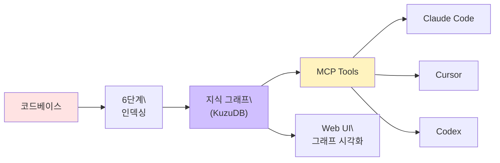
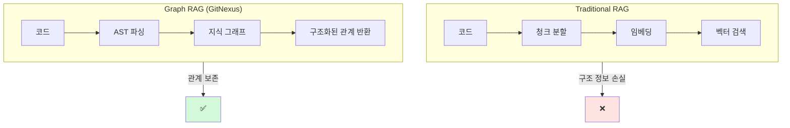

> **TL;DR** — GitNexus는 리포지토리를 지식 그래프로 변환해 AI 코딩 에이전트가 코드 구조를 깊이 이해하게 만드는 오픈소스 도구다. Tree-sitter로 AST를 파싱하고, Leiden 알고리즘으로 기능 단위 클러스터링하고, MCP로 Claude Code/Cursor/Codex에 그래프 인텔리전스를 제공한다. 서버 없이 브라우저에서도 돌아간다. GitHub 스타 38.8k.
{: .prompt-info}

---

## 1. 왜 코드 지식 그래프가 필요한가

AI 코딩 에이전트(Claude Code, Cursor, Codex)가 대중화되면서 "AI가 내 코드를 이해하나?"라는 질문이 중요해졌다. 현실은:

- AI는 **현재 열린 파일**만 잘 본다
- 파일 경계를 넘나드는 **의존성, 호출 체인**은 놓친다
- 리팩토링 후 "이거 바꾸면 어디가 깨지지?"를 물어봐도 제대로 대답 못 한다

전통적인 RAG는 코드를 청크로 쪼개서 임베딩하는 방식이라, **구조적 컨텍스트가 사라진다**. 함수 A가 함수 B를 호출한다는 관계가 벡터 검색에는 안 보이는 것.

GitNexus는 이 문제를 **지식 그래프**로 접근한다. 코드를 노드와 엣지로 모델링해서, AI가 "이 함수 시그니처를 바꾸면 저쪽 3개 모듈이 깨진다"를 한 번에 파악할 수 있게 한다.

---

## 2. GitNexus가 하는 일



한 줄로 요약하면: **코드베이스 → 지식 그래프 → AI 에이전트가 구조를 이해**.

### 6단계 인덱싱 파이프라인

| 단계 | 역할 | 기술 |
|---|---|---|
| Structure | 파일 트리 순회 | 디렉토리 구조 매핑 |
| Parsing | AST 추출 | Tree-sitter (13개 언어) |
| Resolution | import/call 해석 | 언어별 해석기 + 신뢰도 점수 |
| Clustering | 기능 단위 그룹핑 | Leiden 커뮤니티 탐지 |
| Processes | 실행 흐름 추적 | 엔트리 포인트 → 전체 경로 |
| Search | 하이브리드 검색 | BM25 + Semantic Embeddings + RRF |

지원 언어: TypeScript, JavaScript, Python, Java, Kotlin, C#, Go, Rust, PHP, Ruby, Swift, C, C++.

---

## 3. 두 가지 사용 모드

### CLI + MCP (로컬)

```bash
npm install -g gitnexus
cd your-repo
gitnexus analyze     # 인덱싱
gitnexus setup       # MCP 자동 설정
gitnexus mcp         # MCP 서버 실행
```

로컬에서 동작, 모든 데이터가 내 컴퓨터에만 남는다. LadybugDB(내장 그래프 DB)에 저장.

### Web UI (브라우저)

[gitnexus.vercel.app](https://gitnexus.vercel.app)에 접속하면 설치 없이 바로 사용. GitHub repo URL이나 ZIP 파일을 드래그하면 브라우저 안에서 인덱싱 + 그래프 시각화 + AI 채팅.

서버가 없다. Tree-sitter WASM, LadybugDB WASM, 임베딩까지 전부 브라우저에서 돌아간다.

> **Bridge Mode**: `gitnexus serve`로 CLI 인덱싱 결과를 Web UI에서 볼 수 있다. 대형 리포지토리는 CLI로 인덱싱하고 Web UI에서 탐색하는 조합이 실용적.

---

## 4. 7개 MCP Tools — AI 에이전트를 위한 무기

GitNexus의 진짜 가치는 AI 에이전트에게 **그래프 인텔리전스**를 제공하는 7개 도구에 있다.

### impact — Blast Radius 분석

```
impact({target: "UserService", direction: "upstream"})
→ Depth 1: handleLogin, handleRegister, UserController (WILL BREAK)
→ Depth 2: authRouter, middleware (LIKELY AFFECTED)
```

리팩토링 전에 "이거 건드리면 어디까지 영향 가나?"를 한 방에.

### context — 심볼 360도 분석

```
context({name: "validateUser"})
→ incoming calls: handleLogin, handleRegister
→ outgoing calls: checkPassword, createSession
→ processes: LoginFlow (step 2/7), RegistrationFlow (step 3/5)
```

### detect_changes — Git diff 아키텍처 매핑

```
detect_changes({scope: "all"})
→ changed: 12, affected processes: 3, risk: medium
```

### rename — 멀티파일 안전 리네임

```
rename({symbol_name: "validateUser", new_name: "verifyUser", dry_run: true})
→ files_affected: 5, graph_edits: 6 (high confidence), text_search_edits: 2 (review)
```

그래프 기반으로 함수 호출은 확실히 잡고, 주석/문자열은 "review carefully"로 구분해 준다.

나머지 3개: `query`(프로세스 그룹핑 하이브리드 검색), `list_repos`(인덱싱된 리포지토리 목록), `cypher`(Raw 그래프 DB 쿼리).

---

## 5. Graph RAG vs Traditional RAG



Traditional RAG이 "이 함수와 비슷한 코드"를 찾는다면, Graph RAG은 "이 함수를 호출하는 모든 곳, 이 함수가 속한 클러스터, 이 함수가 참여하는 실행 흐름"을 반환한다.

핵심 차이: **precompute**. GitNexus는 인덱싱 시점에 클러스터링, 실행 흐름 추적, 신뢰도 점수를 미리 계산한다. LLM이 10번 쿼리해서 컨텍스트를 모으는 게 아니라, **1번 쿼리에 완전한 컨텍스트**가 들어온다.

---

## 6. 실전 활용 예시

### 예시 1: 대형 오픈소스 프로젝트 구조 파악

새로운 프로젝트에 합류하거나 오픈소스에 기여할 때. 파일만 수백 개인 Spring 프로젝트를 Web UI에 넣으면:

- 어떤 모듈이 있는지 (클러스터링)
- API 엔드포인트에서 DB까지 실행 흐름이 어떻게 이어지는지 (Process 추적)
- 핵심 서비스 간 의존성 (Call chain)

이걸 그래프로 시각화해서 한눈에 볼 수 있다.

### 예시 2: Claude Code와 연동한 안전 리팩토링

```bash
# 프로젝트 인덱싱
cd my-spring-project
gitnexus analyze
gitnexus setup   # Claude Code MCP 자동 설정
```

이제 Claude Code에게 "UserService의 validateUser 메서드 시그니처를 바꾸고 싶은데 영향 범위 분석해줘"라고 하면, Claude Code가 GitNexus의 `impact` 도구를 호출해서:

- 직접 의존자 (Depth 1)
- 간접 의존자 (Depth 2)
- 영향받는 클러스터/프로세스
- 신뢰도 점수

를 반환하고, 안전하게 리팩토링을 수행한다.

### 예시 3: PR 코드 리뷰 자동화

PR이 들어오면 `detect_changes`로 변경된 파일을 아키텍처 컴포넌트에 매핑:

```
변경 12개 파일 → 영향받는 프로세스 3개 (LoginFlow, RegistrationFlow, PasswordResetFlow)
→ 리스크 레벨: medium
```

리뷰어가 파일 단위가 아니라 **아키텍처 단위**로 영향을 파악할 수 있다.

### 예시 4: Legacy 코드 의존성 분석

문서화가 안 된 레거시 프로젝트. `context` 도구로 핵심 클래스 하나만 지정하면:

- 누가 이 클래스를 호출하는지 (incoming)
- 이 클래스가 무엇을 호출하는지 (outgoing)
- 어떤 비즈니스 프로세스에 참여하는지

의존성 맵이 자동으로 그려진다.

### 예시 5: 팀 온보딩

신규 팀원이 합류하면 `gitnexus wiki`로 리포지토리 위키를 자동 생성. 프로젝트 구조, 모듈 간 관계, 핵심 실행 흐름이 정리된 문서를 즉시 제공할 수 있다.

---

## 7. 에디터 지원 현황

| 에디터 | MCP | Skills | Hooks | 지원 |
|---|---|---|---|---|
| Claude Code | O | O | O (Pre+Post) | Full |
| Cursor | O | O | O (Post) | Full |
| Codex | O | O | - | MCP+Skills |
| Windsurf | O | - | - | MCP |
| OpenCode | O | O | - | MCP+Skills |

`gitnexus setup` 한 번이면 자동으로 MCP 설정, Skills 설치, Hooks 등록까지 처리된다.

---

## 8. 주의사항

- **라이선스**: PolyForm Noncommercial 1.0.0 — 개인/학습은 무료, 상업적 사용은 akonlabs.com 엔터프라이즈 필요
- **Web UI 한계**: 브라우저 모드는 ~5K 파일까지만 원활. 대형 리포지토리는 CLI + Bridge 조합
- **인덱싱 시간**: 대형 리포지토리는 최초 인덱싱에 시간이 걸림. `--skip-embeddings`로 빠른 인덱싱 후 필요시 `--embeddings` 추가
- **Tree-sitter 빌드**: `tree-sitter-dart`, `tree-sitter-proto`는 C++ 툴체인 필요. 불필요하면 `GITNEXUS_SKIP_OPTIONAL_GRAMMARS=1` 설정

---

## 9. 마무리

GitNexus는 "AI 에이전트에게 코드의 신경망을 달아주는" 도구다. 전통적인 RAG이 코드를 평면 텍스트로 다루는 한계를 **지식 그래프**로 돌파하고, MCP를 통해 이미 사용 중인 AI 코딩 에이전트에 그래프 인텔리전스를 자연스럽게 통합한다.

특히 인상적인 점:

1. **Zero-Server** — 브라우저에서도 로컬에서도 서버 없이 동작
2. **Precompute** — 인덱싱 시점에 분석을 마쳐서 쿼리 1번에 완전한 컨텍스트
3. **프라이버시** — 코드가 외부로 전송되지 않음
4. **에디터 통합** — Claude Code, Cursor 등 주요 에이전트에 Full 지원

38.8k 스타가 말해주듯, AI 코딩 에이전트 시대에 **코드 구조 이해**는 선택이 아닌 필수가 되고 있다. GitNexus는 그 갭을 메우는 가장 실용적인 도구 중 하나다.

---

**참고**
- [GitHub: abhigyanpatwari/GitNexus](https://github.com/abhigyanpatwari/GitNexus)
- [GitNexus Web UI](https://gitnexus.vercel.app)
- [SitePoint: Client-Side RAG with GitNexus](https://www.sitepoint.com/client-side-rag-building-knowledge-graphs-in-the-browser-with-gitnexus/)
- [GitNexus Explained — hoangyell](https://hoangyell.com/gitnexus-explained/)
