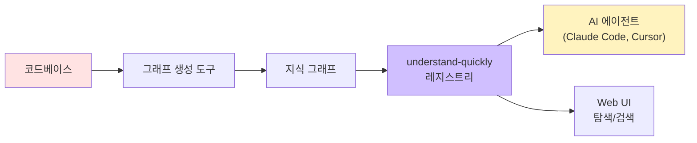
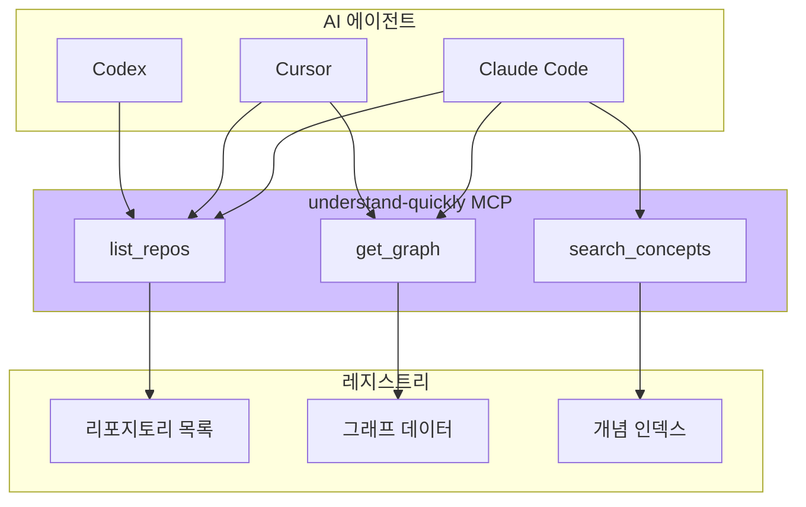
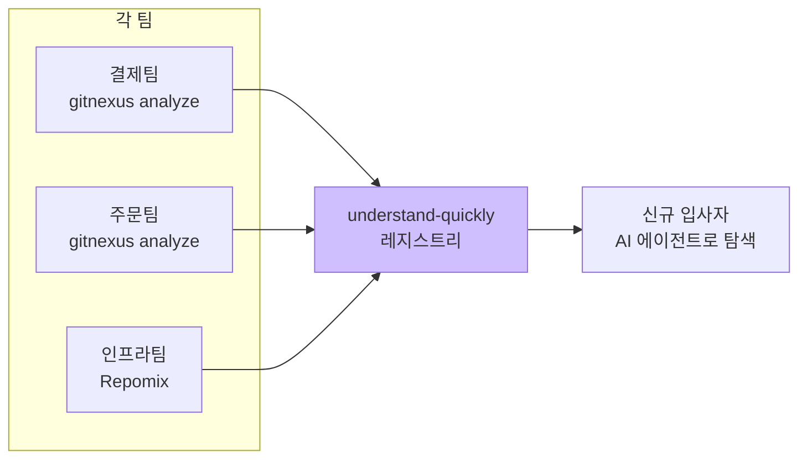

> **TL;DR** — understand-quickly는 코드베이스의 지식 그래프(Knowledge Graph)를 공개 레지스트리에 등록하는 시스템이다. "Awesome-list 2.0"이라고 부를 만큼 스키마 검증된 콘텐츠 포인터를 제공하고, AI 에이전트가 어떤 리포지토리든 한 번의 네트워크 요청으로 코드 구조를 파악할 수 있게 한다. Apache 2.0 라이선스, v0.4.0.
{: .prompt-info}

---

## 1. 왜 "코드 지식 그래프 레지스트리"가 필요한가

GitNexus, Understand-Anything 같은 도구가 개별 리포지토리를 지식 그래프로 변환해 준다. 그런데:

- 각 팀이 만든 그래프가 **어디에 있는지** 어떻게 알지?
- AI 에이전트가 "결제 서비스 구조 알려줘"라고 했을 때 **어디서 가져오지?**
- 그래프가 최신인지 **어떻게 보장하지?**

understand-quickly는 이 문제를 **공개 레지스트리**로 해결한다. 각 리포지토리의 지식 그래프를 중앙에서 발견하고 검색할 수 있게 만드는 것. npm이 패키지를 등록하듯, understand-quickly는 코드 지식 그래프를 등록한다.



핵심 아이디어: **그래프는 있고, 발견 가능하게 만들자**.

---

## 2. understand-quickly가 하는 일

### CKGP — Code-Knowledge-Graph Protocol v1

understand-quickly의 기반은 **CKGP(Code-Knowledge-Graph Protocol) v1**이다. vendor-neutral한 프로토콜로, 지식 그래프를 발행(publish)하고 발견(discover)하는 표준 규약이다.

| 개념 | 설명 |
|---|---|
| Discovery | `.well-known/code-graph.json`을 리포지토리 루트에 배치 |
| Drift Detection | `source_sha`로 그래프가 소스 코드와 동기화됐는지 확인 |
| Size Limit | 그래프당 50 MiB 제한 |

즉, 리포지토리에 `.well-known/code-graph.json` 파일 하나만 있으면 어떤 도구든 그 그래프를 발견하고 활용할 수 있다.

### 지원 그래프 포맷

| Format | Source Tool | Tier |
|---|---|---|
| `understand-anything@1` | Understand-Anything | first-class |
| `gitnexus@1` | GitNexus | first-class |
| `code-review-graph@1` | code-review-graph | first-class |
| `bundle@1` | Repomix, gitingest, codebase-digest | first-class |
| `generic@1` | any {nodes, edges} graph | fallback |

여러 도구가 만드는 그래프 포맷을 모두 수용한다. `generic@1` 폴백이 있으니 사내 커스텀 그래프도 등록 가능.

### Entry Status

| 상태 | 의미 |
|---|---|
| 🆕 pending | 등록 대기 중 |
| ✅ ok | 정상 등록됨 |
| 🟡 missing | 그래프 파일 없음 |
| ⚠️ error | 오류 발생 |

---

## 3. 배포 채널 — 어디서 어떻게 쓰나

understand-quickly는 6가지 경로로 접근할 수 있다:

| 채널 | 용도 |
|---|---|
| **Web** | [looptech-ai.github.io/understand-quickly](https://looptech-ai.github.io/understand-quickly/) — 브라우저에서 탐색 |
| **MCP Registry** | `io.github.looptech-ai/understand-quickly` — MCP 클라이언트에서 검색 |
| **npm CLI** | `npm i -g @looptech-ai/understand-quickly-cli` — 터미널에서 등록/조회 |
| **npm MCP** | `npm i -g @looptech-ai/understand-quickly-mcp` — AI 에이전트에 MCP로 연결 |
| **PyPI SDK** | `pip install understand-quickly` — Python에서 프로그래밍 접근 |
| **GitHub Action** | `looptech-ai/uq-publish-action@v0.1.0` — CI/CD에서 자동 등록 |

### CLI로 등록하기

```bash
# 설치
npm install -g @looptech-ai/understand-quickly-cli

# 그래프 등록
uq publish --repo my-org/my-service --graph ./code-graph.json

# 레지스트리 조회
uq list
```

### GitHub Action으로 자동화

```yaml
# .github/workflows/publish-graph.yml
- uses: looptech-ai/uq-publish-action@v0.1.0
  with:
    graph-path: ./code-graph.json
```

PR마다 자동으로 그래프를 갱신하고, drift detection으로 최신 상태를 보장한다.

---

## 4. MCP Tools — AI 에이전트를 위한 3개 도구

understand-quickly MCP 서버는 AI 에이전트에게 3개의 도구를 제공한다:



### list_repos — 리포지토리 목록

```
list_repos({filter: "payment"})
→ [
    {name: "payment-service", status: "ok", formats: ["gitnexus@1"]},
    {name: "payment-gateway", status: "ok", formats: ["bundle@1"]}
  ]
```

### get_graph — 특정 리포지토리 그래프 가져오기

```
get_graph({repo: "payment-service", format: "gitnexus@1"})
→ {nodes: 342, edges: 891, source_sha: "abc123...", clusters: [...]}
```

한 번의 네트워크 요청으로 전체 코드 구조를 가져온다.

### search_concepts — 개념 검색

```
search_concepts({query: "주문 처리 프로세스"})
→ [
    {repo: "order-service", node: "OrderProcessor", type: "class"},
    {repo: "payment-service", node: "handlePayment", type: "function"}
  ]
```

리포지토리 경계를 넘어서 개념을 검색할 수 있다.

---

## 5. 사내 활용 예시

이 부분이 understand-quickly의 실전 가치를 가장 잘 보여준다.

### 예시 1: 멀티 리포지토리 지식 허브



수십 개 마이크로서비스 환경에서 각 팀이 그래프를 생성해 레지스트리에 등록. 신규 입사자가 "결제 서비스에서 주문 서비스 호출하는 부분 찾아줘"라고 질의하면 `search_concepts`로 즉시 응답.

### 예시 2: CI/CD 자동화

```yaml
# PR 머지 시 자동 그래프 갱신
on:
  pull_request:
    types: [closed]
jobs:
  publish-graph:
    runs-on: ubuntu-latest
    steps:
      - uses: actions/checkout@v4
      - run: npx gitnexus analyze
      - uses: looptech-ai/uq-publish-action@v0.1.0
```

drift detection으로 레지스트리의 그래프가 항상 최신임을 보장.

### 예시 3: AI 코드 리뷰

Claude Code에 understand-quickly MCP를 연결하면:

```
1. list_repos → 관련 리포지토리 찾기
2. get_graph → 그래프 가져오기
3. search_concepts → 변경된 심볼과 연결된 노드 탐색
→ "UserService 변경 → handleLogin, handleRegister에 영향 (3개 클러스터)"
```

### 예시 4: 레거시 문서화 + 크로스 팀 협업

- 문서 없는 레거시 코드에 GitNexus로 그래프 생성 후 등록 → AI가 즉시 구조 이해
- 프론트엔드 팀이 백엔드 API 구조를 AI 에이전트로 탐색 → 스펙 이해 시간 단축
- 팀 간 의존성을 그래프로 시각화 → "우리 팀 API 바꾸면 누가 영향 받아?" 즉시 확인

### 예시 5: 사내 프라이빗 레지스트리

Apache 2.0 라이선스로 사내 fork가 자유롭다. 공개 프로젝트는 공개 레지스트리에, 사내 프로젝트는 프라이빗 레지스트리에 등록하는 하이브리드 운영 가능. CKGP 프로토콜은 vendor-neutral이라 사내 도구와도 호환.

---

## 6. 다른 도구와의 관계 + 주의사항

understand-quickly는 그래프를 **만드는** 도구가 아니다. 그래프를 **등록하고 발견하는** 레지스트리다.

```
그래프 생성: GitNexus, Understand-Anything, Repomix, code-review-graph
        ↓
그래프 등록/발견: understand-quickly ← 이 포스트의 주인공
        ↓
그래프 소비: Claude Code, Cursor, Codex (via MCP)
```

주의할 점:

- **라이선스**: 코드는 Apache 2.0, 레지스트리 데이터는 Data License 1.0 — 코드는 자유롭게 수정/배포 가능하나 데이터 사용 조건 확인 필요
- **프로젝트 초기**: v0.4.0, Star 24 — 아직 초기 단계라 레지스트리에 등록된 리포지토리가 많지 않음
- **그래프 품질**: 레지스트리는 그래프를 저장할 뿐, 품질은 생성 도구에 의존
- **50 MiB 제한**: 대형 모노리포는 그래프가 클 수 있으니 `bundle@1` 포맷으로 압축 고려

---

## 7. 마무리

understand-quickly는 "코드 지식 그래프의 npm registry"를 만드는 프로젝트다. 개별 도구가 만든 그래프를 중앙에서 발견하고, AI 에이전트가 한 번의 요청으로 코드 구조를 파악할 수 있게 한다.

인상적인 점:

1. **CKGP 프로토콜** — vendor-neutral 표준으로 어떤 그래프 도구와도 호환
2. **6가지 배포 채널** — Web, CLI, MCP, PyPI, GitHub Action, MCP Registry
3. **MCP 3개 도구** — `list_repos`, `get_graph`, `search_concepts`로 AI 에이전트에 직결
4. **Apache 2.0** — 사내 fork로 프라이빗 레지스트리 운영 자유로움

아직 초기 프로젝트(Star 24)지만, "AI 에이전트가 모든 리포지토리의 구조를 즉시 이해하는" 미래를 향한 중요한 인프라다. 멀티 리포지토리 환경에서 AI 코딩 에이전트를 쓰고 있다면 주목할 만하다.

---

**참고**
- [GitHub: looptech-ai/understand-quickly](https://github.com/looptech-ai/understand-quickly)
- [Web 레지스트리](https://looptech-ai.github.io/understand-quickly/)
- [MCP Registry: io.github.looptech-ai/understand-quickly](https://github.com/looptech-ai/understand-quickly)
- [npm CLI: @looptech-ai/understand-quickly-cli](https://www.npmjs.com/package/@looptech-ai/understand-quickly-cli)
- [PyPI SDK: understand-quickly](https://pypi.org/project/understand-quickly/)
