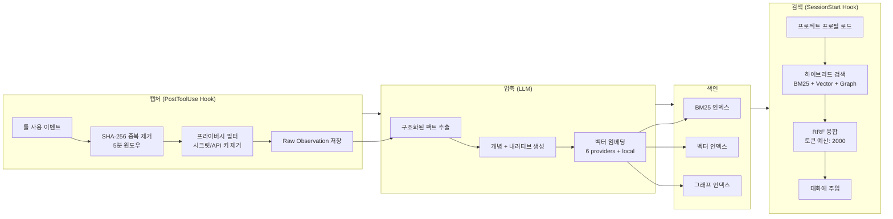

> **TL;DR**
> AI 코딩 에이전트는 세션이 끝나면 모든 것을 잊는다. agentmemory는 툴 사용을 자동 캡처해 4계층 메모리로 압축·저장하고, 다음 세션에서 하이브리드 검색으로 필요한 맥락만 주입한다. LongMemEval-S 기준 R@5 95.2%, 연간 토큰 비용 약 $10. 외부 DB 없이 SQLite 하나로 동작한다.

---

## 1. 왜 AI 코딩 에이전트에 지속적 메모리가 필요한가

Claude Code, Cursor, Codex CLI 같은 AI 코딩 에이전트는 강력하지만 한 가지 치명적 약점이 있다 — **세션이 끝나면 모든 것을 잊는다.**

어제 디버깅하며 발견한 아키텍처 결정, 지난주에 합의한 API 스펙, 수천 줄의 코드베이스에서 반복적으로 탐색한 모듈 구조. 이런 맥락을 매 세션마다 처음부터 다시 설명하거나, `CLAUDE.md` 파일에 수동으로 복사해야 한다.

문제는 단순히 귀찮은 정도가 아니다:

- **토큰 낭비**: 프로젝트 히스토리를 전체 컨텍스트에 붙여넣으면 세션당 22K+ 토큰이 소모된다 (관측치 240개 기준). 1년이면 19.5M+ 토큰 — 사실상 불가능한 수준이다.
- **정확도 저하**: 컨텍스트 윈도우에 모든 걸 넣으면 LLM은 중요한 정보와 노이즈를 구분하지 못한다.
- **수동 관리 비용**: `CLAUDE.md`를 사람이 직접 업데이트하는 건 "기억력"이 아니라 "문서화"다.

**지속적 메모리(Persistent Memory)**는 이 문제를 근본적으로 해결한다 — 에이전트가 스스로 기억하고, 필요할 때만 꺼내 쓰는 것.

---

## 2. agentmemory란

[agentmemory](https://github.com/rohitg00/agentmemory)는 AI 코딩 에이전트를 위한 오픈소스 영구 메모리 시스템이다. Apache-2.0 라이선스, 15.4k 스타, 34명의 기여자가 참여 중이다.

**핵심 스펙 한눈에 보기:**

| 항목 | 수치 |
|---|---|
| 검색 정확도 (R@5) | 95.2% (LongMemEval-S, ICLR 2025) |
| 토큰 절약 | ~92% (전체 컨텍스트 대비) |
| MCP 도구 | 53개 |
| 자동 훅 | Claude Code 12개, OpenCode 22개, Codex 6개 |
| 외부 DB 필요 | 없음 (SQLite + iii-engine 내장) |
| 테스트 케이스 | 1,081+ |
| REST 엔드포인트 | 124개 |

에이전트의 툴 사용(File read, Terminal 실행 등)을 자동으로 캡처해 메모리로 저장하고, 다음 세션 시작 시 관련 맥락만 선별해 주입한다. **설정 한 번이면 이후에는 완전 자동.**

---

## 3. 작동 원리: 메모리 파이프라인

agentmemory의 핵심은 **캡처 → 압축 → 색인 → 검색 → 주입** 파이프라인이다.



**저장 시 (PostToolUse):**
에이전트가 파일을 읽거나 터미널을 실행할 때마다 hook이 발동한다. SHA-256으로 5분 내 중복을 제거하고, 프라이버시 필터가 API 키와 시크릿을 제거한 뒤 원본 관측치를 저장한다. LLM이 이를 구조화된 팩트와 개념으로 압축하고, 6가지 임베딩 제공자(로컬 포함) 중 하나로 벡터화해 BM25 + 벡터 + 그래프에 동시 색인한다.

**검색 시 (SessionStart):**
새 세션이 시작되면 프로젝트 프로필을 로드하고 하이브리드 검색으로 관련 메모리를 찾는다. BM25(키워드), Vector(의미), Graph(관계) 세 가지 검색 결과를 RRF(Reciprocal Rank Fusion)로 융합해 최종 순위를 매긴 뒤, 토큰 예산(기본 2000 토큰) 내에서 대화에 주입한다.

---

## 4. 4-Tier 메모리 구조

agentmemory는 인간의 기억 시스템에서 영감을 받은 4계층 구조를 사용한다.

| 계층 | 역할 | 예시 |
|---|---|---|
| **Working** (작업 기억) | 툴 사용에서 발생한 원본 관측치 | "사용자가 `auth.ts` 파일을 수정함" |
| **Episodic** (일화 기억) | 세션 단위 압축 요약 | "이번 세션에서 OAuth2 로그인 버그를 수정함" |
| **Semantic** (의미 기억) | 추출된 개념과 사실 | "이 프로젝트는 JWT + Refresh Token 방식을 사용함" |
| **Procedural** (절차 기억) | 학습된 워크플로우와 패턴 | "이 프로젝트에서 테스트 실행은 `pnpm test:unit` 사용" |

낮은 계층의 Raw 데이터는 높은 계층으로 압축되면서 중요한 정보만 남는다. 덕분에 토큰을 낭비하지 않으면서도 핵심 맥락을 보존할 수 있다.

---

## 5. 설치 & Claude Code 연동

### 설치

```bash
# npm으로 전역 설치
npm install -g @agentmemory/agentmemory

# 메모리 서버 시작 (:3111 포트)
agentmemory

# 데모 실행 (샘플 데이터 + recall 증명)
agentmemory demo
```

### Claude Code 연동

```bash
# 원커맨드 연결
agentmemory connect claude-code
```

또는 Claude Code Plugin Marketplace를 통해 설치할 수도 있다:

```bash
# Claude Code 내에서 실행
/plugin marketplace add rohitg00/agentmemory
/plugin install agentmemory
```

두 방식 모두 12개의 PostToolUse hook, 4개의 skill, MCP 서버 설정을 자동 구성한다.

### npx로 설치 없이 실행

```bash
npx @agentmemory/agentmemory@latest
# 주의: 버전별 캐시되므로 항상 @latest를 지정하거나
# 캐시 초기화: rm -rf ~/.npm/_npx (macOS/Linux)
```

### MCP 수동 설정

다른 MCP 호환 도구(Cursor, Cline, Roo Code 등)에서는 다음 설정을 사용한다:

```json
"agentmemory": {
  "command": "npx",
  "args": ["-y", "@agentmemory/mcp"],
  "env": {
    "AGENTMEMORY_URL": "{{ AGENTMEMORY_URL }}",
    "AGENTMEMORY_SECRET": "{{ AGENTMEMORY_SECRET }}"
  }
}
```

### 실시간 뷰어

`http://localhost:3113`에서 메모리 내용을 실시간으로 확인할 수 있다. 어떤 관측치가 저장되었고, 어떻게 압축되었는지 직접 검증 가능하다.

---

## 6. 벤치마크: 얼마나 정확한가

### 내부 벤치마크 (coding-agent-life-v1)

| 메트릭 | agentmemory | grep baseline |
|---|---|---|
| Precision@5 | 0.578 | 0.267 |
| Recall@5 | 0.967 | — |
| Top-5 hit rate | 15/15 | — |
| p50 지연 시간 | 14ms | 0ms |

agentmemory hybrid 검색은 grep 대비 **2.2× 정확도** (P@5)를 달성한다.

### 외부 벤치마크 (LongMemEval-S, ICLR 2025, 500문항)

| 메트릭 | agentmemory | BM25-only |
|---|---|---|
| R@5 | **95.2%** | 86.2% |
| R@10 | **98.6%** | 94.6% |
| MRR | **88.2%** | 71.5% |

BM25 단일 검색 대비 +9%p의 R@5 향상. 하이브리드 검색(RRF)과 4계층 압축의 시너지 효과다.

### 토큰 비용 비교 (연간 기준)

| 방식 | 토큰/년 | 비용/년 |
|---|---|---|
| 전체 컨텍스트 붙여넣기 | 19.5M+ | 사실상 불가능 |
| LLM 요약 직접 관리 | ~650K | ~$500 |
| **agentmemory** | **~170K** | **~$10** |
| agentmemory (로컬 임베딩) | ~170K | **$0** |

---

## 7. 경쟁사 비교

| | **agentmemory** | **mem0** (53K★) | **Letta/MemGPT** (22K★) | **내장 (CLAUDE.md)** |
|---|---|---|---|---|
| R@5 | **95.2%** | 68.5% | 83.2% | N/A |
| 자동 캡처 | 12 hooks (zero effort) | Manual add() | Agent self-edits | 수동 |
| 검색 방식 | BM25+Vector+Graph (RRF) | Vector+Graph | Vector | 전체 로드 |
| 외부 의존성 | 없음 | Qdrant/pgvector | Postgres+vectorDB | 없음 |
| 토큰 효율 | ~1,900/세션 ($10/년) | 상황에 따라 다름 | Core in context | 22K+ at 240 obs |
| 프레임워크 종속성 | 없음 | 없음 | 높음 | 에이전트별 |
| 실시간 뷰어 | 있음 (:3113) | 클라우드 | 클라우드 | 없음 |

**agentmemory의 차별점:**
- **설정 제로**: 연결 한 번으로 자동 캡처 시작. 수동으로 add() 호출할 필요 없다.
- **외부 DB 불필요**: SQLite 하나로 동작. Qdrant, Postgres, pgvector 없이도 BM25+Vector+Graph 하이브리드 검색이 가능하다.
- **프레임워크 독립**: 특정 에이전트 프레임워크에 종속되지 않는다. MCP, REST API, Native Plugin 등 다양한 방식으로 연동 가능하다.

### 지원 에이전트

**Native Plugin** (hooks + skills + MCP): Claude Code, Codex CLI, OpenCode, OpenClaw, Hermes, pi, OpenHuman

**MCP Only**: Cursor, Claude Desktop, Cline, Roo Code, Kilo Code, Windsurf, Gemini CLI, Goose

**REST API**: Aider (curl)

---

## 8. 정리 & 결론

agentmemory는 "에이전트가 기억해야 한다"는 당연하지만 구현이 어려웠던 문제를 **설정 한 번으로 해결**한다.

핵심은 세 가지다:

1. **자동 캡처** — 수동 개입 없이 툴 사용을 메모리로 저장
2. **하이브리드 검색** — BM25+Vector+Graph의 RRF 융합으로 R@5 95.2% 달성
3. **토큰 효율** — 4계층 압축으로 연간 $10, 로컬 임베딩 시 $0

새 세션을 시작할 때마다 에이전트에게 프로젝트 맥락을 다시 설명할 필요가 없다. 어제의 디버깅, 지난주의 아키텍처 결정, 누적된 코드베이스 지식 — 모두 자동으로 기억되고, 필요할 때만 꺼내 쓴다.

```bash
npm install -g @agentmemory/agentmemory
agentmemory connect claude-code
```

이 두 줄이면 된다. 나머지는 agentmemory가 알아서 한다.

{: .prompt-info}
> agentmemory는 오픈소스(Apache-2.0)입니다. GitHub: [rohitg00/agentmemory](https://github.com/rohitg00/agentmemory)
