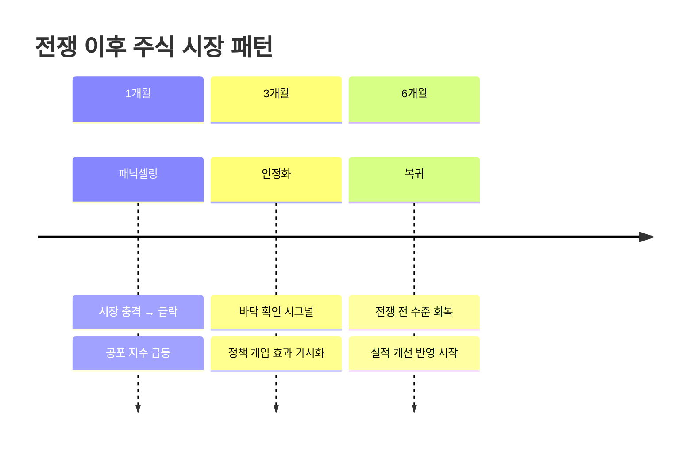
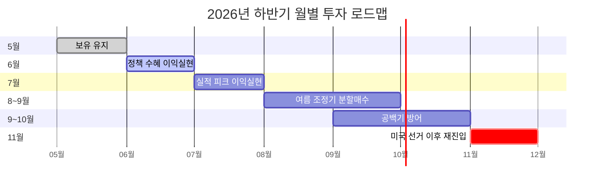

> **원본 영상:** [위폴 버디버디 — 백찬규 센터장](https://www.youtube.com/watch?v=ZJCu2_uYL2Y)
>
> NH투자증권 자산관리컨설팅센터 백찬규 센터장이 위폴 버디버디에 출연해 2026년 하반기 국내 주식 전략을 전망했다. 전쟁 이후 시장 패턴부터 코스피 8,000 시나리오, 월별 투자 로드맵, ETF 활용법까지 실전 투자자를 위한 핵심 인사이트를 정리한다.
{: .prompt-info }

---

## 1. 전쟁 이후 주식 시장 패턴

백찬규 센터장은 과거 주요 전쟁 이후 주식 시장의 움직임을 분석해 **일관된 3단계 패턴**을 발견했다.



핵심은 **"전쟁은 주식 시장에 단기 충격이지, 장기 추세를 바꾸지 않는다"**는 점이다. 과거 걸프전, 이라크전, 러시아-우크라이나 전쟁 모두 동일한 패턴을 보였다.

> 1개월 차에 패닉셀링으로 빠진 사람이 가장 큰 손실을 본다. 3개월 뒤 시장은 항상 안정되고, 6개월 뒤에는 전쟁 전 수준으로 돌아간다. 이 패턴은 예외 없이 반복됐다.
{: .prompt-tip }

---

## 2. 코스피 7천→8천의 두 기둥

코스피가 7천을 돌파하고 8천을 향해 가는 원동력은 **실적 모멘텀**과 **정책 드라이브** 두 가지다.

### 순이익 추이

```mermaid
xychart-beta
    title "코스피 구성종목 순이익 추이 (조 원)"
    x-bar ["과거 기준", "2026년 추정", "2027년 전망"]
    y-bar "순이익 (조 원)" 0 --> 900
    bar [200, 671, 800]
```

- **과거 기준 → 2026년:** 순이익 **208.7% 증가** (200조 → 671조)
- **2026년 → 2027년:** 800조 전망, 증가율은 둔화되나 여전히 성장 궤도

> 실적이 200조에서 671조로 3배 넘게 뛰었다. 주가는 실적을 따라간다. 코스피 8,000은 과소평가된 시장의 정상 복귀일 뿐이다.
{: .prompt-tip }

### 정책 드라이브

- **반도체 특별법** 등 산업 지원 입법 가속
- **기업 밸류업 프로그램**으로 주주환원 확대
- **연기금 편입** 수요 증가

---

## 3. 미분으로 보는 실적 모멘텀

백찬규 센터장은 실적 성장을 **미분(기울기)** 관점에서 분석했다.

```mermaid
xychart-beta
    title "연도별 순이익 증가율 (기울기) 비교"
    x-bar ["2024년", "2025년", "2026년", "2027년"]
    y-bar "증가율 (%)" 0 --> 250
    line [30, 80, 209, 19]
```

- **2026년 기울기가 가장 가파르다** — 실적 개선 속도가 최고조
- **2027년 기울기 둔화** — 여전히 성장하지만 가속도는 줄어든다
- **엔비디아와의 비교:** 엔비디아가 2023~2024년에 보여준 실적 폭발과 유사한 궤적

> 미분이 최대라는 건 "지금이 실적 개선 속도가 가장 빠른 시점"이라는 뜻이다. 기울기가 꺾이기 전에 행동해야 한다. 2026년이 바로 그 해다.
{: .prompt-warning }

---

## 4. 월별 투자 로드맵

2026년 하반기 월별 전략을 간트차트로 정리했다.



### 월별 상세 전략

- **5월:** 현재 포지션 그대로 **보유 유지**. 섣부른 매도 금지
- **6월:** 정책 수혜주가 반영되면 **이익 실현** 시작. 반도체, 2차전지
- **7월:** 2분기 실적 피크. 실적 모멘텀 최고점에서 **이익 실현 본격화**
- **8~9월:** 전통적 **변동성 확대기**. 하락 시 **분할 매수**로 물타기
- **9~10월:** 실적 공백기. 시장 방향성 불투명 → **방어적 포지션**
- **11월:** 미국 중간선거 이후 방향 확인 후 **공격적 재진입**

> "7월에 다 팔고 쉬지 마세요. 8~9월에 천천히 줍고, 11월에 다시 달리면 됩니다." — 백찬규 센터장
{: .prompt-info }

---

## 5. ETF 활용 전략

백찬규 센터장이 추천한 ETF 전략을 유형별로 정리했다.

### ETF 유형별 정리

- **반도체 ETF (반반)**
  - 대상: 반도체 업종 집중 투자
  - 특징: 삼성전자·SK하이닉스 비중 높음
  - 적기: 실적 모멘텀이 강한 5~7월

- **커버드콜 S&P 500**
  - 대상: 미국 대형주 + 옵션 프리미엄
  - 특징: 연 **~9%** 배당 수익 목표
  - 적기: 횡보~약세장 방어용

- **배당다우존스**
  - 대상: 미국 배당 성장주
  - 특징: 연 **~8%** 배당 수익 + 자본 이익
  - 적기: 현금흐름 확보가 필요한 공백기

- **나스닥 + 채권 혼합**
  - 대상: 나스닥100 ETF + 미국 장기채권
  - 특징: 금리 하락 시 두 자산 모두 수익
  - 적기: 금리 인하 사이클 진입 시점

> ETF는 개별주 리스크 없이 섹터/테마에 참여하는 가장 효율적인 도구다. 한 해에 2~3개 전략만 순환하면 충분하다.
{: .prompt-tip }

---

## 6. 핵심 리스크: 엔드컨디션

### 금리 + 유가 조합

백찬규 센터장이 정의한 **엔드컨디션(End Condition):**

> 미국 10년물 국채 금리 **4.5%** + 국제 유가 **100달러**가 동시에 도달하면, 주식 시장의 상승 시나리오가 종료될 수 있다.
{: .prompt-warning }

이 두 가지가 동시에 충족될 때:
- 기업 이자비용 급증 → 실적 악화
- 인플레이션 압력 → 연준 금리 인하 불가
- 소비 위축 → 수익 둔화

현재(2026년 5월) 기준으로는 두 지표 모두 엔드컨디션 수치에 미치지 않아 **상승 추세가 유효**하다.

### 국민연금 리스크

- 국민연금 **해외투자 비중 목표:** 14.9%
- **현재 해외투자 비중:** 24.5%
- **시사점:** 중장기적으로 해외 비중을 낮추면서 **국내 주식 매수 세력**으로 작용 가능

> 국민연금이 해외 비중을 14.9%까지 줄이려면 국내 자산으로 편입해야 한다. 이것이 코스피의 중장기 하방 지지체다.
{: .prompt-info }

---

## 7. 요약: 핵심만 챙기자

> **백찬규 센터장 2026 전략 요약**
>
> - **코스피 8,000 시나리오:** 순이익 200조→671조 폭증이 근거. 실적 모멘텀 최고조
> - **전쟁 패턴:** 1개월 패닉→3개월 안정→6개월 복귀. 공포에 팔지 마라
> - **미분 관점:** 2026년 실적 기울기 최대, 2027년 둔화. 지금이 타이밍
> - **월별 전략:** 5월 보유→6~7월 실현→여름 분할매수→11월 재진입
> - **ETF 활용:** 반도체(공격) + 커버드콜/배당(방어) 조합으로 리스크 관리
> - **엔드컨디션:** 10년물 4.5% + 유가 100달러 동시 도달 시 시나리오 수정
> - **국민연금:** 24.5%→14.9% 해외 비중 조정이 국내 주식 중장기 호재
{: .prompt-tip }

---

*이 포스트는 2026년 5월 21일 위폴 버디버디 방송 내용을 기반으로 작성되었습니다. 투자는 본인의 판단과 책임하에 이루어져야 합니다.*
