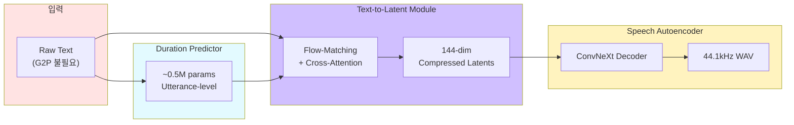
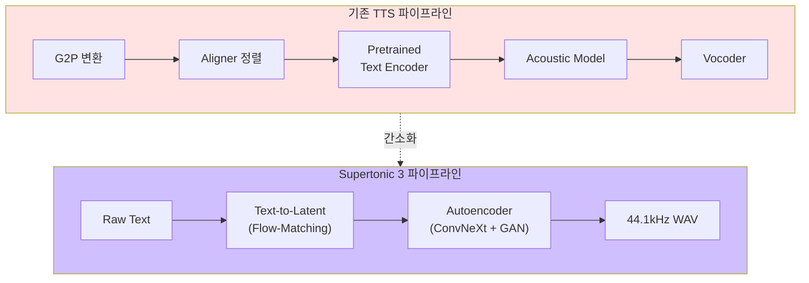
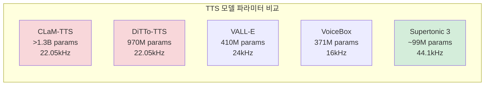
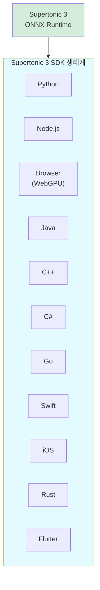

> **TL;DR** — 한국 스타트업 Supertone이 발표한 Supertonic 3는 ~99M 파라미터로 31개 언어를 지원하는 온디바이스 TTS 모델이다. GPU 없이 CPU만으로 44.1kHz 오디오를 합성하며, Apple M4 Pro에서 RTF 0.015를 달성한다. MIT(코드) / OpenRAIL-M(가중치) 이중 라이선스, 11개 SDK, 10개 표현 태그를 제공한다.
{: .prompt-info}

---

**핵심 스펙 한눈에 보기:**

| 항목 | 수치 |
|---|---|
| 모델 | Supertonic 3 (Supertone Inc.) |
| 파라미터 | ~99M (ONNX assets 기준) |
| 지원 언어 | 31개 (한국어 포함) |
| 출력 품질 | 44.1kHz 16-bit WAV |
| 런타임 | ONNX Runtime (CPU 기반), GPU 불필요 |
| 최대 속도 | 167x 실시간 (RTF 0.006, WebGPU) |
| Apple M4 Pro 성능 | 912–1,263 CPS, RTF 0.015 |
| 표현 태그 | 10개 (laugh, breath, sigh 등) |
| SDK | 11개 (Python, Node.js, Browser, Java, C++, C#, Go, Swift, iOS, Rust, Flutter) |
| 라이선스 | MIT (코드) / OpenRAIL-M (모델 가중치) |
| GitHub | 9.3k ⭐ / 956 forks |

> **원본 소스:** [Supertone/supertonic-3 (HuggingFace)](https://huggingface.co/Supertone/supertonic-3) · [GitHub](https://github.com/supertone-inc/supertonic) · [arXiv 2503.23108](https://arxiv.org/abs/2503.23108)
{: .prompt-info}

---

## 1. 왜 온디바이스 TTS가 중요한가

기존 고품질 TTS 시스템은 클라우드 GPU에 의존한다. 이는 세 가지 문제를 낳는다:

- **지연(Latency):** 네트워크 왕복 시간이 실시간 대화를 방해한다
- **프라이버시:** 음성 데이터가 서버로 전송된다
- **비용:** GPU 인프라 운영비가 서비스 단가를 올린다

Supertonic 3는 ~99M 파라미터라는 가벼운 모델로 **CPU만으로 실시간 합성**을 달성하면서도, 44.1kHz 고품질 출력을 보장한다. GPU가 없는 엣지 디바이스, 모바일, 브라우저까지 어디서든 돌아간다.

---

## 2. 모델 아키텍처

Supertonic 3는 세 가지 모듈로 구성된다 (arXiv 2503.23108).



### 2-1. Speech Autoencoder

Mel spectrogram을 **24차원 잠재 공간(latent space)**으로 인코딩한 뒤, ConvNeXt 블록과 GAN으로 복원한다. 핵심은 **Temporal Compression (Kc=6)** — 잠재 표현을 6배 압축해 144차원 compressed latents를 생성한다. 이 압축이 경량화의 핵심 열쇠다.

### 2-2. Text-to-Latent Module

**Flow-matching** 기반으로 텍스트에서 잠재 표현을 직접 생성한다. 원시 문자(raw character)를 그대로 입력받아 **G2P, 외부 aligner, 사전 학습된 텍스트 인코더가 전혀 필요 없다.** Cross-attention으로 텍스트-음성 정렬을 학습한다.

**Context-Sharing Batch Expansion (Ke=4)** 기법으로 학습 효율을 극대화한다 — 하나의 컨텍스트를 4배 확장해 배치 내에서 공유한다.

### 2-3. Duration Predictor

단 ~0.5M 파라미터의 가벼운 모듈로, 발화(utterance) 단위로 지속 시간을 예측한다. 별도의 정렬 annotation 없이 end-to-end로 학습된다.

---

## 3. 핵심 혁신 포인트



기존 TTS 파이프라인이 5단계를 거치는 반면, Supertonic 3는 **3단계**로 끝난다:

| 혁신 | 설명 |
|---|---|
| **G2P 불필요** | 원시 문자를 직접 입력받아 언어별 음소 변환기를 내장하지 않음 |
| **외부 Aligner 불필요** | Cross-attention이 텍스트-음성 정렬을 자동 학습 |
| **Pretrained Text Encoder 불필요** | 경량 모델로 BERT/LLM 계열 인코더 없이도 충분한 언어 이해 |
| **Temporal Compression (Kc=6)** | 잠재 표현 6배 압축으로 연산량 대폭 감소 |
| **Context-Sharing (Ke=4)** | 배치 확장으로 학습 효율 4배 향상 |

파이프라인 간소화가 곧 **배포 단순화**다. 의존성이 줄어들수록 온디바이스 실행이 쉬워진다.

---

## 4. 모델 진화: v1 → v2 → v3

| | **v3** | **v2** | **v1** |
|---|---|---|---|
| 파라미터 | ~99M | ~66M | ~66M |
| 지원 언어 | 31개 | 5개 | 1개 (en) |
| 표현 태그 | 10개 | — | — |
| 출력 샘플레이트 | 44.1kHz | — | — |
| 온디바이스 실행 | ✅ | — | — |

v1에서 영어 단일 언어로 시작해, v2에서 5개 언어로 확장, v3에서 **31개 언어 + 표현 태그 + 온디바이스 최적화**를 한 번에 달성했다. 파라미터는 ~66M에서 ~99M으로 50% 증가했지만, 지원 언어는 31배 늘었다.

---

## 5. 타 모델 대비 파라미터 효율성

Supertonic 3는 파라미터 대비 성능이 압도적이다:



| 모델 | 파라미터 | 출력 샘플레이트 |
|---|---|---|
| CLaM-TTS | >1.3B | 22.05kHz |
| DiTTo-TTS | 970M | 22.05kHz |
| VALL-E | 410M | 24kHz |
| VoiceBox | 371M | 16kHz |
| **Supertonic 3** | **~99M** | **44.1kHz** |

Supertonic 3는 가장 적은 파라미터로 **가장 높은 샘플레이트**를 출력한다. VALL-E 대비 파라미터 4분의 1, CLaM-TTS 대비 13분의 1 수준이다.

---

## 6. 읽기 정확도 벤치마크

Minimax-MLS-Test 벤치마크 기준 WER(Word Error Rate) / CER(Character Error Rate) 결과:

### 영어 (WER, 낮을수록 좋음)

| 모델 | WER (%) |
|---|---|
| OmniVoice | 2.02 |
| **Supertonic 3** | **2.06** |
| VoxCPM2 | 2.11 |
| Qwen3-TTS | 2.25 |

### 한국어 (CER, 낮을수록 좋음)

| 모델 | CER (%) |
|---|---|
| OmniVoice | 3.22 |
| **Supertonic 3** | **3.26** |
| Qwen3-TTS | 4.07 |
| VoxCPM2 | 4.70 |

### 일본어 / 프랑스어 / 러시아어

| 모델 | 일본어 CER (%) | 프랑스어 WER (%) | 러시아어 WER (%) |
|---|---|---|---|
| OmniVoice | 3.81 | 4.74 | 4.53 |
| Qwen3-TTS | 3.67 | 3.82 | 4.48 |
| VoxCPM2 | 3.35 | 4.41 | 3.31 |
| **Supertonic 3** | **4.61** | **4.89** | **3.9** |

### 독일어 / 스페인어 (WER)

| 모델 | 독일어 WER (%) | 스페인어 WER (%) |
|---|---|---|
| Qwen3-TTS | 0.52 | 0.75 |
| OmniVoice | — | 0.99 |
| **Supertonic 3** | **0.86** | **1.13** |
| VoxCPM2 | 0.85 | 1.34 |

~99M 파라미터 모델이 수십억 파라미터 모델들과 **동급의 읽기 정확도**를 보여준다. 한국어 CER 3.26은 VoxCPM2(4.70) 대비 30% 개선이다.

---

## 7. 학습 구성

| 단계 | Iteration | GPU | 데이터 | 스피커 수 |
|---|---|---|---|---|
| Autoencoder | 1.5M iter | 4× RTX 4090 | 11,167시간 | ~14,000명 |
| TTS | 700K iter | 4× RTX 4090 | 945시간 | 2,576명 |

총 4장의 RTX 4090으로 학습했다. 대규모 GPU 클러스터가 아닌 **일반 개발자도 접근 가능한 규모의 하드웨어**로 학습이 완료됐다는 점이 인상적이다.

---

## 8. 31개 지원 언어

아랍어(ar)부터 베트남어(vi)까지 31개 언어를 지원한다:

> ar, bg, hr, cs, da, nl, en, et, fi, fr, de, el, hi, hu, id, it, ja, ko, lv, lt, pl, pt, ro, ru, sk, sl, es, sv, tr, uk, vi

한국어(ko), 일본어(ja), 중국어는 별도 표기 없으나 한국어·일본어가 명시적으로 포함되어 있다. 아시아 언어 5개(아랍어, 힌디어, 인도네시아어, 일본어, 한국어)와 유럽 언어 26개를 아우른다.

---

## 9. 10개 표현 태그

음성에 감정과 자연스러움을 더하는 10개 표현 태그를 지원한다:

| 태그 | 효과 |
|---|---|
| `laugh` | 웃음 |
| `breath` | 숨소리 |
| `sigh` | 한숨 |
| `cough` | 기침 |
| 기타 6개 | 자연스러운 발화 표현 |

태그를 텍스트에 삽입하는 것만으로 감정이 포함된 음성을 합성할 수 있다.

---

## 10. 퀵 스타트

### Python SDK

```python
pip install supertonic
```

```python
from supertonic import TTS

tts = TTS(auto_download=True)
style = tts.get_voice_style(voice_name="M1")
wav, duration = tts.synthesize("안녕하세요, Supertonic 3입니다.", voice_style=style, lang="ko")
tts.save_audio(wav, "output.wav")
```

### HTTP 서버 (v1.3.1+)

```bash
pip install 'supertonic[serve]'
supertonic serve --host 127.0.0.1 --port 7788
```

| 엔드포인트 | 설명 |
|---|---|
| `POST /v1/tts` | Native API |
| `POST /v1/audio/speech` | OpenAI 호환 API |

OpenAI 호환 엔드포인트가 있어 기존 OpenAI TTS 클라이언트를 그대로 사용할 수 있다.

---

## 11. 11개 SDK



Python, Node.js는 물론 Browser WebGPU, iOS, Flutter까지 **프론트엔드와 모바일을 직접 타겟**하는 SDK 라인업이 특징이다. ONNX Runtime 기반이므로 모든 플랫폼에서 동일한 품질을 보장한다.

---

## 12. 정리: Supertonic 3의 의의

| 관점 | 평가 |
|---|---|
| **경량성** | ~99M 파라미터로 44.1kHz 합성. CLaM-TTS 대비 13분의 1 |
| **다국어** | 31개 언어. 한국어 포함. G2P 의존 없음 |
| **온디바이스** | CPU만으로 실시간. Apple M4 Pro RTF 0.015 |
| **오픈소스** | MIT + OpenRAIL-M 이중 라이선스 |
| **생태계** | 11개 SDK, OpenAI 호환 API, 9.3k GitHub 스타 |
| **정확도** | 영어 WER 2.06, 한국어 CER 3.26. 대형 모델과 동급 |

Supertonic 3는 "경량 TTS = 저품질"이라는 편견을 깬다. ~99M 파라미터로 31개 언어를 지원하고, GPU 없이 실시간 합성이 가능하며, 한국어 정확도에서 수십억 파라미터 모델을 압도한다. MIT 라이선스와 11개 SDK로 상업적 활용의 장벽도 낮다.

**온디바이스 AI의 시대가 열리고 있다 — Supertonic 3는 TTS 분야에서 그 선두에 서 있다.**

---

> **링크 모음:**
> - 🤗 HuggingFace: [Supertone/supertonic-3](https://huggingface.co/Supertone/supertonic-3)
> - 💻 GitHub: [supertone-inc/supertonic](https://github.com/supertone-inc/supertonic)
> - 🎤 Demo: [HuggingFace Spaces](https://huggingface.co/spaces/Supertone/supertonic-3)
> - 📄 Paper: [arXiv 2503.23108](https://arxiv.org/abs/2503.23108)
{: .prompt-info}
