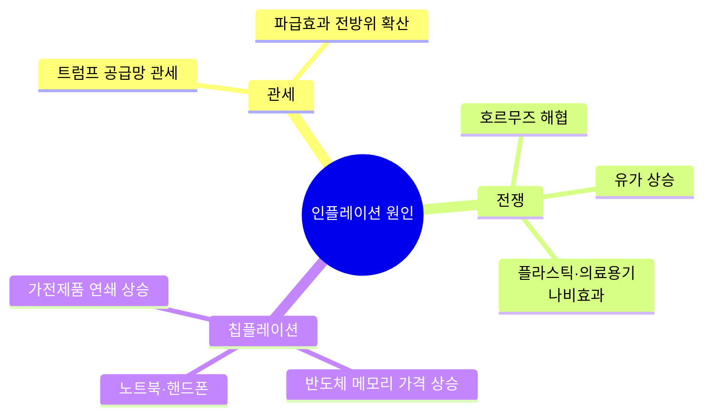
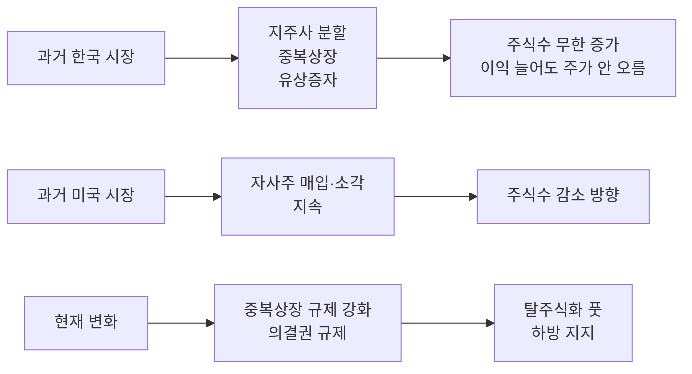
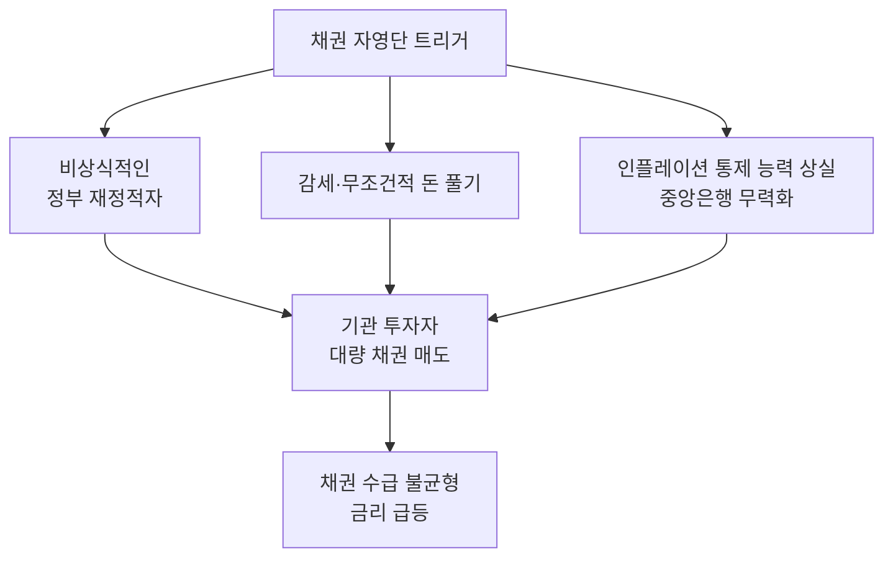

> **TL;DR**
> 2022년 이후 주식-채권 간 양의 상관관계가 고착화되면서 전통적인 60:40 포트폴리오의 분산 효과가 약화되었다. 인플레이션 국면에서는 원자재 10%를 추가한 6:3:1 포트폴리오가 우월하며, 하이퍼스케일러의 CAPEX 급증과 4조 달러 규모의 대형 IPO가 주식시장의 변동성을 확대할 수 있다. 채권 자영단(Bond Vigilante)은 "징벌"이 아니라 기관 투자자의 강제 청산 메커니즘이다.
{: .prompt-info }

## 개요

| 항목 | 내용 |
|------|------|
| 출연 | 김상미 본부장 (키움투자자산운용) |
| 진행 | 박종훈 |
| 촬영일 | 2026.05.26 |
| 길이 | 19:42 |
| 주제 | 인플레이션 대응 자산 배분, 채권 주식화, 대형 IPO 수급 충격 |

---

## 1. 60:40 포트폴리오의 붕괴

전통적인 60:40 (주식 60% : 채권 40%) 포트폴리오는 지난 20년간 훌륭하게 작동했다. 1997~2020년 사이 S&P 500이 10% 이상 하락한 9차례 중, 미국 채권이 7% 상승하며 방어 역할을 수행했다. 주식이 빠질 때 채권이 올라주는 **음의 상관관계**가 핵심이었다.

그러나 **2022년, 20년 만에 처음으로 양의 상관관계**가 출현했다. 인플레이션 구간에서는 긴축 정책으로 채권 가격도 동시에 하락한다.

{: .shadow }

### 대안: 6:3:1 포트폴리오

김상미 본부장은 채권 비중을 축소하고 원자재를 추가한 **6:3:1 포트폴리오**를 대안으로 제시했다.

| 구성 | 비율 | 비고 |
|------|------|------|
| 주식 | 60% | 기존 유지 |
| 채권 | 30% | 축소 (기존 40%) |
| 원자재 | 10% | 신규 추가 |

2000년부터 현재까지 누적 가격 비교 결과, 고물가·공급망 충격 구간에서 **6:3:1이 6:4를 지속적으로 상회**했다.

{: .shadow }

> 자산 배분은 고정된 답이 아니다. 분기별·월별로 모델을 업데이트하며 변동성을 지속 조정해야 한다.

---

## 2. 인플레이션의 세 가지 원인

현재 인플레이션은 세 가지 요인이 복합적으로 작용하고 있다.

전쟁의 영향은 단순히 유가 상승에 그치지 않는다. 호르무즈 해협을 막으면 쓰레기 봉투부터 주사기에 들어가는 플라스틱까지 전방위로 가격이 오르는 **나비효과**가 발생한다. 반도체 메모리 가격 상승은 노트북·핸드폰을 넘어 밥통에 들어가는 메모리까지 연쇄적으로 영향을 미친다.

---

## 3. 채권의 주식화: 왜 더 이상 보험이 아닌가

### 2022년의 충격

2022년 실적은 채권의 신화를 깼다: **주식 -18% vs 20년 만기 국채 -26%**. 채권을 보험으로 놔뒀는데 보험이 아니라 같이 빠졌다.

> "채권을 보험으로 놔뒀는데 보험이 아니라 같이 빠지는 거죠. 인슈어런스가 안 되는 거죠."

{: .shadow }

{: .shadow }

### 회사채가 주식과 닮은 이유

| 요인 | 설명 |
|------|------|
| 신용위험 동조화 | 경기 침체 시 기업 부도위험 커짐 → 주가·회사채 동시 하락 |
| 주주-채권자 충돌 | 기업이 차입해 자사주 매입 시 주주엔 유리, 채권자엔 불리 |
| 하이일드 채권 | 투자등급 미달 → 금리 변동성보다 펀더멘탈 움직임 → 주식과 상관관계 **0.7~0.8** |
| 파생상품 결합 | MBC 등 구조화 상품이 시장 전체를 움직임 (미국·영국에서 크게 작용) |

### 채권 전략 가이드

| 상황 | 추천 전략 |
|------|----------|
| 금리 인하 확신 | 장기채 매수 |
| 불확실 + 주식 하락 우려 | 단기채 또는 MMF |
| 중간 | 단기 채권으로 자금 잠금 |

---

## 4. 주식시장 수급 구조의 변화

### 한국 시장의 특징

한국은 **개인투자자 비중이 매우 높은** 독특한 시장이다. "전문가 따이 저리 가라, 내가 알아서 할 테다"는 심리가 강하며, 퇴직연금 주식 투자 증가와 ETF 열풍이 수요를 뒷받침한다. 사실 전 세계에서 ETF가 이 정도로 활성화된 나라는 **한국과 미국뿐**이다.

### 공급 측면의 과거 vs 현재

{: .shadow }

### 탈주식화 풋 (De-equitization Put)

**탈주식화 풋**이란 주식들이 주식의 효과를 내지 않는 현상을 말한다. 주식 시장에서 공급이 구조적으로 줄어들면서 옵션의 풋처럼 주가 하방을 받쳐주는 효과:

- 자사주 매입·소각 → 상장 주식수 감소
- 사모펀드 비상장화 → 시장 밖으로 주식 격리
- BDC 펀드로 재포장

{: .shadow }

---

## 5. 자사주 매입 감소와 하이퍼스케일러 CAPEX

2005~2023년 호황기에는 자사주 매입 비율이 높았으나, **현재는 98~2000년 닷컴 버블 수준으로 빠르게 하락**하고 있다. 원인은 **하이퍼스케일러들의 CAPEX 급증**이다.

| 구분 | 영업현금흐름 대비 CAPEX | 주가 영향 |
|------|----------------------|----------|
| 메모리 기업 (삼성·SK하이닉스) | 낮음 → 여력 충분 | 주가 상승 원인 |
| 하이퍼스케일러 | **급증** → 매입 여력 축소 | 자사주 매입 감소 |

{: .shadow }

{: .shadow }

> "하이퍼스케일러가 돈이 없다, 할 수 있는 것이냐"는 얘기가 이런 데이터에 근거한다.

영업현금흐름 대비 CAPEX가 계속 늘어나면 자사주 매입 여력이 줄어들어, 과거처럼 바이백이 주가 하방을 지지하는 패턴이 약화될 수 있다.

---

## 6. 4조 달러 대형 IPO의 수급 충격

현재 대기 중인 대형 IPO 목록:

| 기업 | 비고 |
|------|------|
| 스페이스X | 아마존 다음, 브로드컴 위 순위 예상 |
| 오픈AI | AI 대표 기업 |
| 엔트로픽 | AI 안전 스타트업 |
| 세브라스 (Claude) | 소프트웨어 업계 해고 파급 |

규모는 **4조 달러 이상**. 이것이 시장에 미치는 영향은 단순하지 않다.

> "이 주식을 내가 못 샀는데 이게 오르면 저는 잘리는 거예요. 집에 가는 거예요. 무조건 사야 되는 거죠."

{: .shadow }

### 수급 이동 메커니즘

1. **액티브 매니저**: 사전에 다른 주식 매도 가능
2. **패시브 매니저**: 기준가 때문에 직전에 매도 → 호가 움직임 유발
3. **한국 ETF**: 우주항공·스페이스 ETF 준비 중 → 추가 수급

S&P 500 시장에 신규 자금이 4조 달러 이상 들어오지 않으면 **기존 종목에 하락 압력**이 가해진다. 과거 자사주 매입이 하방 지지했던 것이 약화되면서 변동성 확대 가능성이 있다.

---

## 7. 채권 자영단(Bond Vigilante)의 실체

채권 자영단은 채권을 지키는 정의로운 존재가 아니다. 실체는 **강제 청산 메커니즘**에 가깝다.

> "채권 자영단이 채권을 지키는 게 아니라 사실은 금융시장 자영단이다."

### 작동 원리

채권 매니저들은 가치가 아닌 **수급**에 의해 움직인다. 기관 투자자가 항공모함처럼 큰 돈을 움직이며 참다가 **마지막에 던지는 것**이 자영단 효과를 만든다.

### 트리거 조건

{: .shadow }

### 사례: 영국 트러스 사태

영국 트러스 총리의 대규모 감세 정책으로 인해 부채 연기 투자펀드에 마진콜이 발생했다. 대량 매도 → 금리 급등 → **45일 만에 총리 사임**. 이것은 "징벌"이 아니라 기관 투자자들의 항복이었다.

> "저희 회사 채권 본부 매니저들도 얼굴이 다 흑색이 됐어요. 살이 빠지고 다들 너무 괴로워하고."

현재 영국·미국 금리가 다시 난리를 피우고 있어, 비슷한 상황이 재발할 가능성에 시장이 주목하고 있다.

---

## 8. 투자자를 위한 시사점

> "주식 시장 결국 GDP랑 같이 가잖아요. 경제가 성장해야 주식도 가는 거잖아요. 길게 경제가 성장하면 결국은 따라간다고 생각하니까 너무 스트레스 받지 마시고"

| 투자자 유형 | 권장 전략 |
|------------|----------|
| 장기 투자자 | 저가 매수 관점 유지 |
| 스트레스 과다자 | 일부 매도, 채권 섞기, **원자재 추가** 고려 |
| 불확실성 큰 상황 | 단기채/MMF로 자금 잠금 |

인플레이션이 지배적인 충격을 줄 때는 주식과 채권이 동시에 하락할 수 있다. 이럴 때 원자재 같은 실물 자산이 분산 효과를 발휘한다. 자산 배분에 정답은 없지만, 인플레이션 리스크를 인지하고 대응하는 것이 중요하다.

---

> **원본 영상:** [다가오는 인플레이션에 대응하는 자산 배분 전략 — 박종훈](https://youtu.be/Aw4NQe5MJlI)
