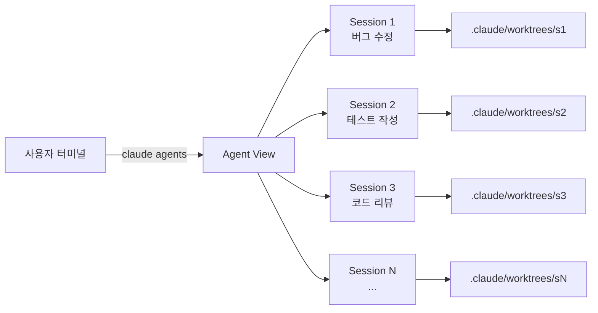
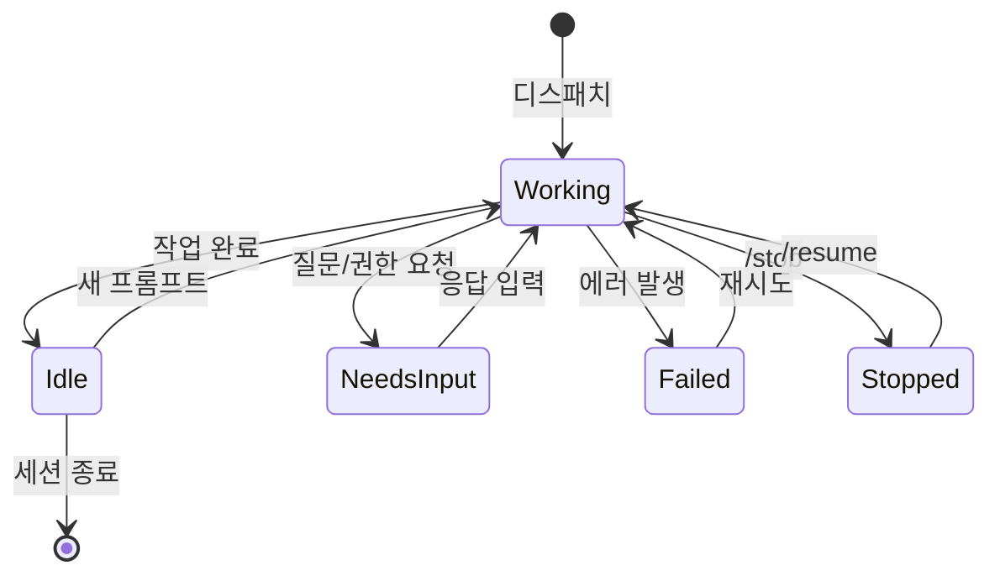
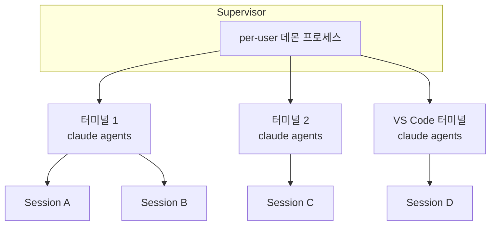
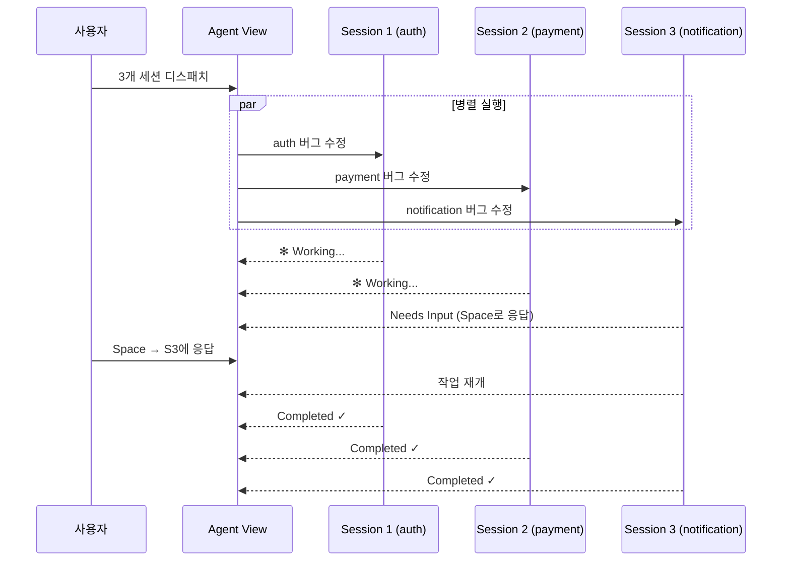
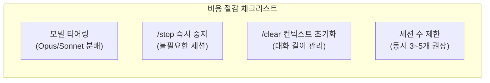

> **TL;DR**
> Claude Code v2.1.139+에서 추가된 **Agent View**(`claude agents`)는 단일 터미널 화면에서
> 여러 백그라운드 AI 세션을 디스패치·모니터링·관리할 수 있는 기능이다.
> 병렬 작업, worktree 격리, 모델 티어링까지 지원하여
> "한 사람이 여러 개발자를 동시에 드라이브"하는 경험을 제공한다.
{: .prompt-info}

## 개요

| 항목 | 내용 |
|---|---|
| **기능명** | Agent View (`claude agents`) |
| **최소 버전** | Claude Code v2.1.139 |
| **필수 플랜** | Pro / Max / Team |
| **핵심 명령어** | `claude agents`, `claude --bg`, `/bg` |
| **격리 방식** | Git worktree (`.claude/worktrees/`) |
| **프로세스 관리** | Per-user supervisor, 터미널 독립 |
| **공식 문서** | [code.claude.com/docs/agent-view](https://code.claude.com/docs/en/agent-view) |

---

## Agent View가 해결하는 문제

기존 Claude Code는 한 번에 하나의 세션만 처리할 수 있었다.
코드 리뷰를 받는 동안 테스트를 돌릴 수 없었고, 버그 수정 중에는 리팩토링을 맡길 수 없었다.

Agent View는 이 제약를 깬다. **하나의 터미널**에서 여러 Claude 세션을 백그라운드로 실행하고,
상태를 실시간으로 확인하며, 필요할 때 즉시 개입할 수 있다.



---

## Quick Start

### 백그라운드 세션 디스패치

```bash
# 쉘에서 바로 백그라운드 디스패치
claude --bg "user-auth 모듈의 로그인 버그를 수정해줘"

# 특정 subagent로 디스패치
claude --agent code-reviewer --bg "PR #42 리뷰해줘"

# Agent View 열기
claude agents

# 특정 프로젝트 디렉토리 스쿼프 (v2.1.141+)
claude agents --cwd ~/projects/my-app
```

### 세션 내에서 전환

현재 세션을 백그라운드로 돌리려면 빈 프롬프트에서 `←` 를 누르거나 `/bg` 를 입력한다.

```
# 현재 세션 안에서
/bg          # 백그라운드로 전환 → agent view로 이동
```

---

## 세션 상태 이해하기

Agent View에서 각 세션은 실시간 상태를 표시한다.



### 상태별 시각 표현

| 상태 | 표시 | 색상 | 의미 |
|---|---|---|---|
| **Working** | ✻ (애니메이션) | 기본 | 활발히 작업 중 |
| **Needs Input** | — | 노랑 | 사용자 응답 대기 |
| **Idle** | — | 흐림 | 대기 중 |
| **Completed** | — | 초록 | 작업 완료 |
| **Failed** | — | 빨강 | 에러 발생 |
| **Stopped** | — | 회색 | 수동 중지 |

프로세스 모양도 상태를 나타낸다:
- **✻** — 활성 프로세스
- **∙** — 종료됨 (복구 가능)
- **✢** — `/loop` 대기 중

---

## 핵심 상호작용

Agent View에서 세 가지 핵심 조작으로 모든 세션을 제어한다.

| 조작 | 키 | 설명 |
|---|---|---|
| **Peek & Reply** | `Space` | 최근 출력 미리보기 + 답변 입력 |
| **Attach** | `Enter` / `→` | 전체 세션으로 진입 (대화형 모드) |
| **Background** | `←` (빈 프롬프트) | 현재 세션 백그라운드 전환 |

> **Peek & Reply**가 핵심이다.
> 전체 세션에 진입하지 않고도 "이 파일 괜찮아?" 같은 질문에 바로 답할 수 있다.
> 가벼운 승인이나 방향 수정에 최적.
{: .prompt-tip}

---

## Worktree 격리

백그라운드 세션은 각각 독립된 git worktree에서 실행된다.

```
.claude/
└── worktrees/
    ├── session-abc123/    # 세션 1의 작업 디렉토리
    ├── session-def456/    # 세션 2의 작업 디렉토리
    └── session-ghi789/    # 세션 3의 작업 디렉토리
```

이 구조의 장점:

- **병렬 쓰기 안전**: 여러 세션이 같은 저장소의 다른 브랜치에서 동시에 작업
- **읽기 공유**: 모든 세션이 최신 코드를 읽을 수 있음
- **충돌 최소화**: 각 세션이 자신의 worktree에 쓰므로 파일 충돌 방지

> 주의: 여러 세션이 **같은 브랜치**에 커밋하려 하면 git 충돌이 발생할 수 있다.
> 세션별로 다른 브랜치를 사용하는 것이 안전하다.
{: .prompt-warning}

---

## Supervisor 프로세스

Agent View는 per-user supervisor 프로세스로 세션을 관리한다.



특징:
- **터미널 독립**: 터미널을 닫아도 세션은 유지된다. 다른 터미널에서 `claude agents`로 재접속 가능
- **자동 정지**: idle 상태 약 1시간 후 프로세스 정지 (세션 state는 디스크에 보존)
- **자동 재시작**: Claude Code 바이너리 업데이트 시 supervisor가 자동으로 재시작

---

## 실전 워크플로우

### 1. 버그 3개 병렬 수정

서로 다른 모듈의 버그를 동시에 수정한다.

```bash
# 3개 버그를 각각 다른 세션에 디스패치
claude --bg "auth 모듈: 세션 만료 시 500 에러 수정"
claude --bg "payment 모듈: 결제 금액 소수점 버그 수정"
claude --bg "notification 모듈: 이메일 중복 발송 버그 수정"

# Agent View에서 진행 상황 모니터링
claude agents
```



### 2. PR 리뷰 + 테스트 작성 동시 진행

```bash
# code-reviewer subagent로 리뷰
claude --agent code-reviewer --bg "PR #87 아키텍처 관점에서 리뷰해줘"

# 다른 세션에서 테스트 작성
claude --bg "PR #87 변경사항에 대한 통합 테스트 작성해줘"
```

두 작업이 독립적으로 실행되므로, 리뷰 피드백을 기다리지 않고
테스트 작성을 바로 시작할 수 있다.

### 3. 리서치 → 구현 파이프라인

```bash
# 1단계: 리서치 에이전트
claude --bg "이 프로젝트에 Redis 캐시 레이어 도입 방법 조사해줘. 
             기존 DB 쿼리 패턴 분석하고 캐시 전략 제안해줘"

# 2단계: 리서치 완료 후, 결과를 기반으로 구현
# (Agent View에서 Session 1의 결과를 확인한 뒤)
claude --bg "첫 번째 세션의 리서치 결과를 바탕으로 Redis 캐시 레이어를 
             구현해줘. cache module 디렉토리에 작성해줘"
```

### 4. 오케스트레이터 패턴 (비용 절약)

Opus 모델을 오케스트레이터로, Sonnet을 워커로 사용하는 패턴.

```bash
# Opus: 설계 및 작업 분배
claude --model opus --bg "이 리팩토링 작업을 4개 서브태스크로 나누고,
                          각각에 대한 상세 지시사항을 작성해줘"

# Sonnet: 실제 구현 (비용 효율)
claude --model sonnet --bg "<Opus가 작성한 지시사항> 기반으로 task 1 구현"
claude --model sonnet --bg "<Opus가 작성한 지시사항> 기반으로 task 2 구현"
claude --model sonnet --bg "<Opus가 작성한 지시사항> 기반으로 task 3 구현"
claude --model sonnet --bg "<Opus가 작성한 지시사항> 기반으로 task 4 구현"
```

> 이 패턴으로 **비용 약 40% 절약** 가능하다.
> 고가의 Opus는 설계와 검토에만, 저렴한 Sonnet은 구현에 배분.
{: .prompt-tip}

---

## 비용 관리

Agent View는 강력하지만 비용에 주의해야 한다.

### 핵심 원칙

| 원칙 | 설명 |
|---|---|
| **세션 = 독립 쿼터** | 각 백그라운드 세션이 독립적으로 API 쿼터를 소모 |
| **10 병렬 = 10배 소모** | 10개 세션을 동시에 돌리면 10배 빠르게 쿼터 소진 |
| **Pro 플랜 주의** | 5개 에이전트를 활발히 돌리면 1시간 내 쿼터 소진 가능 |

### 절감 전략

```bash
# 1. 모델 티어링 — 단순 작업은 Sonnet 사용
claude --model sonnet --bg "이 파일에 주석 추가해줘"

# 2. 즉시 중지 — 불필요한 세션은 /stop
# Agent View에서 해당 세션 선택 후 /stop 입력

# 3. 컨텍스트 초기화 — 대화가 길어지면 /clear
# 토큰 사용량을 줄이기 위해 주기적으로 컨텍스트 초기화
```



---

## 정리

Agent View는 Claude Code를 "1:1 채팅"에서 "1:N 오케스트레이션" 도구로 바꾼다.

**잘 맞는 경우:**
- 독립적인 태스크를 여러 개 처리할 때
- 리서치와 구현을 파이프라인으로 연결할 때
- 모델 티어링으로 비용을 최적화하고 싶을 때

**주의할 경우:**
- 같은 파일을 여러 세션에서 수정해야 할 때 (worktree 충돌)
- 쿼터 제한이 타이트한 Pro 플랜
- 세션 간 복잡한 의존성이 있을 때 (순차 실행이 나을 수 있음)

한 번 익숙해지면 돌아갈 수 없는 생산성 차이를 경험하게 된다.
시작은 간단하다 — 터미널에서 `claude agents`를 쳐보자.

---

**참고 자료:**
- [Claude Code Agent View 공식 문서](https://code.claude.com/docs/en/agent-view)
- [MindStudio: Claude Code Agent View 분석](https://www.mindstudio.ai/blog/claude-code-agent-view-multiple-agents/)
- [CloudZero: Claude Code Agents 비용 분석](https://www.cloudzero.com/blog/claude-code-agents/)
