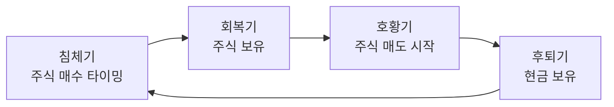
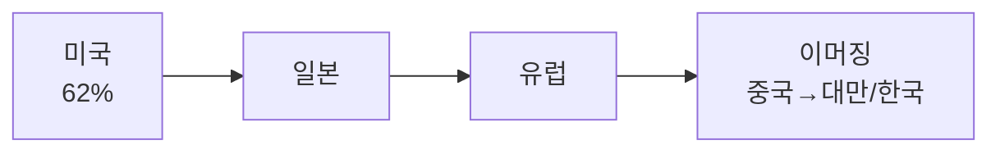

> **TL;DR**
> 경기 순환 4국면(회복·호황·후퇴·침체)에서 주식은 경기 선행, 소비는 후행이므로 침체기 말→회복기에 매수하고 호황→후퇴기 초반에 매도하는 것이 핵심이다. MSCI ACWI 수급 구조와 달러 인덱스 방향성을 함께 읽으면 개별 종목을 몰라도 타이밍을 잡을 수 있다.
{: .prompt-info }

## 1. 개요

| 항목 | 내용 |
|------|------|
| 연사 | 백찬규 자산관리컨설팅센터장 (NH투자증권) |
| 플랫폼 | WePoll 버디버디 |
| 일자 | 2026-05-28 |
| 영상 길이 | 약 25분 |
| 핵심 주제 | 경기 순환 4국면, MSCI ACWI 글로벌 수급, 달러 인덱스·환율 분석 |
| 영상 링크 | [https://youtu.be/ec61o-JTEnU](https://youtu.be/ec61o-JTEnU) |

---

## 2. 경기 순환 4국면

경기는 **회복기 → 호황기 → 후퇴기 → 침체기**의 사이클을 반복한다. 각 국면에서 자산 가격과 소비 행태가 다르게 나타나며, 이를 읽으면 주식 매수·매도 타이밍을 잡을 수 있다.

주식은 경기에 **선행**하고, 소비(소매)는 **후행**한다. 따라서 소비 지표가 꺾이기 시작하면 이미 늦었다. 소비가 꺾이는 시점에 주식을 사는 것은 절대 금물이다.

> **체크 포인트**
> 한 달에 한 번, 월급날(21~25일) 무렵 미국 경제 지표가 업데이트되는 시점에 국면을 점검하라.
{: .prompt-tip }

---

## 3. 명품 소비로 보는 경기 후행성

### 롤렉스·명품 붐과 경기 국면

2022년 1분기, 롤렉스는 사자마자 2배 가격에 되팔 수 있었다. 이른바 **샤테크·에르샤테크**라는 말이 유행할 정도였다. 에르메스 Birkin은 돈이 있어도 구매 이력이 필요하고 원하는 색·소재를 고를 수 없을 만큼 수요가 폭발했다.

이 현상은 **호황기 말 ~ 후퇴기 초반**에 나타난다. 명품을 사기 힘들 때가 바로 경기가 과열된 시점이다. 반대로 **침체기 끝 ~ 회복기**에는 줄 없이 쉽게 살 수 있다.

### LVMH 주가 패턴

소매 판매 12개월 이동평균은 경기보다 후행한다. 사치재, 경기소비재, 차량이 동시에 하락하면 매우 위험한 신호다. LVMH 주가는 경기 침체 이후 반등하는 패턴을 보인다.

---

## 4. 현재 경기 국면 진단

- **2024~2025년**: 미국 경기 회복기 진입 확인, 주식 추천
- **2025년 가을**: 한국 성장률 1% 전망, 골목상권 침체
- **2026년 현재**: 백화점 매출 20% 증가, 명품 줄 서는 현상 재등장

---

## 5. MSCI ACWI와 글로벌 수급

### MSCI ACWI 구성

MSCI ACWI(All Country World Index)는 전 세계 주식 시장을 담는 지수다.

- **DM(선진국)**: 90.9%
- **EM(이머징)**: 9.1% (작년말 기준)

### 한국의 위치

한국은 이머징 마켓에 속하며 비중은 약 **1.3% → 1.67%**로 주가 상승으로 증가했다. 하지만 비중이 정해져 있기 때문에 한국 주가가 급등하면 **리밸런싱(헐컷)**이 발생한다.

> **핵심 인사이트**
> 외국인이 한국을 매도하는 것은 한국 경제가 나빠서가 아니라 **비중 조정**일 수 있다.
{: .prompt-info }

---

## 6. 글로벌 자본 흐름 순서

글로벌 자본은 일정한 순서로 흐른다.

### DM/EM 리밸런싱의 힘

DM 비중이 91%에서 95%로 커지면 EM으로 가는 돈은 약 **50% 증가**한다. 반도체 종목을 몰라도 경기 국면과 수급 흐름만으로 타이밍을 잡을 수 있었던 이유가 여기에 있다.

---

## 7. 환율 3대 요인

학술적으로 환율은 다음 세 가지로 설명한다.

1. **금리차**
2. **펀더멘탈**
3. **경상수지**

하지만 실제로는 **미국의 정치적 의지가 절반을 차지**한다. 특히 트럼프 행정부에서는 예측이 더욱 어려워진다.

> **주의**
> 환율 예측은 학술적 요인만으로는 한계가 있으며, 정치적 변수를 반드시 고려해야 한다.
{: .prompt-warning }

---

## 8. 달러 인덱스 (DXY) 분석

### 구성 통화

달러 인덱스는 6개 통화로 구성된다.

| 통화 | 비중 |
|------|------|
| 유로 | 57.6% |
| 엔화 | 13.6% |
| 파운드 | 포함 |
| 스위스프랑 | 포함 |
| 캐나다달러 | 포함 |
| 스웨덴크로나 | 포함 |

위안화가 GDP 규모 2위임에도 포함되지 않는 한계가 있다. 유로 + 엔화만 합쳐도 **70% 이상**이며, 캐나다달러를 제외하면 **80%**에 달한다. 따라서 **유로와 엔화 방향만 봐도 달러 방향을 파악**할 수 있다.

### 달러 인덱스 역사와 원달러 환율

| 시기 | DXY 평균 | 원달러 환율 |
|------|----------|-------------|
| 2010~2015 | 78포인트 | 950~1,200원 |
| 2015~2020 | 95포인트 | 1,100~1,300원 |
| 코로나 후 | 105포인트 | 1,480원 |

달러 가치가 **40% 비싸져서** 환율이 상승한 것이다. "한국이 망한다"는 시각과 달리, 구조적으로 달러가 강해진 결과다.

---

## 9. 장기 환율 구조적 압력

- **1988년 서울올림픽**: 환율 800원 이하
- **생산가능인구 감소**: 10년간 850만 명 은퇴
- **잠재성장률**: 1%대, 총요소생산성 정체, 자본투자 해외 이탈
- **순대외자산**: GDP 대비 60% 미만 (선진국은 더 높음)

장기적으로 환율 상승 압력이 존재한다. 인구 구조와 잠재성장률 하락이 근본적인 요인이다.

---

## 10. 6월 수급 이슈

6월에는 다음 세 가지 수급 변수가 겹친다.

- **국민연금 중기 자산운용 방안** 결정
- **SpaceX 상장** → S&P 500 7위 진입 예상, 주변 기업 덩치 축소
- 한국은 **레버리지**가 있어 수급 꼬임 가능

> **행동 권고**
> 향후 2주간 수급 동향을 신경 쓰며 매매에 임하라.
{: .prompt-tip }

---

## 요약

| 주제 | 핵심 포인트 |
|------|-------------|
| 경기 국면 | 4국면 순환, 주식은 선행·소비는 후행 |
| 매수 타이밍 | 침체기 말→회복기 |
| 매도 타이밍 | 호황기→후퇴기 초반 |
| 글로벌 수급 | MSCI ACWI DM 90.9% / EM 9.1%, 한국 1.67% |
| 자본 흐름 | 미국→일본→유럽→이머징 순 |
| 달러 인덱스 | 유로+엔화 70%+, 방향 파악 가능 |
| 장기 환율 | 인구·성장률 구조적 압력, 상승 방향 |
| 6월 이슈 | 국민연금·SpaceX·레버리지 수급 변수 |
