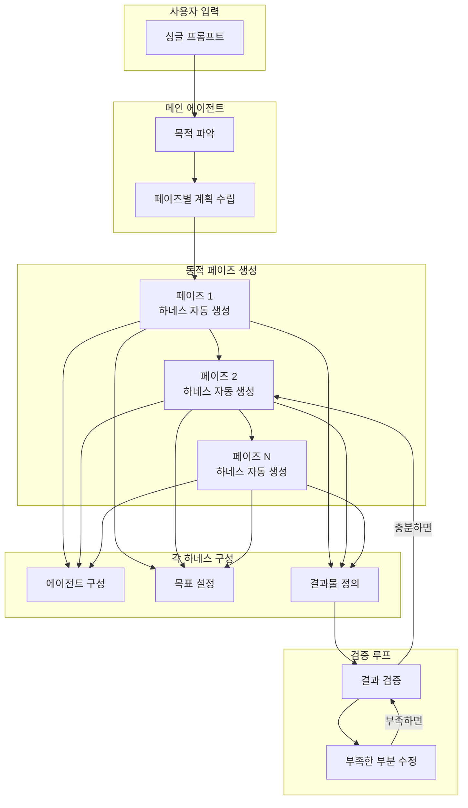
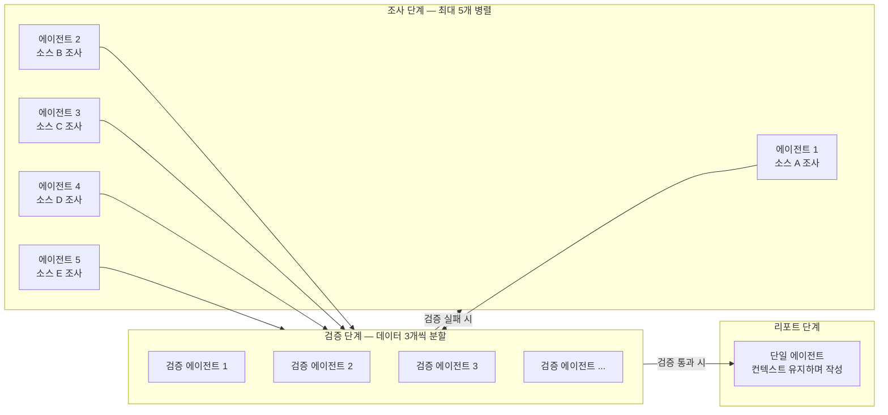
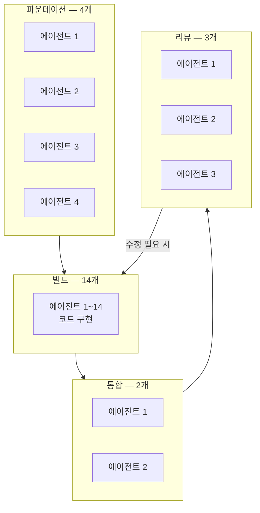
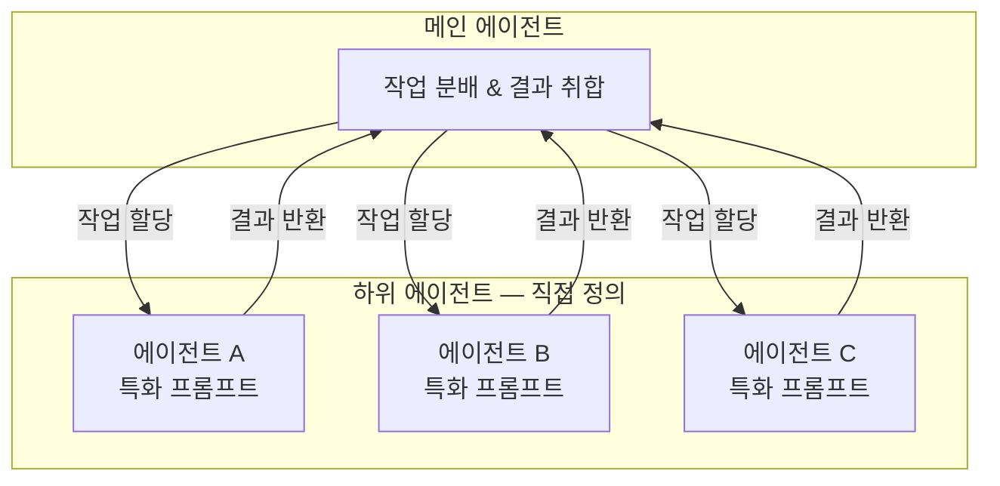
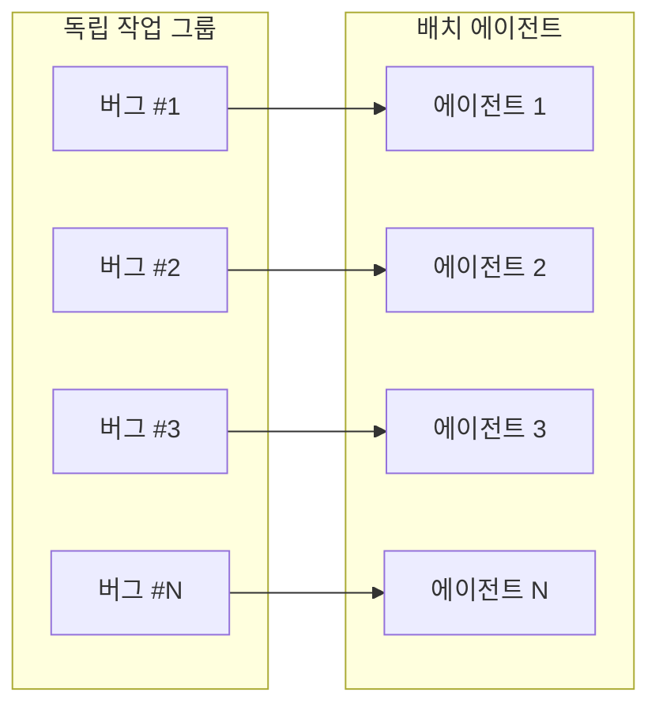
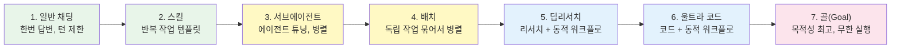
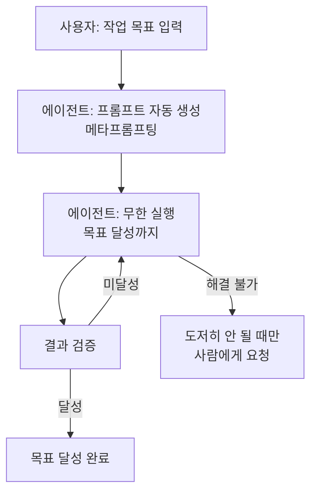
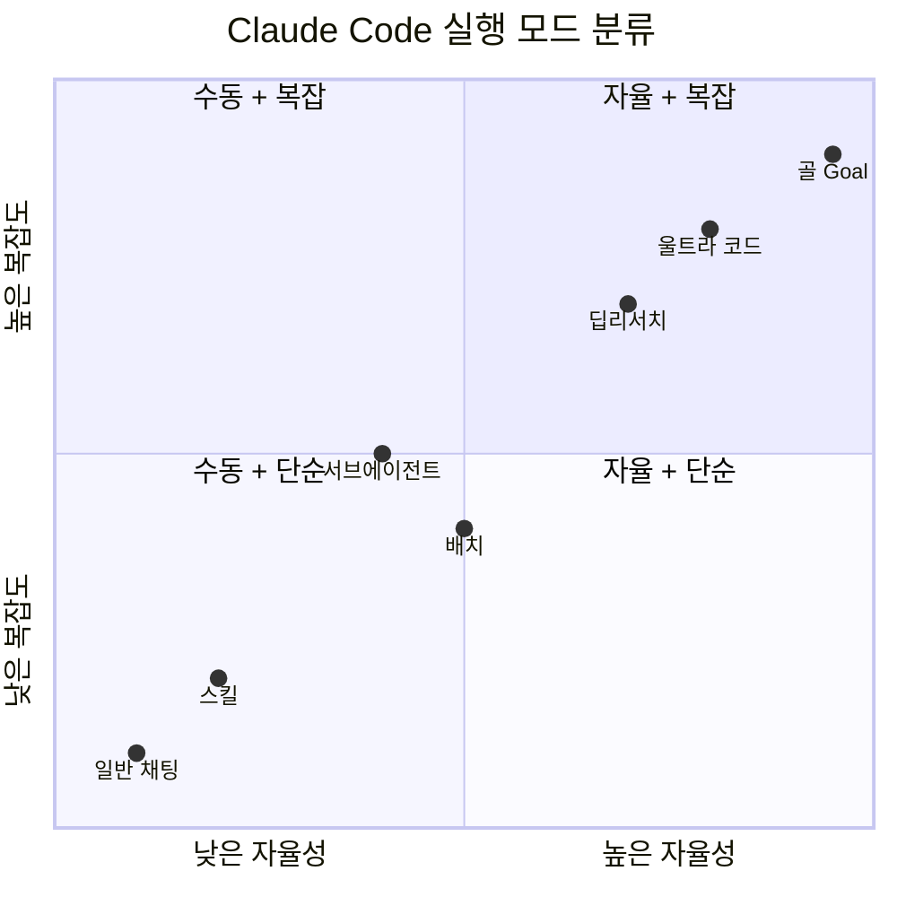
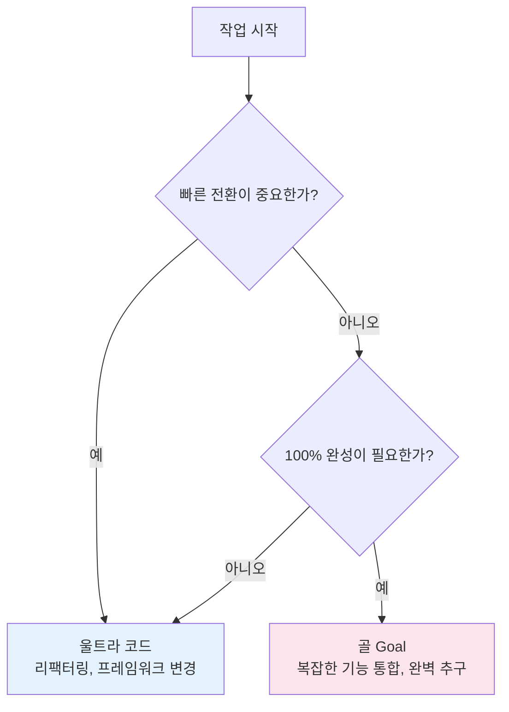

> **원본 영상:** [Claude Code Dynamic Workflow Feature Comparison: The Ultimate Guide! — 코드팩토리](https://www.youtube.com/watch?v=9fx2_1aTzq8)
>
> **TL;DR** — Claude Code의 Dynamic Workflow는 싱글 프롬프트로 전체 워크플로우를 동적으로 생성한다. 7가지 실행 모드(일반 채팅 → 스킬 → 서브에이전트 → 배치 → 딥리서치 → 울트라 코드 → 골)를 목적과 토큰 비용 기준으로 비교 정리.
{: .prompt-info }

---

| 항목 | 내용 |
|---|---|
| **채널** | 코드팩토리 (Code Factory) |
| **영상** | Claude Code Dynamic Workflow Feature Comparison: The Ultimate Guide! |
| **길이** | 18:24 |
| **주제** | Claude Code Dynamic Workflow 7가지 모드 비교 |
| **핵심 키워드** | Dynamic Workflow, Deep Research, Ultra Code, Goal, Subagent, Batch |

---

## Dynamic Workflow 작동 원리

{: .shadow }

Dynamic Workflow의 핵심은 **하나의 프롬프트로 전체 워크플로우를 동적으로 생성**한다는 것이다. 사용자가 목적을 입력하면, 메인 에이전트가 목적을 파악하고 페이즈별 계획을 수립한다. 각 페이즈에는 하네스(에이전트 구성, 목표, 결과물)가 동적으로 생성된다.

정적 하네스는 사람이 수동으로 에이전트 구성을 정의하는 방식이지만, Dynamic Workflow는 **매번 요청에 맞게 자동으로 생성**한다. 부족한 부분이 있으면 검증과 수정을 무한히 반복한다.

정적 하네스와 동적 하네스의 차이를 정리하면:

- **정적 하네스**: 사람이 미리 에이전트 구성, 목표, 결과물을 수동 정의
- **동적 하네스**: 요청마다 자동으로 최적의 구성을 생성
- **공통점**: 둘 다 검증-수정 무한루프를 통해 품질 보장

---

## Deep Research

{: .shadow }

Deep Research는 **조사 → 검증 → 추가 조사 → 무한루프 → 최종 리포트**의 흐름으로 동작한다. 일반 채팅은 첫 번째 조사 단계에서 끝나지만, 딥리서치는 검증까지 수행한다.

### 병렬 에이전트 구성

{: .shadow }

최대 **5개의 병렬 에이전트**가 각각 검색 소스별로 조사를 진행한다. 수집된 데이터는 검증 단계에서 **3개씩 쪼개서 독립 검증**한다. 이때 에이전트 수는 최대 5배까지 늘어난다.

최종 리포트는 **단일 에이전트가 작성**한다. 여러 에이전트가 나눠서 쓰면 컨텍스트가 끊기기 때문이다.

핵심 포인트:

- 일반 채팅: 조사 1단계에서 종료
- 딥리서치: 조사 → 검증 → 추가 조사 루프 후 최종 리포트
- 검증 시 데이터를 3개 단위로 분할하여 독립 검증
- 최종 리포트는 반드시 단일 에이전트가 작성 (컨텍스트 보존)

---

## Ultra Code

{: .shadow }

Ultra Code는 **코드 생성/수정**에 특화된 Dynamic Workflow 모드다. 병렬 처리 → 리뷰 → 검증 → 수정 → 무한루프 → 결과의 흐름으로 동작한다.

### 페이즈 구성

{: .shadow }

실제 실행 예시를 보면 다음과 같은 페이즈로 구성된다:

- **파운데이션**: 4개 에이전트 — 기반 구조 설계
- **빌드**: 14개 에이전트 — 실제 코드 구현
- **통합**: 2개 에이전트 — 코드 병합
- **리뷰**: 3개 에이전트 — 품질 검증

Deep Research보다 적은 에이전트를 사용하지만, **각 에이전트가 더 오래 실행**하며 토큰을 더 많이 사용한다. 계획 설계 단계에서는 **X-High 모델이 필수**다.

주의할 점:

- 코드 변경은 **70개까지 에이전트를 쓰기 어렵다** — 컨텍스트 유지가 중요하기 때문
- 딥리서치보다 에이전트 수는 적지만 개별 실행 시간이 길다
- 예시: 클린 아키텍처 포트&어댑터 패턴으로 모든 SQL API를 호환하는 작업

---

## Subagent

{: .shadow }

Subagent는 Claude Code에서 **가장 먼저 나온 병렬 실행 기능**이다. 하위 에이전트를 직접 정의해서 사용하는 방식이다.

대표적인 활용 패턴:

- 하이쿠(Haiku) 모델로 **빠른 검색** 수행 → 결과를 메인 에이전트에 전달 → 컨텍스트 절약
- 특화된 프롬프트를 가진 에이전트들을 **병렬 또는 직렬**로 실행
- 완료 후 메인 에이전트가 결과를 취합

핵심은 **에이전트를 직접 튜닝**할 수 있다는 점. 모델 선택, 프롬프트, 실행 순서까지 사용자가 제어한다.

---

## Batch

{: .shadow }

Batch는 **독립적인 작업들을 묶어서 한 번에 병렬 실행**하는 모드다. 마치 공장의 조립 라인처럼, 각각의 작업을 개별 에이전트에 배정하여 동시에 처리한다.

대표적인 활용 예시:

- 버그 1~100번이 있을 때, 각 버그를 개별 에이전트에 배정하여 **동시 수정**
- 서로 의존성이 없는 작업들을 그룹핑해서 병렬 처리

특징:

- **수동 그룹핑**이 필요 — 어떤 작업을 묶을지 사용자가 판단
- 각 작업은 서로 독립적이어야 병렬 실행이 가능
- 공장 같은 느낌으로, 정해진 작업을 정해진 에이전트가 처리

---

## 프롬프팅 진화 스펙트럼

{: .shadow }

Claude Code의 실행 모드는 7단계로 진화해왔다. 왼쪽부터 오른쪽으로 갈수록 **토큰 사용량이 많아지고 목표 추종도가 높아진다**.

각 단계의 핵심 차이:

- **1~2단계 (일반 채팅, 스킬)**: 심플. 한 번에 끝나는 작업에 적합
- **3~4단계 (서브에이전트, 배치)**: 병렬 실행 도입. 수동 제어 필요
- **5~6단계 (딥리서치, 울트라 코드)**: 동적 워크플로우 결합. 자동 계획+실행
- **7단계 (골)**: 목적성 최고. 턴 제한 없이 목표 완수까지 무한 실행

---

## Goal

{: .shadow }

Goal은 Claude Code 실행 모드 중 **목적성이 가장 높은 모드**다. 턴 제한이 없으며, 몇 시간이든 며칠이든 실행할 수 있다. 목표를 완전히 달성할 때까지 계속 실행된다.

### 핵심 특징

- **턴 제한 없음**: 일반 채팅은 턴 제한이 있지만 Goal은 무제한
- **무한 실행**: 몇 시간, 며칠 단위로 실행 가능
- **자체 해결 지향**: 일반 채팅은 포기하지만, Goal은 최대한 스스로 해결. 도저히 안 될 때만 사람에게 요청

### 메타프롬프팅

{: .shadow }

Goal을 사용할 때는 **반드시 메타프롬프팅**을 해야 한다. 핵심 아이디어는:

> "이 작업을 할 건데, **네가 먹일 프롬프트를 만들어줘**"

메타프롬프팅의 장점:

- **환각(Hallucination) 감소**: 에이전트가 스스로 프롬프트를 설계하므로 더 정직한 답변
- **목표 명확화**: 에이전트가 작업을 이해하고 프롬프트를 구성하는 과정에서 목표가 명확해짐
- **결과 품질 향상**: 자기 자신에게 최적화된 프롬프트를 생성

Goal의 성격을 한마디로 요약하면: **성공하거나 죽을 때까지 하는 집착형 에이전트**.

---

## 전체 비교

{: .shadow }

7가지 모드를 핵심 기준으로 비교하면 다음과 같다.

- **일반 채팅**: 한 번 답변, 턴 제한, 가장 심플
- **스킬**: 반복 작업을 템플릿화
- **서브에이전트**: 에이전트 직접 튜닝, 병렬 실행
- **배치**: 독립 작업 묶어서 병렬, 수동 그룹핑
- **딥리서치**: 리서치 + Dynamic Workflow, 병렬 조사+검증
- **울트라 코드**: 코드 + Dynamic Workflow, 병렬 구현+리뷰
- **골(Goal)**: 목적성 최고, 무한 실행, 메타프롬프팅 필수

---

## 실전 가이드: 울트라 코드 vs 골

{: .shadow }

실전에서 가장 많이 비교되는 두 모드의 선택 기준을 정리한다.

### 기본 원칙: 울트라 코드를 우선 사용

빠르고 포커스가 좋기 때문에, **기본적으로 울트라 코드**를 선택한다.

### 울트라 코드가 적합한 경우

- **리팩터링**: 코드 구조 개선, 불필요한 코드 제거
- **프레임워크 변경**: 빠른 전환이 중요한 작업
- 속도와 정확도의 밸런스가 필요한 경우

### 골(Goal)이 적합한 경우

- **복잡한 새 기능 통합**: 예 — Redis 캐싱 레이어 추가
- **완벽해야 하는 작업**: 100% 완성도가 요구되는 경우
- **집착이 필요한 작업**: 성공하거나 죽을 때까지 물고 늘어져야 하는 경우

한마디로 요약하면:

- **울트라 코드**: 속도와 효율 중심의 전천후 모드
- **골(Goal)**: 완벽주의자의 무기, 집착형 실행
