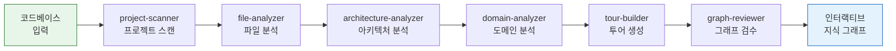

> **원본 영상:** [This AI Tool Maps Any Codebase Before You Touch It (Understand-Anything) — Better Stack](https://www.youtube.com/watch?v=VmIUXVlt7_I)
>
> **TL;DR** — Understand-Anything은 오픈소스 Claude Code 플러그인으로, 코드베이스를 정적 분석과 LLM을 결합해 인터랙티브 지식 그래프로 변환한다. 7개 에이전트가 구조·관계·도메인 지식을 추출하고, 대시보드·가이드 투어·Diff Impact 등으로 시각화한다.
{: .prompt-info }

---

| 항목 | 내용 |
|---|---|
| **채널** | Better Stack |
| **영상** | This AI Tool Maps Any Codebase Before You Touch It (Understand-Anything) |
| **길이** | 약 7분 |
| **GitHub** | [Lum1104/Understand-Anything](https://github.com/Lum1104/Understand-Anything) |
| **Stars** | 51.6k ⭐ · MIT License · v2.7.3 · Contributors 40명 |
| **주제** | 코드베이스 인터랙티브 지식 그래프 변환 |
| **핵심 키워드** | Knowledge Graph, Tree-sitter, Multi-Agent, Guided Tour, Diff Impact |

---

## 200K 라인 코드베이스, 어디서 시작할까

{: .shadow }

새로 합류한 프로젝트가 20만 줄짜리 모노레포라고 가정해보자. 문서는 12페이지. 어디서 읽기 시작해야 할지, 한 모듈을 건드리면 어디까지 영향이 퍼지는지 감이 오지 않는다. 기존 IDE 그래프는 "이 파일이 저 파일을 import 한다" 정도만 보여줄 뿐, **왜 그 관계가 존재하는지**는 알려주지 않는다.

---

## Understand-Anything이란

{: .shadow }

Understand-Anything은 코드베이스를 **인터랙티브 지식 그래프(Interactive Knowledge Graph)** 로 변환하는 오픈소스 Claude Code 플러그이다. 단순히 파일 간 import 관계를 보여주는 것을 넘어, 각 모듈의 역할, 비즈니스 컨텍스트, 데이터 흐름까지 시각적으로 탐색할 수 있게 한다.

핵심 철학은 한 문장으로 요약된다:

> 기존 도구는 "이 파일이 저 파일을 import 한다"를 보여주지만, Understand-Anything은 **"이 파일이 왜 존재하고, 어떤 플로우의 일부인지"** 를 보여준다.

---

## 작동 원리 — Tree-sitter + LLM 하이브리드 아키텍처

{: .shadow }

Understand-Anything의 분석 파이프라인은 **결정론적 파싱**과 **시맨틱 분석**을 결합한 하이브리드 구조다.

- **Tree-sitter**: 빠르고 정확한 정적 분석. AST 레벨에서 함수, 클래스, import, 호출 관계를 추출
- **LLM (Claude)**: 추출된 구조 위에 의미(semantic) 레이어를 얹음. "이 모듈은 결제 검증 플로우의 일부" 같은 도메인 지식을 생성

이 두 레이어를 7개의 전문 에이전트가 파이프라인으로 처리한다:



### 7개 에이전트 파이프라인

| 에이전트 | 역할 |
|---|---|
| **project-scanner** | 프로젝트 전체 구조 스캔, 언어·프레임워크 감지 |
| **file-analyzer** | 개별 파일의 역할과 책임 분석 |
| **architecture-analyzer** | 모듈 간 의존성과 아키텍처 패턴 도출 |
| **domain-analyzer** | 비즈니스 도메인과 코드의 매핑 |
| **tour-builder** | 탐색 경로(진입점→로직→DB→외부 API) 생성 |
| **graph-reviewer** | 생성된 그래프 정확도 검수 |
| **incremental-updater** | 변경된 파일만 재분석, 증분 업데이트 관리 |

---

## 핵심 기능

{: .shadow }

### 1. 인터랙티브 대시보드

{: .shadow }

줌인/줌아웃으로 아키텍처 계층을 탐색할 수 있다. 최상위에서는 시스템 전체 뷰, 줌인하면 개별 모듈과 함수 단위까지 내려간다. 노드를 클릭하면 해당 컴포넌트의 역할과 의존성을 바로 확인할 수 있다.

### 2. 통합 검색

"payments"를 검색하면 routes, services, models, handlers까지 관련된 모든 컴포넌트가 통합해서 나타난다. 단순 텍스트 검색이 아니라 **시맨틱 검색**으로, 결제와 관련된 모든 코드 경로를 한눈에 볼 수 있다.

### 3. Guided Tour

{: .shadow }

코드베이스를 단계별로 워크스루하는 기능이다. 진입점 → 검증 → 비즈니스 로직 → 데이터베이스 → 외부 API → 에러 처리 순서로 안내한다. 마치 시니어 개발자가 옆에서 코드를 설명해주는 것과 같은 경험을 제공한다.

### 4. Diff Impact — 변경 영향도 분석

코드를 수정하기 전에 어떤 모듈이 영향을 받는지 미리 확인할 수 있다. 리팩토링 전 필수 체크 포인트.

### 5. 도메인 뷰

코드를 비즈니스 프로세스에 매핑한다. "결제 플로우"라는 도메인 관점에서 관련된 모든 코드를 묶어서 볼 수 있다.

### 6. 페르소나 적응형 UI

주니어 개발자, PM, 파워유저 등 대상에 따라 상세도를 조절한다. 주니어에게는 더 많은 설명을, 시니어에게는 핵심 관계만 보여준다.

### 7. 증분 업데이트

코드가 변경되면 전체를 다시 분석하는 것이 아니라, 변경된 파일만 재분석한다. 비용과 시간을 크게 절약할 수 있다.

---

## 세 가지 유스케이스

```mermaid
graph TB
    subgraph usecase["Understand-Anything 유스케이스"]
        onboard["🟢 온보딩<br/>\"12페이지 읽고 물어보세요\"<br/>→ \"그래프 열고 투어하세요\""]
        ai["🔵 AI 에이전트 컨텍스트<br/>구조화된 아키텍처 지식으로<br/>코드 생성 정확도 향상"]
        refactor["🟠 리팩토링<br/>의존성·플로우·변경 영향<br/>사전 파악"]
    end

    subgraph result["결과"]
        r1["신규 팀원 빠른 적응"]
        r2["AI 코딩 품질 향상"]
        r3["안전한 구조 개선"]
    end

    onboard --> r1
    ai --> r2
    refactor --> r3
```

### 유스케이스 1: 온보딩

{: .shadow }

기존 온보딩: "문서 12페이지 읽고 질문 있으면 물어보세요." → 신규 입사자는 막막하다.

Understand-Anything 온보딩: "그래프 열고 Guided Tour 따라가세요." → 문서를 뒤적이며 헤매던 시간을 크게 줄일 수 있다.

### 유스케이스 2: AI 에이전트 컨텍스트

{: .shadow }

Claude Code나 Cursor 같은 AI 코딩 도구는 컨텍스트가 부족하면 계속 추측만 반복한다. Understand-Anything이 생성한 구조화된 아키텍처 지식을 컨텍스트로 제공하면, AI 에이전트가 처음부터 정확한 변경을 할 가능성이 크게 높아진다.

### 유스케이스 3: 리팩토링

{: .shadow }

리팩토링 전에 의존성, 데이터 플로우, 변경 영향을 사전에 파악할 수 있다. Diff Impact 기능으로 "이 함수를 변경하면 어떤 모듈이 영향을 받는지"를 수정 전에 확인할 수 있다.

---

## 기존 도구와의 차이 — 의미(Meaning) 레이어

{: .shadow }

기존 코드 분석 도구와 Understand-Anything의 근본적인 차이는 **의미(Meaning)** 레이어에 있다.

### 기존 도구가 보여주는 것

| 도구 | 한계 |
|---|---|
| **IDE 그래프** | 파일 간 import 관계만 표시 |
| **Sourcegraph** | 코드 검색은 강력하지만 시각적 맥락 부족 |
| **NX 그래프** | 모노레포 의존성은 보여주지만 비즈니스 의미는 없음 |
| **Tree-sitter** | 정확한 AST 파싱이지만 구조만, 의미는 없음 |

공통된 한계: **"이 파일이 저 파일을 import 한다"는 알려주지만, "왜?"는 대답하지 못한다.**

### Understand-Anything이 추가하는 레이어

{: .shadow }

Understand-Anything은 기존 도구의 구조 분석 위에 두 가지 레이어를 추가한다:

- **files → meaning**: 각 파일이 왜 존재하는지, 어떤 비즈니스 요구사항을 만족하는지
- **imports → system behavior**: 단순 import 관계를 넘어, 전체 시스템에서 어떤 동작 흐름의 일부인지

LLM/RAG 기반 코드 검색 도구와도 다르다. 검색 박스에 질문을 던지는 것이 아니라, **시각적이고 가르칠 수 있는(teachable)** 전체 코드 분해를 제공한다.

---

## 명령어 정리

| 명령어 | 기능 |
|---|---|
| `/understand` | 전체 코드베이스 분석 실행 |
| `/understand-dashboard` | 인터랙티브 대시보드 열기 |
| `/understand-chat` | 코드베이스에 대해 질문/대화 |
| `/understand-diff` | 변경 영향도 분석 |
| `/understand-explain` | 특정 모듈/함수 설명 |
| `/understand-onboard` | 온보딩용 Guided Tour 생성 |
| `/understand-domain` | 도메인 뷰 생성 |
| `/understand-knowledge` | 추출된 지식 그래프 확인 |

한국어 지원: `/understand --language ko`

### 지원 플랫폼 (15개)

Claude Code, Cursor, VS Code+Copilot, Copilot CLI, Codex, OpenCode, OpenClaw, Antigravity, Gemini CLI, Pi Agent, Vibe CLI, Hermes, Cline, KIMI CLI, Trae

---

## 장단점과 솔직한 평가

{: .shadow }

### 장점

- **시각적 코드 이해**: 20만 줄 코드베이스도 그래프로 한눈에 파악
- **도메인 지식 추출**: 코드를 비즈니스 컨텍스트와 연결
- **온보딩 시간 단축**: "12페이지 문서 읽기" → "그래프 투어 30분"
- **AI 에이전트 정확도 향상**: 구조화된 컨텍스트로 추측 감소
- **광범위한 플랫폼 지원**: 15개 코딩 도구에서 사용 가능
- **오픈소스 (MIT)**: 무료, 자유롭게 기여 가능

### 단점

{: .shadow }

- **높은 토큰 비용**: Claude Max 플랜의 최대 25%를 사용할 수 있다. 대규모 코드베이스에서는 비용이 상당하다.
- **느린 처리**: 전체 분석에 30분 이상 소요될 수 있다.
- **좋은 Claude 플랜 필수**: 낮은 등급의 플랜에서는 토큰 제한에 걸리기 쉽다.
- **코드 읽기 대체 불가**: 그래프가 코드 이해를 돕지만, 여전히 실제 코드는 읽어야 한다.
- **급성장에 대한 회의**: 빠르게 성장하는 오픈소스 프로젝트의 전형적인 불안정성이 있을 수 있다.

### 총평

Understand-Anything은 "코드를 읽는다"는 행위 자체를 바꾸는 것이 아니라, **"코드를 읽기 전에 무엇을 읽어야 하는지"** 를 알려주는 도구다. 특히 대규모 코드베이스에 처음 진입하는 순간, 혹은 AI 에이전트에게 정확한 컨텍스트를 제공해야 하는 상황에서 강력한 가치를 발휘한다.

다만 토큰 비용과 처리 시간은 실사용에서 만만치 않은 장벽이다. 소규모 프로젝트에는 오버킬일 수 있으며, 대규모 프로젝트라도 Claude Max 이상의 플랜이 사실상 필요하다. "마법 같은 도구"라기보다는 **"비용을 감수할 만큼 가치가 있는 분석 도구"** 로 접근하는 것이 현실적이다.
