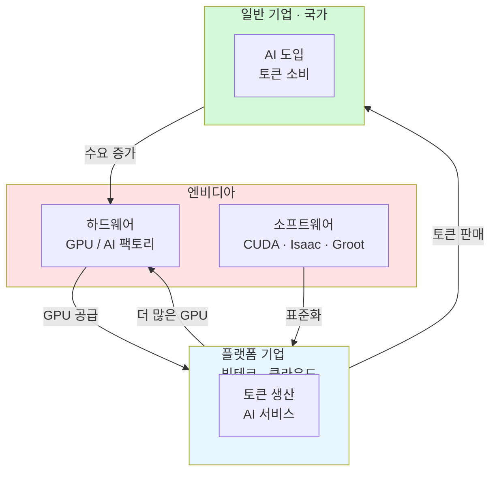

> **원본 영상:** [젠슨황은 왜 페이커를 만나고 삼겹살을 먹고 시구를 했을까? — 위폴 WePoll](https://youtu.be/UKiVx5N8xjA)
>
> **TL;DR** — 젠슨황의 한국 방문은 단순 파트너십이 아니라 산업 표준화 전략. 엔비디아는 HW를 넘어 SW 생태계로 플랫폼 기업으로 진화 중이며, 메모리 기업들은 공급 부족 속 가격 결정력을 강화하고 있다.
{: .prompt-info }

---

| 항목 | 내용 |
|---|---|
| **채널** | 위폴 WePoll (버디버디) |
| **출연** | 강재구 하나증권 리서치센터 연구원 |
| **영상** | 젠슨황은 왜 페이커를 만나고 삼겹살을 먹고 시구를 했을까? |
| **길이** | 44분 56초 |
| **핵심 키워드** | AI 팩토리, 플랫폼 진화, 메모리 수급, 토큰 경제, Broadcom, Vera Rubin |

---

## 반도체 조정은 끝이 아니다

{: .shadow }

2026년 연초 대비 필라델피아 반도체 지수(SOX)는 **+73%** 상승했다. 같은 기간 S&P 500은 +8.4%에 불과했다. 9배 초과 상승한 상태에서 조정이 나오는 건 당연하다.

10년 기준으로 보면 나스닥 4~5% 조정은 **매년 1~2회** 발생하는 일상적 패턴이다. 구조적 문제가 아니라 단순히 많이 올랐으니 내리는 것이다.

강재구 위원은 미국의 달러 시스템을 강조한다. 문제가 발생하면 돈으로 해결하는 구조. "무서운 건 사실 미국이다. 달러 시스템에서 벗어날 수 없다." S&P 500 실적 컨센서스에서 **정보기술 섹터의 이익 모멘텀이 가장 강하다** — 반도체·통신장비·하드웨어·스토리지가 끌고 있다.

---

## Broadcom 실적의 진짜 의미

{: .shadow }

Broadcom 실적 발표 후 반도체 전반이 흔들렸다. 하지만 강 위원은 명확히 선을 그었다: **"Broadcom의 문제지 업계 전체 문제가 아니다."**

핵심은 **ASIC(맞춤형 반도체)** 특성에 있다. 엔비디아·AMD 같은 범용 칩은 주문 즉시 매출 인식이 가능하다. 반면 ASIC은 고객사 인프라 구축 진도에 따라 순차적 매출 발생이다. 백로그(수주 잔고)는 2028년까지 풍부하지만, 매출 전환 속도에 시장이 실망한 것.

병목의 핵심은 **TSMC 첨단 패키징 용량 부족**. 엔비디아가 대부분의 용량을 선점하고 있어, Broadcom의 커스텀 칩 생산이 지연되는 구조다.

---

## Vera Rubin 소캠 스펙 변경 루머

{: .shadow }

세미애널리시스(SemiAnalysis) 보고서가 파장을 일으켰다. 엔비디아 차세대 GPU **Vera Rubin**의 CPU 보조 메모리 소캠(LPDDR) 용량을 192GB에서 96GB로 반토막내겠다는 루머다.

중요한 건 **GPU 핵심 메모리(HBM)는 변경 없다**는 점. HBM은 렉당 20.7TB, GPU당 288GB가 유지된다. 줄어드는 건 상대적으로 통제 가능한 CPU 보조 메모리뿐이다.

강 위원은 이를 "요리사와 주방 보조"에 비유했다. GPU는 요리사(토큰 생성 핵심), CPU는 주방 보조(오케스트레이션). 요리사의 최고급 재료대(HBM)는 그대로 두고, 보조의 재료대(LPDDR)를 줄이는 것.

더 흥미로운 건 세미애널리시스의 태도 변화다. 5월에는 소캠을 "차기 마진 레버"로 극찬하더니, 6월 들어 갑자기 부정적으로 돌아섰다. 모순이다.

강 위원의 판단: **용량이 줄어들면 오히려 더 많이 살 것이다.** 수요가 폭발적인 상황에서 "하나 살 가격에 두 개 살 수 있게 되면, 하나만 살까?" 총량은 오히려 늘어난다.

---

## 메모리 기업의 반란

{: .shadow }

엔비디아가 사양을 변경할 수밖에 없을 정도로 **메모리 공급 부족은 팩트**다. 그렇다면 역으로 메모리 기업(삼성전자, SK하이닉스, Micron)의 파워는 강해진다.

AMD의 경우 하이퍼스케일러 대상 공격적 가격 인상이 어렵다. Micron은 공급 부족·원자재 인상을 명분으로 한 가격 인상이 "현실적이지 않다"고 답변받는다. 반면 **메모리는 sold-out 상황**이라 가격 협상력에서 우위다.

강 위원: **"Q(물량)가 줄면 P(가격)를 올리면 된다."** 비트당 매출 감소를 가격 인상으로 상쇄할 수 있는 포지션.

### 인위적 공급 조절

2023년 반도체 적자 시절, Micron이 삼성·SK에 감산을 요청했지만 담합 우려로 거부됐다. 하지만 감산은 했다. 줄여놓은 상태에서 AI 수요가 터졌다.

강 위원의 핵심 질문: **"이 좋은 사이클에 스스로 망가뜨리겠는가?"** 과거처럼 무리한 증설로 공급 과잉을 만들 이유가 없다. 보수적 증설로 가격 결정력을 유지하며 호황을 연장하는 게 합리적이다.

---

## 반도체 사이클이 달라졌다

{: .shadow }

과거 반도체 사이클은 **5년 주기**였다. 2013년, 2018년 클라우드 캡리투자 피크가 그 예다. 2018년 이후 2023년에 다음 사이클이 와야 했지만, 금리 인상과 경제 불안으로 **1년 연장**됐다.

아마존은 2023년 투자를 2024년으로 이연하겠다고 공식 발표했다. 그 이연된 투자에 AI 수요가 겹치면서 사이클이 **구조적으로 연장**되고 있다.

데이터센터 설계 수명은 10~15년, 감가상각은 통상 5년. 5년 주기로 프로세서 성능이 20~40% 향상되는 시기와 맞물린다. 마이클 버리가 5년 감가상각을 비난한 적 있지만, 이는 **기술적 사이클**에 기반한 관행이다.

강 위원: **"이번 사이클은 업계 최초로 경험하는 패턴이다. 5년 이상 갈 수 있다."**

---

## 엔비디아의 플랫폼 진화

{: .shadow }

엔비디아의 FY27 Q1 실적 발표에서 **보고 양식이 조용히 바뀌었다.** 기존에는 엔드마켓별(데이터센터, 게이밍, 오토모티브 등)로 보고했는데, 이제는 **데이터센터(하이퍼스케일러/그 외) + 그 외**로 재분류했다.

이 변경의 의미: 하이퍼스케일러 외 매출이 **하이퍼스케일러와 동등한 수준**으로 성장했다. 엔비디아가 하고 싶은 말은 "우리는 하이퍼스케일러 전용이 아니다 — **플랫폼 기업으로 진화하고 있다**."

시장은 아직 이 변화를 충분히 인식하지 못하고 있다. 현재 투자 시선은 빅테크 캡리에 쏠려 있지만, 그 외 산업에서도 엔비디아 제품이 빠르게 깔리고 있다.

---

## 젠슨황이 삼겹살을 먹으러 온 진짜 이유

{: .shadow }

삼성전자·SK하이닉스만 만난 게 아니다. **LG, 두산, 현대차, 네이버**까지 만났다. 반도체 구매가 목적이었다면 제조업체를 만날 이유가 없다.

강 위원이 읽어낸 전략: **과거 CUDA가 GPU 산업 표준이 된 것처럼, AI 소프트웨어를 산업 표준화하겠다.**

한국은 제조업에서 세계적 파워를 가진 기업들이 많다. 엔비디아 입장에서 이 기업들이 **Isaac(로봇), Groot** 등 자사 소프트웨어를 채택하면 산업 표준이 된다. 표준이 되면 플랫폼 기업들도 울며 겨자 먹기로 엔비디아 스택을 적용할 수밖에 없다.

결과적으로 **하드웨어 매출 + 소프트웨어 매출**을 동시에 확보하는 구조. CoreWeave(GB300 최초 파트너), Lambda, Nebius 등 AI 클라우드 파트너에게 자금을 빌려주고 GPU를 사게 하는 "전진기지" 전략도 병행하고 있다.

---

## 미토스와 국가 단위 AI 투주

{: .shadow }

미토스(OpenAI)가 최강의 안보 시스템을 뚫었다는 발표는 단순한 기술 데모가 아니다. 경쟁국(중국, 러시아)은 대응 투자가 불가피하고, 동맹국도 미국만 의존할 수 없다.

**국가 단위 AI 인프라 투자 사이클이 시작됐다.** 한국의 AI 인프라는 사실상 전무하다. 유럽도 마찬가지. 전 세계가 AI 인프라를 구축하려면 엔비디아 장비를 사야 한다.

강 위원: **"AI가 시작도 안 했다고 people들이 얘기하는데, 정말 시작도 안 한 거다."** 지금은 투자가 들어가는 사이클이고, 그 투자 사이클이 길어지고 있다.

---

## 토큰 경제와 엔비디아의 무서운 그림

{: .shadow }

**토큰**은 AI가 문장을 처리하기 위해 쪼갠 최소 단위다. AI 서비스를 많이 쓸수록 토큰 소모가 늘고, 토큰 수요가 늘수록 AI 인프라 수요가 증가한다.

AI 매출 = **사용 토큰 수 × 토큰당 가격**. 원가는 AI 인프라 비용. 엔비디아가 TCO(총소유비용)를 낮춰주면 플랫폼 기업의 마진이 개선되고, 더 많은 GPU를 사게 된다.

엔비디아는 토큰을 직접 생성하지 않는다. **토큰 생산 도구(GPU + 플랫폼)만 제공**한다. 하지만 이 도구가 산업 표준이 되면, 모든 기업이 엔비디아 생태계에 종속된다.

강 위원의 비유가 정확하다: **"그림판과 물감은 내 걸 써. 그러면 어쩔 수 없이 내 걸 쓰게 돼."** 소프트웨어 기업들도 고민해야 할 구조다 — 자체 생태계를 만들어도 엔비디아 토큰 생태계에 종속될 수밖에 없다면, 번 돈의 일부를 뺏기는 구조가 된다.

---

## 투자 시사점

{: .shadow }

1. **반도체 조정은 속도 조정이지 방향 전환이 아님** — 수주 잔고 풍부, 공급 병목이 성장 제한일 뿐
2. **메모리 기업 가격 결정력 강화** — 공급 부족 + 보수적 증설 = 이익 사이클 연장. 삼성전자·SK하이닉스·Micron이 과거와 달리 무리한 증설을 하지 않는다
3. **엔비디아는 플랫폼 기업으로 진화** — HW+SW 수익 구조, 하이퍼스케일러 외 매출 성장. 시장이 아직 충분히 인식하지 못함
4. **국가 단위 AI 인프라 투자 사이클 시작** — 미토스 이후 안보 패러다임 변화가 글로벌 수요 자극
5. **토큰 경제가 산업 구조를 재편** — 엔비디아 생태계 종속 가속화는 경쟁사·소프트웨어 기업에 구조적 위협

> 지금이 사이클의 시작이라면, 조정은 기회다. 큰 그림을 보자.
