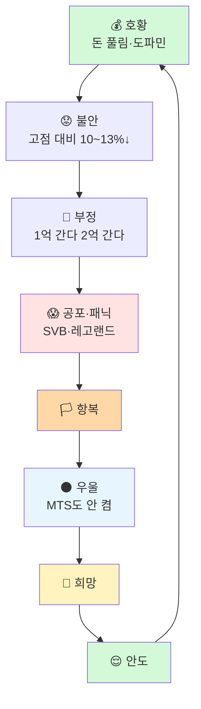
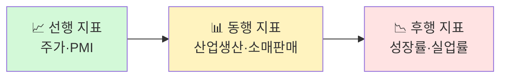
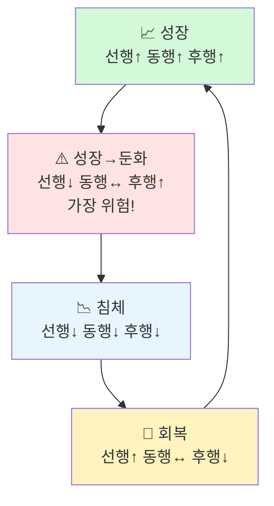
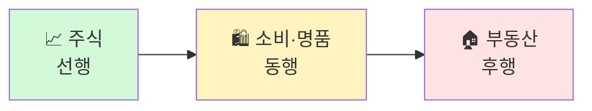

> **원본 영상:** [백찬규 센터장의 경기 국면 판단법 — 위폴 WePoll](https://youtu.be/FkXloDopkEA)
>
> **TL;DR** — 경기 국면은 선행·동행·후행 3개 지표만으로 판단할 수 있다. 가장 위험한 건 "성장→둔화" 전환 구간이며, 투자자 심리 사이클(Human Index)을 읽으면 매수·매도 타이밍을 잡을 수 있다.
{: .prompt-info }

---

| 항목 | 내용 |
|---|---|
| **채널** | 위폴 WePoll (버디버디) |
| **출연** | 박종훈(진행), 백찬규(NH투자증권 자산관리컨설팅센터 센터장) |
| **영상** | 백찬규 센터장의 경기 국면 판단법 |
| **길이** | 29분 27초 |
| **업로드** | 2026-06-11 |
| **핵심 키워드** | 경기 국면, 선행 지표, 투자자 심리, Human Index, 자산 순환, 서점 인덱스 |

---

## 싱가포르·홍콩 글로벌 자본 흐름

{: .shadow }

백찬규 센터장은 최근 싱가포르 패밀리 오피스와 홍콩 시장을 직접 다녀온 뒤 글로벌 자본의 흐름을 전한다.

**싱가포르 패밀리 오피스**는 주식 시장이 상승했음에도 불구하고, 부자들 전체 자산 대비 **주식 비중은 크게 늘지 않았다**. 현금성 자산을 여전히 선호하는 보수적 포지셔닝. 다만 포트폴리오 내 **한국 비중은 증가**한 것으로 관찰됐다.

**홍콩 강구통(Stock Connect)**을 통해 중국 본토 자금이 유입되면서 ETF와 주식 시장이 확대되고 있다. 글로벌 자본이 아시아 시장에 대한 관심을 점진적으로 높이는 흐름.

---

## 투자자 심리 사이클 — Human Index

{: .shadow }

백찬규 센터장이 가장 강조하는 것은 지표가 아니라 **사람의 심리**다. 그는 이를 'Human Index'라고 부른다.

### 우울 국면 = 최적 매수 타이밍

> "MTS, HTS도 안 켜요. 비밀번호도 잊어버려요. 곡소리도 안 나요."

이게 바로 **최적의 매수 타이밍**이다. 2022년 가을~겨울이 최근 우울 국면의 사례. 아무도 시장을 언급하지 않고, 주식 이야기만 꺼내도 자리를 피하는 분위기.

### 호황 국면의 특징 (2021년)

돈이 풀리고 나면 **주식·코인·명품·부동산**이 동시에 급등한다. 레버리지가 걸리고, 도파민이 분비되고, "돈 복사"가 유행한다. 바로 이 순간이 위험의 시작이다.

### 불안 → 부정 → 공포

- **불안:** 고점 대비 **10~13% 하락** 시 손절하지 못하고 방치
- **부정:** "스테고사우루스 차트", "피카츄 차트"를 그리며 **1억 간다, 2억 간다**며 스스로를 위로
- **공포·패닉:** 2022년 SVB 파산, 레고랜드 사태 등 **블랙스완**이 터지며 공포 확산

---

## 경기 국면 판단법 — 3대 지표

{: .shadow }

백찬규 센터장은 경기 국면을 **반드시 미국 기준**으로 판단해야 한다고 강조한다. 한국 GDP는 세계의 1.1%, 미국은 25%. 반도체 수요는 선진국만 구매하기 때문에 미국 경기 사이클이 곧 글로벌 사이클이다.

### 선행·동행·후행 지표

| 구분 | 지표 | 특징 |
|---|---|---|
| **선행** | 주가, PMI | 2개만 봐도 충분 |
| **동행** | 산업 생산, 소매 판매 | 현재 경기 상태 반영 |
| **후행** | 성장률, 실업률 | 가장 늦게 확인 가능 |

한 사이클은 **4~5년** 주기이며, 각 국면은 짧게 10개월에서 길게 2년까지 지속된다.

---

## 국면별 판단과 대응

### 성장 국면

선행↑ 동행↑ 후행↑ — 수익 실현 구간. 최소 **1~2년 지속**된다. 끝머리에 투자자가 몰리는 특징이 있다.

### 성장→둔화 (가장 위험)

{: .shadow }

> "판이 바뀌었어요."

**선행 지표는 꺾이는데 후행 지표는 양호**한 상태. 신문·기사는 "밸류에이션 메리트"를 운운하며 매수를 권한다. 하지만 선행이 꺾였다는 건 이미 **판이 바뀌었다**는 뜻. 2022년 1분기가 대표적 사례다.

### 침체 국면

선행↓ 동행↓ 후행↓ — **위험자산 매수를 완료**해야 할 상태. 모든 지표가 하락하는 가운데 심리는 극도의 우울.

### 회복 국면 — 적극 매수 타이밍

{: .shadow }

선행 반등, 동행 바닥, 후행 하락(실업률 상승). **이때가 적극 매수 타이밍**이다. 2023년이 대표적 사례. 실업률이 올라가니 뉴스는 부정적이지만, 선행 지표가 먼저 반등하기 시작한 상태.

---

## 자산 순환 사이클

{: .shadow }

자산 클래스별로 선행·동행·후행 관계가 존재한다.

실제 타임라인:
- **2021년:** 주식 고점
- **2022년 초:** 소비·명품 고점
- **2022년 후반:** 부동산 고점

부동산은 금리와 목돈이 필요하기 때문에 **가장 후행**하는 자산이다. 주식이 먼저 움직이고, 소비가 따르며, 부동산이 마지막에 반응한다.

---

## 투자 위험 신호 — 서점 인덱스

{: .shadow }

백찬규 센터장은 **서점 베스트셀러**로 시장 국면을 읽는 독특한 방법을 소개한다.

| 국면 | 베스트셀러 유형 |
|---|---|---|
| **침체** | 현명한 투자자, 가치투자 서적 |
| **성장 끝물** | 차트 분석, 파동, 엘리어트, 일목균형표 |

**기영이 오른손, 피카츄 차트**가 유행하면 그게 바로 **성장 끝물의 신호**다. 차트 분석서가 베스트셀러가 되는 시점은 이미 위험.

> "절대 가격만 보고 사면 안 됩니다."

35만원→25만원으로 내려왔다고 싸게 샀다가 **17,000원까지 가는 경우**가 있다. 가격이 아니라 국면을 봐야 한다.

---

## 단기 시황 및 전망

{: .shadow }

백찬규 센터장은 3주 전 제시한 전략을 유지한다:

- **6월 초 매도** → **7월 7일 실적 모멘텀** 재매수
- **금리 상승**(분모 확대) + 실적 시즌 마감 → **터뷸런스** 예상
- **FMC 통과** 후 안정화 기대
- **2분기 잠정실적:** 메모리 반도체 실적 개선 + AI 수혜

단기적으로는 6월 한 달간 조정·횡보 가능성을 열어두되, 7월 실적 시즌을 기다리는 전략이다.

---

## 핵심 요약

1. **경기 국면은 미국 기준 3개 지표**로 판단: 선행(주가·PMI), 동행(산업생산·소매판매), 후행(성장률·실업률)
2. **가장 위험한 구간은 성장→둔화 전환점** — 선행이 꺾이는데 기사는 "밸류에이션 메리트" 운운
3. **투자자 심리 사이클(Human Index)**: 우울 국면이 매수 타이밍, 호황 국면이 경계 타이밍
4. **자산은 순차적으로 순환**: 주식→소비→부동산
5. **서점 인덱스**: 차트 분석서 유행 = 성장 끝물 신호
