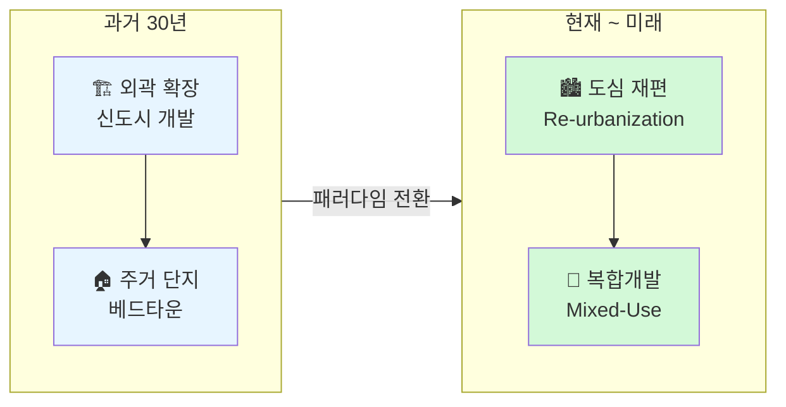
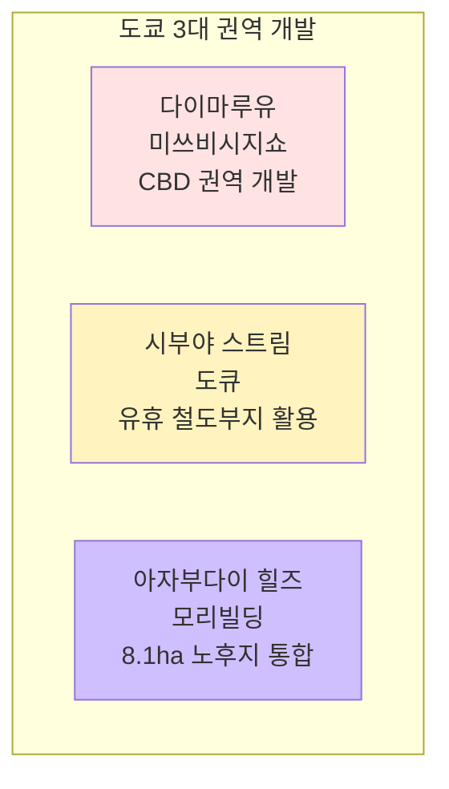
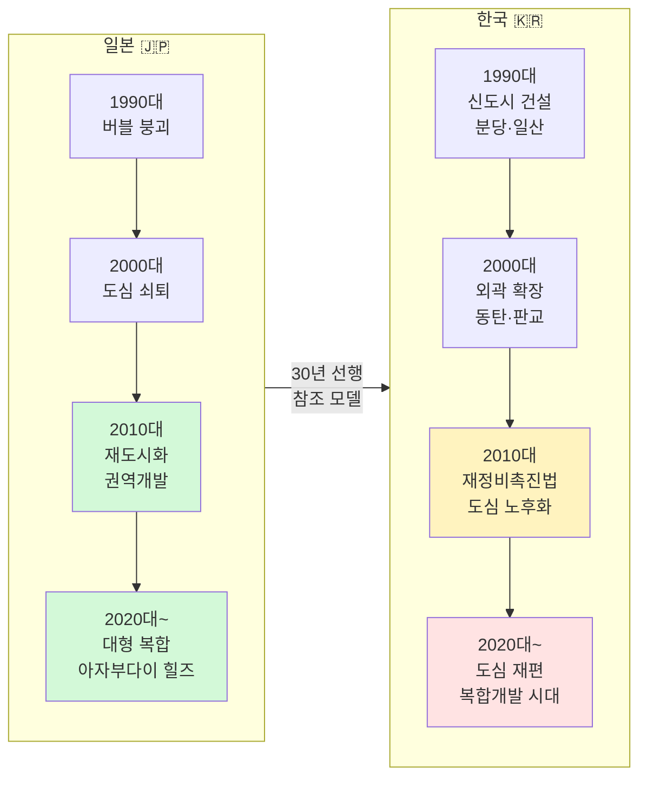
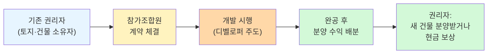
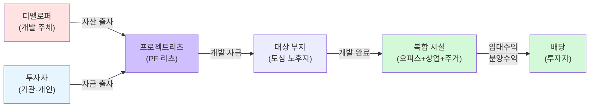
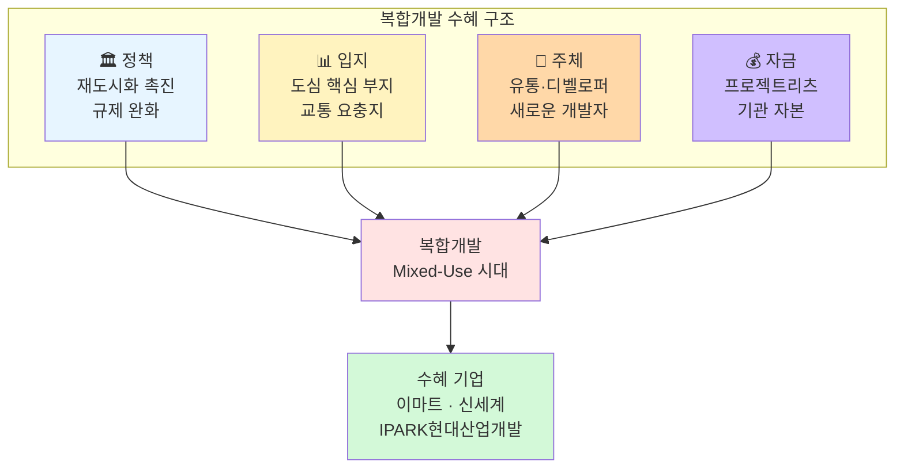

> **원본 리서치:** 도쿄에서 본 서울의 미래 — IBK투자증권 (2026.05.26)
>
> **TL;DR** — 한국 도시 개발이 외곽 확장에서 도심 재편으로 전환하고 있다. 복합개발(Mixed-Use) 시대가 도래했으며, 유통기업(신세계, 이마트)과 디벨로퍼(IPARK현대산업개발)이 새로운 개발 주체로 부상한다. 일본의 권역 개발 사례(다이마루유, 시부야 스트림, 아자부다이 힐즈)가 한국의 로드맵이 된다.
{: .prompt-info }

---

| 항목 | 내용 |
|---|---|
| **작성** | IBK투자증권 남성현·조정현 |
| **일자** | 2026.05.26 |
| **분량** | 110p |
| **핵심** | 외곽 확장 → 도심 재편, 복합개발(Mixed-Use) 시대 |
| **투자의견** | 이마트 매수(TP 12만), 신세계 매수(TP 78만), IPARK현대산업개발 매수(TP 3.5만) |

---

## 도시 개발 패러다임 전환

{: .shadow }

한국의 도시 개발은 지금 **근본적인 전환점**에 서 있다. 과거 30년간 이어진 외곽 확장(신도시 개발) 모델이 한계에 도달했고, 이제는 **도심 재편(Re-urbanization)** 이 새로운 패러다임이다.

### 외곽 확장의 한계

- **서울 인구 정체:** 970만 명 수준에서 더 이상 성장 불가
- **기성시가지 노후화:** 30년 이상 된 건축물 비율 급증
- **도심 내 저이용 자산 증가:** 구도심 공장, 유휴 철도부지, 노후 상가
- **교통 인프라 포화:** 외곽으로 갈수록 통근 시간 증가, 삶의 질 저하

### 재도시화(Re-urbanization) 트렌드

젊은 층과 1인 가구가 다시 도심으로 몰리고 있다. 직주근접(직장과 주거지의 근접) 선호, 문화·소비 인프라 밀집, 교통 접근성이 핵심 요인이다. 이 흐름은 일본이 이미 2000년대부터 겪은 것과 동일한 궤적이다.

---

## 도쿄 3대 권역 개발 사례

{: .shadow }

IBK투자증권이 주목하는 건 일본 도쿄의 **권역 개발(Area Development)** 사례다. 단일 건물이 아니라, 여러 블록을 하나의 도시처럼 설계하는 방식이다.

### 1. 다이마루유 — 미쓰비시지쇼의 CBD 권역 개발

{: .shadow }

도쿄 마루노우치·유라쿠초·다이마루 지역을 잇는 **대규모 CBD 재편 사업**. 미쓰비시지쇼가 주도한 이 프로젝트의 핵심은:

- **용적이전( Floor Area Transfer):** 보존할 건물의 용적률을 새 건물로 이전하여 고밀도 개발 실현
- **지하 네트워크:** 건물 간 지하 통로 연결로 보행 동선 확보
- **업무+상업+문화 복합:** 단순 오피스가 아닌 도시 경험 제공
- **30년+ 장기 계획:** 분할 시공으로 위험 분산

### 2. 시부야 스트림 — 도큐의 유휴 철도부지 활용

{: .shadow }

도큐전철이 시부야역 인근 **유휴 철도부지(차량기지)**를 복합개발로 전환한 사례.

- **철도 사업자의 부동산 개발:** 역세권 개발로 유동 인구 창출 → 철도 수요 증가
- **호텔+오피스+상업+이벤트 홀:** 복합 프로그램으로 24시간 도시 공간
- **계단형 지붕 광장:** 시부야의 지형을 활용한 독창적 공간 설계
- **도큐 전체 네트워크와 연계:** 철도·백화점·부동산 시너지

### 3. 아자부다이 힐즈 — 모리빌딩의 노후지 통합

{: .shadow }

모리빌딩이 도쿄 미나토구 **8.1ha 노후 주거지**를 통합 재개발한 초대형 프로젝트.

- **8.1ha 통합 개발:** 수백 명의 권리자 협의, 30년 이상의 기획 기간
- **참가조합원 제도:** 권리자가 사업에 참여, 완성 후 분양받는 구조
- **주거+상업+오피스+문화+의료:** 도시 축소판
- **관광 명소화:** 연간 3,000만 명 방문 목표, 도쿄 새 랜드마크

---

## 한국 vs 일본: 도시 개발 흐름 비교

일본은 한국보다 **약 20~30년 앞서** 도시 개발의 전환을 겪었다. 버블 붕괴 후 도심 쇠퇴 → 재도시화 → 권역 개발의 경로를 밟았다. 한국은 이제 같은 궤적에 진입하고 있다.

---

## 한국형 권역 개발의 조건

{: .shadow }

일본의 사례를 그대로 복제할 수는 없다. 한국의 제도적 특성을 고려한 **현지화 모델**이 필요하다.

### 참가조합원 제도

참가조합원 제도는 **권리자의 이익을 보호하면서 원활한 사업 추진**을 가능하게 하는 핵심 장치다. 일본에서 성공적으로 검증된 방식이며, 한국에서도 도입이 확대되는 추세다.

### 프로젝트리츠(Project REITs)

프로젝트리츠는 개발 단계부터 자금을 조달하여, **완공 후 운용까지** 리츠가 주도하는 구조다. 기존 PF(프로젝트파이낸싱)의 고금리 부담을 줄이고, 소액 투자자의 도심 부동산 투자 기회를 제공한다.

### 5·8 부동산 특별대책의 역사

| 시기 | 정책 | 의미 |
|---|---|---|
| 1970년대 | 비업무용 토지 세제 규제 | 대기업의 부동산 보유 억제 시작 |
| 1980년대 말 | 토지공개념 도입 논의 | 개발이익 사회 환원 논의 본격화 |
| 1990년 | **5·8 부동산 특별대책** | 49개 재벌 5,741만 평 비업무용 부동산 매각 명령 |
| 현재 | 재도시화·복합개발 촉진 | 규제 완화, 용적률 상향, 기부채납제도 개선 |

과거 5·8 특별대책은 대기업의 **도심 토지 장기 보유를 원천 차단**했다. 일본의 미쓰비시지쇼·모리빌딩 같은 장기 보유형 디벨로퍼가 한국에서 성장하지 못한 핵심 원인이다. 현재는 **도심 재편 촉진**으로 방향이 바뀌어, 참가조합원제와 프로젝트리츠를 통해 우회적 권역 개발이 가능해지고 있다.

---

## 핵심 기업 분석

IBK투자증권은 세 가지 기업을 **매수(Buy)** 의견으로 제시한다. 공통점은 모두 **복합개발 시대의 수혜주**라는 것.

### 이마트 — Rising Developer

{: .shadow }

| 항목 | 내용 |
|---|---|
| **투자의견** | 매수(Buy) |
| **목표가** | 120,000원 |
| **핵심 변화** | 신세계프라퍼티를 통한 디벨로퍼 전환 |

이마트의 변화는 단순한 유통기업의 다각화가 아니다. 신세계프라퍼티를 플랫폼으로 **부동산 개발 사업자(Rising Developer)** 로 진화하고 있다. 기존 점포 부지를 복합개발 대상으로 전환, 유통+부동산 시너지를 창출한다.

### 신세계 — 고속터미널·광주 복합개발

{: .shadow }

| 항목 | 내용 |
|---|---|
| **투자의견** | 매수(Buy) |
| **목표가** | 780,000원 |
| **핵심 프로젝트** | 서울고속터미널 복합개발, 광주신세계 |

신세계의 가장 큰 카드는 **서울고속터미널 복합개발**이다. 서초구 반포동, 3호선·7호선·9호선 환승역이라는 최상의 입지. 유통+호텔+오피스+문화 복합시설로 재탄생할 계획이다. 또한 광주신세계도 지역 백화점을 넘어 복합 쇼핑몰로 확장 중이다.

### IPARK현대산업개발 — 서울원 아이파크

{: .shadow }

| 항목 | 내용 |
|---|---|
| **투자의견** | 매수(Buy) |
| **목표가** | 35,000원 |
| **핵심 프로젝트** | 서울원 아이파크 (용산) |

IPARK현대산업개발은 **용산 서울원 아이파크**로 디벨로퍼 전환을 시도하고 있다. 용산국제업무지구 내 대규모 복합단지로, 주거+오피스+상업+호텔이 들어선다. 기존 아파트 건설사에서 **도심 복합개발 디벨로퍼**로의 전환이 핵심 테마다.

---

## 투자 시사점

{: .shadow }

### 핵심 포인트

1. **패러다임 전환:** 외곽 확장 → 도심 재편. 이 변화는 되돌릴 수 없는 구조적 트렌드다.
2. **새로운 개발 주체:** 기존 대형 건설사가 아니라, **유통기업**과 **전문 디벨로퍼**가 주도한다.
3. **일본 참조 모델:** 다이마루유, 시부야 스트림, 아자부다이 힐즈가 20~30년 앞선 사례.
4. **프로젝트리츠:** 자금 조달의 새로운 패러다임. 소액 투자자의 도심 부동산 접근성 개선.
5. **장기 테마:** 단기 모멘텀이 아닌 **10년+ 구조적 변화**. 분할 매수 관점 접근.

### 리스크 요인

- 정책 변화에 따른 규제 환경 불확실성
- 금리 변동에 따른 부동산 개발 수익성 악화
- 권리자 협의 지연에 따른 사업 지연
- 경기 침체 시 분양 물량 소화 부진

---

## 결론

IBK투자증권의 이번 리서치는 **한국 도시 개발의 패러다임 전환**을 일본이라는 거울을 통해 선명하게 보여준다. "도쿄에서 본 서울의 미래"라는 제목 그대로, 일본이 겪은 재도시화 과정이 한국에서도 동일하게 진행되고 있다.

핵심은 **누가 도심의 저이용 자산을 복합개발로 전환하느냐**이다. 이마트, 신세계, IPARK현대산업개발은 각각 유통 인프라, 백화점 입지, 주택 건설 역량을 무기로 이 경쟁에 뛰어들고 있다. 투자자에게 이것은 단순히 부동산주가 아니라 **새로운 도시를 만드는 기업**에 투자하는 기회다.

> **참고:** 본 포스팅은 투자 정보 제공 목적이며, 특정 종목의 매수·매도를 권유하지 않습니다. 투자는 본인의 판단과 책임으로 이뤄져야 합니다.
