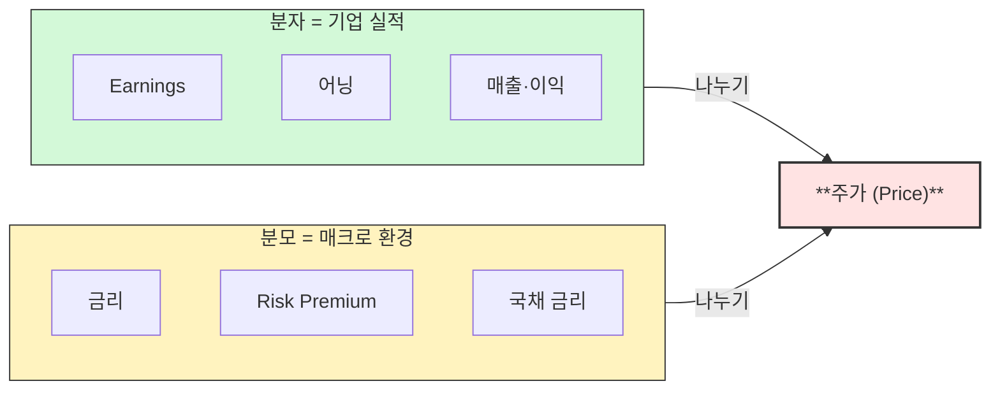
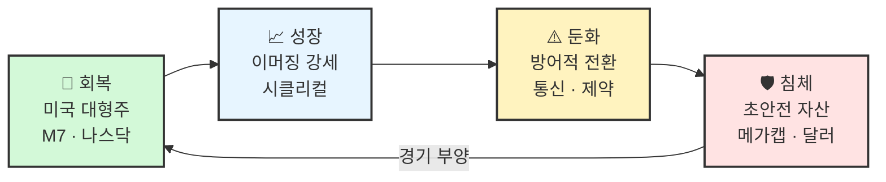
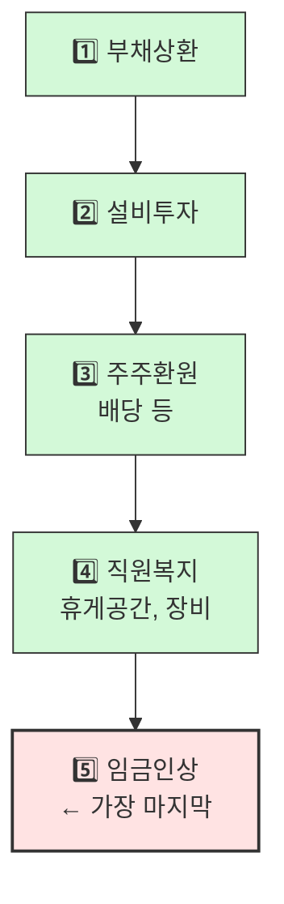

> **원본 영상:** [경기를 보고 투자하라, 3부작 총정리 — 위폴 WePoll](https://youtu.be/ed7YyrftrkM)
>
> **TL;DR** — 경기는 회복 → 성장 → 둔화 → 침체의 4국면을 순환한다. 각 국면마다 사야 할 자산이 다르다: 회복엔 미국 대형주, 성장엔 이머징 시클리컬, 둔화엔 방어주, 침체엔 메가캡. 선행·동행·후행 지표를 직접 확인하면 국면 전환을 미리 감지할 수 있다.
{: .prompt-info}

---

## 1. 개요

| 항목 | 내용 |
|------|------|
| **출연자** | 백찬규 센터장, NH투자증권 자산관리컨설팅센터 |
| **채널** | 위폴 WePoll |
| **일자** | 2026.06.20 |
| **길이** | 31분 26초 |
| **핵심 주제** | 경기 순환 4국면별 투자 전략 + 지표 확인 실전 가이드 |

경기 순환(Business Cycle)은 자본주의 경제의 필연적 리듬이다. 주가는 경기보다 항상 먼저 움직이기 때문에, 경기 국면을 읽으면 다음에 어떤 자산이 오를지 미리 알 수 있다. 이 영상은 백찬규 센터장이 3부작에 걸쳐 다룬 경기 순환 투자법의 **총정리**다.

---

## 2. 분자-분모: 주가를 결정하는 두 가지 힘

주가는 **분자(기업 실적)** 와 **분모(매크로 환경)** 의 비율로 결정된다.

**분모가 안정적일 때**는 기업 실적이 주가를 결정한다. 하지만 **분모가 요동칠 때** — 금리가 오르거나 risk premium이 확대될 때 — 투자가 급격히 까다로워진다.

> "분모의 역할이 커지고 있어 투자가 까다로워졌습니다. 6월과 7월에는 주식 투자를 한 번 실현하고, 다시 모아가는 것이 핵심입니다."
> — 백찬규 센터장

분모 값이 커질 때는 **방망이를 짧게 잡고 승률을 높이는 것**이 낫다. 즉, 리스크를 줄이고 확실한 종목에 집중하라는 뜻이다.

{: .shadow }

---

## 3. 경기 순환 4국매: 무엇을 사야 하는가

경기 순환은 **미국 경기 기준**으로 판단한다. 한 사이클에 약 4~5년 반, 점차 단축되는 추세다.

### 회복 국면: 미국이 전부다

금리 하락 시그널이 나오면 분모가 줄어들고 주가가 오른다. 이때는 **미국 대형주**가 압도적으로 강하다.

- **사야 할 것**: 미국 대형주, M7, 나스닥
- **특징**: 성장주 강세, 대형주 > 중소형주, 달러는 여전히 비쌈
- **과거 사례**: 2023~2025년 (엔비디아·M7 주도, 서학개미 황금기)

### 성장 국면: 이머징의 시대

미국 경기가 본격적으로 좋아지면 다른 나라에 주문이 쏟아진다. 한국의 반도체, 2차전지, 전력기기가 수혜를 입는다.

{: .shadow }

- **사야 할 것**: 시클리컬 섹터 (에너지, 소재, 산업재)
- **주도 섹터**: 금융, 방산, 전력기기, 자유소비재(자동차, 테슬라), 헬스케어, IT 하드웨어, 미디어 엔터
- **지속 기간**: 보통 1년~1년 반 (현재 약 10개월 경과)
- **예외**: 전쟁으로 달러 약세가 일시적으로 튀었으나, 원래는 약세여야 함

> **시클리컬(Cyclical)이란?** 경기 사이클이 한 바퀴 돌 때 좋아지는 업종. 에너지, 소재, 산업재 등이 여기에 속한다.

### 둔화 국면: 지갑을 닫는 시기

사람들이 돈을 안 쓰기 시작하면, 소비와 투자가 위축된다. 이때는 끊을 수 없는 소비를 하는 업종이 강하다.

- **사야 할 것**: 통신, 헬스케어/제약, 필수소비재, 유틸리티
- **논리**:
  - **통신**: 무제한 데이터는 필수. 정주행, 버디버디 시청은 경기와 무관
  - **제약**: 아프면 약은 끊을 수 없다
  - **필수소비재**: 샴푸, 비누, 치약, 식료품은 경기와 무관
- 성장주 약화, 배당/가치/방어주 강세
- 달러 강화 → 미국 자산 선호

{: .shadow }

### 침체 국면: 가장 안전한 곳으로

마지막 1격이 오면, 부채비율이 높은 기업은 휘청거린다. 돈이 가장 안전한 곳으로 몰린다.

- **사야 할 것**: 선진국 메가캡, 달러 초강세
- **선호 기업 조건**: 부채비율 낮음, 현금흐름 양호, 매출액 꾸준, 자금 조달 능력 보유
- 과거 사례: 2022년 주가 바닥 때도 미국 M7은 부채비율이 낮았고 매출이 꾸준했다

---

## 4. 경기 지표 3분류: 국면을 직접 판단하는 법

경기 국면을 판단하려면 세 가지 지표를 순서대로 봐야 한다.

| 분류 | 핵심 지표 | 특징 | 확인 포인트 |
|------|-----------|------|-------------|
| **선행** | 주가, PMI, 소비자심리지수, 장단기 금리차 | 경기보다 먼저 움직임 | 꺾이면 경계 신호 |
| **동행** | 산업생산, 소매판매, 교역량, 설비가동률 | 경기와 동행 | 고점 후 하락하면 전환 확인 |
| **후행** | GDP 성장률, 실업률, 임금상승률 | 경기보다 늦게 반응 | 좋다고 안심하면 속음 |

{: .shadow }

### 임금: 가장 늦게 오르는 지표

백찬규 센터장의 독창적 분석에 따르면, 실업률보다도 더 늦게 반응하는 지표는 **임금상승률**이다.

기업이 돈을 벌었을 때 우선순위:

> "성장 국면인데도 월급이 안 오릅니다, 여러분. 임금은 가장 후행 지표이기 때문입니다." — 백찬규 센터장

---

## 5. 2021년 시장 꺾임: 후행지표의 함정

백찬규 센터장이 2021년에 시장 꺾임을 선제적으로 판단한 과정을 통해, 지표 체계의 실전 활용법을 이해할 수 있다.

{: .shadow }

| 시기 | 선행지표 | 동행지표 | 후행지표 | 시장 심리 |
|------|----------|----------|----------|-----------|
| **2021년** | 주식시장·PMI 고점 후 하락 ⬇️ | 아직 양호 | 매우 양호 | "아직 괜찮아" |
| **2022년 초** | 이미 하락 중 | 산업생산·소매판매 고점 후 하락 ⬇️ | 양호 (GDP 높음, 실업률 바닥) | "밸류에이션 기회인가?" |
| **2022년 중** | 하락 지속 | 하락 가속 | 마침내 악화 | 공포 |

> [!warning] 핵심 교훈
> 후행지표(GDP, 실업률)가 좋다고 해서 시장이 안전한 것은 **절대** 아니다.
>
> 2021년 말에 투자자들이 속은 이유는 후행지표가 너무 좋았기 때문이다. 선행지표는 이미 하락하고 있었지만, "실업률 괜찮잖아, 성장률 양호잖아"라며 말려들었다.
>
> **성장에서 둔화로 갈 때 하락이 가장 심하다.** 이때 말려야 한다.

---

## 6. Trading Economics 실전: 월 1회 10분 체크

백찬규 센터장이 추천하는 무료 경제 지표 확인 사이트.

{: .shadow }

### 사용법

1. [tradingeconomics.com](https://tradingeconomics.com) 접속
2. 주소창 앞에 `ko.` 입력 → 한글 변환 (예: `ko.tradingeconomics.com`)
3. **Countries(나라)** → 미국 선택
4. 아래 순서대로 확인:

| 순서 | 지표 | 분류 | 확인 포인트 |
|------|------|------|-------------|
| 1 | 주식시장 | 선행 | 5년/10년 차트, 추세선 유지 여부 |
| 2 | 제조업 PMI | 선행 | 50 이상 = 확장, 고점 꺾임 확인 |
| 3 | 산업생산 | 동행 | 상승 추세 유지 여부 |
| 4 | 소매판매 | 동행 | 연간 상승 추세 |
| 5 | GDP 연간 | 후행 | 바닥 찍고 회복 중인지 |
| 6 | 실업률 | 후행 | 아직 높은지 (성장국면 끝이 아니라는 신호) |

{: .shadow }

> **확인 시기**: 매월 말 (월급날 21~25일 경). 지표 발표 후 3~4주가 지나면 데이터가 업데이트된다.

---

## 7. 침체는 어떻게 피해지는가

2000년대 이후 경제 시스템은 침체 회피법을 터득했다. 핵심은 **무제한 유동성 공급**이다.

| 시기 | 사건 | 대응 | 결과 |
|------|------|------|------|
| 2008년 | 금융위기 | 양적완화 못 함 | 큰 상처 |
| 2010년대 | Bernanke | 양적완화 테스트 | 효과 확인 |
| 2020년 | 코로나 | 본격 양적완화 | 침체 즉시 극복 |
| 2022~23년 | 금리 인상 | 근접 회피 | 침체 면함 |

**메커니즘**: 금리가 오르고 경기가 나빠져서 돈이 안 돌면, 중앙은행이 직접 돈을 풀어버린다. 돈이 도는 길이 좁아지면, 그 위로 넘치도록 유동성을 주입하는 것.

**후유증**: **자산 양극화** (일명 "돈 잔치"). 돈이 있는 사람은 더 벌고, 없는 사람은 조금 버는 격차가 확대된다.

**한계**: 이 패턴은 신용창출(빚)에 기반하기 때문에, 장기적으로 지속 가능할지는 미지수다.

---

## 8. 현재 시장 진단 (2026년 6월)

| 지표 | 현황 | 판단 |
|------|------|------|
| 선행지표 (주가, PMI) | 상승 추세 유지 | 둔화 아님 |
| 동행지표 (산업생산, 소매판매) | 상승 중 | 성장 |
| 후행지표 (GDP) | 바닥 찍고 회복 중 | 성장 초기~중기 |
| 실업률 | 여전히 높음 | 성장국면 끝이 아님 |

**진단**: 현재 **성장 국면**. 전쟁과 물가만 없었으면 더 긴 성장 사이클이 될 수 있었다.

**주요 변수**:
- 금리 인상 가능성 → 분모(매크로 환경) 요동
- 전쟁 → 일시적 달러 강세, 안전자산 선호
- 물가: 유가(일일 확인), 소비자물가(월간) 모니터링 필수

---

## 9. 실행 가이드: 메뉴판 투자법

{: .shadow }

### Step 1: 메뉴판(엑셀) 작성

각 국면별로 매수할 ETF/종목을 미리 정리한다:

| 국면 | 지역/지수 | 섹터 | 예시 |
|------|-----------|------|------|
| 회복 | 미국, 나스닥 | 대형 성장주 | M7, 엔비디아 |
| 성장 | 한국, 중국 | 시클리컬 | 반도체, 금융, 산업재 |
| 둔화 | 미국 | 방어주 | 통신, 제약, 필수소비재 |
| 침체 | 선진국 | 메가캡 | 달러, 부채 없는 대형주 |

### Step 2: 월 1회 지표 체크

매월 말 Trading Economics에서 선행·동행·후행 지표 확인.

### Step 3: 국면 전환 신호

- **선행지표 하락 + 동행지표 하락** → 둔화 진입 → **방어적 전환**
- 통신·제약·필수소비재가 뜨기 시작하면 → 이미 둔화국면일 가능성

### Step 4: 1년에 1~2회 포트폴리오 조정

빈번한 매매가 아니라, 국면이 바뀔 때만 메뉴판을 교체하면 된다. 이것만으로도 수익률이 크게 개선된다.

---

## 10. 추천 도서

> **"세계 경제 지표: 지표의 비밀"**
> - 분야별 핵심 지표, 발표 시기, 확인 방법 정리
> - 가격: 34,000원
> - 절판 이력 있음 → 알라딘 중고 구매 가능
> - "진지하게 투자하시는 분들은 책장에 꽂아두세요. 일단 있어 보입니다." 😄

{: .shadow }

뉴스에서 물가 지표만 나와도 PCE, CPI, 핵심 CPI, Trimmed Mean 등 용어가 쏟아져 헷갈리기 쉽다. 이 책은 어떤 지표가 중요한지, 언제 발표되는지, 어디서 볼 수 있는지를 한눈에 정리해준다.

---

## 마무리

경기 순환 투자의 핵심은 **3가지 지표(선행·동행·후행)를 순서대로 보고, 국면 전환을 미리 감지하는 것**이다.

지금은 성장 국면. 하지만 분모(금리·물가)가 요동치고 있으니, 방망이를 짧게 잡고 승률을 높여야 할 때다.

> "분모 값이 커질 때는 방망이를 짧게 잡고 수익률을 높이는 것이 좋지 않을까, 그런 생각을 하고 있습니다." — 백찬규 센터장
