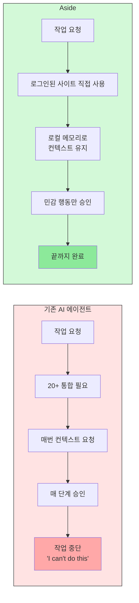
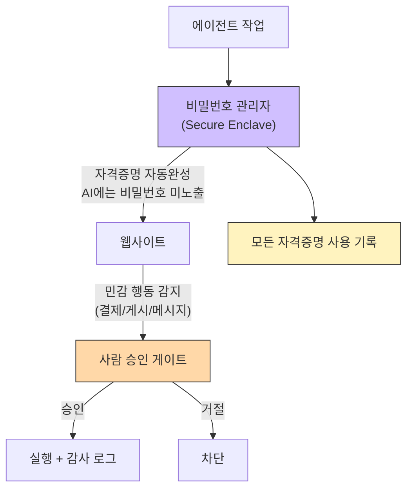
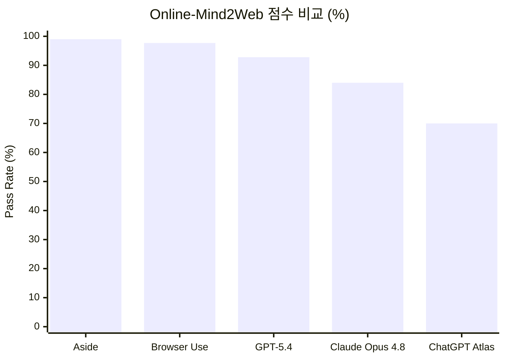
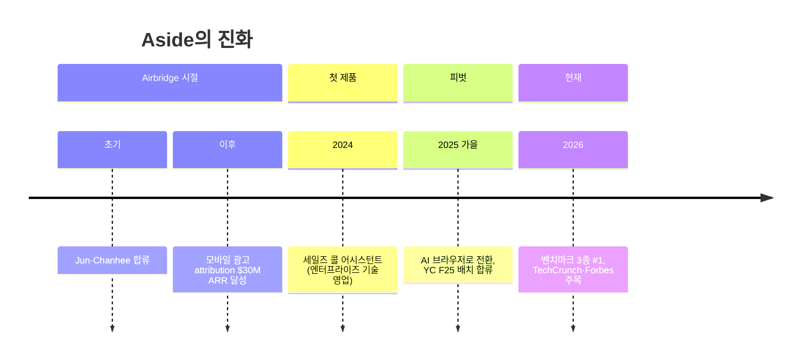

> **TL;DR**
> **Aside**는 "AI를 위한 운영체제는 브라우저다"라는 전제로 만들어진 AI 브라우저다. 기존 에이전트처럼 서비스마다 통합을 붙이는 대신, **로그인된 웹사이트를 사람처럼 직접 조작**해 복잡한 작업을 끝까지 수행한다. 에이전트용 비밀번호 관리자, 로컬 메모리, 민감 행동 승인 게이트를 갖췄고, 브라우저 에이전트 벤치마크 3종에서 #1을 기록했다.
{: .prompt-info}

> **짚고 가기: AI 에이전트와 AI 브라우저**
> **AI 에이전트**는 단순히 답변을 주는 것을 넘어, 스스로 여러 단계를 수행하는 AI다. "항공권 예약해 줘"라고 하면 검색·선택·결제까지 알아서 진행하는 식이다. **AI 브라우저**는 이 에이전트가 일하는 무대가 일반 브라우저(Chrome, Safari) 자체인 경우다. ChatGPT에 확장 프로그램을 얹은 것과 다른 점은, AI가 마우스 클릭·입력·로그인을 **브라우저 안에서 직접** 수행한다는 것이다.
{: .prompt-tip}

---

## 1. 개요

| 항목 | 내용 |
|------|------|
| **제품** | Aside (AI 브라우저) |
| **회사** | Aside Computer Inc., San Francisco |
| **설립** | 2024년 |
| **YC 배치** | Fall 2025 (F25) |
| **창업자** | Jun Kim(CEO), Chanhee Lee, Sanghun Lee (한국인 3인, Airbridge 출신) |
| **웹사이트** | [aside.com](https://aside.com/) |
| **GitHub** | [github.com/at-inc](https://github.com/at-inc/) |
| **요금제** | Free($0) · Pro($20) · Max($200) · Enterprise(문의) |

대부분의 모던 소프트웨어는 결국 "하나의 탭"이다 — 문서, 결제, 뱅킹, 리크루팅, 디자인, 세일즈, 세금까지 모두 브라우저 안에서 돌아간다. 하지만 오늘날 AI 에이전트들은 여전히 **외부에서** 접근한다: 20개가 넘는 통합을 요구하고, 컨텍스트를 매번 다시 묻고, 매 단계마다 승인을 요구한다.

Aside는 이 문제를 브라우저 자체를 에이전트의 실행 환경으로 삼아 건너뛴다. "오늘날 AI 브라우저는 망가졌다. 작업을 끝내지 못하고, '할 수 없다'고만 한다"는 비판에서 출발했다.

---

## 2. 핵심 차이: 통합이 아니라 직접 조작

기존 AI 에이전트와 Aside의 가장 큰 차이는 **접근 방식**에 있다.

Aside가 다룰 수 있는 영역:

- **로그인** — 이메일, 대시보드, 내부 도구 전반에서 작동
- **커뮤니케이션** — 댓글, 답장, 팔로우업 처리
- **문서·스프레드시트** — 기기의 파일을 직접 조작
- **결제, 내부 도구, 그 사이의 모든 것**

> **구체적 시나리오** — 데모에서 보여준 사용 예시를 옮기면: "매일 9시에 데일리 브리핑 만들어 줘"라는 routine을 예약하면, Aside가 로그인된 Gmail·Slack·대시보드에서 최근 팔로워·댓글·좋아요 요약을 수집해 정리한다. 작업 진행 중에는 "3분 38초 진행 중", "스크린샷 캡처 중", "artifacts 폴더에 저장 중" 같은 실시간 상태가 표시된다.

> **Ultrabrowse** — 심층 리서치나 복잡 작업용 모드. 필요한 컨텍스트를 직접 수집하고, 후속 작업을 스스로 처리하며, 완료될 때까지 멈추지 않는다. Pro 플랜 이상에서 사용 가능하다.

### 경쟁 환경에서의 위치

Aside만 브라우저 에이전트가 아니다. 같은 공간에 여러 접근이 있다:

| 접근 | 대표 | 특징 |
|------|------|------|
| **AI 브라우저(직접 조작)** | **Aside** | 로그인 컨텍스트 + 로컬 메모리 + 승인 게이트를 하나로 묶음 |
| 오픈소스 브라우저 자동화 | Browser Use | 프레임워크. 벤치마크에서 97.7%로 Aside 다음 |
| 모델 내장 컴퓨터 사용 | OpenAI Operator / Anthropic Claude(Computer Use) | 모델 자체의 화면 조작 능력에 의존 |
| 통합 기반 자동화 | Zapier, Make | API 통합으로 연결, 브라우저 직접 조작 아님 |

Aside의 차별점은 "더 나은 모델"이 아니라 **브라우저를 에이전트의 실행 환경으로 통째로 설계**했다는 점에 있다. 같은 gpt-5.5를 써도 Aside 인프라 위에서 더 안정적으로 돌아가는 이유는 로그인 처리·메모리·액션 안정성을 인프라 단에서 해결하기 때문이다(다만 이 인과를 직접 증명하는 ablation 데이터는 공개되지 않았다).

---

## 3. 보안 아키텍처: 에이전트를 위한 비밀번호 관리자

AI 에이전트의 가장 흔한 실패 지점은 **로그인 화면**이다. 대부분 여기서 멈추고 매번 로그인을 요구한다. Aside는 이를 해결하기 위해 **에이전트를 염두에 둔 비밀번호 관리자**를 내장했다.

### 보안 원칙

| 원칙 | 설명 |
|------|------|
| **비밀번호 비노출** | 자격증명은 웹사이트에 자동완성되며, 에이전트에게 노출되지 않는다 |
| **엣지 승인** | 결제·게시·메시지 등 민감 행동은 항상 사람 확인 대기 |
| **접근 기록** | 모든 자격증명 사용이 로깅된다 |
| **하드웨어 암호화** | Secure Enclave 로컬 저장, post-quantum 암호화 |
| **범위 제한** | 에이전트는 각 작업에 필요한 것만 접근 |

### 데이터 처리

- **Local by default** — 작업 기록, **메모리, 브라우징 히스토리, 비밀번호 데이터는 기기에만** 저장된다
- **샌드박스** — 파일시스템/네트워크 접근 격리
- **훈련 안 함(기본값)** — User Content, 브라우저 컨텍스트, 히스토리, 비밀번호 데이터, 파일로 Aside 자체 모델을 훈련하지 않는다
- **BYO 구독** — ChatGPT/Claude 구독 또는 자체 API 키 사용 가능

> **⚠️ "로컬"과 "클라우드 모델"의 관계**
> 주의할 점: Aside가 gpt-5.5 같은 **클라우드 LLM**으로 작업을 수행하면, 그 작업의 컨텍스트(읽고 있는 웹페이지 내용 등)는 해당 LLM 제공자로 전송된다. "Local by default"는 **메모리·히스토리·비밀번호 보관소가 기기에 남는다**는 뜻이지, LLM 추론 자체가 오프라인이라는 뜻은 아니다. BYO 구독을 쓰면 작업이 사용자 자신의 OpenAI/Anthropic 계정을 통해 직접 처리되므로, Aside 서버를 경유하지 않는다. Aside는 서드파티 AI에 zero-data-retention/no-training을 "지원되는 한도에서" 적용한다고 밝힌다.

---

## 4. 벤치마크: 브라우저 에이전트 3종 #1

Aside의 브라우저 에이전트는 세 개의 공개 벤치마크에서 #1을 기록했다. 결과는 [github.com/at-inc/aside-benchmarks](https://github.com/at-inc/aside-benchmarks)(MIT)에서 재현 가능하며, 모두 **실제 라이브 웹사이트**를 대상으로 실행했다.

### 세 벤치마크 상세

| 벤치마크 | 작업 수 | Aside 결과 | 특징 |
|----------|--------|-----------|------|
| **Online-Mind2Web** | 300 | **99.0%** (297/300) | 136개 인기 사이트. 난이도별 easy 100% / medium 99.3% / hard 97.4% |
| **Odysseys** | 200 | **75.5% perfect** | Long-horizon. task-avg rubric 86.5%, rubric 통과율 88.8% |
| **BU Bench V1** | 100 | **93.0%** | gpt-5.5 기준. kimi-k2.6으로는 88.0% |

> **⚠️ 벤치마크 해석 주의**
> Aside의 헤드라인 결과(Online-Mind2Web 99.0%)는 **gpt-5.5(openai-codex)** 모델을 사용한 것이다. 자체 모델이 아니다. 즉 Aside의 진짜 강점은 모델이 아니라 **브라우저·에이전트 인프라(로그인, 로컬 메모리, 승인 게이트, 샌드박스)** 에 있다. 같은 모델을 써도 Aside 인프라 위에서 더 잘 돌아간다는 의미다.

실패 사례(Online-Mind2Web 3건)도 흥미롭다:
- Dillard's "Merry Christmas" 기프트카드 — **불가능**(사이트에 해당 디자인이 더 이상 없음)
- 중고 Apple Mac Studio M4 Max 16-core 장바구니 — **실패**(재고 없음)
- 33-49" QLED 240Hz 모니터 검색 — **실패**

즉 실패의 상당수는 에이전트 능력보다 **실제 웹사이트 상태 변화**(재고·디자인·흐름 변경)에서 비롯된다.

---

## 5. 요금제

| 플랜 | 월 요금 | 핵심 |
|------|---------|------|
| **Free** | $0 | 500 credits/월, 최대 3 routines, 비밀번호 관리자, 개인화 메모리 |
| **Pro** | $20 | Free의 3x 사용량, Ultrabrowse, 무제한 routines, cloud handoff |
| **Max** | $200 | Free의 30x 사용량, 얼리 액세스 프로그램 |
| **Enterprise** | 문의 | 팀 관리, 공유 프로필, 볼트, API/cron 실행, 롤아웃 지원 |

연간 결제 시 20% 할인. Pro/Max는 14일 무료 체험 제공.

> **경제성 관점 — 이 모델은 지속 가능한가?**
> 창업자 Jun Kim에 따르면, Pro 구독 한 건이 API 가격으로 **$14,000** 상당의 토큰을 끌어올 수 있다. Maxed-out Pro 사용자는 $200 수익 대비 ~$3,500의 연산 비용을 소진한다. 숫자만 보면 **단위 경제(unit economics) 적자**처럼 보인다.
>
> 하지만 이 구독 모델이 성립하려면 세 가지 가정이 필요하다: (1) **대다수 사용자는 maxed-out이 아니다** — 평균 사용자의 실제 사용량은 상한의 극히 일부일 것. (2) **모델 단가는 하락 추세** — 1~2년 뒤 동일 작업의 토큰 비용은 지금보다 훨씬 낮을 것. (3) **Free 티어의 전환율** — 무료 사용자가 Pro로 올라가며, 결제하지 않는 사용자의 연산 비용은 마케팅 비용으로 흡수. 이는 ChatGPT Plus, Claude Max 등이 취하는 **평균 사용자가 적자를 메우는** 구독 경제학과 같은 구조다. 핵심 위험은 헤비 유저(고래)의 비율이다.

---

## 6. 창업자와 피벗 이력

세 창업자 모두 **한국인**이며, 모바일 광고 attribution 플랫폼 **Airbridge.io** 출신이다.

| 이름 | 역할 | 배경 |
|------|------|------|
| **Jun Kim (김효준)** | Co-founder & CEO | Airbridge 창립 멤버(17세~), $30M ARR 달성. 솔루션 컨설턴트 |
| **Chanhee Lee (이찬희)** | Co-founder | Airbridge 파운딩 엔지니어($0→$30M ARR). 15세에 MS 지원 비영리 설립 |
| **Sanghun Lee (이상훈)** | Co-founder | 14세부터 코딩, 1M+ 다운로드 앱 개발 |

Aside는 처음에 **엔터프라이즈 기술 영업용 세일즈 콜 어시스턴트**로 시작했다. 영업 담당자가 받는 기술 질문("데이터 전송 중 HSTS가 적용되나요?" 등)에 문서·HubSpot·Slack·과거 콜에서 800ms 내 답변을 내놓는 제품이었다. Jun은 이를 "과거의 자신을 AI로 대체하는 것"이라 설명했다.

---

## 7. 한계와 리스크

Aside가 인상적이긴 하지만, 몇 가지 현실적인 한계가 있다.

| 리스크 | 설명 |
|--------|------|
| **AI는 확률적** | 출력이 틀리거나, 불완전하거나, 오래되거나, 부적절할 수 있음(Terms 명시) |
| **프롬프트 인젝션** | 모든 악성 지시/안전하지 않은 컨텍스트를 잡지 못할 수 있음 |
| **전문가 조언 아님** | 법/의료/재무/세무/보안 자문을 대체하지 않음 |
| **책임 한도** | Aside 총 책임 = 청구 전 12개월 결제액 또는 USD $100 중 큰 금액. 결제·이체를 수행할 수 있는 에이전트가 총 책임 $100이라는 것은, 오작업으로 인한 금전적 손실의 상당 부분을 **사용자가 부담**한다는 의미다 |
| **실시간 웹 의존** | 대상 사이트가 플로우/재고/인증을 바꾸면 작업이 실패 |
| **2FA·CAPTCHA·봇 감지** | 2단계 인증, CAPTCHA, Cloudflare 등 봇 탐지를 만나면 에이전트가 멈출 수 있음. Aside가 이를 어떻게 처리하는지는 공식 문서에 명확히 나와 있지 않다 |
| **베타 기능** | 오류, 보안 이슈, 데이터 손실 가능성 |

특히 "실시간 웹 의존"은 양날의 검이다. 실제 사이트에서 작동한다는 것은 강점이지만, 사이트가 변경되면 에이전트도 함께 실패한다는 뜻이다. 벤치마크의 실패 3건 중 2건이 이런 유형(재고 없음, 디자인 단종)이었다. 그리고 이 "DOM 의존성"은 통합 API 방식이 안 겪는, 직접 조작 방식 특유의 새로운 형태의 취약점이다.

---

## 8. 마무리: AI 에이전트의 '운영체제' 경쟁

Aside가 제기하는 질문은 단순하다: **"AI를 위한 운영체제는 무엇인가?"** 그들의 답은 브라우저다. 통합 API를 하나씩 붙이는 대신, 이미 모든 소프트웨어가 살고 있는 브라우저를 그대로 실행 환경으로 삼자는 접근이다.

이 접근이 설득력 있는 이유:

1. **통합 부채가 없다** — 새 서비스가 나와도 브라우저에서 열리면 바로 사용 가능
2. **사용자 컨텍스트가 이미 거기 있다** — 로그인, 쿠키, 히스토리, 파일이 모두 브라우저에
3. **보안 모델이 현실적** — 비밀번호를 AI에 주지 않으면서 사람 승인 게이트로 통제

물론 과제도 있다. 라이브 웹의 불확실성, 프롬프트 인젝션, 그리고 "에이전트가 내 계정으로 행동한다"는 신뢰의 문제. Aside는 로컬 우선 설계와 승인 게이트로 이를 완화하려 하지만, 결국 실사용에서 얼마나 안정적일지는 시간이 말해줄 것이다.

한국인 창업자가 만든 YC F25 스타트업이라는 점도 흥미롭다. Airbridge에서 모바일 광고 attribution을 $30M ARR까지 키운 경험이, 이번엔 "AI가 인간 대신 웹을 조작하는" 새로운 영역으로 옮겨간 셈이다.

> **참고** — 이 글은 [aside.com](https://aside.com/), [YC 페이지](https://www.ycombinator.com/companies/aside), [aside-benchmarks 저장소](https://github.com/at-inc/aside-benchmarks), [요금제 페이지](https://aside.com/pricing), [이용약관](https://aside.com/policy/terms)을 기반으로 작성했다.
