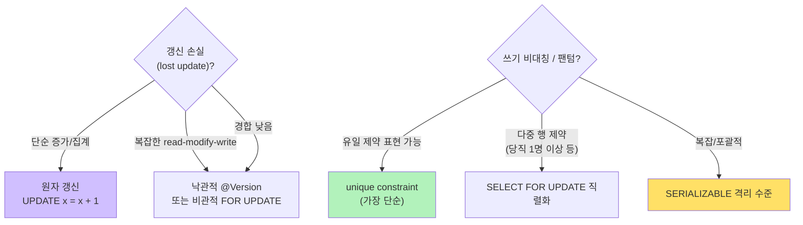

> **TL;DR** — "ACID"와 "격리 수준"은 외워도 와닿지 않는다. 그래서 *Designing Data-Intensive Applications* 7장의 핵심 예시(갱신 손실 · 읽기 비대칭 · 쓰기 비대칭 · 팬텀)를 **Spring Boot 4 + Kotlin + JPA 코드로 그대로 옮기고, 각 동시성 버그가 실제로 터지는 걸 눈으로 확인**한 뒤 해결책까지 짝지은 실습 프로젝트를 만들었다. 이 글은 그 핵심을 **코드 + ASCII 타이밍 다이어그램**으로 압축한다. 전체 코드는 👉 [GitHub 저장소 **ddia-ch7-transactions**](https://github.com/pallidev/ddia-ch7-transactions) 에서, `./gradlew test` 한 번이면 전부 재현된다.
{: .prompt-info}

---

## 왜 "코드로" 배워야 하는가

DDIA 7장을 읽으면 이런 문장이 나온다.

> "Repeatable Read(snapshot isolation)는 lost update, write skew, phantom을 못 막는다."

이해가 되는 듯 안 되는 듯… 격리 수준 표를 달달 외워도 **"그래서 내 JPA 코드에서 진짜 터지나?"** 는 확신이 안 선다. 그래서 직접 부딪혀봤다.

여기서 가장 중요한 통찰 하나:

> **동시성 버그는 "운이 나빠야만" 터지기 때문에, 일반적인 테스트로는 재현이 거의 불가능하다.**

그래서 이 프로젝트에는 `CountDownLatch`로 두 스레드의 실행 순서를 **결정적(deterministic)**으로 묶어, **매번 100% 같은 방식으로 버그가 발생하게 만드는 헬퍼**(`ConcurrentTx`)를 뒀다. 책의 타이밍 다이어그램(Fig 7-1, 7-8 등)을 코드로 재현한 셈이다.

---

## 1. ACID — 네 글자의 (불완전한) 약속

| 글자 | 의미 | 누구 책임? |
|---|---|---|
| **A**tomicity (원자성) | 중간에 고장 나면 **지금까지 한 쓰기도 전부 취소** (all-or-nothing). "abortability"가 더 정확한 이름. | DB |
| **C**onsistency (일관성) | "데이터가 항상 옳은 상태"라는 **앱 정의 불변식**. DB가 강제 불가. | **앱** ⚠️ |
| **I**solation (격리) | 동시에 실행되는 트랜잭션이 **서로 간섭하지 않는다**. | DB |
| **D**urability (지속성) | commit 된 데이터는 고장 나도 사라지지 않는다. | DB |

> 🚨 **가장 중요한 통찰**: **C는 사실 ACID에 속하지 않는다.** 일관성은 앱의 책임이지 DB가 주는 게 아니다. "한 shift엔 항상 당직 의사가 1명 이상" 같은 규칙은 DB가 모른다 — 앱이 올바른 트랜잭션을 짜야 지켜진다. 이 장의 나머지는 **I(격리)**에 대한 깊은 탐구다.

### 원자성(A)이 없으면 / 있으면 — 이체 중간 장애 시뮬레이션

```
[트랜잭션 없음]                    [@Transactional]
출금  1000→900  ✔ COMMIT            출금  1000→900  (아직 커밋 X)
─── 💥 장애 발생 ───                ─── 💥 장애 발생 ───
입금  ✗ (실행 안 됨)                입금  ✗
      ▼                                  ▼
잔액 900 / 0   (총합 900)            전체 ROLLBACK → 1000 / 0 (총합 1000)
돈 100 증발  ✗                      총합 보존  ✅
```

`@Transactional` 하나가 없으면 출금만 커밋되고 입금 전에 장애가 나서 **돈이 증발**한다. 이것이 ACID의 A가 없는 세계고, `@Transactional`이 붙으면 예외 시 **전부 롤백**된다.

---

## 2. 격리 수준은 "어디까지 막아주나"의 스펙트럼

```
  약하다 · 빠르다                                          강하다 · 느리다
  ◄──────────────────────────────────────────────────────────────────►
  Read Uncommitted ── Read Committed ── Repeatable Read ── Serializable

  dirty read/write   read skew         lost update          ✅ 모든 race 차단
                     (nonrepeatable)   write skew
                     ↑                 phantom
                     RR 이 막음        ↑
                                       RR 도 못 막음 → 수동 보완 필요
```

이 한 장이 핵심이다. **Repeatable Read(=우리가 흔히 쓰는 기본 수준)조차 lost update, write skew, phantom을 못 막는다.** 이 셋을 모두 막는 건 **Serializable 하나뿐**이다. 아래에서 이 "못 막는" 버그 4가지를 코드로 직접 터뜨려 본다.

---

## 3. 동시성 버그 4총사 — 코드로 직접 터뜨리기

### 3.1 갱신 손실 (Lost Update) — 책 Fig 7-1, 프로젝트 `LostUpdateTest`

두 클라이언트가 같은 행을 read → modify → write 한다. 0에서 두 번 +1 해야 2인데, 둘 다 "0"을 읽고 각자 1을 쓰면 → **최종 1**. 한쪽 증가가 "묵살(clobber)"된다.

```
시간↓      T1                       T2
   ┌───────────────┐                │
   │ READ   x = 0  │                │
   └───────┬───────┘                │
           │             ┌──────────────────┐
           │             │ READ   x = 0     │  ← 같은 "0" 을 봄
           │             └────────┬─────────┘
   ┌───────┴───────┐               │
   │ WRITE  x = 1  │               │
   └───────────────┘ ┌─────────────┴────┐
                     │ WRITE  x = 1     │  ← T1 의 +1 을 덮어씀(clobber)
                     └──────────────────┘
           ▼                    ▼
        결과: x = 1     (두 번 +1 했으니 2 여야 함)  ✗
```

**재현 코드** (안전하지 않은 read-modify-write — ORM으로 엔티티 읽어 `+1` 후 `save`하면 기본적으로 이 꼴):

```kotlin
concurrent.runConcurrent(
    isolation = TransactionDefinition.ISOLATION_REPEATABLE_READ,
    t1 = {
        startAsT1()
        val seen = accounts.findByIdOrNull(accId)!!.balance   // read = 0
        t1FinishedStep1()
        awaitT2Step1()                                         // T2도 읽을 때까지 대기
        val acc = accounts.findByIdOrNull(accId)!!
        acc.balance = seen + 1                                 // write = 0 + 1 = 1
        accounts.save(acc)
    },
    t2 = { /* 동일 — T2도 0을 읽고 1을 씀 */ },
)
// 결과: 1 (기대: 2) ← 한 증가가 손실
```

**해결책 ① — DB 원자 갱신** (read-modify-write를 SQL 한 줄로; DB가 행 잠금으로 직렬화):

```kotlin
@Modifying
@Query("update Account a set a.balance = a.balance + :delta where a.id = :id")
fun addBalance(@Param("id") id: Long, @Param("delta") delta: Long): Int
```

**해결책 ② — 비관적 락** (`SELECT ... FOR UPDATE`) / **③ — 낙관적 락** (`@Version`). 둘 다 프로젝트에 들어있다.

---

### 3.2 읽기 비대칭 (Read Skew / nonrepeatable read) — `ReadSkewTest`

한 트랜잭션이 같은 행을 **두 번 읽는 사이** 다른 트랜잭션이 커밋하면 값이 달라진다. READ COMMITTED에서 발생, Repeatable Read(스냅샷)가 막는다.

```
시간↓     T1 (이체)              T2 (Alice 잔액 조회)
          │                        │
   ┌──────┴──────┐                 │
   │ 계좌2 500→400│                 │
   └──────┬──────┘                 │
        COMMIT ───────────────┐    │
          ▼                   ▼    │
                          ┌────────┴────────┐
                          │ READ  계좌2 = 400│  ← T1 커밋 "뒤" 의 새 값
                          └────────┬────────┘
                          ┌────────┴────────┐
                          │ READ  계좌1 = 500│  ← 이체 "전" 의 옛 값
                          └─────────────────┘
                                   ▼
                   합 = 900  (100이 증발한 것처럼 보임)
  ※ REPEATABLE READ : 스냅샷만 보 → 둘 다 500 = 합 1000 일관 ✅
```

이게 바로 **MVCC(다중 버전 동시성 제어)**가 주는 가치 — "트랜잭션 시작 시점의 일관된 스냅샷"만 본다. readers never block writers, writers never block readers.

---

### 3.3 쓰기 비대칭 (Write Skew) ⭐ — 책 Fig 7-8, `WriteSkewTest`

**이 장에서 가장 중요한 예시.** 병원 당직 시스템: *"한 shift엔 항상 1명 이상 당직 의사가 있어야 한다."* Alice와 Bob이 동시에 당직을 포기한다.

```
시간↓      T1 (Alice)              T2 (Bob)
   ┌──────────────┐                │
   │ COUNT  = 2   │  "한 명 빠져도 OK"
   └──────┬───────┘                │
          │             ┌────────────────────┐
          │             │ COUNT  = 2         │  "한 명 빠져도 OK"
          │             └────────┬───────────┘
   ┌──────┴───────┐               │
   │ Alice off    │               │  ← 서로 다른 행 수정 → 충돌 감지 안 됨
   └──────────────┘ ┌─────────────┴──────┐
                   │ Bob off            │
                   └────────────────────┘
          ▼                    ▼
        결과: 당직 0명   (불변식 "항상 1명 이상" 위반)  ✗
```

**왜 위험한가?** 두 트랜잭션이 **서로 다른 행**(Alice 행, Bob 행)을 고친다. 그래서 갱신 손실도 더러운 쓰기도 아니다 → Repeatable Read가 전혀 못 막는다.

**재현 코드** (검사 → 결정 → 쓰기 흐름):

```kotlin
concurrent.runConcurrent(
    isolation = TransactionDefinition.ISOLATION_REPEATABLE_READ,
    t1 = {
        startAsT1()
        println("[T1/Alice] 당직 인원 = ${onCall.countOnCall(shift)} → 포기 결정") // 2명
        t1FinishedStep1()
        awaitT2Step1()
        doctors.save(doctors.findByIdOrNull(aliceId)!!.apply { onCall = false })
    },
    t2 = { /* Bob 도 동일 — 둘 다 "2명" 을 보고 포기 */ },
)
// 결과: 당직 0명 — 불변식 위반!
```

**해결책 — `SELECT ... FOR UPDATE`로 검사 대상 행을 잠가 직렬화** (책 p.248 코드와 동일):

```kotlin
@Transactional
fun goOffCallWithLock(doctorId: Long, shiftId: Long): Boolean {
    // FOR UPDATE 로 당직 행을 잠근다 → 두 번째 트랜잭션은 첫 번째가 커밋할 때까지 대기
    val onCall = doctors.findOnCallDoctorsForUpdate(shiftId)
    if (onCall.size < 2) return false   // 이제 진짜 1명이라 포기 거부
    val me = onCall.first { it.id == doctorId }
    me.onCall = false
    doctors.save(me)
    return true
}
```

> 💡 **write skew가 숨어있는 곳**: 회의실 중복 예약, 유저명 중복 가입, 게임 말 겹침, 포인트 이중 지출. 공통점은 **"검사(SELECT) → 결정 → 쓰기"** 흐름이다.

---

### 3.4 팬텀 (Phantom) — 책 Example 7-2, `PhantomTest`

회의실 예약: *"같은 방, 겹치는 시간엔 2개 예약 금지."* 흐름: (1) 겹치는 기존 예약 검색 (2) 없으면 INSERT.

```
시간↓   T1 (12-13시 예약)      T2 (12-13시 예약)
   ┌──────────────┐            │
   │검색: 겹침 없음│            │
   └──────┬───────┘            │
          │          ┌────────────────────┐
          │          │검색: 겹침 없음      │  ← T1 미커밋이라 안 보임(=팬텀)
          │          └────────┬───────────┘
   ┌──────┴───────┐          │
   │  INSERT      │          │
   └──────────────┘ ┌────────┴──────────┐
                   │  INSERT           │  ← 같은 (방,시간) → 유일제약 위반
                   └───────────────────┘
          ▼                   ▼
        결과: 예약 1개   (DB 제약이 중복 INSERT 차단)  ✅
```

**팬텀이 까다로운 이유**: 잠글(LOCK) 대상 **행이 아직 존재하지 않는다**(INSERT로 새로 생김). 그래서 `SELECT ... FOR UPDATE`로는 잠을 수가 없다. 해결은 **유일 제약(unique constraint)**이 최후의 방어선이 되어 동시 INSERT 중 하나를 abort시킨다:

```kotlin
@Entity
@Table(uniqueConstraints = [
    UniqueConstraint(name = "uk_room_start", columnNames = ["roomId", "startTime"])
])
class Booking(...)
```

---

## 4. 갱신 손실 해결책 — 한눈에 보는 치트시트



그리고 **낙관적 락**의 핵심 — `@Version` 컬럼 하나로 commit 시점 충돌 감지:

```kotlin
@Entity
class Account(
    @Id @GeneratedValue(strategy = GenerationType.IDENTITY) var id: Long? = null,
    var owner: String,
    var balance: Long,
    @Version var version: Long? = null,   // ← 이 한 줄로 낙관적 락
)
```

충돌하면 `ObjectOptimisticLockingFailureException`이 발생 → **재시도 대상**. 경합이 적을 땐 비관적 락보다 성능이 좋다.

---

## 5. 직접 실행해보기

전체 코드는 👉 [**github.com/pallidev/ddia-ch7-transactions**](https://github.com/pallidev/ddia-ch7-transactions)

```bash
git clone https://github.com/pallidev/ddia-ch7-transactions.git
cd ddia-ch7-transactions

# 전체 동시성 시나리오를 한 번에 실행 (별도 DB 설치 불필요, H2 MySQL 모드 사용)
./gradlew test

# 특정 개념만 보기
./gradlew test --tests "*.WriteSkewTest"
./gradlew test --tests "*.LostUpdateTest"
```

각 테스트는 `[T1]/[T2]/[결과]` 로그를 남겨서, 동시성 버그가 **눈에 보인다**. 예를 들어 `WriteSkewTest`를 돌리면:

```
[T1/Alice] 당직 인원 = 2 → 포기 결정
[T2/Bob]   당직 인원 = 2 → 포기 결정
[결과] 최종 당직 인원 = 0 (불변식: 항상 1명 이상이어야 함)
```

> 📁 **프로젝트 구조** (파일명만 봐도 무엇을 다루는지 알게 되어 있다):
> - `01_atomicity_AtomicityTest.kt` — ACID의 A
> - `02_read_skew_ReadSkewTest.kt` — READ COMMITTED vs REPEATABLE READ
> - `03_lost_update_LostUpdateTest.kt` — 갱신 손실 ⭐
> - `04_write_skew_WriteSkewTest.kt` — 쓰기 비대칭 ⭐⭐ 가장 중요
> - `05_phantom_PhantomTest.kt` — 팬텀
> - `06_optimistic_lock_OptimisticLockTest.kt` — @Version 낙관적 락

---

## 마무리 — 절대 잊지 말아야 할 핵심 5줄

1. **ACID의 C는 사실 앱 책임**이다. DB가 주는 건 A, I, D.
2. **Repeatable Read(snapshot)는 lost update, write skew, phantom을 못 막는다.**
3. **write skew = "검사 → 결정 → 쓰기" 패턴의 동시성 버그.** 가장 은밀하고 위험하다.
4. **모든 race condition을 막는 건 Serializable 하나뿐.** 그 외는 원자 갱신 / `FOR UPDATE` / `@Version` / 유일 제약으로 **앱이 직접 보완**해야 한다.
5. 동시성 버그는 타이밍이 안 맞으면 재현이 안 되니, **latch로 결정적으로 묶어 재현하는 테스트**를 두는 게 학습에 결정적이다.

---

> 이 글의 모든 코드와 더 자세한 설명(H2 vs MySQL 차이, Serializable 3가지 구현 알고리즘, dirty read/write를 왜 다루지 않았는지 등)은 저장소의 [`docs/CH07_트랜잭션_학습.md`](https://github.com/pallidev/ddia-ch7-transactions/blob/main/docs/CH07_%ED%8A%B8%EB%9E%9C%EC%9E%AD%EC%85%98_%ED%95%99%EC%8A%B5.md) 에 있다. 궁금한 점이나 오탈자는 저장소 Issue로 알려주시면 감사하겠다. 🙌
{: .prompt-tip}
