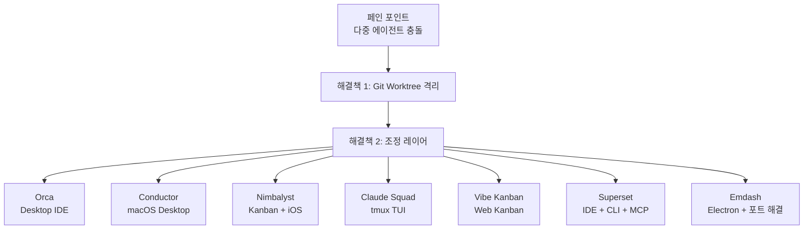
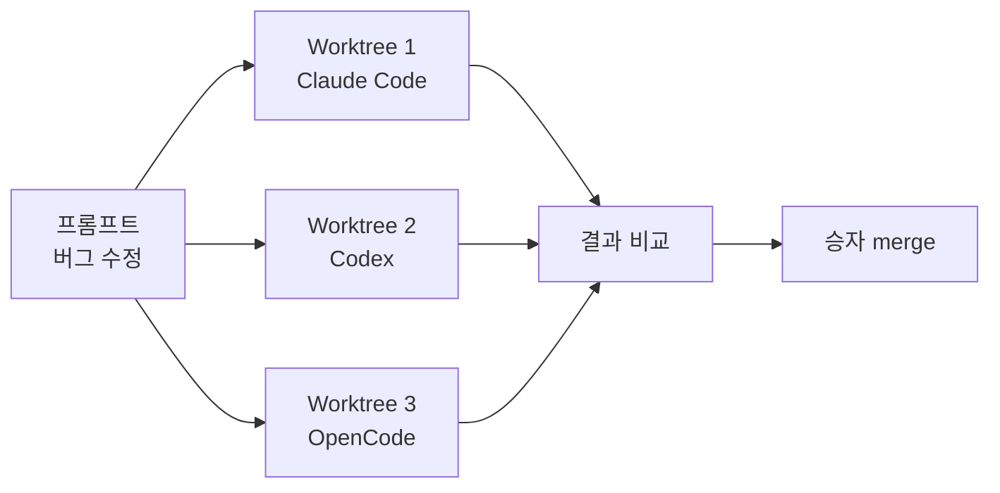
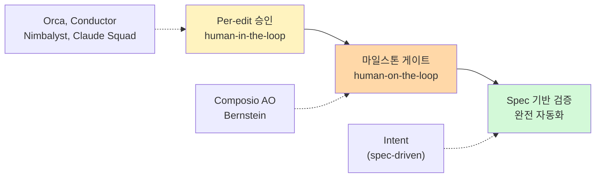

> **TL;DR**
> 2026년 AI 코딩의 병목은 모델이 아니라 **operator**로 넘어갔다. 한 번에 6개 에이전트를 돌리면
> "어떤 에이전트가 막혔는지, 어떤 브랜치가 안전한지"가 문제가 된다.
> 이를 해결하는 **agent orchestrator / ADE** 카테고리가 폭발적 성장 중이며,
> 그 중 **Orca**는 크로스플랫폼 + MIT 오픈소스 + Design Mode + 모바일 앱으로 가장 완성도 높은 선택지다.
> {: .prompt-info}

## 개요

| 항목 | 내용 |
|---|---|
| **도구명** | Orca (ADE) |
| **개발사** | Stably AI (Y Combinator 백업) |
| **라이선스** | MIT (오픈소스) |
| **플랫폼** | macOS, Windows, Linux |
| **모바일** | iOS (App Store 정식), Android (APK) |
| **비용** | 무료 (BYO 에이전트 구독) |
| **지원 에이전트** | 25+ (Claude Code, Codex, Gemini, OpenCode, Pi, Copilot, Hermes Agent 등) |
| **공식 사이트** | [onorca.dev](https://www.onorca.dev/) |
| **GitHub** | [github.com/stablyai/orca](https://github.com/stablyai/orca) |

---

## ADE 카테고리가 등장한 배경

단일 AI 코딩 에이전트는 쉽다. Claude Code 하나 켜고 작업하면 된다.
문제는 **여러 에이전트를 동시에 돌릴 때** 시작된다.

세 에이전트를 같은 repo에 돌리면:

1. 서로의 파일을 덮어쓴다
2. dev 서버 포트를 두고 싸운다
3. `git reflog`로 무슨 일이 있었는지 복원해야 한다

이 문제를 해결하기 위해 등장한 공통 패턴이 **git worktree 기반 격리**.
각 태스크마다 독립된 worktree를 생성해 에이전트끼리 충돌을 방지한다.
2025-2026년 약 18개월 만에 이 패턴이 컨센서스가 되었고,
그 위에 다양한 UI와 조정(coordination) 레이어를 얹은 도구들이 쏟아졌다.

---

## Orca가 제창하는 ADE 개념

Orca는 **ADE (Agent Development Environment)** 라는 새로운 카테고리를 정의하며 기존 도구와 구별한다.

| 구분 | 대상 | 특징 |
|---|---|---|
| **IDE** | 인간만 | 한 명의 개발자, 하나의 워킹 디렉토리. AI는 부가 기능 |
| **Wrapper** | 병렬 실행만 | 터미널 위에 에이전트만 얹음. 조정 기능 부족 |
| **ADE** | 인간 + 에이전트 | worktree, 터미널, 브라우저, CLI, diff review가 통합 |

Orca의 주장: "전통적 IDE는 에이전트를 위해 설계되지 않았다. Wrapper는 터미널에서 멈춘다. Orca는 전체 환경이다."

---

## Orca 핵심 기능

### 1. Parallel Worktrees

각 태스크 = 격리된 git worktree. `stash`나 branch juggling 없이 5개 에이전트에 동일 프롬프트를 fan-out한 뒤 최적 결과를 merge.

### 2. Design Mode

worktree마다 **실제 Chromium 창**을 띄움. UI 요소를 클릭하면 해당 요소의 HTML, CSS, 크롭된 스크린샷이 에이전트에게 전달된다. 프론트엔드 작업에서 "이 버튼이 이상해"라고 말하는 대신 클릭 한 번으로 컨텍스트를 전달.

### 3. Ghostty-class Terminal

WebGL 렌더링, 무한 split, 재시작 시 scrollback 복원, full scrollback search. 단순 터미널 에뮬레이터가 아니라 Ghostty 수준의 터미널이 내장.

### 4. GitHub & Linear 통합

PR, issue, Project board를 앱 내에서 브라우징. worktree에서 직접 PR을 생성, 리뷰, 승인. Linear issue에 팀 셀렉터 포함. 외부 도구로의 컨텍스트 스위칭 제거.

### 5. BYO Agent / Subscription

자체 모델이 아니다. 기존 Claude Code, Codex 구독을 그대로 Orca에 플러그인. 25+ CLI 에이전트가 사전 구성되어 있고, 다른 CLI 에이전트도 드롭인 가능.

### 6. 모바일 컴패니언

iOS App Store 정식 등록 + Android APK. 라이브 에이전트 상태, 사용량, rate-limit reset 확인. 계정 핫스왑. 이동 중에도 터미널 작업 지속.

> "Orchestrating 600 agents from my phone" — 실제 사용자 트윗
> {: .prompt-tip}

---

## 경쟁 도구 비교

### 핵심 비교 테이블

| 도구 | 라이선스 | 플랫폼 | UI | 에이전트 | 모바일 | 비용 |
|---|---|---|---|---|---|---|
| **Orca** | MIT | macOS/Win/Linux | Desktop IDE | 25+ | iOS/Android | 무료 |
| **Conductor** | 무료(예정 유료) | macOS only | Desktop sidebar | Claude Code, Codex | 없음 | 무료 |
| **Nimbalyst** | MIT | macOS/Win/Linux/iOS | Kanban + visual | Claude Code, Codex, OpenCode | iOS | 개인 무료 |
| **Claude Squad** | AGPL-3.0 | tmux 환경 | tmux TUI | 다수 | 없음 | 무료 |
| **Vibe Kanban** | Apache-2.0 | 브라우저 | Kanban web | 다수 | 브라우저 | 무료(클라우드 종료) |
| **Superset** | 부분 OSS | macOS/Linux | IDE + CLI + MCP | 다수 | 예정 | Pro $15/user/월 |
| **Emdash** | Apache-2.0 | 크로스플랫폼 | Electron | 22개 | 없음 | 무료 |

### 조정 깊이 (Coordination Depth)

에이전트 관리 도구의 가장 큰 차이는 **얼마나 자동화할 것인가**이다.

Orca를 포함한 대부분 OSS orchestrator는 **per-edit 승인** 단계에 머물러 있다. 모든 변경을 내가 검토하고 반영한다. 완전 자동화(CI 실패 시 자동 재시도, spec 준수 자동 검증)를 원하면 Composio AO나 Intent 같은 도구가 필요하다.

---

## Orca의 장점

1. **크로스플랫폼** — 경쟁사 중 Windows와 Linux를 지원하는 것은 Orca, Nimbalyst, Emdash 정도. Conductor는 macOS 전용.
2. **ADE 완성도** — worktree + terminal + browser + diff review + CLI 통합. 경쟁사 대부분은 이 중 일부만 갖춘다.
3. **Design Mode** — Chromium + UI 클릭 → 에이전트 컨텍스트 전달. 프론트엔드 작업에서 독보적.
4. **모바일 네이티브** — iOS App Store 정식 등록은 이 카테고리에서 매우 드문 일.
5. **MIT 라이선스** — 가장 느슨한 라이선스. AGPL-3.0(Claude Squad) 대비 기업 도입 용이.
6. **SSH 원격 worktree** — 원격 머신에서 에이전트 실행. 자동 재연결, 포트 포워딩, passphrase 캐싱.

## Orca의 단점

1. **신생 도구** — 2026년 중반 출시. 안정성과 커뮤니티가 미검증. "ships daily"는 빠른 개발을 의미하지만 breaking change 위험.
2. **BYO 구독 필요** — 자체 모델이 아니다. Claude Code, Codex 등 기존 유료 구독을 별도로 가져야 함.
3. **학습 곡선** — IDE + terminal + browser + git + CLI 통합의 초기 설정 부담. no-code 사용자 부적합.
4. **리소스 사용량** — worktree마다 Chromium 창을 띄우므로 메모리/CPU 부담이 크다. 저사양 머신에는 무리.
5. **경쟁 심화** — Conductor, Nimbalyst, Superset, Emdash가 빠르게 기능을 따라잡는 중. Vibe Kanban(클라우드 종료), Crystal(→Nimbalyst 피벗)처럼 도태된 사례도 이미 있음.
6. **포트 충돌 미해결** — Emdash는 `$EMDASH_PORT`로 포트 충돌을 명시적으로 해결하지만, Orca는 이 부분 문서가 부족.

---

## 상황별 추천

| 상황 | 추천 | 이유 |
|---|---|---|
| macOS만 쓰고 가볍게 시작 | **Conductor** | 가장 낮은 마찰, 깔끔한 diff review |
| 터미널에서 절대 벗어나지 않음 | **Claude Squad** | tmux TUI, 모든 CLI 에이전트 지원 |
| 시각적 kanban + iOS 모니터링 | **Nimbalyst** | 보드 중심, 네이티브 iOS |
| 크로스플랫폼 + 풀 ADE 경험 | **Orca** | Win/Linux 지원, Design Mode, 모바일 |
| 프론트엔드 중심 작업 | **Orca** | Design Mode가 압도적 |
| 팀용 + 엔터프라이즈 | **Superset** | 명확한 Pro/Enterprise 플랜 |
| 포트 충돌이 잦은 모노레포 | **Emdash** | `$EMDASH_PORT` 자동 주입 |
| 최소 의존성, DIY | **tmux + 스크립트** | 벤더 종속 zero |

---

## 종합 평가

Orca는 **ADE 카테고리에서 기능 완성도가 가장 높은 도구**다. 크로스플랫폼 + MIT 오픈소스 + Design Mode + 모바일의 조합은 경쟁사가 따라오기 어려운 차별점이다.

다만 세 가지 주의점이 있다:

1. **신생 도구** — 안정성과 장기 생존이 미지수. 이미 Vibe Kanban은 클라우드 서비스가 종료되었다.
2. **BYO 비용** — 무료인 건 Orca 자체뿐. Claude Code 구독($20/월) + Codex 구독이 별도로 든다.
3. **카테고리 전체가 초기 단계** — 2026년 하반기에 누가 살아남을지 결정된다. Orca가 유력하지만 확정은 아니다.

> [!note] 백엔드 개발자 관점
> Spring/Kotlin 백엔드 작업이라면 Design Mode(프론트엔드 특화)의 이점이 제한적이다.
> 핵심 가치는 **병렬 worktree로 여러 에이전트가 동시에 서로 다른 태스크를 처리**하는 것.
> 예: 버그 수정 + 테스트 작성 + 리팩토링을 3개 worktree에서 동시 진행.
> 이 패턴 자체는 Claude Squad(무료, tmux)로도 가능하므로, Orca의 크로스플랫폼 + 모바일이 꼭 필요한지가 선택 기준이 된다.

---

## 참고 자료

- [Orca 공식 사이트](https://www.onorca.dev/)
- [Orca GitHub (stablyai/orca)](https://github.com/stablyai/orca)
- [Orca Docs](https://www.onorca.dev/docs)
- [Best Tools for Managing Parallel AI Coding Agents in 2026 — Nimbalyst](https://nimbalyst.com/blog/best-agent-management-tools-2026/)
- [9 Open-Source Agent Orchestrators for AI Coding — Augment Code](https://www.augmentcode.com/tools/open-source-agent-orchestrators)
