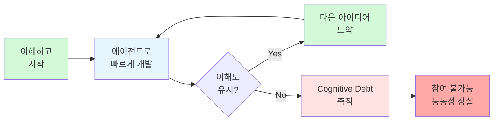
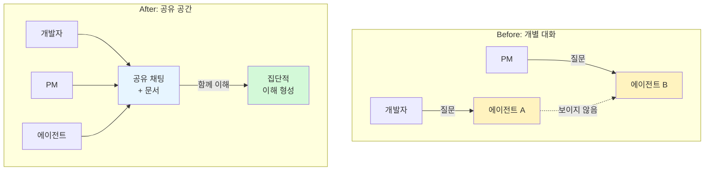

> **TL;DR**
> Notion 디자인 엔지니어 Geoffrey Litt가 AI Engineer World's Fair에서 발표한 "코드를 이해하는 것이 새로운 병목" 강연 정리. 에이전트가 코드를 대신 짜는 시대에도 이해는 필수지만, 그 이유는 '검증'이 아니라 '참여'를 위해서다. 코드 설명서, 이해도 퀴즈, 마이크로월드, 공유 공간까지 — 실전에 바로 써먹을 수 있는 4가지 기법을 다룬다.
{: .prompt-info }

## 1. 개요

| 항목 | 내용 |
|------|------|
| 발표자 | Geoffrey Litt (Notion 디자인 엔지니어) |
| 행사 | AI Engineer World's Fair 2026 |
| 길이 | 19분 33초 |
| 핵심 질문 | AI 에이전트가 코드를 짜주는 시대, 왜 사람이 코드를 "이해"해야 하는가? |
| 원본 영상 | [Tech Bridge 한영 자막 버전](https://www.youtube.com/watch?v=x3e_Yl4NNHY) |

에이전트가 50,000줄 PR을 만드는 시대. "코드 리뷰가 새로운 병목"이라는 말이 나온다. 하지만 정말로 우리가 해야 할 일은 단순히 에이전트의 결과물이 맞는지 확인하는 것일까?

{: .shadow }

Geoffrey Litt는 이 질문에 대해 **"It's important for humans to understand how the code works"**라고 선언하며 발표를 시작한다. AI Engineer World's Fair의 디자인 엔지니어링 트랙에서 이 말은 일종의 "hot take"로 받아들여졌다.

---

## 2. 왜 이해해야 하는가: 잘못된 가정과 진짜 이유

### 흔한 오해: "Understand to Verify"

많은 사람이 "왜 인간이 이해해야 하냐"는 질문에 이렇게 답한다:

> "에이전트가 바보 같은 짓을 할 수 있으니까. 우리 일은 그걸 잡아내는 거다."

{: .shadow }

correctness checking — 스펙과 맞는가? 프로덕션이 무너지지 않는가? 아키텍처가 괜찮은가? 이런 질문들은 본질적으로 thumbs up / thumbs down 결정이다.

문제는, **에이전트도 점점 더 잘 검증하고 있다**는 것이다. 명확한 검증 루프를 주면, 인간의 correctness checking 역할은 줄어든다.

### 진짜 이유: "Understand to Participate"

Geoffrey가 강조하는 핵심 — 이해는 하나의 루프가 아니라 **연속적인 루프의 기반**이다:

{: .shadow }

> "뭔가를 이해하게 되고, 그 이해가 다음 루프로, 또 그다음 루프로 이어지는 거죠."

풍부한 개념 구조가 머릿속에 있으면, 매번 에이전트에게 물어보지 않고도 유창하게 사고하고 창발적 아이디어 도약을 할 수 있다. 이것이야말로 **인간의 역할**이다.

### Cognitive Debt (인지 부채)

기술 부채(technical debt)의 사촌 개념. 학자 **Margaret Storey**가 대중화했고 Simon Willison도 블로그로 다뤘다.

> "Even if AI agents produce code that could be easy to understand, the humans involved may have simply lost the plot..."

{: .shadow }

바이브 코딩(vibe coding)을 하다 보면 이런 순간이 온다:

> "wait... 지금 뭐가 어떻게 돌아가는지 모르겠다."

인지 부채가 쌓이면 더 이상 프로젝트에 **능동적으로 참여**할 수 없게 된다.

---

## 3. 해법의 출처: 교육학

"어떻게 이해하는가?"라는 질문은 새로운 것이 아니다. **교육학(education)**이 수십 년간 다뤄온 주제다.

Geoffrey는 최고의 교육 아이디어를 코드 이해에 적용할 수 있다고 말하며, 세 가지 기법을 소개한다.

{: .shadow }

이 슬라이드는 Geoffrey가 실제로 사용하는 워크플로우를 보여준다: **Code explainers**, **Quizzes**, **Micro-worlds**. 각각이 어떻게 에이전트 코드를 이해하는 데 도움이 되는지 하나씩 살펴보자.

---

## 4. 기법 1: Explanations (코드 설명서)

에이전트가 코드를 작성하면, 단순한 diff가 아니라 **최고의 선생님이 써주는 맞춤형 커리큘럼**처럼 설명하게 만든다. Geoffrey가 매일 사용하는 `explain diff` 스킬의 네 가지 원칙:

### 원칙 1: Background부터 시작

코드 변경부터 보여주지 않는다. 시스템이 어떻게 작동하는지 배경지식부터:

{: .shadow }

> "이런 모습인데요, 배경 설명부터 시작합니다."

Zen Garden 게임 예시에서는 Phaser 3 게임 엔진, HTML5 canvas 좌표계, 하위 시스템 구조를 먼저 설명한다. 이미 알면 스킵 가능하다 (개인화).

### 원칙 2: Intuition before details

코드를 보여주기 전에 직관적 이해를 먼저:

{: .shadow }

> "코드를 보기 전에, 이 커밋의 목표는 2D 그리기 기법만으로 정원이 입체적으로 느껴지게 만드는 거라고 알려줍니다."

좋은 수학 선생님이 하는 방식 — essence를 먼저, detail은 나중에. isometric projection이 무엇인지, 왜 찌그러진 타원이 3D처럼 보이는지 직관적으로 설명한 다음 코드로 들어간다.

### 원칙 3: Interactive figures

만질 수 있는 시뮬레이션을 제공. 바위를 드래그하면 좌표와 Z-레이어가 어떻게 변하는지 실시간으로 확인. Notion의 새로운 HTML 블록 기능을 활용하면 인터랙티브 시뮬레이션을 문서 안에 넣을 수 있다.

> 주의: 인터랙티비티는 쓸데없는 장식(slop)이 될 수 있다. 신중하게 사용할 것.

### 원칙 4: Literate code diffs

raw diff를 그냥 던지지 않는다. 각 파일 앞에 prose로 맥락을 설명. Geoffrey는 이 설명서를 **출력해서 커피숍에서 읽는다** — IDE에 매달려 있던 과거와 달리, AI 덕분에 마치 교과서를 읽듯 코드를 이해할 수 있게 됐다.

### 이해도 확인 퀴즈: "Books don't work"

연구자 **Andy Matuschak**의 "Books don't work" 개념에서 영감:

{: .shadow }

> "as a medium, books are surprisingly bad at conveying knowledge, and readers mostly don't realize it." — Andy Matuschak

책을 읽고도 이해하지 못했는지 알기 어렵다. Matuschak은 에세이 안에 **spaced repetition 퀴즈**를 넣어 해결했다.

Geoffrey의 적용:
- 코드 설명서 끝에 **5문항 중간 난이도 퀴즈**를 붙임
- 규칙: **퀴즈를 통과하지 않으면 팀에 코드 리뷰를 보내지 않는다**
- 실제로 이해하지 못한 채로 넘어가는 것을 반복적으로 잡아냄

{: .shadow }

> "A quiz is a speed regulator. Everything AI is speed up, speed up, speed up."

모든 것이 speed up인 시대에, 퀴즈는 **이해의 속도 조절기** 역할을 한다.

---

## 5. 기법 2: Microworlds (마이크로월드)

교육자 **Seymour Papert**의 **Mathland** 개념에서 영감:

> "아이들은 프랑스에서 프랑스어를 배운다. 그렇다면 수학은 어디서 배우는가? Mathland가 있다면, 거기서 살기만 하면 직관적으로 수학을 배울 수 있지 않을까?"

Papert는 Logo 프로그래밍의 거북이(turtle)로 아이들이 수학을 배우는 환경을 만들었다. "요점은 로봇이 아니라 아이들이다."

{: .shadow }

### 사례 1: Prolog 인터프리터 디버거

Geoffrey가 Prolog(데이터베이스 쿼리 언어와 비슷한) 인터프리터를 직접 구현하며 배우고 있었다. Wikipedia에서 읽으면 복잡해 보이지만, 막상 이해하면 "그렇게 어려운 건 아니었는데..." 하는 경우가 많다.

해결책: Claude에게 인터프리터 내부 구조를 시각화하는 **임시 디버거**를 만들어달라고 함.

{: .shadow }

- 타임라인을 스크럽하며 단계별 실행 상태 시각화
- Prolog 코드(`father(orville, abel).`)와 실행 스택(R0 Goals, Bindings)을 실시간으로 보여줌
- "Step 15 of 85" — 85단계 중 15번째 스텝의 모든 상태를 시각화
- 버그를 수정할 뿐 아니라 기계 자체에 대한 **감각(peripheral vision)** 획득
- 에이전트에게 버그 수정을 맡기면 얻을 수 없는 깊은 이해

### 사례 2: 웹사이트 마이그레이션

개인 웹사이트를 한 프레임워크에서 다른 프레임워크로 마이그레이션:

{: .shadow }

1. 첫 시도: Claude에게 스크립트 작성을 맡김 → 작동하지만 "Abstract code can be hard to follow 😬"
2. 두 번째 시도: **"직접 포팅하는 비디오 게임"**을 만들어달라고 함
   - 왼쪽에 구사이트, 오른쪽에 신사이트
   - 버튼을 클릭하면 한 단계씩 진행
   - 각 단계에서 실행하는 명령어와 파일 트리 변화를 시각적으로 확인

결과: 수동 작업의 이점(반복적 경험을 통한 이해)을 고통 없이 획득.

> **"Agents can write code to help us understand code!"**

{: .shadow }

이것이 마이크로월드의 핵심이다 — 에이전트가 소프트웨어를 출하하기 위해 코드를 짜는 게 아니라, **우리가 이해하기 위한 작은 세계를 짜는 것**.

---

## 6. 기법 3: Shared Spaces (공유 공간)

여기까지는 개인 이해에 관한 것이었다. 하지만 팀으로 일할 때는 **팀 전체가 함께 이해**해야 비로소 창발적 아이디어를 낼 수 있다.

Notion에서 실험 중인 것들:

### Multiplayer chat threads

여러 인간과 에이전트가 함께 참여하는 채팅:

- 기존: 나와 내 에이전트, PM과 PM의 에이전트 — 개별 1:1 대화
- 새로운 방식: **공유 공간**에서 모두가 함께 대화
- "1:1 대화에서 Slack 채널로 옮아온 것" — 서로의 에이전트 통신을 볼 수 있다
- 이해가 개인이 아닌 **집단적**으로 형성됨

### 협업 문서

{: .shadow }

Claude가 만든 계획을 공유 문서에 올리면:
- 팀원이 댓글로 질문하고 토론
- "Understanding the problem together" — 에이전트가 삭제한 블록도 팀이 함께 검토
- 로컬 환경이 아닌 공유 공간에 있어 누구나 참여 가능

> 2026년 7월 기준, Notion에서 Claude와 Cursor를 코딩 에이전트로 직접 사용할 수 있게 됐다.

---

## 7. 더 넓은 시각: Alan Kay의 비전

이 메시지는 새로운 것이 아니다. 개인용 컴퓨팅 선구자 **Alan Kay**가 정확히 **50년 전**에 쓴 에세이 *"A Personal Computer for Children of All Ages"*에서 이미 비전을 제시했다.

{: .shadow }

Geoffrey는 발표 마지막에 메시지를 확장한다 — "코드"가 아니라 **"모든 것"**을 이해하는 것이 중요하다고.

{: .shadow }

두 아이가 태블릿을 들고 있는 그림 — YouTube를 보는 iPad처럼 보이지만, 실제 비전은:
- 아이들이 비디오 게임을 하면서 **코드를 수정해 물리학을 배우는** 것
- "요점은 컴퓨터가 아니라 **아이들**이다"
- 컴퓨터는 인간을 레벨업하기 위한 도구

> "그가 그린 건 아이들이 비디오 게임을 하면서 코드를 수정해 물리학을 배우는 모습이었습니다. 핵심은 컴퓨터가 아니라 아이들이었죠."

어느 시점에 컴퓨터가 이 비전에서 약간 벗어났다고 Alan Kay는 말한다. 하지만 AI 시대에 다시 되찾을 기회가 왔다:

> "Code is free. We can make ephemeral UIs, dynamic simulations to understand concepts. We can make debuggers, playgrounds."

이것은 새로운 아이디어가 아니라 **원래의 목표**였다.

---

## 8. 결론: 루프에서 빠져나오지 말고, 더 깊이 들어가라

| 통념 | Geoffrey의 주장 |
|------|----------------|
| 에이전트가 똑똑해지면 이해 불필요 | 이해는 참여를 위해 더 중요해진다 |
| 코드 리뷰 = correctness checking | 진짜 목적은 다음 아이디어를 갖는 것 |
| AI는 속도를 높이는 도구 | AI는 이해를 깊게 만드는 도구 |
| 루프에서 빠져나가라 | **루프 안으로 더 깊이 들어가라** |

> "With AI, we can kind of empower ourselves more, not just taking ourselves out of loops, but actually putting ourselves more deeply in loops than we ever have before."

---

## 실전 적용 체크리스트

> **바로 써먹을 수 있는 액션 아이템**
{: .prompt-tip }

1. **코드 설명서 만들기** — 에이전트가 PR을 만들면 diff 대신 background → intuition → interactive → literate diff 순서의 설명서를 요구
2. **이해도 퀴즈 붙이기** — 코드 리뷰를 보내기 전에 5문항 퀴즈를 통과하는 규칙 도입
3. **마이크로월드 요청하기** — "이 코드를 이해할 수 있는 인터랙티브 시뮬레이션을 만들어줘"라고 에이전트에게 요청
4. **공유 공간에서 에이전트 사용하기** — 1:1이 아닌 팀 채널에서 에이전트와 대화하여 집단적 이해 형성
5. **Cognitive Debt 경계** — "지금 뭐가 어떻게 돌아가는지 모르겠다"는 느낌이 들면 즉시 멈추고 이해부터

---

> **원본 영상:** [\[한영자막\] "코드를 이해하는 것"이 새로운 병목입니다 — Tech Bridge](https://www.youtube.com/watch?v=x3e_Yl4NNHY)
>
> **발표자:** Geoffrey Litt, Design Engineer at Notion
>
> **행사:** AI Engineer World's Fair 2026
