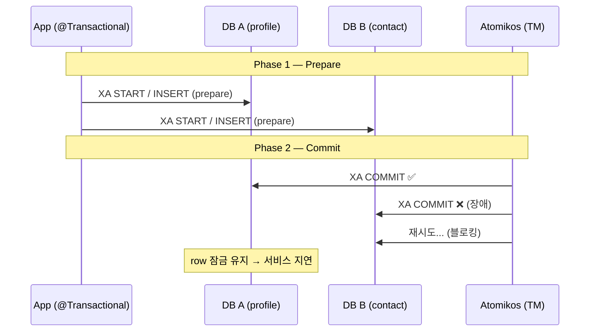
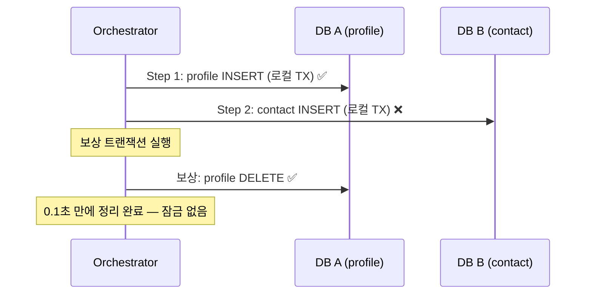

실제 회원 시스템 무중단 마이그레이션에서 **2PC(JTA/Atomikos)** 의 치명적 한계를
체감했다. Phase 2 커밋 실패 시 **되돌릴 수 없고**, Atomikos가 **블로킹 재시도**를
무한히 반복하는 것을 겪은 뒤, 같은 시나리오를 **Saga 보상 트랜잭션**으로 다시
설계했다.

이 글은 그 과정을 **4개 모듈**로 직접 구현·검증한 학습 프로젝트를 기반으로,
2PC → Saga(직접 구현) → Arrow-KT Saga(라이브러리) → Temporal(플랫폼)의 진화를
코드와 Web UI 스크린샷으로 정리한다.

> **전체 코드**: [distributed-tx-study](https://github.com/pallidev/distributed-tx-study)
> **학습 커리큘럼**: [docs/curriculum.md](https://github.com/pallidev/distributed-tx-study/blob/main/docs/curriculum.md)

---

## TL;DR

| 한 줄 요약 |
|-----------|
| **2PC**는 강한 일관성을 보장하지만 Phase 2 실패 시 **되돌릴 수 없다** |
| **Saga**는 보상 트랜잭션으로 되돌리되, **일시적 불일치**를 감수한다 (최종 일관성) |
| 직접 만든 SagaEngine은 **영속화·재시도가 없어** 서버 재시작 시 상태 유실 |
| **Temporal**은 영속화·자동 재시도·Web UI를 제공하지만, **별도 서버 운영**이 필요 |
| 실무 결정: 간단하면 **Arrow-KT Saga**, 복잡/대규모면 **Temporal** |

---

## 목차

1. [시나리오 — 회원 테이블 2개 DB로 분할](#시나리오--레거시-회원-테이블을-2개-db로-분할)
2. [Step 1. 2PC — 강한 일관성의 함정](#step-1-2pc--강한-일관성의-약속과-함정)
3. [Step 2. Saga — 보상 트랜잭션](#step-2-saga--보상-트랜잭션으로-해결)
4. [Step 3. SagaEngine — 직접 구현](#step-3-sagaengine--직접-구현-보상-리스트--역순-실행)
5. [Step 4. Arrow-KT Saga — 라이브러리](#step-4-arrow-kt-saga--검증된-라이브러리로-교체)
6. [Step 5. Temporal — 플랫폼 + Web UI](#step-5-temporal--플랫폼으로-한계-극복)
7. [4개 모듈 비교 + 실무 결정 기준](#4개-모듈-비교)

---

## 시나리오 — 레거시 회원 테이블을 2개 DB로 분할

레거시 단일 회원 테이블을 신규 DB 2개(profile/contact)로 도메인 분할한다.
회원 1건을 두 DB에 나눠 저장할 때 **양쪽 쓰기의 원자성**을 각 패턴으로 구현한다.

```
레거시 단일 회원 (id, name, email, phone, ...)
    ↓ 도메인별 분할
DB A · profile (id, name)  ←→  DB B · contact (id, profile_id, email, phone)
         ↕ 원자적 분할 저장: 2PC or Saga
```

---

## Step 1. 2PC — 강한 일관성의 약속과 함정

### 작동 방식

`@Transactional`(JTA) 하나로 두 DB를 **하나의 분산 트랜잭션**에 묶는다:

```kotlin
@Transactional  // JTA (Atomikos) — Phase 1(prepare) → Phase 2(commit)
fun registerMember(member: Member) {
    profileRepo.save(MemberProfile(member.name))    // DB A
    contactRepo.save(MemberContact(member.email))   // DB B
}
```



### 한계: Phase 2 실패 — "되돌릴 수 없다"는 것의 진짜 의미

> "Atomikos가 재시도하니까 결국 DB B에도 COMMIT 들어가는 거 아닌가?"
>
> 맞다. **재시도가 성공하면** 결국 양쪽 DB가 일치한다. 문제는 **재시도가 성공하기 전까지**
> 무슨 일이 벌어지는가다.

**실제 운영에서 겪은 시나리오** — 새벽 트래픽 피크 시간, DB B가 30초간 응답 지연:

```
T+0s    Phase 2 Commit 시작
T+0.1s  DB A: XA COMMIT ✅  — profile 영구 저장됨 (이제 롤백 불가)
T+0.1s  DB B: XA COMMIT ❌  — 타임아웃 실패
T+0.1s  ────────────────────────────────────────
        여기서 선택지는 단 하나: "DB B에 COMMIT을 다시 밀어넣기"
        DB A에서 방금 저장한 데이터를 취소(ROLLBACK)하는 건 불가능하다.
T+5s    Atomikos 1차 재시도 → 실패 (DB B 여전히 지연)
T+30s   DB B 정상 복구
T+30s   Atomikos 재시도 성공 → DB B COMMIT ✅
        ────────────────────────────────────────
        그런데 그 30초 동안:
        - DB A의 해당 row가 "글로벌 TX 미완료" 상태로 잠김
        - 같은 회원에 대한 모든 후속 요청이 대기 (락 경합)
        - 사용자는 회원가입 응답을 30초간 기다림 → 타임아웃 → 재시도 → 악순환
```

이게 **블로킹**의 실체다. 재시도가 성공하는 동안 해당 데이터가 잠겨 있어서
**서비스 전체가 느려지거나 멈춘다.**

**더 끔찍한 시나리오 — 코디네이터(Atomikos) 자체가 죽으면?**

```
DB A: XA COMMIT ✅
DB B: XA COMMIT ❌
Atomikos 서버: 재시도 중 OOM/Kill → 다운 💀
  → 누가 재시도? → Atomikos가 살아나서 로그를 읽고 재개해야 함
  → Atomikos 복구 전까지 DB A와 DB B가 불일치 상태로 방치
  → 최악의 경우: 수동으로 데이터를 보정해야 함
```

이게 **코디네이터 SPOF (Single Point of Failure)** 이다. Atomikos가 없으면
트랜잭션을 완료할 수 있는 주체가 아무도 없다.

**극단적 시나리오 — DB B가 영구 장애면?**

DB B의 디스크 고장이나 데이터센터 장애로 재시도가 **영원히** 실패하면?
DB A에서 방금 저장한 데이터를 취소할 방법이 없다. **운영자가 수동으로 데이터를 보정**해야 한다.

### 왜 Saga가 다른가 — 같은 장애 상황에서의 비교

```
같은 상황: profile 저장 성공, contact 저장 실패

2PC:
  DB A COMMIT ✅ → DB B COMMIT ❌
  → DB A를 롤백 못 함 → DB B에 COMMIT 재시도 (블로킹)
  → 재시도 성공까지 잠금 유지 → 서비스 지연

Saga:
  profile INSERT (로컬 TX 커밋) ✅ → contact INSERT 실패 ❌
  → 보상: profile DELETE (별개의 로컬 TX) — 0.1초 만에 완료
  → 잠금 없음 → 즉시 다음 요청 처리
  → contact 서버가 살아돌아오든 말든 상관없음 (내쪽은 이미 정리됨)
```

**핵심 차이**: 2PC의 재시도는 **"상대방이 살아있어야 성공"**한다 (DB B에 밀어넣기).
Saga의 보상은 **"내 쪽만으로 가능"**하다 (DB A에서 DELETE).
밀어넣기는 상대방에 의존하지만, 되돌리기는 자기 자신만으로 끝난다.

이것이 **강한 일관성(CP)**[^1]을 포기하고 **최종 일관성(AP)**을 선택한 대가이자 이유다.

[^1]: CP = Consistency + Partition tolerance. 네트워크 분할(장애) 시에도 **데이터 정합성을 우선**한다. 반대로 AP는 가용성을 우선하여 일시적 불일치를 허용한다.

---

## Step 2. Saga — 보상 트랜잭션으로 해결

### 핵심 아이디어

분산 트랜잭션 대신 **각 단계를 독립된 로컬 트랜잭션**으로 실행하고,
실패 시 **보상 트랜잭션(compensating transaction)**으로 되돌린다.



```
최종 일관성 (AP) — 일시적 중간 상태(profile만 있는 구간)를 감수
```

### 보상 트랜잭션 종류 (★ 핵심)

| 정방향 | 보상 | 비고 |
|--------|------|------|
| **INSERT** | **DELETE** | 생성된 row 제거 (단순) |
| **UPDATE** | **before 이미지로 재 UPDATE** | 변경 전 값을 보관 → 되돌림 |
| **DELETE** | **(원칙적 불가)** | PK 복원·연쇄 삭제·동시성 문제 → 마지막 단계에 배치 |

DELETE 보상이 불가한 이유: auto-increment PK를 다시 INSERT해도 **원래 ID를 복원할 수 없고**,
외래키가 끊어지며, CASCADE DELETE로 삭제된 자식 데이터까지 복구해야 한다.

---

## Step 3. SagaEngine — 직접 구현 (보상 리스트 + 역순 실행)

### 문제: try-catch 하드코딩

단계가 2개면 try-catch로 감당할 수 있지만, 5~6개가 되면 중첩이 폭발한다.

### 해결: 보상 스택 + 역순 자동 실행

Temporal, Restate, AWS Durable Functions이 공통으로 사용하는 패턴이다:

1. 각 단계가 성공하면 보상 람다를 **스택에 push**
2. 이후 단계 실패 시 스택에서 **역순(LIFO)**으로 보상 자동 실행

```kotlin
// SagaEngine — 단계가 N개여도 같은 패턴
SagaEngine(log).execute {
    val orderId = step("주문 생성", { createOrder() }, { id -> cancelOrder(id) })
    val payId   = step("결제",    { pay(orderId) },   { id -> refund(id) })
    step("재고 차감", { deductStock(orderId) })  // 마지막 — 보상 생략
}
// Step 3 실패 → 엔진이 자동으로 refund(Step2) → cancelOrder(Step1) 역순 보상
```

### 한계

직접 만든 SagaEngine은 **상태 영속화·자동 재시도·모니터링**이 없다.
서버가 재시작하면 실행 중인 Saga 상태가 유실된다.

---

## Step 4. Arrow-KT Saga — 검증된 라이브러리로 교체

직접 만든 SagaEngine과 **동일한 패턴**을 검증된 라이브러리로 구현한다.
`arrow-resilience` 모듈의 `saga { }` 함수를 사용한다:

```kotlin
// 직접 구현 (saga 모듈)
val profileId = step("profile INSERT", { profileSvc.create(name) }, { id -> profileSvc.compensateDelete(id) })

// Arrow-KT 라이브러리 (arrow-saga 모듈) — 동일한 패턴
val profileId = saga({ profileSvc.create(name) }) { id -> profileSvc.compensateDelete(id) }
// → Saga<A> 반환 → .transact() 로 실행
```

**결론**: 라이브러리가 있으면 굳이 직접 만들 필요가 없다.
하지만 한계는 동일하다 — 상태 영속화·재시도·모니터링이 없다.

---

## Step 5. Temporal — 플랫폼으로 한계 극복

### Temporal이 추가로 제공하는 것

| | SagaEngine / Arrow-KT | Temporal |
|---|---|---|
| 보상 역순 실행 | ✅ | ✅ |
| **상태 영속화** | ❌ | ✅ PostgreSQL |
| **자동 재시도** | ❌ | ✅ |
| **타임아웃** | ❌ | ✅ |
| **Web UI 모니터링** | ❌ | ✅ |
| **서버 필요** | ❌ | ✅ (별도 플랫폼) |

> **모니터링이란?** Temporal Web UI에서 Workflow 실행 현황, 각 Activity의 소요 시간,
> 실패 원인, 보상 이력을 **브라우저에서 실시간으로 확인**할 수 있는 기능이다.
> SagaEngine/Arrow-KT는 이런 가시성이 전혀 없다 — 문제가 생겨도 로그를 뒤져야 한다.

### Workflow vs Activity

Temporal의 핵심 개념 분리:

- **Workflow** — 오케스트레이션 (순서, 보상). **deterministic**해야 함 (replay로 복구)
- **Activity** — 실제 작업 (DB, HTTP). 실패 시 Temporal이 자동 재시도

> Workflow에서 `Thread.sleep()`, `Random`, `System.currentTimeMillis()`를 **직접 쓸 수 없다.**
> replay 시 결과가 달라지기 때문이다. 대신 `Workflow.sleep()`, `Workflow.randomUUID()`를 사용한다.

### Temporal Saga 구현

```kotlin
// Workflow — Saga 클래스로 보상 패턴
override fun registerMember(name: String, email: String, phone: String, failContact: Boolean): String {
    val saga = newSaga()
    return try {
        val profileId = activities.createProfile(name)
        saga.addCompensation { activities.deleteProfile(profileId) }
        if (failContact) activities.createContactThenFail(profileId, email, phone)
        else activities.createContact(profileId, email, phone)
        "COMPLETED"
    } catch (e: Exception) {
        saga.compensate()  // 역순 보상 자동 실행
        "COMPENSATED"
    }
}
```

### 병렬 Activity 실행

독립적인 Activity를 `Async.function()`으로 **동시에 실행**할 수 있다:

```kotlin
// contact 생성과 쿠폰 발급을 동시에 실행
val contactPromise = Async.procedure(activities::createContact, profileId, email, phone)
val couponPromise = Async.function(activities::issueCoupon, profileId)
contactPromise.get()     // 완료 대기
val couponId = couponPromise.get()
```

### Web UI에서 직접 확인

Docker Compose로 Temporal Server + PostgreSQL + Web UI를 실행하고,
REST API로 Workflow를 호출하면 Web UI에서 실행 이력을 확인할 수 있다:

```bash
# Temporal 스택 실행
cd temporal-saga && docker compose up -d

# Spring Boot Worker + REST API 실행
TEMPORAL_WORKER_ENABLED=true ./gradlew :temporal-saga:bootRun

# API 호출
curl -X POST http://localhost:8082/members/parallel \
  -H "Content-Type: application/json" \
  -d '{"name":"eve","email":"eve@example.com","phone":"010-7777-8888","failContact":true}'
# → COMPENSATED (cancelCoupon → deleteProfile 역순 보상)
```

**Workflows 목록** — 실행한 모든 워크플로우가 표시된다:


**Workflow 상세 타임라인** — 각 Activity의 실행 순서와 소요 시간을 확인할 수 있다:


**보상 Activity 이력** — `saga.compensate()`로 실행된 `deleteProfile`, `cancelCoupon`
보상 Activity까지 전체 타임라인에서 확인할 수 있다:


> **PostgreSQL 영속화**: `docker compose down` 후 `up`해도 모든 실행 이력이 유지된다.
> 메모리 기반 개발 서버(`temporal server start.dev`)와의 핵심 차이점이다.

---

## 4개 모듈 비교

| | two-pc | saga | arrow-saga | temporal-saga |
|---|---|---|---|---|
| **패턴** | 2PC (JTA) | Saga (직접 구현) | Saga (Arrow-KT) | Saga (Temporal) |
| **일관성** | 강한 (CP) | 최종 (AP) | 최종 (AP) | 최종 (AP) |
| **검증됨** | ✅ Atomikos | ❌ 학습용 | ✅ Arrow-KT | ✅ Temporal |
| **영속화** | ✅ | ❌ | ❌ | ✅ PostgreSQL |
| **자동 재시도** | ❌ | ❌ | ❌ | ✅ |
| **Web UI** | ❌ | ❌ | ❌ | ✅ |
| **별도 서버** | ❌ | ❌ | ❌ | ✅ |
| **Docker** | MySQL XA | 불필요 (H2) | 불필요 (H2) | PostgreSQL + Server + UI |

---

## 실무 의사결정 기준

```
분산 트랜잭션이 필요하다
  ↓
강한 일관성이 반드시 필요한가? (예: 계좌)
  ├─ YES → 2PC (하지만 Phase 2 실패 위험을 감수)
  └─ NO  → Saga 패턴
            ↓
        상태 영속화·재시도·모니터막이 필요한가?
          ├─ NO  → Arrow-KT Saga 또는 자체 구현 (가벼움, 서버 불필요)
          └─ YES → Temporal (영속화·재시도·Web UI 포함)
```

### Temporal이 **과한** 경우

Temporal은 강력하지만 **별도 서버 운영 비용**이 든다. 다음 경우에는 Arrow-KT Saga
또는 자체 구현이 더 적합하다:

- 트래픽이 적고 (단계 2~3개) 일시적 실패가 드문 경우
- 인프라 팀이 Temporal Server 운영을 감당하기 어려운 소규모 팀
- Saga 단계가 단순하고 수동 복구가 가능한 경우

> 반대로 **단계가 5개 이상**, **장기 실행**(분~시간), **재시도/타임아웃이 필수**라면
> Temporal이 압도적으로 좋은 선택이다.

### Saga 일시적 중간 상태 — 클라이언트에 어떻게 보여줄 것인가?

Saga는 profile은 저장됐지만 contact가 아직 없는 **일시적 불일치 구간**이 존재한다.
실무에서는 이 구간을 클라이언트에 노출하지 않는다:

- **응답 지연**: 모든 단계가 완료될 때까지 클라이언트 대기 (동기)
- **PENDING 상태**: 즉시 "처리 중" 응답 → 폴링/웹푸시로 완료 알림 (비동기)
- **읽기 모델 분리**: 쓰기는 Saga로, 읽기는 별도 CQRS 읽기 모델에서 (profile + contact 조인 결과 제공)

**Netflix, Stripe, Coinbase, DoorDash** 등이 Temporal로 수백만~수십억 워크플로우를
실행하고 있다. ([Temporal — In Use](https://temporal.io/in-use))

---

## 마무리

| 단계 | 배운 것 |
|------|---------|
| 2PC | 강한 일관성의 약속과 Phase 2 실패의 치명적 한계 |
| Saga (직접 구현) | 보상 트랜잭션 패턴, 보상 스택 + 역순 실행 |
| Arrow-KT Saga | 직접 만든 것과 동일한 패턴의 검증된 라이브러리 |
| Temporal | 영속화·재시도·Web UI — "플랫폼이 필요한 이유" 체감 |

> 직접 구현해봐야 **"왜 Temporal이 필요한지"**를 체감할 수 있다.
> Temporal을 처음부터 쓰면 "마법처럼 동작"하지만, 한계를 직접 겪어봐야 가치를 안다.

### 학습 자료

- **전체 코드**: [distributed-tx-study](https://github.com/pallidev/distributed-tx-study)
- **학습 커리큘럼**: [docs/curriculum.md](https://github.com/pallidev/distributed-tx-study/blob/main/docs/curriculum.md) — 7스텝 가이드
- **심화 문서**: [docs/saga-deep-dive.md](https://github.com/pallidev/distributed-tx-study/blob/main/docs/saga-deep-dive.md) — 출처 30개
- [Pattern: Saga — microservices.io (Chris Richardson)](https://microservices.io/patterns/data/saga.html)
- [Temporal — Saga Made Easy](https://temporal.io/blog/saga-pattern-made-easy)
- [Arrow-KT — Saga](https://arrow-kt.io/learn/resilience/saga/)
