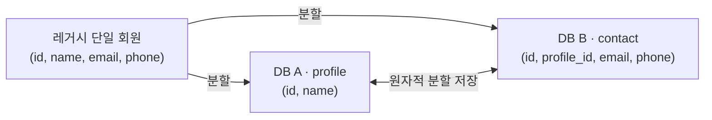
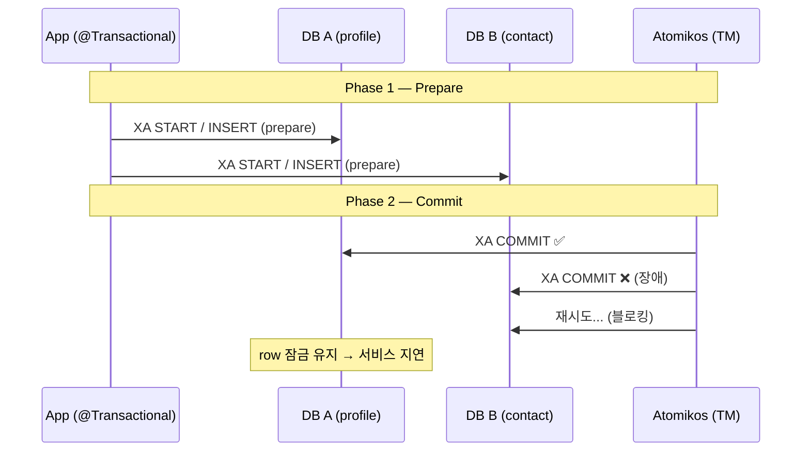
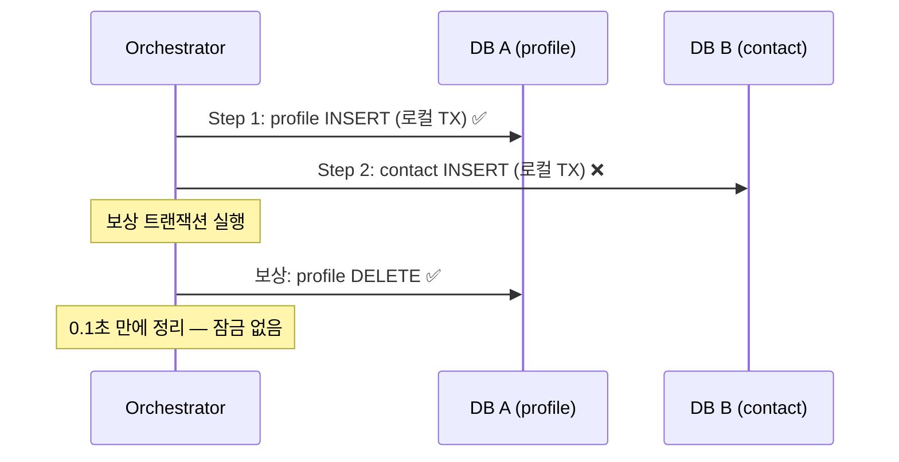
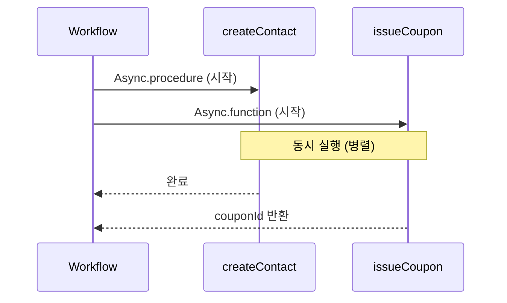
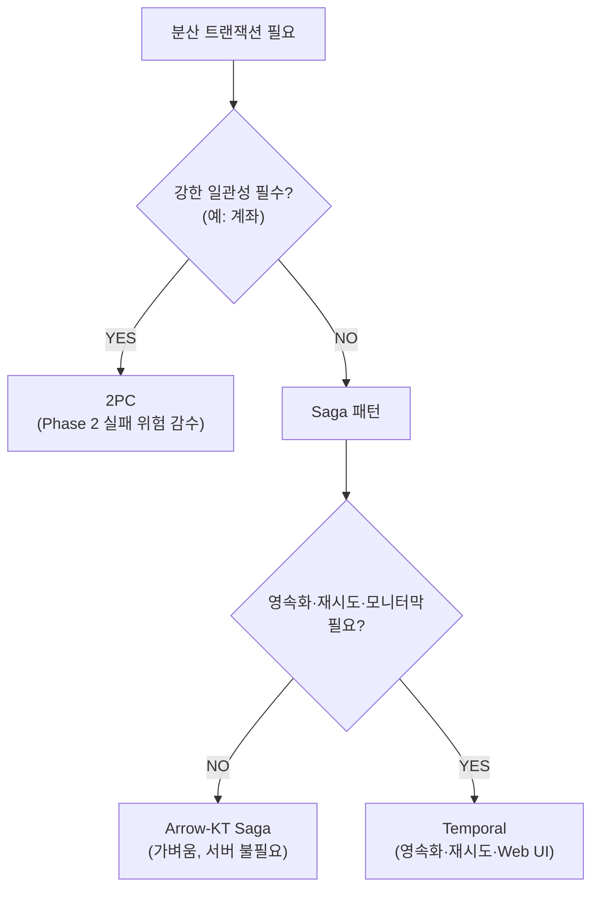

회원 시스템 무중단 마이그레이션에서 **두 개의 DB에 걸친 쓰기를 원자적으로** 처리해야 했다.
2PC(JTA/Atomikos)로 시작했다가 Phase 2 실패의 치명적 한계를 체감했고, Saga 보상 트랜잭션으로
갈아탔다. 그 과정에서 직접 구현한 SagaEngine, Arrow-KT 라이브러리, Temporal 플랫폼까지
**4가지 접근을 모두 코드로 구현·검증**했다.

이 글은 각 접근의 **장단점**을 코드, Mermaid 다이어그램, Temporal Web UI 스크린샷과 함께 정리한다.

> **전체 코드**: [distributed-tx-study](https://github.com/pallidev/distributed-tx-study)

---

## TL;DR

| 패턴 | 한 줄 평 | 언제 쓸까 |
|------|---------|----------|
| **2PC** | 강한 일관성, 하지만 Phase 2 실패 시 **되돌릴 수 없다** — 재시도는 **상대방이 살아있어야** 성공 | 계좌 등 정합성이 절대적인 도메인 |
| **Saga (직접 구현)** | 보상으로 되돌리되, 영속화·재시도가 **없다** — 되돌리기는 **내 쪽만으로** 가능 | 학습 목적, 소규모 2~3단계 |
| **Saga (Arrow-KT)** | 직접 만든 것과 동일 패턴의 **검증된 라이브러리** | 간단한 Saga, 서버 없이 쓰고 싶을 때 |
| **Saga (Temporal)** | 영속화·재시도·Web UI 포함, 하지만 **별도 서버 운영** | 대규모, 장기 실행, 모니터링 필수 |

---

## 시나리오

레거시 단일 회원 테이블을 신규 DB 2개(profile/contact)로 도메인 분할.
회원 1건을 두 DB에 나눠 저장할 때 **양쪽 쓰기의 원자성**을 각 패턴으로 구현한다.



---

## 1. 2PC (Two-Phase Commit)

### 개념

코디네이터(Atomikos)가 Phase 1(prepare) → Phase 2(commit)로 양쪽 DB를 **하나의 분산 트랜잭션**에 묶는다.



### 장점

| 장점 | 설명 |
|------|------|
| **강한 일관성 (CP)**[^cp] | 양쪽 DB가 동시에 커밋되거나 동시에 롤백 — 중간 상태 없음 |
| **개발자 친화적** | `@Transactional` 하나로 끝 — 보상 로직 작성 불필요 |
| **표준 프로토콜** | XA 표준 — MySQL, PostgreSQL 등 주요 DB가 지원 |

### 단점

| 단점 | 설명 |
|------|------|
| **Phase 2 실패 시 되돌릴 수 없다** | DB A가 이미 커밋된 후 DB B가 실패하면, DB A를 **롤백할 방법이 없다** |
| **블로킹** | 재시도가 성공할 때까지 해당 데이터가 **잠긴 상태**로 유지 — 서비스 전체 지연 |
| **코디네이터 SPOF** | Atomikos 서버가 죽으면 트랜잭션을 완료할 주체가 사라진다 |
| **영구 장애 시 수동 복구** | DB B가 영구 다운되면 재시도가 영원히 실패 — 운영자가 수동 보정 |

> **"재시도하면 되지 않나?"** — 맞다, 결국 성공한다. 하지만 재시도하는 **그 사이**에
> 데이터가 잠겨서 서비스가 멈춘다. 30초 지연이면 30초간 해당 회원에 대한 모든 요청이 대기한다.
> 코디네이터가 죽으면? 아무도 재시도하지 못해 불일치가 영속된다.

[^cp]: CP = Consistency + Partition tolerance. 네트워크 분할(장애) 시에도 **데이터 정합성을 우선**한다. 반대로 AP는 가용성을 우선하여 일시적 불일치를 허용한다.

---

## 2. Saga 패턴

### 개념

분산 트랜잭션 대신 **각 단계를 독립된 로컬 트랜잭션**으로 실행하고,
실패 시 **보상 트랜잭션(compensating transaction)**으로 되돌린다.



> **2PC vs Saga의 핵심 차이**: 2PC는 "DB B에 COMMIT을 **밀어넣기**(재시도)"이고,
> Saga는 "DB A에서 DELETE로 **되돌리기**(보상)"다. 밀어넣기는 상대방이 살아있어야 성공하지만,
> 되돌리기는 내 쪽만으로 가능하다.

### 장점

| 장점 | 설명 |
|------|------|
| **블로킹 없음** | 각 단계가 독립적인 로컬 TX — 글로벌 잠금이 없다 |
| **장애 격리** | 한 DB 장애가 다른 DB를 블로킹하지 않는다 |
| **가용성 우선 (AP)** | 일시적 불일치를 감수하고 서비스를 계속 제공 |

### 단점

| 단점 | 설명 |
|------|------|
| **일시적 불일치** | profile은 저장됐지만 contact가 없는 구간이 존재 — 클라이언트에 노출 주의 |
| **보상 로직 복잡** | 모든 단계마다 보상 액션을 직접 작성해야 함 |
| **디버깅 어려움** | 어디서 실패했는지, 어떤 보상이 실행됐는지 추적이 힘듦 (모니터링 없을 시) |
| **최종 일관성만 보장** | "즉시 일관적"이 아니다 — 비즈니스가 이를 감수해야 함 |

### 보상 트랜잭션 종류

| 정방향 | 보상 | 비고 |
|--------|------|------|
| **INSERT** | **DELETE** | 생성된 row 제거 (단순) |
| **UPDATE** | **before 이미지로 재 UPDATE** | 변경 전 값을 보관 → 되돌림 |
| **DELETE** | **(원칙적 불가)** | PK 복원·연쇄 삭제·동시성 → 마지막 단계에 배치 |

DELETE 보상이 불가한 이유: auto-increment PK를 다시 INSERT해도 원래 ID를 복원할 수 없고,
외래키가 끊어지며 CASCADE DELETE로 삭제된 자식 데이터까지 복구해야 한다.

---

## 3. Saga 구현 방식 비교 — 직접 구현 vs Arrow-KT vs Temporal

같은 Saga 패턴을 **3가지 방식**으로 구현했다. 각각의 장단점을 비교한다.

### 3-1. 직접 구현 (SagaEngine)

보상 리스트 + 역순 실행 패턴을 직접 구현한다.
(Temporal, Restate, AWS Durable Functions이 공통으로 사용하는 패턴)

```kotlin
SagaEngine(log).execute {
    val orderId = step("주문 생성", { createOrder() }, { id -> cancelOrder(id) })
    val payId   = step("결제",    { pay(orderId) },   { id -> refund(id) })
    step("재고 차감", { deductStock(orderId) })
}
// Step 3 실패 → 자동으로 refund(Step2) → cancelOrder(Step1) 역순 보상
```

| 장점 | 단점 |
|------|------|
| 패턴의 핵심을 직접 체감 | **상태 영속화 ❌** — 서버 재시작 시 유실 |
| 의존성 없음 | **자동 재시도 ❌** |
| 원하는 대로 커스터마이징 | **모니터링 ❌** — 로그를 뒤져야 함 |
| | 버그 위험 (직접 만들었으므로) |

### 3-2. Arrow-KT Saga (arrow-resilience)

직접 만든 것과 **동일한 패턴**을 검증된 라이브러리로 대체한다.

```kotlin
// Arrow-KT — saga { } + transact()
val transaction: Saga<Unit> = saga {
    val profileId = saga({ profileSvc.create(name) }) { id -> profileSvc.compensateDelete(id) }
    saga({ contactSvc.create(profileId, email, phone) }) {}
}
val result = Either.catch { transaction.transact() }
```

| 장점 | 단점 |
|------|------|
| **검증된 라이브러리** — 직접 만들 필요 없음 | 상태 영속화 ❌ (직접 구현과 동일) |
| coroutine(suspend) 기반 | 자동 재시도 ❌ |
| 별도 서버 불필요 (가벼움) | 모니터링 ❌ |
| Spring Boot와 잘 맞음 | 복잡한 Saga(분기, 병렬)는 한계 |

> **결론**: 직접 만들 이유가 없다. 가벼운 Saga가 필요하면 Arrow-KT를 쓰면 된다.
> 하지만 영속화·재시도·모니터링이 필요하면 **Temporal**로 넘어가야 한다.

### 3-3. Temporal (플랫폼)

Saga 패턴 + **상태 영속화·자동 재시도·타임아웃·Web UI**를 모두 포함한 플랫폼.

**Workflow vs Activity 분리**:

| | Workflow | Activity |
|---|---|---|
| 역할 | 순서·보상 결정 (오케스트레이션) | DB/HTTP 실제 작업 |
| 제약 | **deterministic 필수** (replay로 복구) | 제약 없음 (일반 코드) |
| 재시도 | ❌ | ✅ Temporal 자동 |
| coroutine | ❌ 금지 (Promise/Async 사용) | ✅ 가능 |

```kotlin
// Temporal — Saga 클래스
override fun registerMember(name: String, ...): String {
    val saga = newSaga()
    return try {
        val profileId = activities.createProfile(name)
        saga.addCompensation { activities.deleteProfile(profileId) }
        activities.createContact(profileId, email, phone)
        "COMPLETED"
    } catch (e: Exception) {
        saga.compensate()  // 역순 보상 + 상태 영속화 + 재시도
        "COMPENSATED"
    }
}
```

**병렬 Activity 실행** — 독립적인 작업을 동시에 실행:



| 장점 | 단점 |
|------|------|
| **상태 영속화 ✅** — 서버 재시작 시 중단 지점부터 재개 | **별도 서버 운영** — Temporal Server + DB 필요 |
| **자동 재시도 ✅** — 일시적 실패를 프레임워크가 처리 | **학습 곡선** — Workflow/Activity 개념, deterministic 제약 |
| **모니터링 ✅** — Web UI에서 실행 현황 실시간 확인 | 인프라 비용 — 소규모 팀에겐 과할 수 있음 |
| **병렬 실행 ✅** — Async/Promise로 독립 작업 동시 처리 | Workflow 내부에서 coroutine 사용 불가 |

### Temporal Web UI — 직접 확인

Docker Compose(PostgreSQL + Temporal Server + Web UI)로 실행하고 REST API를 호출하면,
Web UI에서 Workflow 실행 이력을 실시간으로 확인할 수 있다.

```bash
cd temporal-saga && docker compose up -d
TEMPORAL_WORKER_ENABLED=true ./gradlew :temporal-saga:bootRun

curl -X POST http://localhost:8082/members/parallel \
  -H "Content-Type: application/json" \
  -d '{"name":"frank","email":"frank@example.com","phone":"010-1234-5678"}'
# → COMPLETED
```

**Workflows 목록** — 실행한 모든 워크플로우가 표시된다:


**병렬 Workflow 상세** — createProfile → createContact + issueCoupon 동시 실행 타임라인:


**보상 이력** — contact 실패 후 cancelCoupon + deleteProfile 역순 보상 실행:


> **모니터링이란?** Temporal Web UI에서 Workflow 실행 현황, 각 Activity의 소요 시간,
> 실패 원인, 보상 이력을 브라우저에서 실시간으로 확인하는 기능이다.
> SagaEngine/Arrow-KT는 이런 가시성이 전혀 없다 — 문제가 생겨도 로그를 뒤져야 한다.

> **PostgreSQL 영속화**: `docker compose down` 후 `up`해도 모든 실행 이력이 유지된다.
> 메모리 기반 개발 서버와의 핵심 차이점이다.

---

## 4. 전체 비교표

| | 2PC | Saga (직접 구현) | Saga (Arrow-KT) | Saga (Temporal) |
|---|---|---|---|---|
| **일관성** | 강한 (CP) | 최종 (AP) | 최종 (AP) | 최종 (AP) |
| **검증됨** | ✅ Atomikos | ❌ 학습용 | ✅ Arrow-KT | ✅ Temporal |
| **블로킹** | 🔴 글로벌 잠금 | ✅ 없음 | ✅ 없음 | ✅ 없음 |
| **영속화** | ✅ Atomikos 로그 | ❌ | ❌ | ✅ PostgreSQL |
| **자동 재시도** | ✅ (블로킹) | ❌ | ❌ | ✅ |
| **모니터링 UI** | ❌ | ❌ | ❌ | ✅ |
| **병렬 실행** | ❌ | ❌ | ❌ | ✅ Async/Promise |
| **별도 서버** | ❌ | ❌ | ❌ | ✅ 필요 |
| **Docker** | MySQL XA | 불필요 (H2) | 불필요 (H2) | PostgreSQL + Server + UI |
| **테스트** | JUnit5 + TC | Kotest | Kotest | JUnit5 + TestWorkflowEnv |

---

## 5. 실무 의사결정 기준



### Temporal이 **과한** 경우

- 트래픽이 적고 (단계 2~3개) 일시적 실패가 드문 경우
- 인프라 팀이 Temporal Server 운영을 감당하기 어려운 소규모 팀
- Saga 단계가 단순하고 수동 복구가 가능한 경우

> 반대로 **단계가 5개 이상**, **장기 실행**(분~시간), **재시도/타임아웃이 필수**라면
> Temporal이 압도적으로 좋은 선택이다.

### Saga 일시적 중간 상태 — 클라이언트 처리

profile은 저장됐지만 contact가 없는 **일시적 불일치 구간**을 클라이언트에 노출하지 않는 패턴:

| 패턴 | 방식 |
|------|------|
| **응답 지연** | 모든 단계 완료까지 대기 (동기) |
| **PENDING 상태** | "처리 중" 응답 → 폴링/웹푸시로 완료 알림 |
| **CQRS 읽기 모델** | 쓰기는 Saga로, 읽기는 별도 조인 결과 제공 |

**Netflix, Stripe, Coinbase, DoorDash** 등이 Temporal로 수백만~수십억 워크플로우를 실행한다.
([Temporal — In Use](https://temporal.io/in-use))

---

## 마무리

| 단계 | 배운 것 |
|------|---------|
| 2PC | 강한 일관성의 약속과 Phase 2 실패의 치명적 한계 — "밀어넣기는 상대방이 살아있어야 성공" |
| Saga (직접 구현) | 보상 트랜잭션 패턴, 보상 스택 + 역순 실행 — "되돌리기는 내 쪽만으로 가능" |
| Arrow-KT Saga | 직접 만든 것과 동일한 패턴의 검증된 라이브러리 — "라이브러리가 있으면 직접 만들 필요 없음" |
| Temporal | 영속화·재시도·Web UI — "플랫폼이 필요한 이유" 체감 |

> 직접 구현해봐야 **"왜 Temporal이 필요한지"**를 체감할 수 있다.
> Temporal을 처음부터 쓰면 "마법처럼 동작"하지만, 한계를 직접 겪어봐야 가치를 안다.

### 학습 자료

- **전체 코드**: [distributed-tx-study](https://github.com/pallidev/distributed-tx-study)
- **학습 커리큘럼**: [docs/curriculum.md](https://github.com/pallidev/distributed-tx-study/blob/main/docs/curriculum.md) — 7스텝 가이드
- **심화 문서**: [docs/saga-deep-dive.md](https://github.com/pallidev/distributed-tx-study/blob/main/docs/saga-deep-dive.md) — 출처 30개
- [Pattern: Saga — microservices.io (Chris Richardson)](https://microservices.io/patterns/data/saga.html)
- [Temporal — Saga Made Easy](https://temporal.io/blog/saga-pattern-made-easy)
- [Arrow-KT — Saga](https://arrow-kt.io/learn/resilience/saga/)
