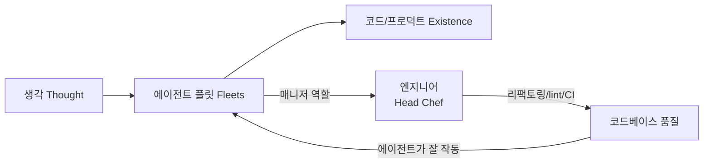

> **TL;DR**
> Cursor의 Lauren Tan·Roshan Sadanani가 MTS 팟캐스트에서 GrokBot(자기 컴퓨터를 가진 persistent 에이전트 팀)과 Grok 4.6 출시를 발표했다. 핵심 메시지: 에이전트가 코딩을 대신하는 세상에서 엔지니어는 코드 작성자가 아니라 **에이전트의 매니저**이며, 코드베이스를 "누구나 고 품질 코드를 기여할 수 있는 상태"로 유지하는 것이 새로운 역할이다.
{: .prompt-info }

## 1. 개요

2026-08-13, Cursor와 SpaceX가 Grok 4.6을 공동 발표한 날, MTS(More Than Source)가 Cursor의 **Lauren Tan**(소프트웨어 엔지니어)과 **Roshan Sadanani**(프로덕트)를 초청해 나눈 28분 대담. GrokBot 라이브 데모 + "에이전트가 소프트웨어 엔지니어링을 대체하는가?"라는 주제를 다룬다.

| 항목 | 내용 |
|------|------|
| 영상 | [Are Agents About to Replace Software Engineering?](https://youtu.be/A63sedG-p5Q) |
| 채널 | MTS (More Than Source) |
| 출연 | Lauren Tan, Roshan Sadanani (Cursor) |
| 발표 | Grok 4.6 (Cursor × SpaceX), GrokBot 베타 |
| 길이 | 28:41 |

## 2. GrokBot: 자기 컴퓨터를 가진 "디지털 동료"

GrokBot은 Cursor가 내부 PMF를 확인한 뒤 공개한 범용 에이전트 제품이다. 핵심 특징:

- **각 봇이 자신만의 컴퓨터를 가진다** — 가상 환경에 사용 중인 도구(LinkedIn, X 등)에 로그인되어 있고, Chrome을 직접 브라우징한다
- **Persistent** — 내가 자리에 없어도 계속 작동한다
- **iMessage 같은 메신저 UI** — tool call을 마이크로매니징하지 않고, 동료에게 부탁하듯 대화한다

### 데모에서 보여준 것들

출연진이 운영하는 봇 팀 (사이드바에 역할별 봇 목록):

- **Coordinator agent (chief of staff)**: 캘린더를 알고, 다른 에이전트에게 메시지를 보내 진행 상황을 점검
- **Marketing agent**: LinkedIn에 로그인해 방금 대담 중에 실제로 MTS Live 계정을 태그한 포스팅을 올림 (라이브로 성공)
- **Shoppy**: 쇼핑 담당 — IMAX 티켓 예매, 장보기 등 내부 사용 사례

버그 수정 파이프라인도 시연했다:

1. Chief of staff이 오늘 발견된 흥미로운 버그를 정리
2. 피처별로 담당을 나눈 엔지니어링 봇 팀에게 태스크를 dispatch
3. 봇들이 작업하고 PR + 스크린샷/비디오 산출
4. Lauren은 리뷰만 한다 — "GrokBot에 대한 피드백이 들어오면 내 봇들이 자동으로 고치고, 나는 코드 리뷰만 해요"

특히 흥미로운 점 두 가지:

- GrokBot 봇은 Cursor의 **cloud agent를 직접 트리거**할 수 있다 (봇 → 코드 작성 → PR)
- **GrokBot 상당 부분이 GrokBot으로 만들어졌다** — 에이전트가 이슈를 self-triage하고 코드를 쓰는 피드백 루프

### 유래: Benny

GrokBot의 뿌리는 Lauren이 만든 Slack 봇 **Benny**다. "자는 동안 에이전트가 버그를 자동으로 고쳐주면 안 될까?"에서 시작해, "모두가 자신의 봇을 정의하고 identity를 부여하고, 자기 컴퓨터와 루틴/자동화를 갖게 하면?"이라는 질문으로 제품화됐다.

## 3. 그래서, 에이전트가 엔지니어링을 대체하는가?

대담의 결론은 **"대체가 아니라 역할 변화"**다.

### 엔지니어 = 에이전트의 매니저

Roshan: "지금 내 직업은 디지털 동료들의 매니저에 가깝다" (Lauren). 엔지니어의 새 책무:

- **리팩토링/재작성 투자** — 그다리 똑똑하지 않은 에이전트도 잘 작동하는 코드베이스 만들기
- **규칙의 인코딩** — 스타일 가이드를 lint rule, CI에서 실패하는 하드 컨스트레인트로
- **코드베이스를 개방 상태로 유지** — PM, 디자이너가 고 품질 코드를 기여할 수 있게 하는 것이 큰 unlock

### Michelin 키친 비유

Lauren이 가장 인상적으로 설명한 은유:

> 나는 이제 모든 요리를 직접 하지 않는다. 스킬과 리팩토링으로 "훈련시킨" 봇 팀을 고용했고, 나는 head chef다. 접시를 플레이팅하고 품질 관리를 소유한다. 팀의 모든 엔지니어가 이런 팀을 하나씩 가진다면 훨씬 많은 문제를 풀 수 있다. (물론 만들지 말아야 할 기능도 있지만)

실제로 Lauren은 다른 1명과 함께 에이전트로 대규모 리팩토링/마이그레이션을 수행했다 — 원래 팀 단위로 수개월~수년이 걸릴 작업이었다고.

### 수요는 오히려 늘고 있다

호스트의 관찰: "에이전트가 다 코딩하는데 엔지니어 역할이 뭐냐"는 외부 우려와 달리, 현장에서는 **그 어느 때보다 엔지니어 수요가 높다**. 생각→실행 사이클이 압축될수록 만들 수 있는 것이 늘어나기 때문.

## 4. Grok 4.6: 비용 경제학

이날 발표된 Grok 4.6의 벤치마크 (호스트 언급, Cursor Bench 3.2):

| 모델 | 점수 | 태스크당 평균 비용 |
|------|------|------|
| **Grok 4.6 (extra high)** | **70.8%** | **$2.81** |
| Fable 5 Max | 70.5% | $17.32 |

동급 성능을 **1/6 이하 비용**으로 낸다는 것. Roshan의 설명:

- "예산 $20로 태스크당 비용이 내려가면, 그냥 더 많은 태스크를 할 수 있다"
- Lauren: 무제한 토큰을 쓰는 자신과 달리 비용에 민감한 고객에게 효율 모델은 중요한 선택지
- 이는 스타트업·인디 해커의 접근성을 높이는 leveling effect

또한 Grok 4.5 출시 때부터 SpaceX AI 팀과 "코드 이상을 위한 모델 훈련"을 논의해왔으며, Grok 4.6과 GrokBot 투자로 그 방향이 이어지고 있다고.

## 5. 디자인 철학: "keep it simple"

- 기존 AI 앱은 파워와 복잡성이 트레이드오프였다. GrokBot의 브리프는 단순함 우선
- Cursor는 코딩 특화 파워 유저용(노브와 휘슬이 많음), GrokBot은 "동료와 대화" 관점에서 재설계
- 모 친온보딩 사례 — OpenClaw는 얼리어답터용이지만(호스트: "우리 엄마는 절대 안 쓸 것, 내 OpenClaw도 자주 깨진다"), GrokBot은 메인스트림을 겨냥

### 로드맵 힌트

- iMessage로 봇과 문자하기 (Lauren이 초기에 직접 해킹해서 넣었던 기능, 흔한 요청)
- "Slack뿐 아니라 문자도 하고 전화도 걸 수 있는 always-on 동료" — 언제 어디서나 대화 가능한 에이전트
- Lauren이 개인적으로 기대하는 것: performance와 reliability

## 6. 결론

이 대담의 답은 명확하다. **에이전트는 소프트웨어 엔지니어링을 대체하는 게 아니라, 엔지니어링의 병목을 제거한다.** 아이디어→존재 파이프라인의 병목이 사라질수록 더 많은 것을 만들 수 있고, 그 세상에서 엔지니어의 가치는 코드 타이핑이 아니라 (1) 에이전트가 잘 작동하는 코드베이스를 만드는 것, (2) taste로 방향을 잡아주는 것으로 이동한다.

백엔드 개발자인 내 관점에서 주목할 지점: "스타일 가이드를 lint rule/CI 하드 컨스트레인트로 인코딩"이라는 조언은 이미 Claude Code 시대의 실무 표준이 되고 있다. 에이전트 시대의 엔지니어링은 이제 이론이 아니라 Cursor 내부에서 매일 일어나는 일이다.

> 원본: [Are Agents About to Replace Software Engineering? — Lauren Tan and Roshan Sadanani, MTS](https://youtu.be/A63sedG-p5Q)
