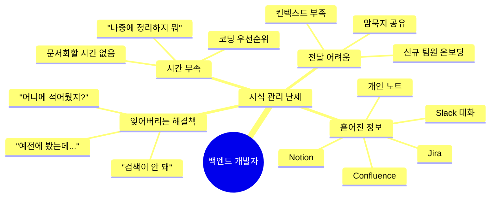
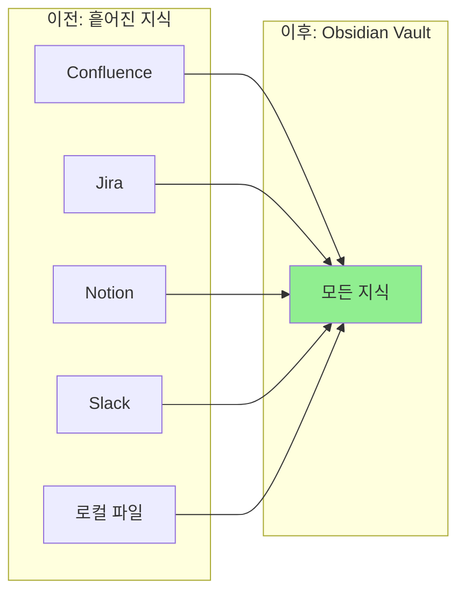

# 왜 Claude Code + Obsidian인가?

백엔드 개발자가 겪는 지식 관리의 난제를 Claude Code와 Obsidian의 조합으로 해결하는 방법을 알아봅니다.

## 개요

백엔드 개발자는 복잡한 시스템, 비즈니스 로직, 트러블슈팅 기록을 체계적으로 관리해야 합니다. Claude Code의 AI 역량과 Obsidian의 지식 구조화 기능을 결합하면 완벽한 지식 관리 시스템을 구축할 수 있습니다.

## 학습 목표

- [ ] 백엔드 개발자의 지식 관리 난제 이해하기
- [ ] Claude Code와 Obsidian의 각각 장점 파악하기
- [ ] 두 도구의 시너지 효과 이해하기

---

## 백엔드 개발자의 지식 관리 난제

### 흔한 문제 상황



### 실제 사례

**상황 1: 재발하는 에러**
```
Q: "Redis 타임아웃 에러가 다시 발생했어. 예전에 해결했었는데..."
A: "Confluence에 정리해둔 것 같은데, 어디였지?"
→ 30분 동안 검색, 결론: "그냥 다시 코드 분석하자"
```

**상황 2: 신규 팀원 온보딩**
```
신규 팀원: "이 시스템 아키텍처 문서 있나요?"
나: "응, 근데 Confluence도 아니고 노션도 아니고..."
→ 결과: 3시간 동안 구두 설명 + 화면 공유
```

**상황 3: 기술 검토**
```
팀장: "Kafka 도입 검토 문서 좀 정리해줘"
나: (생각) "내가 어디서 봤는데... 블로그? 유튜브? 공식 문서?"
→ 결과: 처음부터 다시 조사
```

---

## Claude Code의 강점

### 1. 노트를 읽고 이해하는 AI

Claude Code는 MCP(Model Context Protocol)를 통해 Obsidian vault에 직접 접근할 수 있습니다.

```markdown
# 가능한 일
- "최근 트러블슈팅 노트들을 요약해줘"
- "Spring Data Redis 관련 모든 노트 찾아줘"
- "이번 주에 해결한 이슈들을 분류해줘"
```

### 2. 자동 정리와 요약

```markdown
# Claude가 해주는 일
❌ 수동: 에러 로그 복사 → 원인 분석 → 해결책 정리 → 재발 방지 작성
✅ 자동: 로그 붙여넣기 → Claude가 자동 정리 → 검토 후 저장
```

### 3. 지식 간의 연결 발견

```markdown
# Claude의 연결 능력
"이 Redis 이슈가 지난번에 해결했던 Kafka 랙 문제와
비슷한 패턴이야. 둘 다 커넥션 풀 설정 문제였지?"
```

---

## Obsidian의 장점

### 1. 모든 지식을 한 곳에서



### 2. 백링크로 지식 그래프 형성

Obsidian의 가장 강력한 기능은 **Wiki Links**와 **백링크**입니다.

```markdown
# 노트 A: Spring Data Redis 동시성 이슈
해결책: RedisTemplate을 직접 사용해서 HINCRBY 명령어로
원자적 업데이트

관련 링크:
- [[Redis 데이터 구조]]
- [[동시성 제어 패턴]]

# 노트 B: 동시성 제어 패턴
백링크:
- [[Spring Data Redis 동시성 이슈]] ← 자동 연결!
```

### 3. 강력한 검색

- **전체 텍스트 검색**: 모든 노트의 내용을 검색
- **태그 검색**: `#troubleshooting`, `#spring`, `#redis`
- **Dataview 쿼리**: SQL처럼 노트를 조회

```markdown
## Dataview 예시
```dataview
TABLE file.ctime as "생성일", status as "상태"
FROM #troubleshooting
WHERE contains(tags, "redis")
SORT file.ctime DESC
```

### 4. Git으로 버전 관리

```bash
# 모든 지식의 변경 이력 추적
git log --all --graph --oneline

# 팀과 공유
git push origin main
```

---

## 두 도구의 시너지 효과

### 비교표

| 기능 | Claude Code만 | Obsidian만 | **Claude + Obsidian** |
|------|---------------|------------|---------------------|
| 노트 작성 | AI가 자동 생성 | 수동 작성 | AI가 템플릿 적용해서 자동 생성 |
| 검색 | AI가 이해하고 답변 | 키워드 검색 | AI가 의도를 파악해서 검색 |
| 연결 | 자동으로 연결 제안 | 백링크로 수동 연결 | AI가 관련 노트 찾아서 연결 |
| 정리 | AI가 자동 요약 | 수동 정리 | AI가 패턴을 찾아서 분류 |
| 시각화 | 텍스트 출력 | Mermaid 다이어그램 | AI가 다이어그램 생성 |

### 실전 시나리오

#### 시나리오 1: 트러블슈팅 문서화

**이전 (Obsidian만)**
```
1. 템플릿 찾기
2. 에러 로그 복사
3. 원인 분석 작성
4. 해결책 코드 작성
5. 재발 방지 작성
6. 관련 노트 찾아서 링크
→ 30분 소요
```

**이후 (Claude + Obsidian)**
```
1. Claude에게: "이 에러 로그로 트러블슈팅 문서 만들어줘"
2. Claude가 자동으로 템플릿 적용, 내용 정리, 관련 노트 연결
3. 검토 후 저장
→ 5분 소요
```

#### 시나리오 2: 주간 회고 작성

**이전**
```
1. 일일 노트 7개를 모두 열어서 확인
2. 주요 성과 추출
3. 이슈 정리
4. 다음 주 계획 수립
→ 45분 소요
```

**이후**
```
1. Claude에게: "이번 주 일일 노트들로 주간 회고 작성해줘"
2. Claude가 자동으로 분석, 정리, 생성
3. 검토 후 보완
→ 10분 소요
```

#### 시나리오 3: 기술 학습 정리

**이전**
```
1. 유튜브 보면서 메모
2. 나중에 정리하려고 하면... 망각
3. 다시 보기
→ 무한 반복
```

**이후**
```
1. Claude에게: "이 영상 내용을 요약하고 핵심만 정리해줘"
2. Claude가 영상 스크립트 분석, 핵심 추출
3. 내 언어로 재작성 요청
4. 영구 메모로 저장
→ 즉시 지식화
```

---

## 다른 도구와의 비교

### Notion vs Obsidian

| 측면 | Notion | Obsidian |
|------|--------|----------|
| 데이터 소유권 | 클라우드 (종속적) | 로컬 (완전 소유) |
| 속도 | 웹 기반 (느림) | 로컬 앱 (빠름) |
| 커스터마이징 | 제한적 | 무제한 |
| AI 연동 | Notion AI (유료) | Claude Code (무료) |
| Git 통합 | 불가능 | 완벽 지원 |
| 오프라인 | 제한적 | 완전 지원 |

### Confluence vs Obsidian

| 측면 | Confluence | Obsidian |
|------|------------|----------|
| 대상 | 팀 문서화 | 개인 지식 관리 |
| 작성 편의성 | UI 클릭 (번거로움) | Markdown (빠름) |
| 검색 | 느림 | 즉시 |
| 비용 | 유료 (팀 단위) | 무료 (개인) |
| AI 연동 | 없음 | Claude Code |

---

## 실제 효과

### 사용자 후기 (가상의 사례)

**사례 1: 백엔드 개발자 (경력 3년)**
```
이전: 같은 에러 3번까지 반복
이후: 첫 발생 시 문서화 → 재발 시 즉시 해결

시간 절감: 주당 2시간
```

**사례 2: 팀 리드**
```
이전: 온보딩에 2주 소요
이후: 온보딩 문서 자동화 → 3일로 단축

신규 팀원 만족도: ↑
```

**사례 3: 스타트업 CTO**
```
이전: 기술 검토할 때마다 처음부터
이후: 과거 검토 내용 즉시 참고

의사결정 속도: 2배 향상
```

---

## 실습 과제

- [ ] 현재 본인이 사용하는 지식 관리 도구와 문제점을 정리해보세요
- [ ] Confluence, Notion 등에 흩어진 문서를 확인해보세요
- [ ] "예전에 봤는데 기억 안 나는" 해결책이 있는지 생각해보세요

## 참고 자료

- [Claude Code 공식 문서](https://docs.anthropic.com/claude-code)
- [Obsidian 공식 문서](https://help.obsidian.md/)
- [MCP 프로토콜 소개](https://modelcontextprotocol.io/)
- [Zettelkasten 방법론](https://zettelkasten.de/)

---

## 다음 단계

개념을 이해했으니, 실제로 설치하고 설정해봅시다.

→ [[02-installation|설치 및 초기 설정]]으로 계속하세요
