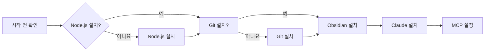
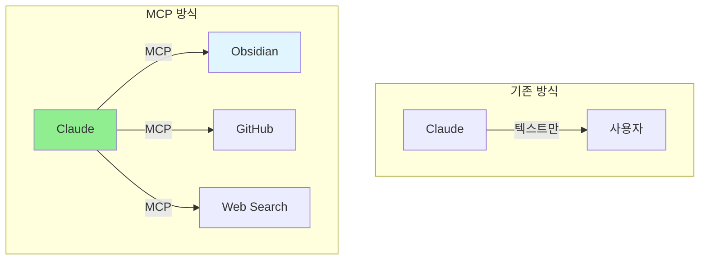

# 설치 및 초기 설정

Obsidian과 Claude Code를 설치하고, MCP 서버를 통해 연동하는 방법을 단계별로 안내합니다.

## 개요

이 가이드에서는 Obsidian, Claude Code, 그리고 두 도구를 연결하는 MCP 서버를 설치하는 전 과정을 다룹니다.

## 학습 목표

- [ ] Obsidian 설치 및 기본 설정 완료
- [ ] Claude Code 설치 및 실행
- [ ] MCP 서버 설치 및 설정
- [ ] Obsidian REST API 플러그인 설정
- [ ] 연동 테스트

---

## 전제 조건

이 가이드를 시작하기 전에 다음이 필요합니다:



### 필요한 것

| 항목 | 버전 | 확인 명령어 |
|------|------|------------|
| Node.js | 18+ | `node --version` |
| npm | 9+ | `npm --version` |
| Git | 2.30+ | `git --version` |
| Obsidian | 1.0+ | - |
| Claude Code | 최신 | - |

---

## Step 1: Obsidian 설치 및 설정

### 1.1 Obsidian 다운로드

1. [Obsidian 공식 웹사이트](https://obsidian.md/) 접속
2. OS에 맞는 버전 다운로드
   - macOS: dmg 파일
   - Windows: exe 파일
   - Linux: AppImage

### 1.2 Vault 생성


**권장 폴더 구조**

```
Documents/
└── mynote/
    ├── .obsidian/
    └── (빈 vault 시작)
```

### 1.3 필수 플러그인 설치

Obsidian 설정 → 서드파티 플러그인 → 검색

| 플러그인 | 용도 | 필수 여부 |
|----------|------|----------|
| **Obsidian Local REST API** | MCP 연동 | ⭐ 필수 |
| Dataview | 동적 쿼리 | ⭐ 추천 |
| Excalidraw | 다이어그램 | ⭐ 추천 |
| Templates | 템플릿 관리 | ⭐ 추천 |
| Daily Notes | 일일 노트 | ⭐ 추천 |

---

## Step 2: Obsidian Local REST API 설정

### 2.1 플러그인 설치

1. 설정 → 서드파티 플러그인
2. "찾아보기" 클릭
3. "Obsidian Local REST API" 검색
4. 설치 및 활성화

### 2.2 API Key 생성


**생성된 API Key 예시**
```
obsidian-api-key-xxxx-xxxx-xxxx-xxxxxxxxxxxx
```

⚠️ **중요**: 이 API Key를 안전하게 보관하세요. MCP 설정에 필요합니다.

### 2.3 포트 설정

기본값: `27123`


**동작 확인**

```bash
# 터미널에서 API 테스트
curl -X GET http://127.0.0.1:27123 \
  -H "Authorization: Bearer YOUR_API_KEY"
```

성공하면 다음과 같은 응답:
```json
{
  "status": "ok",
  "version": "1.0.0"
}
```

---

## Step 3: Claude Code 설치

### 3.1 Claude Code 설치

```bash
# macOS / Linux
npm install -g @anthropic-ai/claude-code

# Windows (PowerShell)
npm install -g @anthropic-ai/claude-code
```

### 3.2 설치 확인

```bash
claude --version
```

### 3.3 인증

```bash
claude auth login
```

브라우저가 열리고 Anthropic 계정으로 로그인합니다.

---

## Step 4: MCP 서버 설정

### 4.1 MCP란 무엇인가?

**MCP (Model Context Protocol)**는 AI 모델이 외부 도구와 데이터 소스에 접근할 수 있게 해주는 프로토콜입니다.



### 4.2 MCP 서버 설치

```bash
# Obsidian MCP 서버 설치
npm install -g obsidian-mcp-server
```

### 4.3 .mcp.json 설정

Claude Code 설정 파일을 생성합니다:

```bash
# macOS / Linux
~/.claude/.mcp.json

# Windows
%APPDATA%\claude\.mcp.json
```

**설정 파일 내용**

```json
{
  "mcpServers": {
    "obsidian": {
      "command": "npx",
      "args": ["-y", "obsidian-mcp-server"],
      "env": {
        "OBSIDIAN_VAULT_PATH": "/Users/사용자명/Documents/mynote",
        "OBSIDIAN_REST_API_PORT": "27123",
        "OBSIDIAN_API_KEY": "obsidian-api-key-xxxx-xxxx-xxxx-xxxxxxxxxxxx"
      }
    }
  }
}
```

⚠️ **주의**: 각 환경 변수를 본인 설정에 맞게 수정하세요:

| 환경 변수 | 설명 | 예시 |
|-----------|------|------|
| `OBSIDIAN_VAULT_PATH` | Vault의 절대 경로 | `/Users/jonginkim/Documents/mynote` |
| `OBSIDIAN_REST_API_PORT` | REST API 포트 | `27123` |
| `OBSIDIAN_API_KEY` | 생성한 API Key | `obsidian-api-key-xxx...` |

### 4.4 Vault 경로 찾기

```bash
# macOS / Linux
pwd

# Obsidian에서 Vault 우클릭 → "Reveal in Finder"
```

---

## Step 5: 연동 테스트

### 5.1 Claude Code 실행

```bash
claude
```

### 5.2 연동 확인

Claude Code에서 다음과 같이 질문해보세요:

```markdown
"내 Obsidian vault에 현재 몇 개의 노트가 있어?"
```

성공하면 Claude가 실제 노트 수를 답변합니다.

```markdown
"최근에 수정한 노트 3개를 보여줘"
```

```markdown
"Projects 폴더에 어떤 노트들이 있어?"
```

### 5.3 첫 번째 노트 생성

```markdown
"테스트 노트를 하나 만들어줘. 제목은 'MCP 연동 테스트'고,
내용은 연동이 성공적으로 완료되었다는 내용이야."
```

---

## 트러블슈팅

### 문제 1: MCP 연결 실패

**에러 메시지**
```
Error: Failed to connect to Obsidian REST API
```

**해결 방법**

1. Obsidian이 실행 중인지 확인
2. REST API 플러그인이 활성화되어 있는지 확인
3. 포트가 올바른지 확인 (기본: 27123)
4. API Key가 올바른지 확인

```bash
# API 테스트
curl -X GET http://127.0.0.1:27123 \
  -H "Authorization: Bearer YOUR_API_KEY"
```

### 문제 2: Vault 경로 오류

**에러 메시지**
```
Error: Vault path not found
```

**해결 방법**

1. 경로가 절대 경로인지 확인
2. 경로에 공백이나 특수문자가 없는지 확인
3. 경로 끝에 슬래시(/)가 없는지 확인

```bash
# 올바른 예
/Users/jonginkim/Documents/mynote

# 잘못된 예
~/Documents/mynote
/mynote/
```

### 문제 3: 권한 오류

**에러 메시지**
```
Error: Permission denied
```

**해결 방법**

1. Vault 폴더의 쓰기 권한 확인
2. Obsidian 실행 권한 확인

```bash
# macOS
xattr -d com.apple.quarantine /Applications/Obsidian.app
```

---

## 실습 과제

- [ ] Obsidian 설치 및 Vault 생성
- [ ] REST API 플러그인 설치 및 API Key 생성
- [ ] Claude Code 설치 및 인증
- [ ] MCP 서버 설정
- [ ] 연동 테스트 (Claude에게 노트 목록 요청)
- [ ] 첫 번째 노트 생성

---

## 다음 단계

설치가 완료되었습니다! 이제 MCP 서버에 대해 더 깊이 알아봅시다.

→ [[03-mcp-deep-dive|MCP 서버 심화]]로 계속하세요

---

## 참고 자료

- [Obsidian REST API 문서](https://github.com/obsidianmd/obsidian-local-rest-api)
- [Claude Code 설치 가이드](https://docs.anthropic.com/claude-code)
- [MCP 프로토콜 사양](https://modelcontextprotocol.io/)
- [Obsidian MCP Server GitHub](https://github.com/souvikinator/obsidian-mcp-server)
