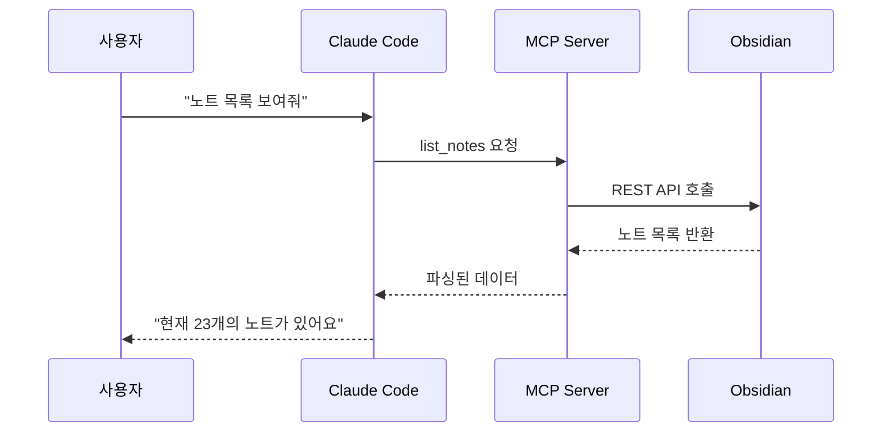
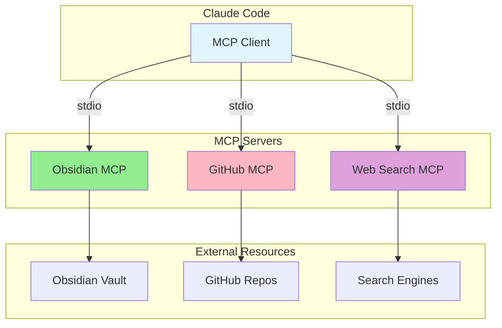
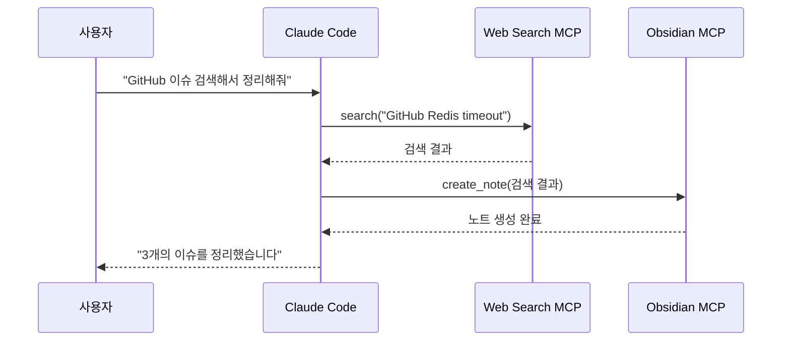
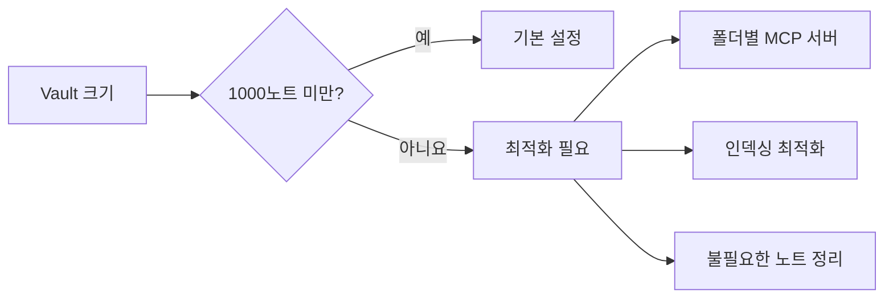

# MCP 서버 심화

MCP(Model Context Protocol)의 개념을 이해하고 고급 설정과 트러블슈팅 방법을 배웁니다.

## 개요

MCP는 AI 모델이 외부 도구와 상호작용할 수 있게 해주는 프로토콜입니다. 이 가이드에서는 MCP의 작동 원리와 Obsidian MCP 서버의 고급 기능을 다룹니다.

## 학습 목표

- [ ] MCP의 작동 원리 이해
- [ ] MCP 서버의 고급 설정
- [ ] 여러 MCP 서버 함께 사용
- [ ] 성능 최적화

---

## MCP란 무엇인가?

### 기본 개념

**MCP (Model Context Protocol)**는 AI 모델이 외부 리소스에 접근하고 작업을 수행할 수 있게 해주는 표준 프로토콜입니다.



### MCP의 핵심 구성 요소

| 구성 요소 | 설명 | 예시 |
|-----------|------|------|
| **Server** | 외부 리소스와 AI를 연결 | Obsidian MCP Server |
| **Tools** | AI가 호출할 수 있는 기능 | `read_note`, `search`, `create_note` |
| **Resources** | AI가 읽을 수 있는 데이터 | 노트 내용, 메타데이터 |
| **Prompts** | 재사용 가능한 프롬프트 템플릿 | "트러블슈팅 문서화" |

---

## MCP 아키텍처

### 1단계: 클라이언트-서버 통신



### 2단계: 메시지 교환

MCP는 **stdin/stdout**을 통해 JSON-RPC 형식의 메시지를 교환합니다.

```json
// 요청 예시
{
  "jsonrpc": "2.0",
  "id": 1,
  "method": "tools/call",
  "params": {
    "name": "obsidian_read_note",
    "arguments": {
      "path": "Projects/study/redis.md"
    }
  }
}

// 응답 예시
{
  "jsonrpc": "2.0",
  "id": 1,
  "result": {
    "content": "# Redis 공부\n\n...",
    "metadata": {
      "created": "2025-01-10",
      "tags": ["study", "redis"]
    }
  }
}
```

---

## Obsidian MCP 서버 상세

### 사용 가능한 도구(Tools)

| 도구 이름                  | 설명       | 사용 예시              |
| ---------------------- | -------- | ------------------ |
| `obsidian_read_note`   | 노트 내용 읽기 | "Redis 노트 읽어줘"     |
| `obsidian_create_note` | 새 노트 생성  | "트러블슈팅 문서 만들어줘"    |
| `obsidian_update_note` | 기존 노트 수정 | "이 노트에 내용 추가해줘"    |
| `obsidian_delete_note` | 노트 삭제    | "이 테스트 노트 삭제해줘"    |
| `obsidian_search`      | 노트 검색    | "Kafka 관련 노트 찾아줘"  |
| `obsidian_list_notes`  | 노트 목록    | "최근 노트들 보여줘"       |
| `obsidian_get_graph`   | 백링크 그래프  | "이 노트와 연결된 것들 보여줘" |

### 실제 사용 예시

#### 1. 노트 읽기

```markdown
사용자: "Projects/study/redis.md 노트를 읽어줘"

Claude의 내부 동작:
1. obsidian_read_note 도구 호출
2. 경로: Projects/study/redis.md
3. 내용 반환 및 요약
```

#### 2. 노트 검색

```markdown
사용자: "Redis 관련된 모든 노트를 찾아줘"

Claude의 내부 동작:
1. obsidian_search 도구 호출
2. 검색어: "redis"
3. 결과:
   - Projects/study/redis.md
   - Troubleshooting/redis-timeout.md
   - Clippings/redis-best-practices.md
```

#### 3. 노트 생성

```markdown
사용자: "오늘 발생한 에러를 문서화해줘"

Claude의 내부 동작:
1. obsidian_create_note 도구 호출
2. 템플릿 적용
3. 사용자 입력 내용 정리
4. Troubleshooting/ 폴더에 저장
```

---

## 여러 MCP 서버 함께 사용

### 설정 예시

```json
{
  "mcpServers": {
    "obsidian": {
      "command": "npx",
      "args": ["-y", "obsidian-mcp-server"],
      "env": {
        "OBSIDIAN_VAULT_PATH": "/Users/jonginkim/Documents/mynote",
        "OBSIDIAN_REST_API_PORT": "27123",
        "OBSIDIAN_API_KEY": "your-api-key"
      }
    },
    "github": {
      "command": "npx",
      "args": ["-y", "@modelcontextprotocol/server-github"],
      "env": {
        "GITHUB_TOKEN": "your-github-token"
      }
    },
    "web-search": {
      "command": "npx",
      "args": ["-y", "@modelcontextprotocol/server-brave-search"],
      "env": {
        "BRAVE_API_KEY": "your-brave-api-key"
      }
    }
  }
}
```

### 함께 사용하는 예시

```markdown
사용자: "최근 GitHub 이슈를 검색해서 Obsidian에 정리해줘"

Claude의 동작:
1. web-search 서버로 GitHub 이슈 검색
2. obsidian 서버로 결과 정리 및 노트 생성
3. 두 서버의 데이터 결합
```



---

## 성능 최적화

### 1. Vault 크기 관리

대용량 Vault의 경우 검색 속도가 느려질 수 있습니다.



**최적화 팁**

| 문제 | 해결 방법 |
|------|----------|
| 검색이 느림 | Dataview 인덱스 재구성 |
| 메모리 사용량 높음 | Vault 분리 또는 MCP 서버 재시작 |
| 파일 동기화 지연 | Git LFS 고려 |

### 2. 캐싱 전략

```json
{
  "mcpServers": {
    "obsidian": {
      "command": "npx",
      "args": ["-y", "obsidian-mcp-server"],
      "env": {
        "OBSIDIAN_VAULT_PATH": "/path/to/vault",
        "CACHE_ENABLED": "true",
        "CACHE_TTL": "300"
      }
    }
  }
}
```

### 3. 동시 요청 처리

여러 MCP 서버를 병렬로 호출할 수 있습니다.

```markdown
사용자: "GitHub 이슈와 내 노트를 함께 검색해줘"

Claude는 병렬로:
1. GitHub MCP → 이슈 검색
2. Obsidian MCP → 관련 노트 검색

→ 두 결과를 결합하여 응답
```

---

## 고급 기능

### 1. 커스텀 프롬프트

재사용 가능한 프롬프트를 정의할 수 있습니다.

```json
{
  "mcpServers": {
    "obsidian": {
      "command": "npx",
      "args": ["-y", "obsidian-mcp-server"],
      "prompts": {
        "troubleshooting": {
          "description": "트러블슈팅 문서를 생성합니다",
          "arguments": [
            {
              "name": "error_log",
              "description": "에러 로그",
              "required": true
            },
            {
              "name": "solution",
              "description": "해결책",
              "required": true
            }
          ]
        }
      }
    }
  }
}
```

### 2. 워크플로우 자동화

```markdown
사용자: "/troubleshoot 에러로그와 해결책"

Claude가 자동으로:
1. Troubleshooting 폴더 확인
2. 템플릿 적용
3. 관련 노트 검색
4. 백링크 생성
5. 일일 노트에 링크 추가
```

### 3. 이벤트 기반 트리거

```javascript
// Obsidian 스크립트 예시
// 노트가 수정될 때 자동으로 Claude에게 전송

const { obsidian } = app.plugins.plugins['obsidian-local-rest-api'];

app.vault.on('modify', (file) => {
  if (file.extension === 'md') {
    // Claude에게 알림
    notifyClaude({
      type: 'note_modified',
      path: file.path,
      content: await app.vault.read(file)
    });
  }
});
```

---

## 트러블슈팅

### 문제 1: MCP 서버가 응답하지 않음

**증상**
```
Claude가 계속 "thinking..." 상태
```

**진단**

```bash
# MCP 서버 로그 확인
DEBUG=* claude

# 또는
claude --verbose
```

**해결 방법**

1. MCP 서버 재시작
2. Obsidian 재시작
3. 포트 충돌 확인

```bash
# 포트 확인
lsof -i :27123

# 프로세스 종료
kill -9 <PID>
```

### 문제 2: 한글 깨짐

**증상**
```
노트 내용의 한글이 깨져서 보임
```

**해결 방법**

```json
{
  "mcpServers": {
    "obsidian": {
      "env": {
        "ENCODING": "UTF-8"
      }
    }
  }
}
```

### 문제 3: 대용량 파일 처리 실패

**증상**
```
큰 노트를 읽을 때 타임아웃
```

**해결 방법**

```json
{
  "mcpServers": {
    "obsidian": {
      "env": {
        "MAX_FILE_SIZE": "10485760",
        "TIMEOUT": "30000"
      }
    }
  }
}
```

---

## 실습 과제

- [ ] MCP 로그를 확인하여 Claude와 Obsidian 간의 통신 이해하기
- [ ] 여러 MCP 서버 설정하고 함께 사용해보기
- [ ] 커스텀 프롬프트 정의해보기
- [ ] 성능 모니터링하고 최적화하기

---

## 참고 자료

- [MCP 프로토콜 사양](https://spec.modelcontextprotocol.io/)
- [Obsidian MCP Server 소스 코드](https://github.com/souvikinator/obsidian-mcp-server)
- [MCP 서버 예제 모음](https://github.com/modelcontextprotocol)

---

## 다음 단계

MCP를 이해했으니, 실제로 노트를 작성해봅시다.

→ [[04-first-steps|첫 노트 작성하기]]로 계속하세요
