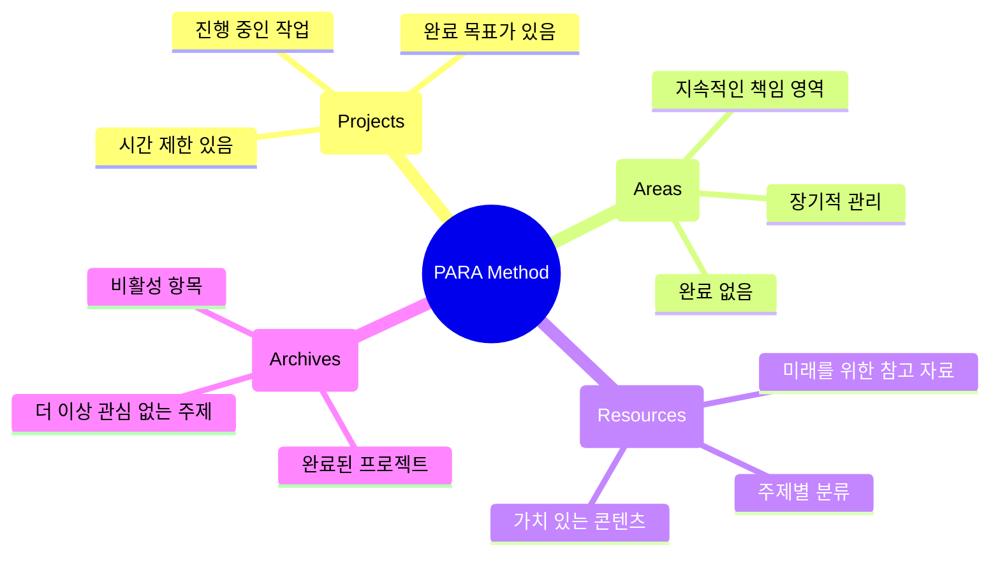
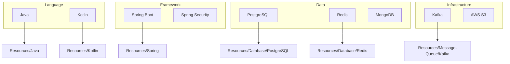
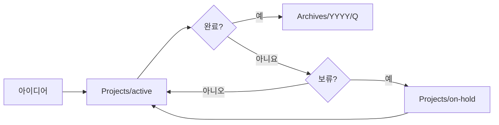

# 백엔드 개발자를 위한 Vault 설계

PARA Method를 백엔드 개발자에게 맞게 적용하고, 기술 스택별로 체계적인 Vault 구조를 설계합니다.

## 개요

효과적인 지식 관리를 위해서는 체계적인 폴더 구조가 필수입니다. 이 가이드에서는 PARA Method를 백엔드 개발 관점에서 해석하고, 실제로 적용 가능한 Vault 구조를 제안합니다.

## 학습 목표

- [ ] PARA Method 이해
- [ ] 백엔드 개발자를 위한 PARA 적용
- [ ] 기술 스택별 분류 전략
- [ ] 프로젝트 기반 문서 관리

---

## PARA Method란?

### 4가지 카테고리



### 백엔드 개발자로의 해석

| 카테고리 | 일반적 의미 | 백엔드 개발자 예시 |
|----------|------------|------------------|
| **Projects** | 완료할 작업 | "신규 주문 API 개발", "Kafka 도입" |
| **Areas** | 지속적 책임 | "API 설계", "데이터베이스", "모니터링" |
| **Resources** | 참고 자료 | "Spring Best Practices", "Redis 튜토리얼" |
| **Archives** | 완료/비활성 | "2024년 프로젝트", "레거시 시스템 문서" |

---

## 백엔드 개발자를 위한 Vault 구조

### 전체 구조

```
mynote/
├── 📁 Projects/              # 진행 중인 프로젝트
│   ├── 📁 active/            # 현재 활발한 작업
│   └── 📁 on-hold/           # 일시 중단
│
├── 📁 Areas/                 # 지속적 관리 영역
│   ├── 📁 Architecture/      # 시스템 아키텍처
│   ├── 📁 API-Design/        # API 설계
│   ├── 📁 Database/          # 데이터베이스
│   ├── 📁 DevOps/            # 배포/운영
│   └── 📁 Monitoring/        # 모니터링
│
├── 📁 Resources/             # 기술 자료
│   ├── 📁 Java/              # Java 관련
│   ├── 📁 Kotlin/            # Kotlin 관련
│   ├── 📁 Spring/            # Spring Framework
│   ├── 📁 Database/          # DB 자료
│   ├── 📁 Message-Queue/     # Kafka, RabbitMQ
│   └── 📁 System-Design/     # 설계 패턴
│
├── 📁 Archives/              # 완료된 프로젝트
│   ├── 📁 2024/              # 연도별
│   └── 📁 2023/
│
├── 📁 Daily/                 # 일일 기록
│   └── 📄 YYYY-MM-DD.md
│
├── 📁 Troubleshooting/       # 트러블슈팅 기록
│   ├── 📁 spring/
│   ├── 📁 redis/
│   ├── 📁 kafka/
│   └── 📁 postgresql/
│
├── 📁 API-Docs/              # API 명세서
│   ├── 📁 user-service/
│   ├── 📁 order-service/
│   └── 📁 product-service/
│
├── 📁 Meetings/              # 회의 기록
│   ├── 📁 1on1/
│   ├── 📁 sprint-planning/
│   └── 📁 retrospective/
│
├── 📁 Templates/             # 템플릿
│   ├── 📄 troubleshooting.md
│   ├── 📄 api-spec.md
│   └── 📄 system-design.md
│
└── 📁 Guides/                # 가이드 문서
    └── 📁 Claude-Obsidian-Guide/
```

### 각 폴더 상세

#### 1. Projects (진행 중인 프로젝트)

```
Projects/
├── active/
│   ├── ai-smart-convenience-pack/
│   │   ├── 📄 overview.md
│   │   ├── 📄 architecture.md
│   │   ├── 📄 api-specs/
│   │   └── 📄 meetings/
│   │
│   ├── kafka-migration/
│   │   ├── 📄 proposal.md
│   │   ├── 📄 poc-results.md
│   │   └── 📄 migration-plan.md
│   │
│   └── payment-refactor/
│       ├── 📄 design.md
│       └── 📄 progress.md
│
└── on-hold/
    └── graphql-introduction/
        └── 📄 research.md
```

**프로젝트 노트 예시**

```markdown
---
title: "AI 스마트편의팩"
status: in-progress
start-date: 2025-01-01
target-date: 2025-03-31
tags: [project, ai, spring, kafka]
---

# AI 스마트편의팩

## 개요
고객 맞춵형 서비스 추천 기능 개발

## 기술 스택
- Spring Boot 3.2
- Python ML 서비스
- Kafka (이벤트 기반 아키텍처)
- Redis (캐싱)

## 관련 문서
- [[Architecture/AI-Service-Architecture]]
- [[API-Docs/ai-recommendation-api]]

## 진행 상황
- [x] 기술 검토
- [ ] PoC
- [ ] 상세 설계
- [ ] 개발

## 백링크
[[2025-01-10]]: 일일 회의
[[Troubleshooting/kafka-latency]]: Kafka 지연 문제
```

#### 2. Areas (지속적 관리 영역)

```
Areas/
├── Architecture/
│   ├── microservices.md
│   ├── event-driven.md
│   └── caching-strategy.md
│
├── API-Design/
│   ├── restful-best-practices.md
│   ├── versioning.md
│   └── error-handling.md
│
├── Database/
│   ├── schema-design.md
│   ├── indexing.md
│   └── transaction-management.md
│
├── DevOps/
│   ├── deployment.md
│   ├── ci-cd.md
│   └── infrastructure.md
│
└── Monitoring/
    ├── metrics.md
    ├── logging.md
    └── alerting.md
```

**Area 노트 예시**

```markdown
---
title: "API 설계 원칙"
tags: [area, api, design]
type: area-note
---

# API 설계 원칙

## 핵심 원칙

### 1. RESTful 설계
- URI는 명사형으로
- HTTP 메서드 적절한 사용
- 상태 코드 올바른 반환

### 2. 버전 관리
```
/api/v1/users
/api/v2/users
```

### 3. 일관된 에러 응답
```json
{
  "code": "USER_NOT_FOUND",
  "message": "사용자를 찾을 수 없습니다",
  "timestamp": "2025-01-10T10:00:00Z"
}
```

## 관련 프로젝트
- [[Projects/active/user-api-refactor]]
- [[Projects/active/api-gateway]]

## 관련 자료
- [[Resources/API-Design/restful-best-practices]]
```

#### 3. Resources (기술 자료)

```
Resources/
├── Java/
│   ├── virtual-threads.md
│   ├── record-pattern.md
│   └── stream-api.md
│
├── Spring/
│   ├── spring-boot-3.md
│   ├── spring-data-redis.md
│   └── spring-security.md
│
├── Database/
│   ├── postgresql/
│   ├── redis/
│   └── mongodb/
│
└── System-Design/
    ├── load-balancing.md
    ├── caching.md
    └── rate-limiting.md
```

**Resource 노트 예시**

```markdown
---
title: "Spring Data Redis"
tags: [resource, spring, redis, database]
source: https://docs.spring.io/spring-data/redis/docs/current/reference/html/
read-date: 2025-01-05
---

# Spring Data Redis

## 핵심 개념

### 1. RedisTemplate
```java
redisTemplate.opsForValue().set("key", "value");
redisTemplate.opsForHash().put("hash", "field", "value");
```

### 2. Repositories
```java
public interface UserCacheRepository extends RedisHashRepository<User, String> {
}
```

## 주의사항

⚠️ **Partial Update 없음**
- JPA와 달리 전체 필드 업데이트
- 동시성 이슈 주의

관련: [[Troubleshooting/redis-concurrency]]

## 참고 링크
- [공식 문서](https://docs.spring.io/spring-data/redis/)
- [[Resources/Redis/data-structures]]
```

#### 4. Archives (완료된 프로젝트)

```
Archives/
├── 2025/
│   ├── q1-product-refactor/
│   └── q2-free-trial-reduction/
├── 2024/
│   └── annual-coupon-system/
└── legacy/
    └── monolith-refactoring/
```

---

## 기술 스택별 분류 전략

### 계층별 분류



### 태그 전략

| 태그 유형 | 예시 | 용도 |
|-----------|------|------|
| 기술 | `#java`, `#spring`, `#redis` | 기술별 필터링 |
| 유형 | `#troubleshooting`, `#api-design` | 문서 유형 |
| 상태 | `#in-progress`, `#resolved`, `#archived` | 진행 상태 |
| 팀 | `#backend`, `#devops` | 팀별 분류 |

---

## 프로젝트 라이프사이클 관리

### 프로젝트 이동 흐름



### 프로젝트 → Area 전환

프로젝트에서 얻은 인사이트는 Area 문서로 정리합니다:

```markdown
## 프로젝트 완료 후

1. 프로젝트 노트 → Archives로 이동
2. 배운 점 → Area 노트에 통합
3. 재사용 가능한 코드 → Resources로 이동
4. 트러블슈팅 → Troubleshooting 폴더에 보존
```

---

## 실습 과제

- [ ] 현재 본인의 작업 스타일을 PARA로 분류해보기
- [ ] 위 구조를 참고하여 본인만의 Vault 구조 설계하기
- [ ] Claude에게 "내 프로젝트들을 PARA로 분류해줘"라고 요청해보기
- [ ] 메인 프로젝트 하나를 Projects/active에 생성하기

---

## 참고 자료

- [PARA Method 공식 가이드](https://fortelabs.co/para/)
- [Obsidian PARA 템플릿](https://github.com/bramses/obsidian-para)

---

## 다음 단계

Vault 구조를 설계했으니, 필수 플러그인을 설정해봅시다.

→ [[06-essential-plugins|필수 플러그인 설정]]으로 계속하세요
