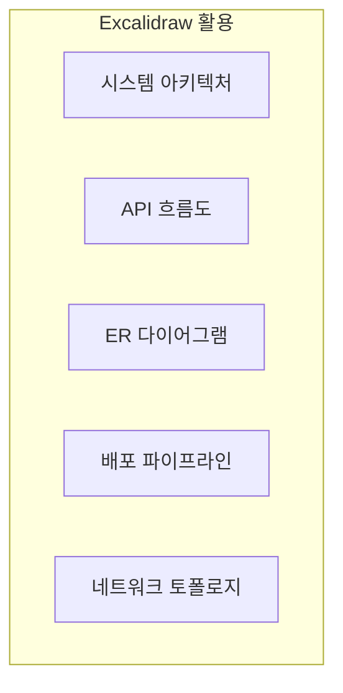
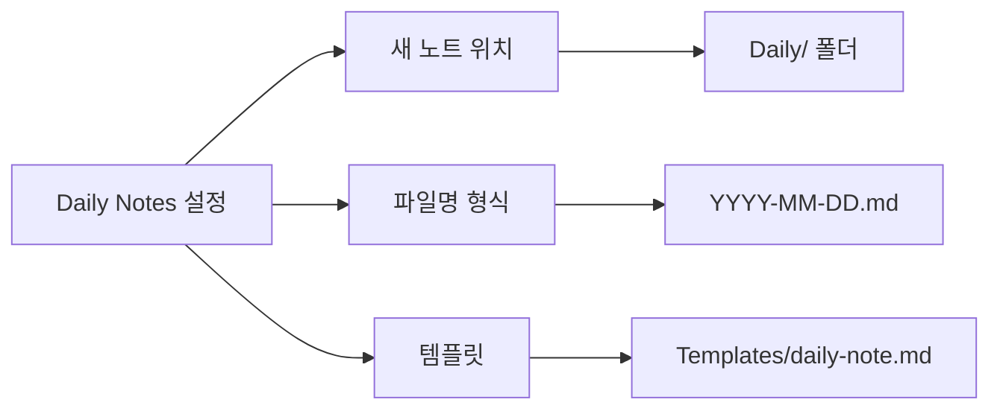

# 필수 플러그인 설정

백엔드 개발자에게 필수적인 Obsidian 플러그인을 설치하고 설정하는 방법을 배웁니다.

## 개요

Obsidian의 강력한 기능은 플러그인에서 나옵니다. 이 가이드에서는 Claude Code 연동, 문서 관리, 시각화를 위한 필수 플러그인을 다룹니다.

## 학습 목표

- [ ] Obsidian Local REST API 설치 및 설정
- [ ] Dataview로 동적 쿼리 작성
- [ ] Excalidraw로 다이어그램 작성
- [ ] Templates로 템플릿 관리
- [ ] Daily Notes로 일일 기록

---

## 플러그인 개요

### 필수 플러그인 5가지

| 플러그인 | 용도 | MCP 연동 | 중요도 |
|----------|------|----------|--------|
| **Local REST API** | Claude와 연동 | ⭐ 필수 | ⭐⭐⭐⭐⭐ |
| **Dataview** | 동적 쿼리 | - | ⭐⭐⭐⭐⭐ |
| **Excalidraw** | 다이어그램 | - | ⭐⭐⭐⭐ |
| **Templates** | 템플릿 | - | ⭐⭐⭐⭐ |
| **Daily Notes** | 일일 기록 | - | ⭐⭐⭐⭐ |

---

## 1. Obsidian Local REST API

### 설치 및 설정


### 고급 설정

#### 1. API Key 관리

```markdown
보안을 위해 API Key를 안전하게 관리하세요:

❌ 하지 말 것
- .mcp.json에 직접 API Key 작성 후 Git 커밋
- 공유된 화면에 API Key 노출

✅ 권장 방법
- .gitignore에 .mcp.json 추가
- 환경 변수로 관리
- 팀별로 고유 API Key 사용
```

#### 2. CORS 설정

외부 도구에서 접근해야 할 경우:

```markdown
REST API 설정 → CORS:
- Enable CORS: ON
- Allowed origins: http://localhost:3000
```

#### 3. 인증 방식

```bash
# Basic Auth
curl -u username:password http://127.0.0.1:27123

# Bearer Token
curl -H "Authorization: Bearer YOUR_API_KEY" http://127.0.0.1:27123
```

### 사용 가능한 엔드포인트

| 엔드포인트 | 메서드 | 설명 |
|------------|--------|------|
| `/` | GET | API 상태 확인 |
| `/notes/` | GET | 전체 노트 목록 |
| `/notes/{path}` | GET | 특정 노트 읽기 |
| `/notes/` | POST | 새 노트 생성 |
| `/notes/{path}` | PUT | 노트 수정 |
| `/notes/{path}` | DELETE | 노트 삭제 |
| `/search/` | POST | 노트 검색 |

---

## 2. Dataview

### 개요

Dataview는 Markdown 노트를 데이터베이스처럼 쿼리할 수 있게 해줍니다.

### 설치

1. 설정 → 서드파티 플러그인 → 찾아보기
2. "Dataview" 검색
3. 설치 및 활성화

### 기본 쿼리

#### LIST 쿼리

```markdown
## 모든 트러블슈팅 노트

```dataview
LIST
FROM #troubleshooting
SORT file.ctime DESC
```
```

결과:
```
- [[Redis 동시성 이슈]]
- [[Kafka 랙 문제]]
- [[PostgreSQL 쿼리 최적화]]
```

#### TABLE 쿼리

```markdown
## 프로젝트 현황

```dataview
TABLE
  status as "상태",
  file.ctime as "생성일",
  target-date as "목표일"
FROM #project
WHERE status = "in-progress"
SORT target-date ASC
```
```

결과:
| 파일 | 상태 | 생성일 | 목표일 |
|------|------|--------|--------|
| [[AI 스마트편의팩]] | in-progress | 2025-01-01 | 2025-03-31 |
| [[Kafka 마이그레이션]] | in-progress | 2025-01-05 | 2025-02-28 |

#### TASK 쿼리

```markdown
## 미완료 작업

```dataview
TASK
FROM #daily
WHERE !completed
GROUP BY file.link
```
```

### 고급 쿼리

#### 필터링

```markdown
## Redis 관련 노트 (최근 30일)

```dataview
TABLE file.ctime, tags
FROM #troubleshooting
WHERE contains(tags, "redis")
AND file.ctime >= date(today) - dur(30 days)
SORT file.ctime DESC
```
```

#### 계산

```markdown
## 프로젝트 진행률

```dataview
TABLE
  (sum(map(file.tasks, (t) => t.completed)) /
   sum(map(file.tasks, (t) => 1))) * 100 as "진행률 %"
FROM #project
WHERE file.tasks
```
```

#### CALCUATE

```markdown
## 기술별 노트 수

```dataview
CALCULATE length(filter(#troubleshooting, (t) => contains(t.tags, "redis")))
FROM #troubleshooting
```
```

### 백엔드 개발자를 위한 쿼리 예제

```markdown
## 1. 해결되지 않은 트러블슈팅

```dataview
TABLE
  file.link as "문제",
  created as "발생일",
  tags as "관련 기술"
FROM #troubleshooting
WHERE status = "open"
SORT created DESC
```

## 2. 기술별 학습 노트

```dataview
TABLE
  file.link,
  read-date,
  rating
FROM #learning
WHERE contains(tags, "java")
GROUP BY tags
```

## 3. 최근 API 변경사항

```dataview
TABLE
  file.link,
  version,
  changes
FROM #api
WHERE file.mtime >= date(today) - dur(7 days)
SORT file.mtime DESC
```

## 4. 프로젝트별 API 문서

```dataview
TABLE
  file.link,
  endpoint,
  method
FROM #api
WHERE contains(project, "ai-smart-convenience")
```
```

---

## 3. Excalidraw

### 개요

Excalidraw는 손그림 스타일의 다이어그램을 그릴 수 있습니다.

### 설치

1. 설정 → 서드파티 플러그인 → 찾아보기
2. "Obsidian Excalidraw" 검색
3. 설치 및 활성화

### 백엔드 아키텍처 다이어그램

#### 시스템 아키텍처

```
Excalidraw 파일 내에서:
1. 도형 툴로 컴포넌트 그리기
2. 화살표로 연결
3. 텍스트로 라벨 추가
4. 레이어로 구조화
```

### 활용 예시



---

## 4. Templates

### 개요

반복적으로 사용하는 문서 형식을 템플릿으로 저장하고 빠르게 불러옵니다.

### 설정

1. Templates 폴더 지정
2. 단축키 설정 (기본: `Ctrl/Cmd + T`)

### 템플릿 변수

```markdown
# 템플릿 파일
---
title: {{title}}
date: {{date}}
tags: [troubleshooting, {{tech}}]
---

# {{title}}

## 발생 일시
{{datetime}}

## 문제 상황

## 원인 분석

## 해결 방법

## 재발 방지
```

사용 시 변수가 자동으로 치환됩니다.

### 동적 템플릿

```markdown
# {{title}}

<%*
let title = tp.file.title;
let date = tp.date.now("YYYY-MM-DD");
tR += `생성일: ${date}\n\n`;
*%>

## 목차
- [[{{title}}/개요]]
- [[{{title}}/기술 스택]]
- [[{{title}}/API 설계]]
```

---

## 5. Daily Notes

### 개요

매일 자동으로 날짜별 노트를 생성합니다.

### 설정



### 템플릿 연동

```markdown
# Templates/daily-note.md
---
date: {{date}}
tags: [daily]
---

# {{date:YYYY-MM-DD}}

## 오늘의 계획
- [ ]
- [ ]

## 회의
- [[14:00 - 스프린트 플래닝]]

## 배운 것

## 해결한 문제

## 내일 할 일

## 참고 자료
```

---

## 플러그인 조합 활용

### 시나리오: 주간 회고 자동화

```markdown
## Claude와 Dataview 조합

"이번 주(2025-01-06 ~ 2025-01-10) 일일 노트들을
분석해서 주간 회고를 작성해줘"

Claude가:
1. Dataview로 해당 기간 노트 조회
2. 완료된 작업 추출
3. 해결한 문제 정리
4. 다음 주 계획 수립
```

```dataview
# Claude가 사용하는 쿼리
TABLE tasks
FROM #daily
WHERE file.ctime >= date(2025-01-06)
AND file.ctime <= date(2025-01-10)
WHERE completed
```

---

## 실습 과제

- [ ] Local REST API 설치 및 API Key 생성
- [ ] Dataview로 프로젝트 현황 테이블 만들기
- [ ] Excalidraw로 간단한 아키텍처 다이어그램 그리기
- [ ] Daily Notes 템플릿 만들기
- [ ] 트러블슈팅 템플릿 만들기

---

## 참고 자료

- [Dataview 문서](https://blacksmithgu.github.io/obsidian-dataview/)
- [Excalidraw 문서](https://github.com/zsviczian/obsidian-excalidraw-plugin)
- [Obsidian 플러그인 목록](https://obsidian.md/plugins)

---

## 다음 단계

플러그인을 설정했으니, 실제 폴더 구조를 만들어봅시다.

→ [[07-folder-structure|폴더 구조 예시]]로 계속하세요
