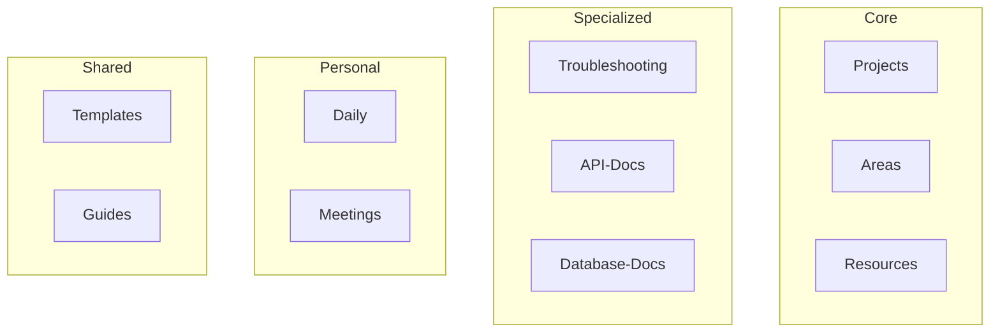

# 폴더 구조 예시

실제 백엔드 팀에서 사용할 수 있는 구체적인 폴더 구조를 제시합니다.

## 개요

이론적인 구조를 실제 프로젝트에 적용 가능한 형태로 제시하고, 각 폴더의 사용법을 설명합니다.

## 학습 목표

- [ ] 실제 프로젝트에 적용 가능한 구조 이해
- [ ] 팀별 폴더 분리 전략
- [ ] 확장 가능한 구조 설계

---

## 실전 폴더 구조

### 완전한 트리

```
backend-knowledge-base/
├── .obsidian/                   # Obsidian 설정
│
├── CLAUDE.md                    # Claude Code를 위한 가이드
│
├── 00-Inbox/                    # 빠른 메모용
│   └── temp-notes/
│
├── 01-Projects/                 # 진행 중인 프로젝트
│   ├── active/
│   │   ├── ai-smart-convenience/
│   │   │   ├── overview.md
│   │   │   ├── architecture.md
│   │   │   ├── api-specs/
│   │   │   │   ├── recommendation-api.md
│   │   │   │   └── personalization-api.md
│   │   │   ├── database/
│   │   │   │   ├── schema.md
│   │   │   │   └── migrations/
│   │   │   ├── meetings/
│   │   │   │   ├── 2025-01-08-kickoff.md
│   │   │   │   └── 2025-01-10-review.md
│   │   │   └── decisions/
│   │   │       ├── adr-001-use-kafka.md
│   │   │       └── adr-002-redis-caching.md
│   │   │
│   │   ├── payment-refactor/
│   │   │   ├── design.md
│   │   │   └── progress.md
│   │   │
│   │   └── user-service-v2/
│   │       ├── api-spec.md
│   │       └── migration-plan.md
│   │
│   └── on-hold/
│       └── graphql-introduction/
│           └── research.md
│
├── 02-Areas/                    # 지속적 관리 영역
│   ├── Architecture/
│   │   ├── microservices.md
│   │   ├── event-driven.md
│   │   ├── caching-strategy.md
│   │   └── service-mesh.md
│   │
│   ├── API-Design/
│   │   ├── restful-best-practices.md
│   │   ├── api-versioning.md
│   │   ├── error-handling.md
│   │   └── rate-limiting.md
│   │
│   ├── Database/
│   │   ├── schema-design.md
│   │   ├── indexing.md
│   │   ├── transaction.md
│   │   └── connection-pool.md
│   │
│   ├── DevOps/
│   │   ├── deployment.md
│   │   ├── ci-cd.md
│   │   ├── docker.md
│   │   └── kubernetes.md
│   │
│   └── Monitoring/
│       ├── metrics.md
│       ├── logging.md
│       ├── tracing.md
│       └── alerting.md
│
├── 03-Resources/                # 기술 자료
│   ├── Java/
│   │   ├── virtual-threads.md
│   │   ├── record-pattern.md
│   │   ├── stream-api.md
│   │   └── collections.md
│   │
│   ├── Kotlin/
│   │   ├── coroutines.md
│   │   ├── flow.md
│   │   └── dsl.md
│   │
│   ├── Spring/
│   │   ├── spring-boot-3.md
│   │   ├── spring-data-jpa.md
│   │   ├── spring-data-redis.md
│   │   └── spring-security.md
│   │
│   ├── Database/
│   │   ├── PostgreSQL/
│   │   │   ├── indexing.md
│   │   │   ├── query-optimization.md
│   │   │   └── replication.md
│   │   │
│   │   ├── Redis/
│   │   │   ├── data-structures.md
│   │   │   ├── caching-patterns.md
│   │   │   └── pub-sub.md
│   │   │
│   │   └── MongoDB/
│   │       ├── document-model.md
│   │       └── aggregation.md
│   │
│   ├── Message-Queue/
│   │   ├── Kafka/
│   │   │   ├── producers.md
│   │   │   ├── consumers.md
│   │   │   └── exactly-once.md
│   │   │
│   │   └── RabbitMQ/
│   │       ├── exchanges.md
│   │       └── queues.md
│   │
│   └── System-Design/
│       ├── load-balancing.md
│       ├── caching.md
│       ├── rate-limiting.md
│       └── id-generation.md
│
├── 04-Archives/                 # 완료된 프로젝트
│   ├── 2025/
│   │   ├── q1/
│   │   │   ├── product-refactor/
│   │   │   └── free-trial-reduction/
│   │   └── q2/
│   │
│   └── 2024/
│       └── annual-coupon-system/
│
├── 05-Troubleshooting/           # 트러블슈팅 기록
│   ├── spring/
│   │   ├── data-jpa-n-plus-one.md
│   │   ├── transaction-rollback.md
│   │   └── bean-lifecycle.md
│   │
│   ├── redis/
│   │   ├── concurrency-issue.md
│   │   ├── timeout-optimization.md
│   │   └── memory-leak.md
│   │
│   ├── kafka/
│   │   ├── consumer-lag.md
│   │   ├── message-ordering.md
│   │   └── exactly-once-setup.md
│   │
│   ├── postgresql/
│   │   ├── deadlock.md
│   │   ├── query-performance.md
│   │   └── connection-exhaustion.md
│   │
│   └── network/
│       ├── dns-resolution.md
│       ├── connection-timeout.md
│       └── load-balancer.md
│
├── 06-API-Docs/                 # API 명세서
│   ├── user-service/
│   │   ├── v1/
│   │   │   ├── authentication.md
│   │   │   ├── profile.md
│   │   │   └── preferences.md
│   │   └── v2/
│   │
│   ├── order-service/
│   │   ├── create-order.md
│   │   ├── cancel-order.md
│   │   └── order-history.md
│   │
│   ├── product-service/
│   │   ├── product-list.md
│   │   ├── product-detail.md
│   │   └── inventory.md
│   │
│   └── payment-service/
│       ├── payment.md
│       ├── refund.md
│       └── cancellation.md
│
├── 07-Database-Docs/             # 데이터베이스 문서
│   ├── schemas/
│   │   ├── users/
│   │   ├── orders/
│   │   └── products/
│   │
│   ├── migrations/
│   │   ├── 2025/
│   │   └── 2024/
│   │
│   └── stored-procedures/
│
├── 08-Meetings/                  # 회의 기록
│   ├── 1on1/
│   │   ├── 2025-01-15-with-manager.md
│   │   └── 2025-01-08-with-mentor.md
│   │
│   ├── sprint-planning/
│   │   ├── 2025-sprint-1-planning.md
│   │   └── 2025-sprint-2-planning.md
│   │
│   ├── retrospective/
│   │   ├── 2024-sprint-12-retro.md
│   │   └── 2025-sprint-1-retro.md
│   │
│   └── tech-review/
│       ├── kafka-introduction.md
│       └── microservices-decision.md
│
├── 09-Daily/                     # 일일 기록
│   ├── 2025/
│   │   ├── 01/
│   │   │   ├── 2025-01-08.md
│   │   │   ├── 2025-01-09.md
│   │   │   ├── 2025-01-10.md
│   │   │   └── ...
│   │   └── 02/
│   │
│   └── 2024/
│
├── 10-Templates/                 # 템플릿
│   ├── daily-note.md
│   ├── weekly-review.md
│   ├── troubleshooting.md
│   ├── api-spec.md
│   ├── system-design.md
│   ├── tech-study.md
│   ├── meeting-1on1.md
│   ├── sprint-planning.md
│   └── retrospective.md
│
├── 11-Guides/                   # 가이드 문서
│   ├── Claude-Obsidian-Guide/
│   │   ├── index.md
│   │   ├── Part1-Basics/
│   │   ├── Part2-Structure/
│   │   └── ...
│   │
│   ├── Onboarding/
│   │   ├── new-developer.md
│   │   └── local-setup.md
│   │
│   └── Best-Practices/
│       ├── code-conventions.md
│       └── review-guidelines.md
│
├── 12-Clippings/                 # 웹에서 수집한 자료
│   ├── architecture/
│   ├── spring-boot/
│   ├── system-design/
│   └── algorithms/
│
└── 13-Diagrams/                 # Excalidraw 다이어그램
    ├── architectures/
    ├── flows/
    └── erds/
```

---

## 폴더별 사용법

### 00-Inbox (빠른 메모)

```markdown
용도: 정리할 시간이 없을 때 빠르게 메모

사용 예:
- 회의 중 중요한 포인트
- 코드 리뷰 중 발견한 사항
- 갑자기 떠오른 아이디어

정기적으로 처리:
- 주말에 비우고 분류
- 적절한 폴더로 이동
```

### 01-Projects (프로젝트)

```markdown
프로젝트 구조:

01-Projects/
├── active/              # 현재 작업 중
│   ├── project-name/
│   │   ├── overview.md          # 개요
│   │   ├── architecture.md      # 아키텍처
│   │   ├── api-specs/           # API 명세
│   │   ├── database/            # DB 설계
│   │   ├── meetings/            # 회의록
│   │   └── decisions/           # 기술적 결정 (ADR)
│
└── on-hold/             # 일시 중단
```

### 02-Areas (영역)

```markdown
Area는 프로젝트와 달리 '완료'가 없습니다:

- API 설계 (지속적 개선)
- 데이터베이스 최적화
- 모니터링 시스템
- 배포 프로세스
```

### 03-Resources (자료)

```markdown
기술 스택별로 정리:

03-Resources/
├── Java/                # 언어별
├── Spring/              # 프레임워크별
├── Database/            # 데이터베이스별
└── System-Design/       # 주제별
```

### 05-Troubleshooting (트러블슈팅)

```markdown
기술/서비스별 분리:

05-Troubleshooting/
├── spring/              # Spring 관련 이슈
├── redis/               # Redis 관련 이슈
├── kafka/               # Kafka 관련 이슈
└── postgresql/          # PostgreSQL 관련 이슈
```

---

## 팀별 폴더 분리

### 대형 팀 구조

```
backend-knowledge-base/
├── Team-FE/             # 프론트엔드 팀
├── Team-BE/             # 백엔드 팀
├── Team-DevOps/         # DevOps 팀
├── Team-Data/           # 데이터 팀
└── Shared/              # 공유 영역
    ├── Architecture/
    ├── Meetings/
    └── Onboarding/
```

### 프로젝트별 분리

```
backend-knowledge-base/
├── Project-A/
│   ├── docs/
│   ├── api/
│   └── database/
│
├── Project-B/
│   ├── docs/
│   ├── api/
│   └── database/
│
└── Shared/
    ├── best-practices/
    └── troubleshooting/
```

---

## Claude를 활용한 폴더 생성

### 자동화 스크립트

```markdown
Claude에게:
"AI 스마트편의팩 프로젝트를 위한
폴더 구조를 만들어줘.

다음 구조로:
- overview.md
- architecture.md
- api-specs/ 폴더
- database/ 폴더
- meetings/ 폴더
- decisions/ 폴더"
```

### 템플릿 적용

```markdown
각 폴더의 기본 문서도 함께 생성:
- overview.md에는 프로젝트 개요 템플릿
- architecture.md에는 아키텍처 템플릿
- decisions/에는 ADR 템플릿
```

---

## 확장 가능한 구조

### 모듈식 설계



### 성장에 따른 확장

```markdown
초기 (1인):
- 01-Projects/
- 02-Resources/
- 03-Daily/

성장 (소규모 팀):
- 위 + 04-Troubleshooting/
- 05-API-Docs/
- 06-Meetings/

대형 (여러 팀):
- 위 + Team-FE/
- Team-BE/
- Shared/
```

---

## 실습 과제

- [ ] 위 구조를 참고하여 본인 Vault에 폴더 생성
- [ ] Claude로 프로젝트 폴더 구조 자동 생성
- [ ] Dataview로 폴더별 노트 수 확인
- [ ] 일일 노트에서 각 폴더로 링크 생성

---

## 다음 단계

폴더 구조를 만들었으니, Claude와 연동해봅시다.

→ [[08-claude-reading|Claude로 노트 읽기]]로 계속하세요
