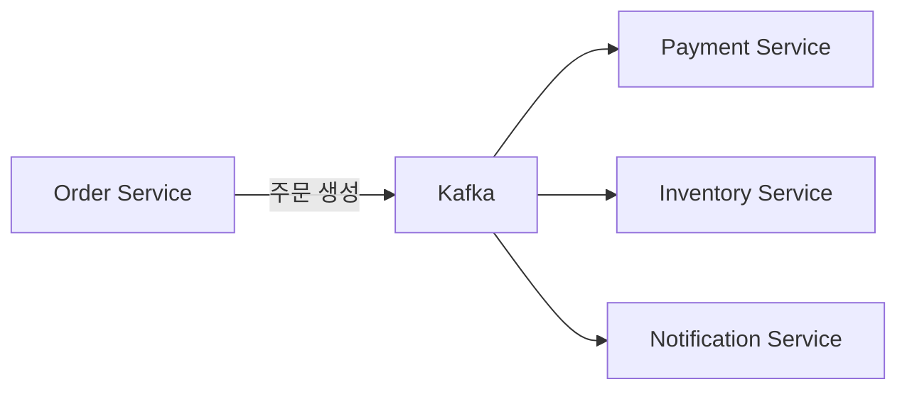

# Claude로 노트 쓰기

Claude Code를 사용하여 Obsidian에 자동으로 노트를 생성하고 정리하는 방법을 배웁니다.

## 개요

Claude의 MCP 연동을 통해 템플릿을 적용하고, 자동으로 노트를 생성하는 방법을 다룹니다.

## 학습 목표

- [ ] 템플릿을 적용한 노트 생성
- [ ] 여러 소스를 통합한 문서 작성
- [ ] 자동 정리 및 요약
- [ ] 백링크 자동 연결

---

## 템플릿 기반 노트 생성

### 1. 트러블슈팅 문서 생성

```markdown
사용자:
"오늘 발생한 Redis 타임아웃 이슈를
트러블슈팅 문서로 작성해줘.

문제 상황:
- 발생 시간: 오후 2시 30분
- 환경: Production
- 에러: redis.clients.jedis.exceptions.JedisConnectionException

원인 분석:
- maxmemory 설정이 2GB에서 4GB로 증가
- LRU 알고리즘 계산 비용 증가

해결책:
- eviction-policy를 allkeys-lru로 변경
- maxmemory-samples를 5에서 10으로 증가

Templates/troubleshooting 템플릿을 사용해줘"
```

Claude가 자동으로 생성:

```markdown
---
title: "Redis 타임아웃 최적화"
tags: [troubleshooting, redis, performance]
created: 2026-01-10
parent: "Part 3: Claude Code 연동"
grand_parent: 백엔드 개발자를 위한 Claude Code + Obsidian 지식 관리법
nav_order: 2
status: resolved
---

# Redis 타임아웃 최적화

## 문제 상황

### 발생 일시
2025-01-10 14:30

### 환경
- Production
- Redis 7.0
- Spring Data Redis

### 에러 메시지
```
redis.clients.jedis.exceptions.JedisConnectionException:
java.net.SocketTimeoutException: Read timed out
```

### 증상
- API 응답 시간이 50ms에서 200ms로 증가
- Redis 쿼리 타임아웃 빈번 발생
- CPU 사용량은 정상 (30-40%)

## 원인 분석

### 근본 원인
1. **메모리 증가로 인한 LRU 계산 비용 증가**
   - maxmemory: 2GB → 4GB
   - 메모리가 늘어날수록 LRU 알고리즘 계산 비용 증가

2. **부적절한 eviction policy**
   - 설정: noeviction
   - 메모리 관리가 제대로 되지 않음

3. **샘플링 효율 저하**
   - maxmemory-samples: 5
   - 큰 메모리에서는 비효율적

## 해결 방법

### 적용한 변경사항

**redis.conf**
```conf
# 변경 전
maxmemory 4gb
maxmemory-policy noeviction
maxmemory-samples 5

# 변경 후
maxmemory 4gb
maxmemory-policy allkeys-lru
maxmemory-samples 10
```

### 적용 명령어
```bash
# Redis 설정 변경
redis-cli CONFIG SET maxmemory-policy allkeys-lru
redis-cli CONFIG SET maxmemory-samples 10

# 영구 저장
redis-cli CONFIG REWRITE
```

### 결과
- API 응답 시간: 200ms → 30ms
- Redis 타임아웃: 0건
- Eviction rate: 150/sec (정상 작동)

## 재발 방지

### 설정 변경 프로세스
1. 스테이징 환경에서 사전 테스트
2. Redis Benchmark로 성능 측정
3. 모니터링 알림 설정

### 모니터링 추가
```yaml
# Prometheus + Grafana
metrics:
  - redis_response_time_p95
  - redis_eviction_rate
  - redis_memory_usage
```

## 참고 자료
- [Redis LRU 분석](https://redis.io/docs/manual/eviction/)
- [[Resources/Database/Redis/caching-patterns]]
- [[Areas/Monitoring/metrics]]

## 관련 문서
- [[2025-01-10]]: 일일 회의 기록
- [[Projects/active/ai-smart-convenience]]: 영향 받는 프로젝트
```

### 2. API 명세서 생성

```markdown
사용자:
"User Service의 회원가입 API 명세서를 작성해줘.

API 정보:
- 엔드포인트: POST /api/v1/users/signup
- 설명: 신규 회원 가입

요청:
{
  "email": "user@example.com",
  "password": "SecurePass123!",
  "name": "홍길동",
  "phone": "010-1234-5678"
}

성공 응답:
{
  "userId": "uuid",
  "email": "user@example.com",
  "createdAt": "2025-01-10T10:00:00Z"
}

에러:
- 400: 이메일 중복
- 400: 비밀번호 규칙 위반
- 422: 검증 실패

Templates/api-spec 템플릿 사용"
```

### 3. 시스템 설계 문서 생성

```markdown
사용자:
"주문 서비스의 마이크로서비스 아키텍처를
설계 문서로 작성해줘.

요구사항:
- 주문 도메인 분리
- 이벤트 기반 아키텍처
- 최소 1000 TPS

기술 스택:
- Spring Boot 3.2
- Kafka 3.0
- PostgreSQL 15
- Redis 7.0

Templates/system-design 사용"
```

---

## 여러 소스 통합

### 1. 회의록 정리

```markdown
사용자:
"다음 회의 내용을 바탕으로
회의록을 작성해줘.

녹음 내용 (또는 메모):
- 일시: 2025-01-10 14:00
- 참석자: 백엔드 팀 전원
- 주제: Kafka 도입 검토

토론 내용:
1. 현재 문제: API 간 통신 병목
2. Kafka 제안: 이벤트 기반 비동기 처리
3. 우려: 운영 복잡도 증가
4. 결정: PoC 진행 후 결정

결과:
- PoC: 2주간 진행
- 담당: 김대리, 박사원
- 다음 회의: 2주 후"
```

Claude가 정리:

```markdown
---
title: "Kafka 도입 검토 회의"
tags: [meeting, kafka, architecture]
date: 2025-01-10
type: meeting-minutes
---

# Kafka 도입 검토 회의

## 개요
- **일시**: 2025-01-10 14:00 - 15:30
- **장소**: 회의실 A
- **참석자**: 백엔드 팀 전원

## 안건

### 1. 현재 문제 분석

**문제점**
- API 간 동기 호출로 인한 병목 발생
- 주문 완료까지 평균 500ms 소요
- 장애 전파 위험 (Service A 장애 → B 장애)

**영향 받는 서비스**
- 주문 서비스
- 결제 서비스
- 재고 서비스
- 알림 서비스

### 2. Kafka 제안

**장점**
- 비동기 처리로 응답 시간 개선 예상
- 서비스 간 결합도 감소
- 재시도/Dead Letter Queue 활용 가능

**아키텍처**


### 3. 우려 사항

| 우려 | 대응 방안 |
|------|----------|
| 운영 복잡도 | 팀 내 교육, 전담 인원 배정 |
| 모니터링 | Kafka UI 도입, 지표 정의 |
| 메시지 순서 | 키 기반 파티셔닝 |

## 결정 사항

### PoC 진행
- **기간**: 2주 (2025-01-13 ~ 2025-01-26)
- **담당**: 김대리, 박사원
- **범위**:
  1. 주문 → 결제 메시지 발행/소비
  2. 성능 측정 (TPS, 레이턴시)
  3. 장애 시나리오 테스트

### 성공 기준
- 주문 처리량: 500 TPS → 1000 TPS
- 응답 시간: 500ms → 200ms
- Kafka 장애 시 영향 최소화

## Action Items

| 담당자 | 작업 | 마감일 |
|--------|------|--------|
| 김대리 | Kafka 클러스터 구축 | 01-15 |
| 박사원 | Producer/Consumer 구현 | 01-20 |
| 이팀장 | PoC 성공 기준 정의 | 01-15 |
| 전원 | 다음 회의 전 결과 리뷰 | 01-26 |

## 다음 회의
- **일시**: 2025-01-26 14:00
- **장소**: 회의실 A
- **안건**: PoC 결과 검토 및 도입 결정

## 참고 자료
- [[Resources/Message-Queue/Kafka/producers]]
- [[Resources/Message-Queue/Kafka/consumers]]
- [[Projects/active/kafka-migration]]
```

---

## 자동 정리

### 1. 코드에서 문서 생성

```markdown
사용자:
"이 Controller 코드를 분석해서
API 명세서를 만들어줘"

(코드 붙여넣기)
```

### 2. 로그에서 트러블슈팅 문서 생성

```markdown
사용자:
"이 에러 로그를 분석해서
트러블슈팅 문서를 작성해줘"

(로그 붙여넣기)
```

### 3. 웹 자료에서 요약

```markdown
사용자:
"이 Spring Boot 3.2 공식 문서를
요약해서 학습 노트를 만들어줘"

(내용 붙여넣기 또는 URL)
```

---

## 백링크 자동 연결

### 1. 관련 노트 자동 연결

```markdown
사용자:
"트러블슈팅 문서를 생성했는데,
관련된 기술 문서들을 찾아서
백링크를 연결해줘"
```

Claude가 수행:
1. 키워드 추출 (Redis, 캐싱, 성능)
2. 관련 노트 검색
3. 백링크 섹션 자동 생성
4. 각 노트에 역링크 추가

### 2. MOC (Map of Content) 업데이트

```markdown
사용자:
"새로 만든 노트를
Redis MOC에 추가해줘"
```

---

## 실전 프롬프트 예시

### 템플릿 지정

```markdown
# 템플릿 적용
"트러블슈팅 템플릿으로 이슈 정리해줘"
"API 명세 템플릿으로 문서 작성해줘"
"일일 노트 템플릿으로 오늘 기록해줘"
```

### 파일 위치 지정

```markdown
# 폴더 지정
"Projects/active 폴더에 만들어줘"
"Troubleshooting/redis 폴더에 저장해줘"
"Resources/Database/PostgreSQL 폴더에 넣어줘"
```

### 형식 지정

```markdown
# 섹션 구조
"이 구조로 작성해줘: 문제 → 원인 → 해결 → 예방"
# 목차 포함
# Mermaid 다이어그램 추가
```

---

## 작성 후 자동화

### 1. 일일 노트에 링크

```markdown
사용자:
"방금 만든 트러블슈팅 문서를
오늘 일일 노트에 추가해줘"
```

### 2. 프로젝트 진행률 업데이트

```markdown
사용자:
"이 이슈가 해결됐으니까
프로젝트 진행률을 80%로 업데이트해줘"
```

### 3. 팀 알림

```markdown
사용자:
"이 문서를 Slack #backend 채널에
공유할 포맷으로 정리해줘"
```

---

## 고급 팁

### 1. 배치 생성

```markdown
사용자:
"최근 일주일간 발생한 모든 이슈를
각각 트러블슈팅 문서로 만들어줘.
일일 노트에서 추출해서"
```

### 2. 문서 통합

```markdown
사용자:
"Kafka 관련 모든 문서를
하나로 통합해서 'Kafka 완전 정복'
문서를 만들어줘"
```

### 3. 버전 관리

```markdown
사용자:
"API 문서를 v2로 업데이트했으니까
v1은 Archives로 옮기고 v2를 만들어줘"
```

---

## 실습 과제

- [ ] 본인이 최근에 해결한 이슈를 트러블슈팅 문서로 생성
- [ ] 회의 메모를 정리해서 회의록 작성
- [ ] 관련 노트들을 찾아서 백링크 연결
- [ ] 일일 노트에 작업 내용 추가

---

## 다음 단계

노트 작성을 자동화하는 방법을 배웠으니, 전체 워크플로우를 자동화해봅시다.

→ [[10-automation|자동화 워크플로우]]로 계속하세요
