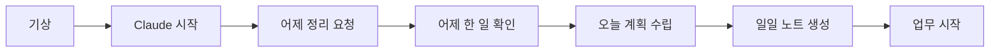
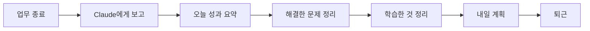
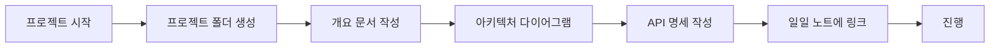
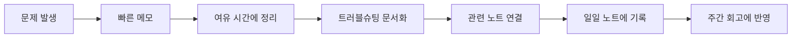
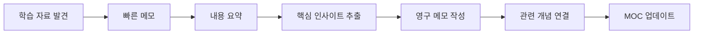
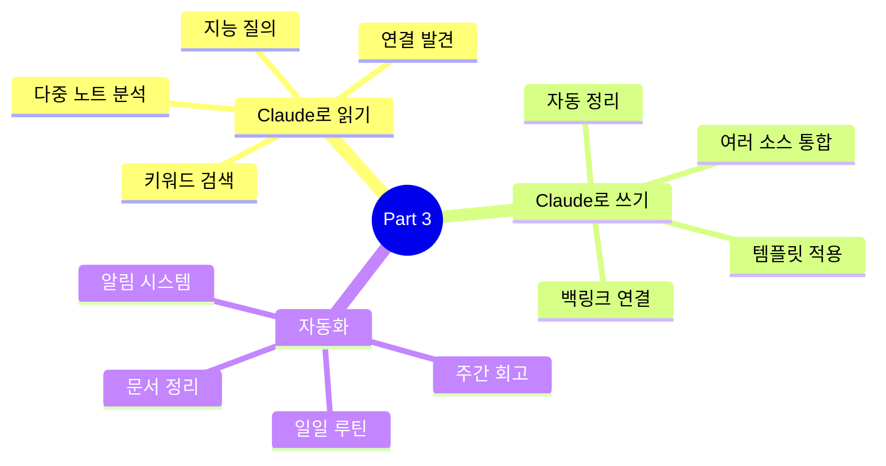

# 자동화 워크플로우

Claude Code를 활용하여 지식 관리 워크플로우를 자동화하는 방법을 배웁니다.

## 개요

정기적인 작업을 Claude에게 맡겨 시간을 절약하고, 지식 관리를 습관화하는 방법을 다룹니다.

## 학습 목표

- [ ] 일일 루틴 자동화
- [ ] 주간/월간 회고 자동 생성
- [ ] 문서 자동 정리 및 분류
- [ ] 알림 및 리마인더 설정

---

## 일일 루틴 자동화

### 아침 루틴 (5분)



**프롬프트**

```markdown
# 매일 아침
"좋은 아침! 어제(2025-01-09) 한 일을 요약해서
오늘(2025-01-10) 할 일을 정리해줘.

1. 어제 완료한 작업
2. 어제 해결하지 못한 것
3. 오늘 우선순위

오늘 일일 노트도 Templates/daily-note 템플릿으로
만들어줘"
```

### 저녁 루틴 (10분)



**프롬프트**

```markdown
# 매일 저녁
"오늘(2025-01-10) 업무를 정리해줘.

1. 완료한 작업과 성과
2. 해결한 문제 (있으면 트러블슈팅 문서로 저장)
3. 새로 배운 것 (학습 노트로 저장)
4. 내일 할 일

완료된 작업은 체크박스에 체크해줘"
```

---

## 주간 워크플로우

### 주간 회고 자동 생성

```markdown
사용자:
"이번 주(2025-01-06 ~ 2025-01-10) 일일 노트들을
분석해서 주간 회고를 작성해줘.

포함할 내용:
1. 주요 성과
2. 해결한 문제
3. 배운 것
4. 다음 주 계획

Templates/weekly-review 템플릿 사용"
```

Claude가 생성:

```markdown
---
title: "2025년 2주 주간 회고"
tags: [weekly-review, retro]
week: "2025-W2"
date-range: [2025-01-06, 2025-01-10]
---

# 2025년 2주 주간 회고

## 주요 성과

### 완료한 프로젝트
- [x] Redis 캐싱 전략 수립 (01-08)
- [x] Kafka PoC 구현 (01-09)
- [x] 결제 API 성능 튜닝 (01-10)

### 주요 지표
- API 평균 응답 시간: 500ms → 200ms
- Redis 캐시 적중률: 85%
- Kafka 처리량: 800 TPS 달성

## 해결한 문제

### 1. Spring Data Redis 동시성 이슈
- **문제**: Partial Update 없음으로 경합 발생
- **해결**: RedisTemplate으로 원자적 연산
- **문서**: [[Troubleshooting/redis/concurrency-issue]]

### 2. Kafka 메시지 순서 보장
- **문제**: 메시지 처리 순서 뒤섞임
- **해결**: 키 기반 파티셔닝
- **문서**: [[Troubleshooting/kafka/message-ordering]]

## 배운 것

### 새로운 기술
- Virtual Threads (Java 21)
- Redis Cluster 운영
- Kafka Exactly-Once semantics

### 교훈
- LLM API 호출 시 비동기 처리 중요
- 캐시 전략은 데이터 접근 패턴 분석 후 결정

## 개선 필요

### 시간 낭비
- Confluence 문서 검색 (2시간/주)
- → Obsidian 이관으로 해결 예정

### 기술 부채
- 레거시 결제 모듈
- → 3월 리팩터링 계획

## 다음 주 계획

### 우선순위 1
- [ ] Kafka 랙 문제 해결
- [ ] CI/CD 파이프라인 개선

### 우선순위 2
- [ ] 신규 팀원 온보딩 문서 작성
- [ ] API 모니터링 대시보드 구축

### 학습
- [ ] Distributed Tracing (Jaeger)
- [ ] Service Mesh (Istio) 기본

## 참고
- [[2025-W1-주간회고]]: 지난 주 회고
- [[Projects/active/kafka-migration]]: 진행 중인 프로젝트
```

---

## 문서 자동 정리

### 1. 미분류 문서 정리

```markdown
사용자:
"Inbox 폴더의 모든 문서를 확인하고
적절한 폴더로 분류해줘.

분류 기준:
- 기술 자료 → Resources/
- 프로젝트 관련 → Projects/
- 문제 해결 → Troubleshooting/
- 버릴 것은 삭제"
```

### 2. 태그 일관성

```markdown
사용자:
"모든 노트의 태그를 확인하고
일관되지 않은 것들을 수정해줘.

기준:
- 소문자만 사용
- 하이픈으로 연결 (예: spring-boot)
- 복수형 단수형 통일"
```

### 3. 백링크 검사

```markdown
사용자:
"링크가 끊어진 노트들을 찾아서
연결 상태를 확인해줘.

검사할 항목:
- 존재하지 않는 파일 링크
- [[링크]] 형식이 아닌 링크
- 관련 있는데 연결되지 않은 노트"
```

---

## 자동화된 알림

### 1. 정기 작업 리마인더

```markdown
사용자:
"매주 금요일 오후 5시가 되면
주간 회고 작성을 알려줘.

알림 내용:
- 이번 주 일일 노트 확인
- 주요 성과 정리
- 다음 주 계획 수립

이 알림을 일일 노트에도 추가해줘"
```

### 2. 프로젝트 마감 알림

```markdown
사용자:
"프로젝트 목표일이 7일 남은 것들을
찾아서 알려줘.

알림에 포함:
- 프로젝트명
- 남은 기간
- 진행률
- 리스크"
```

### 3. 문서 업데이트 리마인더

```markdown
사용자:
"30일 이상 업데이트되지 않은
Area 문서들을 찾아줘.

특히:
- Architecture/
- API-Design/
- Monitoring/

업데이트가 필요한지 확인해서 리마인드"
```

---

## 스크립트 자동화

### GitHub Actions와 연동

```yaml
# .github/workflows/daily-summary.yml
name: Daily Summary

on:
  schedule:
    - cron: '0 18 * * 1-5'  # 평일 6시

jobs:
  summary:
    runs-on: ubuntu-latest
    steps:
      - name: Run Claude
        run: |
          claude "오늘(2025-01-10) 일일 노트들을
                 분석해서 Slack #daily 채널에
                 요약을 보내줘"
```

### Obsidian 스크립트

```javascript
// Scripts/daily-routine.js
const { obsidian } = app;

async function dailyRoutine() {
  // 1. 어제 노트 읽기
  const yesterday = moment().subtract(1, 'day').format('YYYY-MM-DD');
  const yesterdayNote = await obsidian.api.vault.readFile(`Daily/${yesterday}.md`);

  // 2. Claude에게 전송
  const claude = new ClaudeClient();
  const summary = await claude.ask(`
    어제 노트를 분석해서:
    1. 완료한 작업
    2. 미완료 작업
    3. 오늘 계획
  `, yesterdayNote);

  // 3. 오늘 노트 생성
  const today = moment().format('YYYY-MM-DD');
  await obsidian.api.vault.writeFile(`Daily/${today}.md`, summary);
}
```

---

## 워크플로우 예시

### 1. 신규 프로젝트 시작



**프롬프트**

```markdown
"새로운 프로젝트를 시작해줘.

프로젝트명: Kafka 마이그레이션
목표: 기존 RPC → Kafka 이벤트 기반
기간: 2025-01-15 ~ 2025-02-28

다음을 자동으로 만들어줘:
1. Projects/active/kafka-migration 폴더
2. overview.md
3. architecture.md (다이어그램 포함)
4. decisions/ 폴더 (ADR용)
5. 일일 노트에 프로젝트 링크 추가"
```

### 2. 문제 해결 워크플로우



**프롬프트**

```markdown
# 문제 발생 시 (즉시)
"Inbox/quick-note.md에 빠르게 메모해줘:
- Redis 타임아웃 발생
- 14:30경
- 임시 조치: timeout 증가"

# 여유 시간에
"Inbox/quick-note.md를 읽고
트러블슈팅 문서로 정리해줘.
Templates/troubleshooting 사용"
```

### 3. 학습 사이클



**프롬프트**

```markdown
"이 블로그 글을 학습해서
영구 메모를 만들어줘.

단계:
1. 핵심 내용 요약
2. 내 언어로 재작성
3. 실전 적용 방법
4. 관련된 내 기존 노트와 연결
5. MOC에 추가

주제: Spring Boot 3.2 새로운 기능"
```

---

## 모니터링 대시보드

### Dataview로 현황 파악

```markdown
## 진행 중인 프로젝트

```dataview
TABLE
  file.link as "프로젝트",
  status as "상태",
  target-date as "목표일",
  (date(target-date) - date(today)).days as "D-"
FROM #project
WHERE status = "in-progress"
SORT target-date ASC
```

## 해결되지 않은 이슈

```dataview
TABLE
  file.link as "이슈",
  created as "발생일",
  priority as "우선순위"
FROM #troubleshooting
WHERE status != "resolved"
SORT priority DESC
```

## 최근 학습

```dataview
TABLE
  file.link,
  tags,
  rating
FROM #learning
WHERE file.ctime >= date(today) - dur(7 days)
SORT rating DESC
```
```

---

## 실습 과제

- [ ] 아침/저녁 루틴 프롬프트 작성
- [ ] 주간 회고 자동 생성 테스트
- [ ] Inbox 정리 자동화
- [ ] Datavise 대시보드 작성

---

## 참고 자료

- [Obsidian Scripts 플러그인](https://github.com/SamMikes/obsidian-scripts)
- [Templater 플러그인](https://silentnoise13.github.io/TemplaterInternal/)
- [GitHub Actions 문서](https://docs.github.com/en/actions)

---

## Part 3 요약

**Claude Code 연동 학습 완료!**



---

## 다음 단계

연동을 마스터했으니, 이제 템플릿을 활용해봅시다.

→ [[11-templates-overview|템플릿 개요]]로 계속하세요
