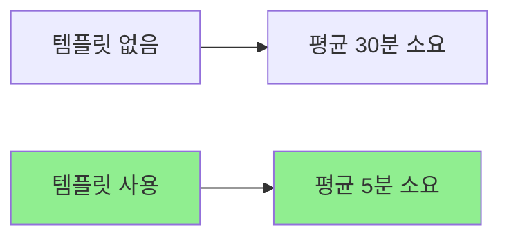

# 템플릿 개요

재사용 가능한 문서 템플릿을 만들어 문서화 속도를 높이고 일관성을 유지하는 방법을 배웁니다.

## 개요

템플릿은 반복적인 문서 작성 작업을 효율화하는 핵심 도구입니다. 백엔드 개발자는 트러블슈팅, API 설계, 시스템 설계, 회의록 등 다양한 문서를 작성합니다. 템플릿을 활용하면 일관된 형식을 유지하면서 문서화 시간을 획기적으로 단축할 수 있습니다.

## 학습 목표

- [ ] 템플릿의 장점 이해하기
- [ ] Obsidian Templates 플러그인 설정하기
- [ ] Templater 고급 기능 활용하기
- [ ] Claude와 템플릿 연동하기

---

## 템플릿의 장점

### 1. 속도 향상



### 2. 일관성 유지

**동일한 구조**
- 모든 트러블슈팅 문서가 같은 섹션을 가짐
- 눈에 익숙한 형식으로 빠른 탐색
- 팀원 간 공통 언어 형성

### 3. 항목 누락 방지

**필수 요소 자동 포함**
```markdown
## 문제 상황
## 원인 분석
## 해결 방법
## 재발 방지  ← 자주 잊어버리는 항목!
```

---

## 템플릿 플러그인 설정

### Obsidian Templates

1. **설치**
   - 설정 → 서드파티 플러그인
   - "Templates" 검색 후 설치
   - 플러그인 활성화

2. **기본 설정**
   ```yaml
   템플릿 폴더: Templates/
   단축키: Ctrl/Cmd + T
   날짜 형식: YYYY-MM-DD
   시간 형식: HH:mm
   ```

3. **사용 방법**
   ```markdown
   1. 단축키 (Ctrl/Cmd + T) 누름
   2. 템플릿 선택
   3. 커서 위치에 삽입
   ```

### Templater (고급)

더 강력한 템플릿 엔진이 필요한 경우 Templater를 사용합니다.

**설정**
```javascript
// Templater 설정
- 템플릿 폴더: Templates/
- 자동 실행 스크립트: startup scripts
- 함수 사용: 활성화
```

**기능 예시**
```javascript
// 현재 날짜 자동 입력
<% tp.date.now("YYYY-MM-DD") %>

// 사용자 입력 받기
<%*
let title = await tp.system.prompt("노트 제목");
tR += `# ${title}\n`;
*%>

// 파일명 자동 생성
<% tp.file.title %>

// 어제/내일 노트 링크
[[<% tp.date.now("YYYY-MM-DD", -1) %>]]
[[<% tp.date.now("YYYY-MM-DD", 1) %>]]
```

---

## Claude와 템플릿 연동

### 1. 템플릿 기반 노트 생성

Claude에게 템플릿을 적용하도록 지시합니다.

```markdown
사용자:
"트러블슈팅 템플릿을 적용해서
Redis 타임아웃 이슈를 문서화해줘.

문제: Production에서 Redis 타임아웃 발생
해결: connectionTimeout을 5초로 증가
재발 방지: 모니터링 알림 추가"
```

Claude가 템플릿 구조를 따라 자동으로 문서를 생성합니다.

### 2. 템플릿 제안 요청

```markdown
사용자:
"내 노트 작성 패턴을 분석해서
새로운 템플릿을 제안해줘"

Claude:
분석 결과 다음 템플릿을 제안합니다:

## API Rate Limiting 템플릿
---
title: "{{endpoint}} Rate Limiting"
tags: [api, rate-limit, performance]
created: {{date}}
---

# {{endpoint}} Rate Limiting 설계

## 대상
- 엔드포인트: {{endpoint_path}}
- 예상 트래픽: {{requests_per_second}}

## 전략
- 알고리즘: {{algorithm}}  # Token Bucket, Leaky Bucket
- 한도: {{limit}} req/sec
- 윈도우: {{window}}

## 구현
```java
{{implementation}}
```

## 모니터링
- 메트릭: {{metrics}}
- 알림: {{alerts}}
```

### 3. 템플릿 자동 개선

```markdown
사용자:
"최근 작성한 트러블슈팅 노트 5개를 분석해서
템플릿을 개선해줘"

Claude:
분석 결과 다음 항목들이 누락되는 경우가 많습니다:

1. **영향 범위** - 얼마나 많은 사용자에게 영향?
2. **재현 가능성** - 항상 재현되는지?
3. **모니터링 링크** - Datadog 대시보드 링크

업데이트된 템플릿을 제안합니다...
```

---

## 템플릿 구조

### 필수 요소

모든 템플릿은 다음 요소를 포함해야 합니다:

```markdown
---
title: "{{title}}"
tags: [{{category}}, {{tech}}]
created: {{date}}
status: {{status}}
---

# {{title}}

## 핵심 내용 1
{{content_1}}

## 핵심 내용 2
{{content_2}}

## 관련 링크
- [[{{related_note_1}}]]
- [[{{related_note_2}}]]
```

### 선택적 요소

상황에 따라 추가할 수 있는 요소:

```markdown
## 메타데이터
- 우선순위: {{priority}}
- 예상 소요시간: {{estimated_time}}
- 담당자: {{assignee}}

## 첨부자료
- [[{{screenshot}}]]
- [[{{diagram}}]]

## 다음 단계
- [ ] {{action_item_1}}
- [ ] {{action_item_2}}
```

---

## 제공되는 템플릿

이 가이드에서 제공하는 6가지 템플릿:

| 템플릿 | 용도 | 위치 |
|--------|------|------|
| 일일 기록 | 데일리 노트, 태스크 관리 | `Templates/daily-note.md` |
| 트러블슈팅 | 문제 해결 기록 | `Templates/troubleshooting.md` |
| API 설계 | REST API 명세 | `Templates/api-spec.md` |
| 시스템 설계 | 아키텍처 설계 | `Templates/system-design.md` |
| 회의록 | 회의 기록, 논의 사항 | `Templates/template-meeting.md` |
| 기술 학습 | 기술 문서 요약 | `Templates/template-learning.md` |

---

## 실전 예시

### Before: 템플릿 없음

```markdown
# Redis 에러

오늘 Redis에서 에러가 났다.
타임아웃이 발생했고, 연결이 안 됐다.
설정을 수정해서 해결했다.

코드:

해결: timeout을 늘렸다.
```

**문제점**
- 구조 없음
- 필수 정보 누락 (환경, 에러 메시지, 정확한 해결책)
- 재발 방지 없음
- 검색 어려움

### After: 템플릿 적용

```markdown
---
title: "Redis Connection Timeout"
tags: [troubleshooting, redis, timeout]
created: 2026-01-10
parent: "Part 4: 템플릿 활용"
grand_parent: 백엔드 개발자를 위한 Claude Code + Obsidian 지식 관리법
nav_order: 1
status: resolved
environment: production
---

# Redis Connection Timeout

## 문제 상황

### 발생 일시
2026-01-10 14:30

### 환경
- 서버: Production Redis Cluster
- 버전: Redis 7.0
- 트래픽: 평소 (약 500 req/s)

### 에러 메시지
```
redis.clients.jedis.exceptions.JedisConnectionException:
java.net.SocketTimeoutException: Read timed out
```

### 증상
- API 응답 시간이 평균 50ms에서 2초로 증가
- 약 30%의 요청에서 타임아웃 발생
- Redis CPU 사용량은 정상

## 원인 분석

### 근본 원인
Redis 클라이언트의 connectionTimeout이 2초로 설정되어 있었고,
네트워크 지연(ms 단위)이 누적되어 타임아웃이 빈번하게 발생.

### 영향 범위
- 영향 서비스: 사용자 API, 상품 API
- 영향 사용자: 약 10% (연결 실패 시 재시도)

## 해결 방법

### 임시 조치
Redis 연결 풀 크기를 10에서 20으로 증가

### 근본적 해결
```yaml
# application.yml
spring:
  data:
    redis:
      jedis:
        pool:
          max-active: 20
        connect-timeout: 5000ms  # 2초 → 5초
        timeout: 5000ms           # 2초 → 5초
```

### 적용 결과
- 타임아웃 발생률: 30% → 0.1%
- API 응답 시간: 평균 50ms로 복귀

## 재발 방지

### 설정 변경
- connectionTimeout을 최소 5초로 권장
- 연결 풀 모니터링 추가

### 모니터링 추가
```yaml
# Datadog 메트릭
- redis.connection.failures
- redis.connection.timeout.count
- redis.pool.active
```

## 참고 자료
- [Redis Connection Best Practices](https://redis.io/docs/manual/patterns/)
- [[Resources/Database/Redis/caching-patterns]]
- [[Monitoring/Redis-Dashboard]]
```

---

## 템플릿 커스터마이징

### 자신만의 템플릿 만들기

1. **Templates/ 폴더에 새 파일 생성**
   ```
   Templates/code-review.md
   ```

2. **템플릿 구조 작성**
   ```markdown
   ---
   title: "{{pr_title}} 코드 리뷰"
   tags: [code-review, {{language}}]
   date: {{date}}
   ---

   # {{pr_title}}

   ## PR 정보
   - 링크: {{pr_url}}
   - 작성자: {{author}}
   - 변경 라인: +/-{{lines}}

   ## 전반적 의견
   {{general_feedback}}

   ## 주요 이슈
   ### {{issue_1_title}}
   - 코드: {{snippet}}
   - 문제: {{problem}}
   - 제안: {{suggestion}}

   ## 개선 제안
   {{improvements}}

   ## 결정
   - [ ] 승인
   - [ ] 수정 요청
   - [ ] 변경 필요
   ```

3. **Claude와 함께 사용**
   ```markdown
   "code-review 템플릿을 사용해서
    이 PR을 리뷰해줘: {{pr_url}}"
   ```

---

## 모범 사례

### 1. 템플릿 간결성 유지

❌ **나쁜 예**
```markdown
## 문제 상황
### 상세 내용
### 더 상세한 내용
### 아주 상세한 내용
### 너무 많은 섹션...
```

✅ **좋은 예**
```markdown
## 문제 상황
### 발생 일시
### 증상
## 원인 분석
## 해결 방법
```

### 2. 변수명 명확성

❌ **나쁜 예**
```markdown
{{x}}
{{y}}
{{data}}
```

✅ **좋은 예**
```markdown
{{error_message}}
{{root_cause}}
{{solution_code}}
```

### 3. 필수/선택 구분

```markdown
# 필수 (항상 작성)
## 문제 상황
## 원인 분석

# 선택 (필요시 작성)
## 임시 조치  # 적용하지 않았다면 생략
## 배경 지식  # 복잡한 문제일 때만
```

---

## 실습 과제

- [ ] Templates 플러그인 설치 및 설정
- [ ] 제공된 템플릿 6개를 모두 사용해보기
- [ ] 자신만의 템플릿 하나 만들기
- [ ] Claude에게 템플릿 적용을 요청하여 노트 작성하기

---

## 참고 자료

- [Obsidian Templates 공식 문서](https://help.obsidian.md/Extending+Obsidian/Templates)
- [Templater 플러그인](https://github.com/SilentVoid13/Templater)

---

## 다음 단계

각 템플릿의 상세 가이드로 계속하세요:

→ [[12-template-daily|일일 기록 템플릿]]
→ [[13-template-troubleshooting|트러블슈팅 템플릿]]
→ [[14-template-api|API 설계 템플릿]]
→ [[15-template-design|시스템 설계 템플릿]]
→ [[16-template-meeting|회의록 템플릿]]
→ [[17-template-learning|학습 노트 템플릿]]
