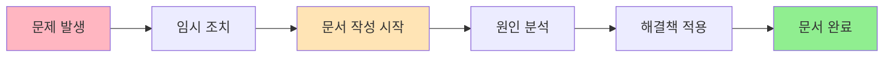

# 트러블슈팅 템플릿

문제 해결 과정을 체계적으로 문서화하는 템플릿입니다.

## 개요

트러블슈팅 문서는 발생한 문제와 해결 과정을 기록하여, 같은 문제가 재발했을 때 빠르게 대응하고 팀 지식을 축적하는 핵심 도구입니다.

## 학습 목표

- [ ] 트러블슈팅 템플릿 구조 이해하기
- [ ] 체계적인 문제 해결 문서화 방법 배우기
- [ ] Claude로 자동 문서화 구축하기
- [ ] 재발 방지 계획 수립하기

---

## 템플릿 구조

### 전체 템플릿

```markdown
---
title: "{{title}}"
created: {{date}}
environment: {{environment}}  # dev, staging, production
---

# {{title}}

## 문제 상황

### 발생 일시
{{datetime}}

### 환경
- 서버: {{server}}
- 버전: {{version}}
- 트래픽: {{traffic_level}}

### 에러 메시지
```
{{error_message}}
```

### 증상
- {{symptom_1}}
- {{symptom_2}}
- 영향 범위: {{affected_users}} 사용자

## 원인 분석

### 근본 원인
{{root_cause}}

### 영향 범위
- 영향 서비스: {{affected_service}}
- 영향 사용자: {{affected_users}}
- 다운타임: {{downtime}}

### 재현 단계
1. {{step_1}}
2. {{step_2}}
3. {{step_3}}

## 해결 방법

### 임시 조치
{{temporary_fix}}

### 근본적 해결
```{{language}}
{{solution_code}}
```

### 적용 결과
- {{result_1}}
- {{result_2}}
- 성능: {{before}} → {{after}}

## 재발 방지

### 코드 개선
{{code_improvement}}

### 설정 변경
```conf
{{config_changes}}
```

### 모니터링 추가
{{monitoring_additions}}

### 테스트 케이스
```test
{{test_case}}
```

## 참고 자료
- [{{reference_title}}]({{reference_url}})
- [[{{related_note_1}}]]
- [[{{related_note_2}}]]

## 역사
| 일자 | 변경 내용 | 작성자 |
|------|----------|--------|
| {{date}} | 초기 작성 | {{author}} |
```

---

## 각 섹션 상세 설명

### 1. 문제 상황

문제가 발생한 당시의 상황을 상세히 기록합니다.

```markdown
## 문제 상황

### 발생 일시
2026-01-10 14:30

### 환경
- 서버: Production Redis Cluster
- 버전: Redis 7.0
- 트래픽: 평소 (약 500 req/s)

### 에러 메시지
```
redis.clients.jedis.exceptions.JedisConnectionException:
java.net.SocketTimeoutException: Read timed out
```

### 증상
- API 응답 시간이 평균 50ms에서 2초로 증가
- 약 30%의 요청에서 타임아웃 발생
- Redis CPU 사용량은 정상

### 영향 범위
- 영향 서비스: 사용자 API, 상품 API
- 영향 사용자: 약 10% (연결 실패 시 재시도)
```

### 2. 원인 분석

문제의 근본 원인을 파악합니다.

```markdown
## 원인 분석

### 근본 원인
Redis 클라이언트의 connectionTimeout이 2초로 설정되어 있었고,
네트워크 지연(ms 단위)이 누적되어 타임아웃이 빈번하게 발생.

### 원인 분류
- [ ] 설정 오류
- [ ] 코드 버그
- [ ] 리소스 부족
- [ ] 외부 의존성
- [ ] 네트워크 문제

### 영향 범위
- 영향 서비스: 사용자 API, 상품 API
- 영향 사용자: 약 10% (연결 실패 시 재시도)
- 다운타임: 없음 (일부 요청만 지연)
```

### 3. 해결 방법

임시 조치와 근본적 해결책을 모두 기록합니다.

```markdown
## 해결 방법

### 임시 조치
Redis 연결 풀 크기를 10에서 20으로 증가하여 즉시 적용

### 근본적 해결
```yaml
# application.yml
spring:
  data:
    redis:
      jedis:
        pool:
          max-active: 20
        connect-timeout: 5000ms  # 2초 → 5초
        timeout: 5000ms           # 2초 → 5초
```

### 적용 결과
- 타임아웃 발생률: 30% → 0.1%
- API 응답 시간: 평균 50ms로 복귀
- 사용자 불만: 0건
```

### 4. 재발 방지

같은 문제가 다시 발생하지 않도록 조치를 기록합니다.

```markdown
## 재발 방지

### 코드 개선
- Redis 연결 설정을 상수로 분리
- 환경별 설정 파일 분리 (dev, staging, prod)

### 설정 변경
```yaml
# redis-default.yml (기본값)
redis:
  timeout: 5000ms  # 최소 5초 권장

# redis-production.yml (운영)
redis:
  timeout: 10000ms  # 운영은 더 길게
```

### 모니터링 추가
```yaml
# Datadog 메트릭
- redis.connection.failures
- redis.connection.timeout.count
- redis.pool.active

# 알림 설정
- 타임아웃 발생률 > 1% 시 알림
```

### 테스트 케이스
```kotlin
@Test
fun `Redis 타임아웃 발생 시 재시도해야 함`() {
    // Given
    val timeoutConfig = TimeoutConfig(1000)  // 1초

    // When
    val result = redisTemplate.get(key)

    // Then
    assertThat(result).isNotNull()
    assertThat(retryCount).isGreaterThan(0)
}
```
```

---

## Claude와 트러블슈팅 문서화

### 1. 에러 로그에서 자동 생성

```markdown
사용자:
"이 에러 로그로 트러블슈팅 문서를 만들어줘.
Templates/troubleshooting 템플릿을 사용해서"

[에러 로그 붙여넣기]

Claude:
## 분석 완료

에러: `SocketTimeoutException: Read timed out`
원인: Redis 연결 타임아웃 설정이 너무 짧음 (2초)

문서를 생성했습니다:
- 경로: Troubleshooting/redis/timeout-2026-01-10.md
- 상태: investigating
```

### 2. 진행 상황 업데이트

```markdown
사용자:
"트러블슈팅 문서의 상태를 resolved로 변경하고
최종 해결책을 추가해줘"

Claude:
업데이트 완료:
- - 해결 방법 섹션에 최종 코드 추가
- 재발 방지 계획 추가
```

### 3. 관련 문서 연결

```markdown
사용자:
"이 트러블슈팅과 관련된
기존 노트들을 찾아서 연결해줘"

Claude:
다음 노트를 연결했습니다:
- [[Resources/Database/Redis/connection-pooling]]
- [[Troubleshooting/redis/performance-2025-12-01]]
- [[Areas/Monitoring/alerts]]

MOC 업데이트:
- [[MOC/Redis]]에 새 문서 추가
```

---

## 실전 예시

### Before: 템플릿 없음

```markdown
# Redis 에러

오늘 Redis에서 에러가 났다.
타임아웃이 발생했고, 연결이 안 됐다.
설정을 수정해서 해결했다.

코드:

해결: timeout을 늘렸다.
```

**문제점**
- 환경 정보 없음
- 정확한 에러 메시지 없음
- 해결책 구체적이지 않음
- 재발 방지 없음

### After: 템플릿 적용

```markdown
---
title: "Redis Connection Timeout"
parent: "Part 4: 템플릿 활용"
nav_order: 3
environment: production
---

# Redis Connection Timeout

## 문제 상황

### 발생 일시
2026-01-10 14:30

### 환경
- 서버: Production Redis Cluster
- 버전: Redis 7.0
- 트래픽: 평소 (약 500 req/s)

### 에러 메시지
```
redis.clients.jedis.exceptions.JedisConnectionException:
java.net.SocketTimeoutException: Read timed out
```

### 증상
- API 응답 시간이 평균 50ms에서 2초로 증가
- 약 30%의 요청에서 타임아웃 발생
- Redis CPU 사용량은 정상

### 영향 범위
- 영향 서비스: 사용자 API, 상품 API
- 영향 사용자: 약 10% (연결 실패 시 재시도)
- 다운타임: 없음 (일부 요청만 지연)

## 원인 분석

### 근본 원인
Redis 클라이언트의 connectionTimeout이 2초로 설정되어 있었고,
네트워크 지연(ms 단위)이 누적되어 타임아웃이 빈번하게 발생.

### 원인 분류
- [x] 설정 오류
- [ ] 코드 버그
- [ ] 리소스 부족
- [ ] 외부 의존성
- [ ] 네트워크 문제

## 해결 방법

### 임시 조치
Redis 연결 풀 크기를 10에서 20으로 증가

### 근본적 해결
```yaml
# application.yml
spring:
  data:
    redis:
      jedis:
        pool:
          max-active: 20
        connect-timeout: 5000ms  # 2초 → 5초
        timeout: 5000ms           # 2초 → 5초
```

### 적용 결과
- 타임아웃 발생률: 30% → 0.1%
- API 응답 시간: 평균 50ms로 복귀

## 재발 방지

### 설정 변경
- connectionTimeout을 최소 5초로 권장
- 환경별 설정 파일 분리

### 모니터링 추가
```yaml
# Datadog 메트릭
- redis.connection.failures
- redis.connection.timeout.count
- redis.pool.active
```

## 참고 자료
- [Redis Connection Best Practices](https://redis.io/docs/manual/patterns/)
- [[Resources/Database/Redis/caching-patterns]]
- [[Monitoring/Redis-Dashboard]]
```

---

## 상태 관리

### 상태 값

| 상태 | 설명 | 다음 단계 |
|------|------|----------|
| `open` | 문제가 발생하여 조사 시작 | `investigating` |
| `investigating` | 원인 파악 중 | `resolved` |
| `resolved` | 해결책 적용 완료 | - |

### 상태 변경 예시

```markdown
## 역사
| 일자 | 상태 | 변경 내용 | 작성자 |
|------|------|----------|--------|
| 2026-01-10 14:30 | open | 문제 발생, 초기 기록 | 홍길동 |
| 2026-01-10 15:00 | investigating | 원인 파악 중 | 홍길동 |
| 2026-01-10 16:30 | resolved | 해결책 적용 완료 | 홍길동 |
```

---

## 검색 팁

### Dataview 쿼리

```dataview
# 해결되지 않은 문제
TABLE file.ctime as "생성일", status as "상태"
FROM #troubleshooting
WHERE status != "resolved"
SORT file.ctime DESC
```

```dataview
# 최근 30일 트러블슈팅 현황
TABLE status as "상태", tags as "태그"
FROM #troubleshooting
WHERE file.ctime >= date(today) - dur(30 days)
SORT file.ctime DESC
```

---

## 모범 사례

### 1. 즉시 기록



### 2. 상세한 에러 메시지

```markdown
### 에러 메시지
```
java.lang.NullPointerException: Cannot invoke "String.length()"
because the return value of "java.util.Map.get(Object)" is null
    at com.example.UserService.getUser(UserService.java:42)
    at com.example.ApiController.handle(ApiController.java:15)
```

### 3. 구체적인 증상

❌ **나쁜 예**
```markdown
- 에러가 발생함
- 느려짐
```

✅ **좋은 예**
```markdown
- API 응답 시간: 50ms → 2000ms (40배 증가)
- 에러 발생률: 전체 요청의 30%
- 영향 사용자: 약 1000명 (전체의 10%)
```

### 4. 검색 가능한 태그

```markdown
---
---

# 기술: redis
# 문제 유형: timeout, connection
# 환경: production
```

---

## 실습 과제

- [ ] 자신이 최근에 겪은 문제 하나 선택
- [ ] 템플릿을 사용하여 트러블슈팅 문서 작성
- [ ] Claude에게 에러 로그 분석 요청
- [ ] 해결책 적용 후 문서 업데이트
- [ ] Dataview로 미해결 문제 조회

---

## 참고 자료

- [Blameless Postmortem 문화](https://blameless.com/postmortem/)
- [Google SRE Book - Incident Management](https://sre.google/sre-book/managing-incidents/)

---

## 다음 단계

트러블슈팅을 기록했으면, 이제 API를 설계해봅시다.

→ [[14-template-api|API 설계 템플릿]]
