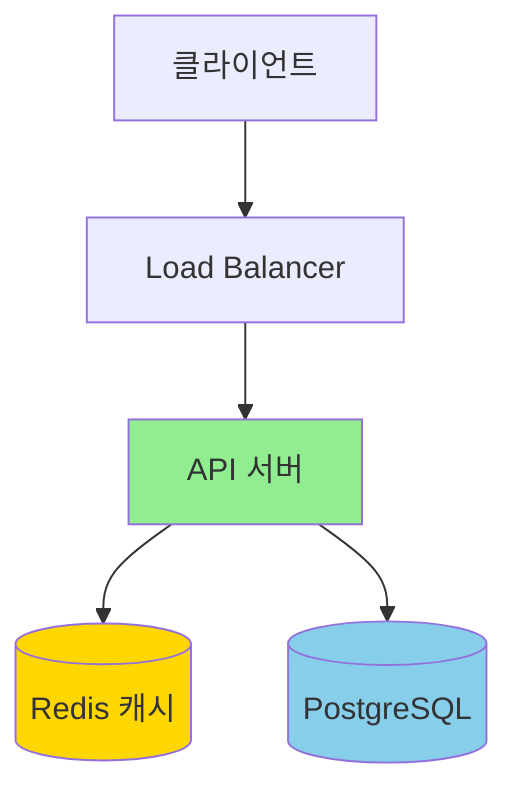
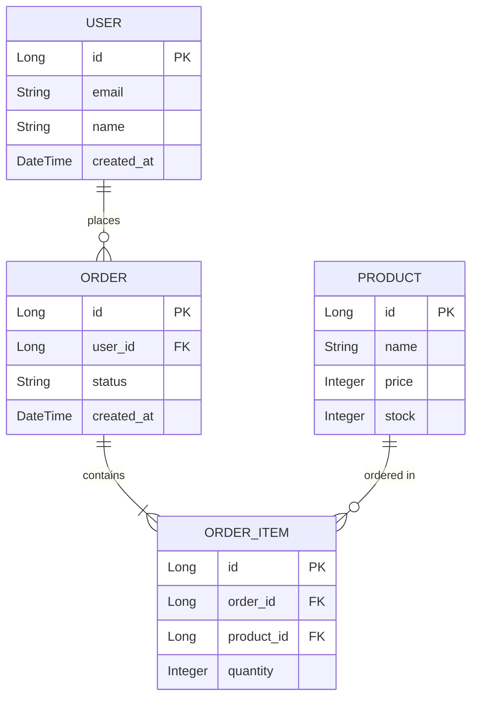
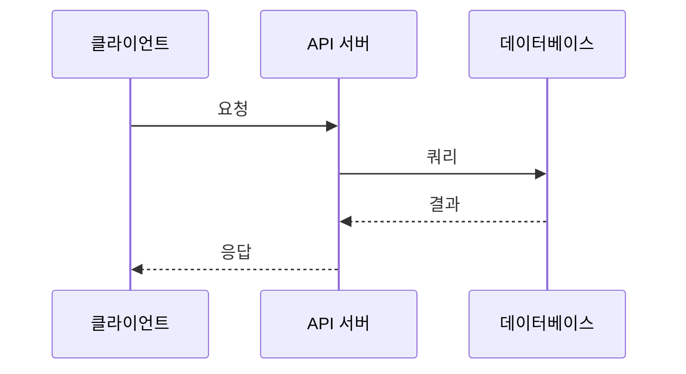
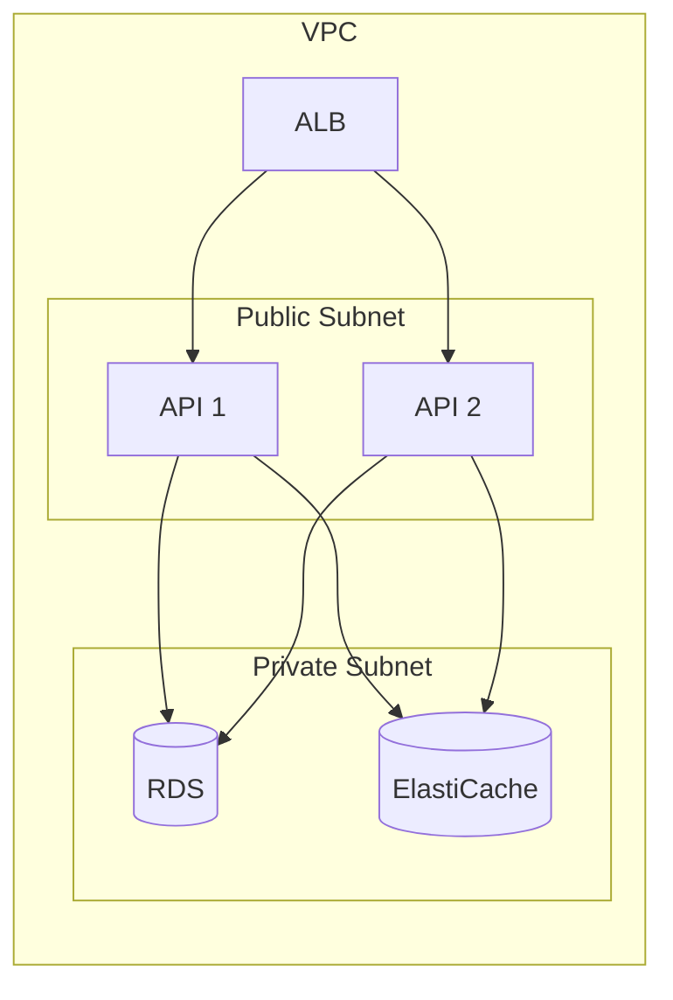
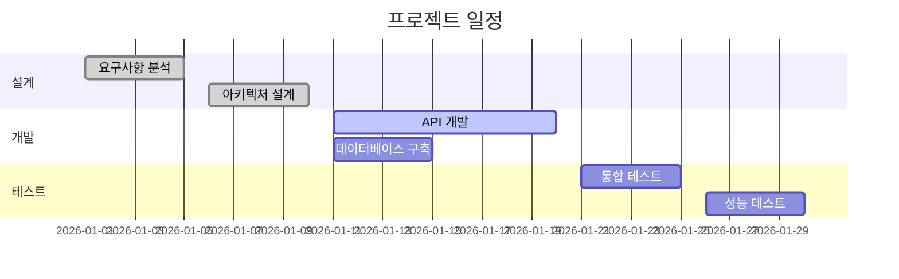
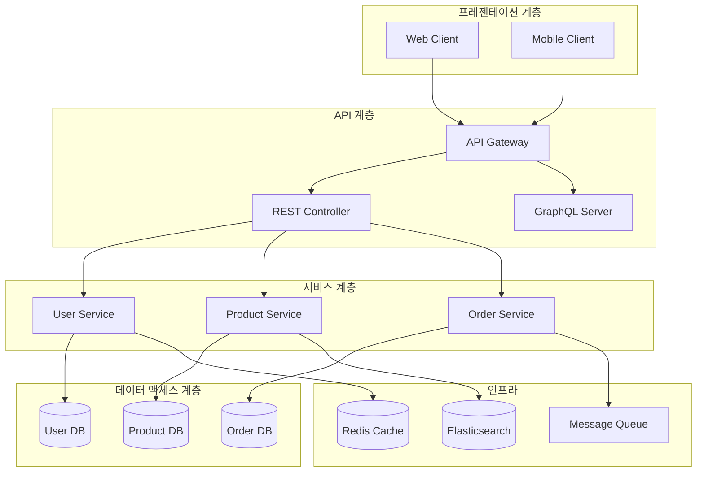
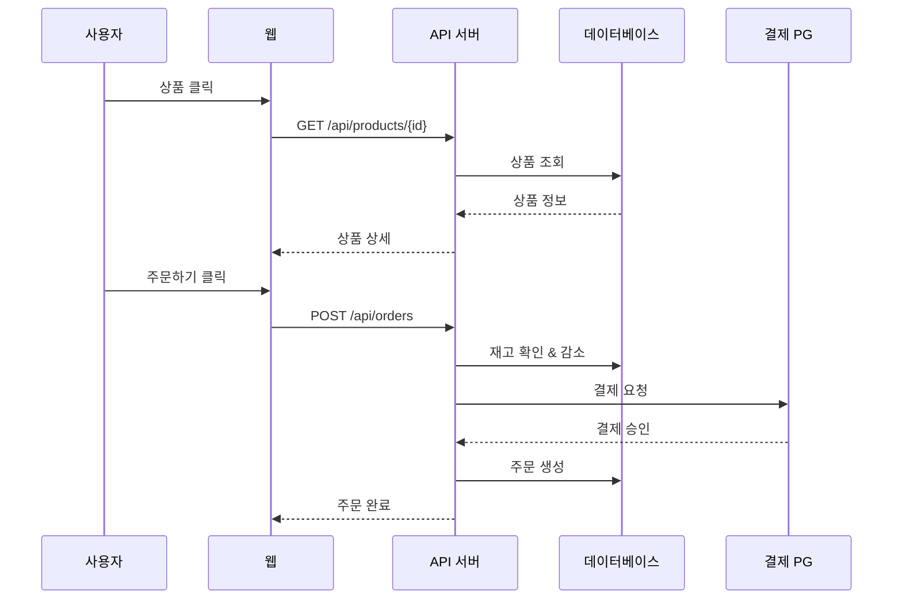
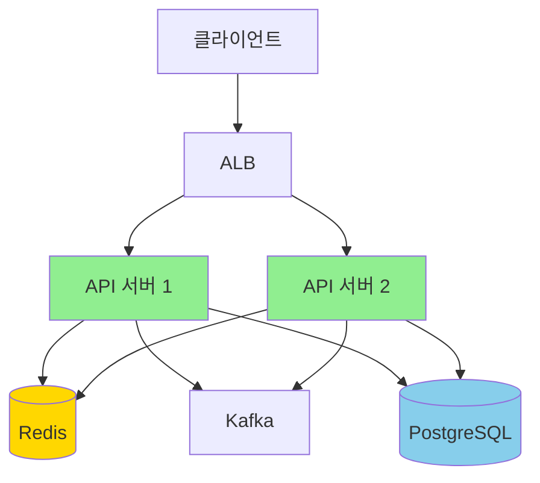
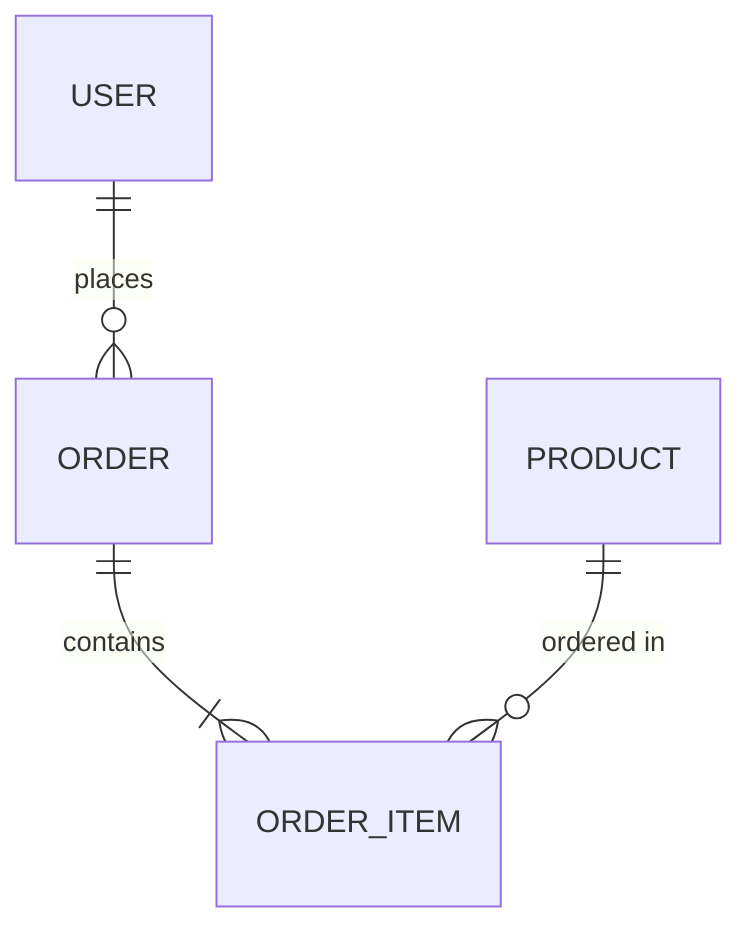
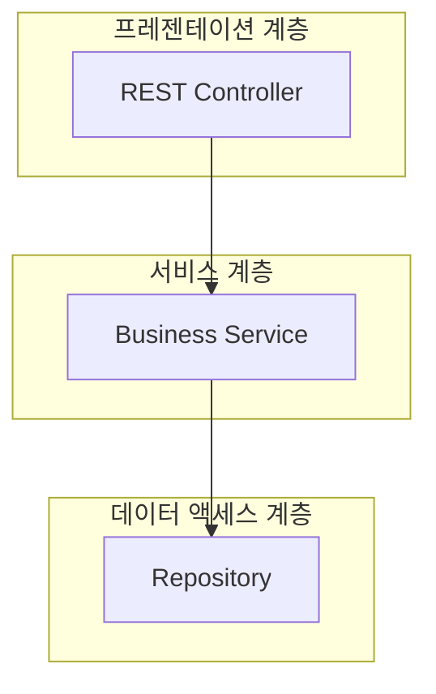

# 시스템 설계 템플릿

시스템 아키텍처를 문서화하는 템플릿입니다.

## 개요

시스템 설계 문서는 프로젝트의 아키텍처, 데이터 모델, API 설계, 배포 구조 등을 포함하는 종합적인 기술 문서입니다. 표준 형식을 사용하면 팀원 간 이해를 높일 수 있습니다.

## 학습 목표

- [ ] 시스템 설계 문서 표준 구조 이해하기
- [ ] 아키텍처 다이어그램 작성하기
- [ ] 데이터 모델링 문서화하기
- [ ] Claude로 설계 문서 작성 자동화하기

---

## 템플릿 구조

### 전체 템플릿

```markdown
---
title: "{{시스템명}} 설계"
version: "{{version}}"
created: {{date}}
author: {{author}}
---

# {{시스템명}} 설계

## 개요

### 프로젝트 배경
{{background}}

### 목표
{{goals}}

### 범위
{{scope}}

### 제약사항
{{constraints}}

---

## 요구사항

### 기능적 요구사항
| ID | 요구사항 | 우선순위 |
|----|----------|----------|
| FR-001 | {{requirement_1}} | P0 |
| FR-002 | {{requirement_2}} | P1 |

### 비기능적 요구사항
| 항목 | 목표 | 측정 방법 |
|------|------|-----------|
| 성능 | {{performance_goal}} | {{metric}} |
| 가용성 | {{availability_goal}} | {{metric}} |
| 확장성 | {{scalability_goal}} | {{metric}} |
| 보안 | {{security_goal}} | {{metric}} |

---

## 아키텍처

### 전체 구조



### 계층별 설명
{{layer_descriptions}}

### 기술 스택
| 계층 | 기술 | 버전 |
|------|------|------|
| 프론트엔드 | {{frontend}} | {{version}} |
| 백엔드 | {{backend}} | {{version}} |
| 데이터베이스 | {{database}} | {{version}} |
| 캐시 | {{cache}} | {{version}} |
| 메시지 큐 | {{message_queue}} | {{version}} |

---

## 데이터 모델

### ERD



### 주요 테이블 설명
{{table_descriptions}}

---

## API 설계

### 주요 엔드포인트
| 메서드 | 경로 | 설명 |
|--------|------|------|
| GET | /api/users | 사용자 목록 |
| POST | /api/users | 사용자 생성 |
| GET | /api/users/{id} | 사용자 조회 |
| PUT | /api/users/{id} | 사용자 수정 |

상세 API 명세: [[{{api_spec_doc}}]]

---

## 상세 설계

### 핵심 컴포넌트

#### 1. {{component_1}}
**목적**: {{purpose}}
**기술**: {{technology}}
```kotlin
interface {{InterfaceName}} {
    fun {{method}}(): {{ReturnType}}
}
```

#### 2. {{component_2}}
{{description}}

### 데이터 흐름



---

## 배포 구조

### 인프라



### 서버 사양
| 서버 | 사양 | 개수 |
|------|------|------|
| API | {{api_spec}} | {{count}} |
| DB | {{db_spec}} | {{count}} |
| Cache | {{cache_spec}} | {{count}} |

---

## 모니터링

### 메트릭
```yaml
# Datadog 메트릭
- API 요청 수 (request count)
- API 응답 시간 (response time)
- 에러율 (error rate)
- DB 연결 수 (db connections)
- 캐시 적중률 (cache hit rate)
```

### 알림
| 항목 | 임계값 | 알림 방법 |
|------|---------|-----------|
| 에러율 | > 1% | Slack |
| 응답 시간 | > 500ms | Slack |
| CPU 사용량 | > 80% | Slack |
| 메모리 사용량 | > 85% | Slack |

---

## 보안

### 인증/인가
- 인증: {{auth_method}}
- 인가: {{authorization_method}}

### 데이터 보호
- 전송: HTTPS (TLS 1.3)
- 저장: {{encryption_method}}
- 민감 정보: {{sensitive_data_protection}}

---

## 개발 계획

### 단계
| 단계 | 작업 | 기간 | 담당자 |
|------|------|------|--------|
| 1단계 | {{task_1}} | {{duration}} | {{assignee}} |
| 2단계 | {{task_2}} | {{duration}} | {{assignee}} |

### 마일스톤


---

## 위험 분석

### 기술적 리스크
| 리스크 | 확률 | 영향 | 대응책 |
|--------|------|------|--------|
| {{risk_1}} | {{probability}} | {{impact}} | {{mitigation}} |

### 일정 리스크
{{schedule_risks}}

---

## 참고 자료

- [[요구사항 문서]]
- [[API 명세서]]
- [[데이터베이스 스키마]]
- [{{reference_title}}]({{reference_url}})
```

---

## 각 섹션 상세 설명

### 1. 요구사항 분석

명확한 요구사항은 좋은 설계의 시작입니다.

```markdown
## 요구사항

### 기능적 요구사항
| ID | 요구사항 | 상세 설명 | 우선순위 |
|----|----------|-----------|----------|
| FR-001 | 사용자 회원가입 | 이메일 인증, 비밀번호 암호화 | P0 |
| FR-002 | 상품 검색 | 키워드 검색, 필터링, 정렬 | P0 |
| FR-003 | 장바구니 | 추가, 삭제, 수량 수정 | P0 |
| FR-004 | 주문 | 결제 연동, 재고 확인 | P0 |
| FR-005 | 리뷰 작성 | 별점, 사진 업로드 | P1 |

### 비기능적 요구사항
| 항목 | 목표 | 측정 방법 |
|------|------|-----------|
| 성능 | API 응답 시간 100ms 이내 (p95) | APM 모니터링 |
| 가용성 | 99.9% (월간 다운타임 43분 이하) | Uptime 모니터링 |
| 확장성 | 트래픽 10배까지 수용 | 부하 테스트 |
| 동시성 | 10,000 동시 사용자 지원 | 부하 테스트 |
| 보안 | OWASP Top 10 방어 | 보안 감사 |
```

### 2. 아키텍처 설계

계층형 아키텍처를 권장합니다:



### 3. 데이터 모델링

ERD와 함께 각 테이블의 설명을 포함합니다:

```markdown
### 주요 테이블

#### users (사용자)
| 컬럼 | 타입 | null | 설명 |
|------|------|------|------|
| id | BIGINT | No | PK, 자동 증가 |
| email | VARCHAR(255) | No | UK, 이메일 |
| password | VARCHAR(255) | No | BCrypt 암호화 |
| name | VARCHAR(100) | No | 이름 |
| created_at | TIMESTAMP | No | 생성일시 |
| updated_at | TIMESTAMP | No | 수정일시 |

**인덱스**
- idx_email: email (UNIQUE)

#### orders (주문)
| 컬럼 | 타입 | null | 설명 |
|------|------|------|------|
| id | BIGINT | No | PK |
| user_id | BIGINT | No | FK → users.id |
| status | VARCHAR(50) | No | 주문 상태 |
| total_amount | DECIMAL(10,2) | No | 총 금액 |
| created_at | TIMESTAMP | No | 생성일시 |

**인덱스**
- idx_user_id: user_id
- idx_- idx_created_at: created_at
```

---

## Claude로 설계 문서 작성

### 1. 요구사항에서 설계 생성

```markdown
사용자:
"다음 요구사항으로 시스템 설계 문서를 작성해줘.

요구사항:
- 사용자가 상품을 검색하고 주문할 수 있는 이커머스 시스템
- 일일 10만 명의 사용자, 피크 시 5,000 TPS
- 99.9% 가용성 목표

Templates/system-design 템플릿을 사용해서
아키텍처 다이어그램도 포함해줘."

Claude:
## 설계 문서 생성 완료

아키텍처:
- 3계층 구조 (프레젠테이션, 서비스, 데이터)
- Stateless API 서버 (Auto Scaling)
- Redis 캐싱 (Read-heavy 최적화)
- PostgreSQL RDS (Multi-AZ)

데이터 모델:
- users, products, orders, order_items
- 정규화된 테이블 구조

전체 문서:
- 경로: Architecture/ecommerce-design.md
```

### 2. 기존 설계 업데이트

```markdown
사용자:
"이커머스 설계에 메시지 큐를 추가해줘.
주문 완료 후 재고 업데이트를 비동기로 처리"

Claude:
업데이트 완료:

아키텍처 변경:
```
OrderService → [Kafka] → InventoryService
```

추가된 컴포넌트:
- Kafka Cluster (3 brokers)
- Inventory Consumer (2 instances)

데이터 흐름:
1. OrderService: 주문 생성 → Kafka 발행
2. InventoryService: Kafka 구독 → 재고 업데이트
```

### 3. 다이어그램 생성

```markdown
사용자:
"이 시스템의 시퀀스 다이어그램을 그려줘.
사용자가 상품을 주문하는 과정"

Claude:

```

---

## 실전 예시

### Before: 템플릿 없음

```markdown
# 이커머스 시스템

Spring Boot로 만들거야.
DB는 PostgreSQL.
Redis도 쓰고.
카프카도 있으면 좋음.

끝.
```

**문제점**
- 구체적인 아키텍처 없음
- 데이터 모델 없음
- 비기능적 요구사항 고려 없음
- 팀원과 공유 불가능

### After: 템플릿 적용

```markdown
---
title: "이커머스 시스템 설계"
version: "1.0.0"
parent: "Part 4: 템플릿 활용"
nav_order: 5
author: 백엔드팀
---

# 이커머스 시스템 설계

## 개요

### 프로젝트 배경
온라인 쇼핑몰 플랫폼 구축 프로젝트입니다. 사용자는 상품을 검색하고 장바구니에 담아 주문할 수 있습니다.

### 목표
- 일일 10만 명의 활성 사용자 지원
- 피크 시 5,000 TPS 처리
- 99.9% 가용성

### 범위
- 회원가입/로그인
- 상품 검색/조회
- 장바구니/주문
- 결제 연동

---

## 요구사항

### 기능적 요구사항
| ID | 요구사항 | 우선순위 |
|----|----------|----------|
| FR-001 | 사용자 회원가입 | P0 |
| FR-002 | 상품 검색 | P0 |
| FR-003 | 장바구니 | P0 |
| FR-004 | 주문/결제 | P0 |

### 비기능적 요구사항
| 항목 | 목표 | 측정 방법 |
|------|------|-----------|
| 성능 | API 응답 시간 100ms 이내 (p95) | APM |
| 가용성 | 99.9% | Uptime |
| 확장성 | 트래픽 10배 지원 | 부하 테스트 |

---

## 아키텍처

### 전체 구조



### 기술 스택
| 계층 | 기술 | 버전 |
|------|------|------|
| 백엔드 | Spring Boot | 3.2 |
| 데이터베이스 | PostgreSQL | 15 |
| 캐시 | Redis | 7.0 |
| 메시지 큐 | Kafka | 3.6 |

---

## 데이터 모델

### ERD


```

---

## 모범 사례

### 1. 명확한 계층 분리



### 2. 확장성 고려

❌ **나쁜 예**
```yaml
# 단일 서버
API: 1대 (모든 트래픽 처리)
```

✅ **좋은 예**
```yaml
# 오토스케일링
API:
  - Min: 2대
  - Max: 10대
  - 조건: CPU > 70% (5분)
```

### 3. 고가용성

❌ **나쁜 예**
```
Single Point of Failure
```

✅ **좋은 예**
```
Multi-AZ 배포
- DB: Primary + Standby (다른 AZ)
- Cache: Cluster Mode (3개 AZ)
- API: Auto Scaling (다중 AZ)
```

---

## 실습 과제

- [ ] 본인이 만들고 싶은 시스템을 하나 선택
- [ ] 요구사항 정의
- [ ] 아키텍처 다이어그램 작성
- [ ] 데이터 모델 설계
- [ ] Claude에게 리뷰 요청

---

## 참고 자료

- [AWS Well-Architected Framework](https://aws.amazon.com/architecture/well-architected/)
- [System Design Primer](https://github.com/donnemartin/system-design-primer)
- [Software Architecture Patterns](https://martinfowler.com/architecture/)

---

## 다음 단계

시스템을 설계했으면, 이제 Mermaid로 표현해봅시다.

→ [[16-mermaid|Mermaid 다이어그램]]
