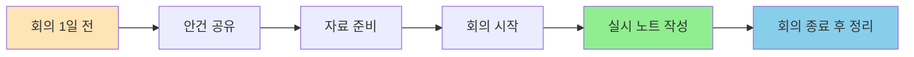

# 회의록 템플릿

회의 내용을 체계적으로 기록하는 템플릿입니다.

## 개요

회의록은 회의 중 논의된 내용, 결정 사항, Action Item을 기록하여 팀원 간의 커뮤니케이션을 개선하고 추적 가능성을 높이는 핵심 도구입니다.

## 학습 목표

- [ ] 회의록 표준 구조 이해하기
- [ ] 회의 중 실시 노트 작성 방법 배우기
- [ ] Action Item 추적 방법 배우기
- [ ] Claude로 회의록 자동 정리하기

---

## 템플릿 구조

### 전체 템플릿

```markdown
---
title: "{{회의명}}"
tags: [meeting, {{meeting_type}}, {{date}}]
date: {{date}}
attendees: {{attendees}}
---

# {{회의명}}

## 기본 정보

| 항목 | 내용 |
|------|------|
| 날짜 | {{date}} |
| 시간 | {{start_time}} - {{end_time}} |
| 장소 | {{location}} |
| 주최자 | {{organizer}} |
| 참석자 | {{attendees}} |
| 불참자 | {{absentees}} |

---

## 회의 목적

{{purpose}}

---

## 안건

### 1. {{agenda_1}}

#### 배경
{{background}}

#### 논의 내용
{{discussion}}

#### 결정 사항
- [x] {{decision_1}}
- [x] {{decision_2}}

---

### 2. {{agenda_2}}

#### 배경
{{background}}

#### 논의 내용
{{discussion}}

#### 결정 사항
- [x] {{decision_1}}

---

## Action Items

| 작업 | 담당자 | 마감일 | 상태 |
|------|--------|--------|------|
| {{action_1}} | {{assignee}} | {{due_date}} | [ ] |
| {{action_2}} | {{assignee}} | {{due_date}} | [ ] |

---

## 논의 중 공유 자료

- [[{{resource_1}}]]
- [[{{resource_2}}]]
- [{{resource_3}}]({{url}})

---

## 다음 회의

- 일정: {{next_meeting_date}}
- 예정 안건: {{next_agendas}}

---

## 회의록 작성자
{{author}}
```

---

## 각 섹션 상세 설명

### 1. 기본 정보

회의의 메타데이터를 기록합니다:

```markdown
## 기본 정보

| 항목 | 내용 |
|------|------|
| 날짜 | 2026-01-10 |
| 시간 | 14:00 - 15:00 |
| 장소 | 회의실 A / Google Meet |
| 주최자 | 홍길동 |
| 참석자 | 홍길동, 김철수, 이영희 |
| 불참자 | 박민수 (연차不可) |
```

### 2. 안건별 논의

각 안건마다 배경, 논의 내용, 결정 사항을 기록합니다:

```markdown
### 1. Kafka 마이그레이션 검토

#### 배경
- 현재 RabbitMQ 사용 중
- 확장성 이슈로 Kafka 도입 고려

#### 논의 내용
1. PoC 진행 현황
   - 3개 시나리오 테스트 완료
   - 성능: RabbitMQ 5,000 msg/s vs Kafka 50,000 msg/s
2. 운영 복잡도
   - Kafka 운영 경험 부족
   - 교육 필요성 제기
3. 일정
   - PoC 완료: 2월 말
   - 도입 결정: 3월 초

#### 결정 사항
- [x] PoC 추가 진행 (성능 테스트 확장)
- [x] Kafka 교육 일정 확보
- [x] 도입 여부는 3월 첫 주 주간 회의에서 결정
```

### 3. Action Item

구체적인 작업과 담당자를 명시합니다:

```markdown
## Action Items

| 작업 | 담당자 | 마감일 | 상태 |
|------|--------|--------|------|
| Kafka 성능 테스트 시나리오 작성 | 홍길동 | 1/17 | [ ] |
| Kafka 교육 과정 조사 | 김철수 | 1/20 | [ ] |
| PoC 환경 구축 | 이영희 | 1/24 | [x] |

*상태: [ ] 미완료, [x] 완료, [~] 진행 중*
```

---

## Claude로 회의록 작성

### 1. 실시 노트 정리

```markdown
사용자:
"다음 회의 노트를 정리해줘.

Kafka 마이그레이션 논의:
- 장점: 확장성, 성능
- 단점: 운영 복잡도
- 결정: PoC 추가 진행

Templates/meeting-notes 템플릿 사용해서"

Claude:
## 회의록 정리 완료

생성된 문서:
- 경로: Meetings/2026-01-10-kafka-migration.md
- 안건별 구조화
- Action Item 테이블 생성
- 결정 사항 요약
```

### 2. Action Item 추출

```markdown
사용자:
"회의 녹음 내용(혹은 메모)에서
Action Item을 추출해줘.

내용:
철수야: 성능 테스트 좀 부탁해
영희야: 교육 찾아봐
길동: 다음 주 회의 잡아줘"

Claude:
## Action Items 추출 완료

| 작업 | 담당자 | 마감일 |
|------|--------|--------|
| Kafka 성능 테스트 시나리오 작성 | 김철수 | 1/17 |
| Kafka 교육 과정 조사 | 이영희 | 1/17 |
| 다음 주 회의 일정 확정 | 홍길동 | 1/13 |

미리보기:
```markdown
## Action Items
- [ ] 김철수: Kafka 성능 테스트 시나리오 작성 (마감: 1/17)
- [ ] 이영희: Kafka 교육 과정 조사 (마감: 1/17)
- [ ] 홍길동: 다음 주 회의 일정 확정 (마감: 1/13)
```
```

### 3. 주간 회고와 연결

```markdown
사용자:
"이번 주 모든 회의록을 정리해서
주간 회고에 추가해줘.

회의:
- 1/9 Kafka PoC 현황
- 1/10 일일 스큠럼
- 1/11 API 설계 검토"

Claude:
## 주간 회고 업데이트 완료

회의 요약:
- 총 3개 회의 (총 4시간)
- 주요 결정: Kafka PoC 추가 진행
- Action Item: 8건 (완료: 5, 진행: 3)

연결된 문서:
- [[Weekly/2026-02-W2]] 주간 회고에 추가
- [[MOC/Projects/Kafka]] MOC 업데이트
```

---

## 실전 예시

### Before: 템플릿 없음

```markdown
# 회의록

Kafka 도입 논의했음.
성능이 좋아서 하는 것 같음.
PoC 더 하기로 함.

끝.
```

**문제점**
- 구조 없음
- 누가 무엇을 해야 할지 불분명
- 나중에 내용 파악 불가능

### After: 템플릿 적용

```markdown
---
title: "Kafka 마이그레이션 검토 회의"
tags: [meeting, architecture, kafka]
date: 2026-01-10
attendees: 홍길동, 김철수, 이영희
---

# Kafka 마이그레이션 검토 회의

## 기본 정보

| 항목 | 내용 |
|------|------|
| 날짜 | 2026-01-10 |
| 시간 | 14:00 - 15:00 |
| 장소 | 회의실 A |
| 주최자 | 홍길동 |
| 참석자 | 홍길동, 김철수, 이영희 |

---

## 회의 목적

RabbitMQ에서 Kafka로의 마이그레이션을 검토하고 PoC 진행 여부를 결정합니다.

---

## 안건

### 1. PoC 진행 현황 공유

#### 배경
- 2025년 12월부터 PoC 진행 중
- 3개 시나리오 테스트 완료

#### 논의 내용

**테스트 결과**
| 시나리오 | RabbitMQ | Kafka |
|----------|----------|-------|
| 대량 메시지 처리 | 5,000 msg/s | 50,000 msg/s |
| 지연 처리 | 100ms | 10ms |
| 순서 보장 | 불가능 | 가능 |

**문제점**
- Exactly-Once 보장 구현 복잡
- 운영 경험 부족

#### 결정 사항
- [x] PoC 추가 진행 (성능 테스트 확장)
- [x] 운영 복잡도 분석 추가

---

### 2. 일정 및 리소스

#### 배경
- PoC 완료 목표: 2월 말
- 도입 결정: 3월 초

#### 논의 내용
1. 리소스
   - 현재: 홍길동 50% 할당
   - 필요: 전담 1명 추가

2. 일정
   - 성능 테스트: 1/20 ~ 1/27
   - 운영 분석: 1/20 ~ 1/31
   - 최종 보고: 2/5

#### 결정 사항
- [x] 리소스 추가 요청 (CTO 승인 필요)
- [x] 일정 확정

---

## Action Items

| 작업 | 담당자 | 마감일 | 상태 |
|------|--------|--------|------|
| Kafka 성능 테스트 시나리오 작성 | 홍길동 | 1/17 | [ ] |
| Kafka 교육 과정 조사 | 김철수 | 1/20 | [ ] |
| 리소스 추가 요청서 작성 | 이영희 | 1/17 | [ ] |
| Exactly-Once 구현 방안 조사 | 홍길동 | 1/24 | [ ] |

---

## 다음 회의

- 일정: 2026-01-17 14:00
- 예정 안건: PoC 중간 점검
```

---

## 모범 사례

### 1. 회의 전 준비



### 2. Action Item 명확히

❌ **나쁜 예**
```markdown
- Kafka 조사
- 성능 테스트
```

✅ **좋은 예**
```markdown
- [ ] 김철수: Kafka 교육 과정 3개 조사 (마감: 1/20)
- [ ] 홍길동: 10만 TPS 성능 테스트 시나리오 작성 (마감: 1/17)
```

### 3. 결정 사항 요약

```markdown
## 결정 사항 요약

### 1. Kafka PoC 추가 진행
- 사유: 성능 우위 확인
- 조건: 운영 복잡도 분석 후 최종 결정

### 2. 리소스 추가 요청
- 내용: 전담 1명
- 대상: 2월~3월
- 승인: CTO

### 3. 도입 결정 연기
- 기존: 2월 결정
- 변경: 3월 첫 주 주간 회의에서 결정
```

---

## 회의 유형별 템플릿

### 1. 기술 검토 회의

```markdown
## 안건

### {{기술}} 도입 검토

#### 현재 상황
{{current_status}}

#### 도입 필요성
{{need}}

#### 기술 비교
| 항목 | A안 | B안 |
|------|-----|-----|
| 성능 | {{a_performance}} | {{b_performance}} |
| 비용 | {{a_cost}} | {{b_cost}} |
| 운영 난이도 | {{a_ops}} | {{b_ops}} |

#### 결정 사항
- [x] {{decision}}
```

### 2. 일일 스큠럼

```markdown
## 안건

### 어제 한 일
- [x] {{task_1}}
- [x] {{task_2}}

### 오늘 할 일
- [ ] {{task_1}}
- [ ] {{task_2}}

### 이슈/리스크
- {{issue}}

### 도움이 필요한 부분
- {{help_needed}}
```

### 3. 코드 리뷰

```markdown
## 안건

### PR #{{pr_number}}: {{pr_title}}

#### 링크
[{{repository}}/pull/{{pr_number}}]({{url}})

#### 변경 사항
{{changes}}

#### 리뷰 의견
| 파일 | 라인 | 의견 | 우선순위 |
|------|------|------|----------|
| {{file}} | {{line}} | {{comment}} | P0 |

#### 결정 사항
- [x] 승인 / 수정 요청 / 보류

#### Action Items
| 작업 | 담당자 | 마감일 |
|------|--------|--------|
| {{fix}} | {{assignee}} | {{due}} |
```

---

## 검색 팁

### Dataview 쿼리

```dataview
# 이번 달 회의
TABLE date, attendees
FROM #meeting
WHERE date >= date(2026-01-01)
AND date <= date(2026-01-31)
SORT date DESC
```

```dataview
# 미완료 Action Item
LIST
FROM #meeting
WHERE contains(file.content, "[ ]")
```

---

## 실습 과제

- [ ] 본인이 참여한 회의 하나 선택
- [ ] 템플릿을 사용하여 회의록 작성
- [ ] Action Item 추적
- [ ] Claude에게 회의 노트 정리 요청

---

## 참고 자료

- [Effective Meetings Guide](https://www.atlassian.com/blog/productivity/effective-meetings/)
- [Project Meeting Agenda Template](https://www.smartsheet.com/content/project-meeting-agenda-template)

---

## 다음 단계

회의록을 작성했으면, 이제 기술 학습을 문서화해봅시다.

→ [[17-template-learning|학습 노트 템플릿]]
