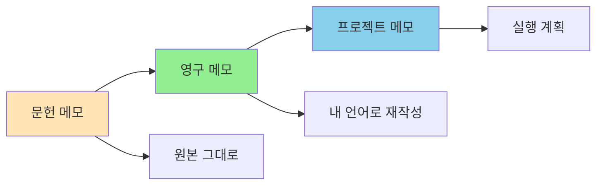

# 학습 노트 템플릿

기술 문서를 읽고 학습한 내용을 정리하는 템플릿입니다.

## 개요

학습 노트는 Zettelkasten 방법론을 적용하여 영구적인 지식으로 저장하는 핵심 도구입니다. 단순한 북여넣기가 아니라 자신만의 언어로 재작성하여 지식을 내재화합니다.

## 학습 목표

- [ ] 학습 노트 표준 구조 이해하기
- [ ] 문헌 메모와 영구 메모 구분하기
- [ ] Claude로 학습 내용 정리하기
- [ ] 백링크로 지식 연결하기

---

## 템플릿 구조

### 문헌 메모 (Literature Note)

원본에서 직접 인용하는 메모입니다:

```markdown
---
title: "LM-{{title}}"
source: {{source}}
---

# {{title}}

## 출처
{{source}}

## 인용 내용

> {{quote}}

## 요약
{{summary}}

## 메타데이터
- 작성일: {{date}}
- 난이도: {{difficulty}}
- 카테고리: {{category}}
```

### 영구 메모 (Permanent Note)

자신만의 언어로 재작성한 메모입니다:

```markdown
---
title: "{{concept}}"
---

# {{concept}}

## 핵심 내용
{{core_concept}}

## 왜 중요한가?
{{importance}}

## 적용 방법
{{application}}

## 예시
```{{language}}
{{example}}
```

## 관련 개념
- [[{{related_1}}]]
- [[{{related_2}}]]

## MOC
- [[MOC/{{topic}}]]
```

---

## 각 섹션 상세 설명

### 1. 문헌 메모 작성

블로그 글, 문서, 책을 읽을 때:

```markdown
---
title: "LM-Spring Data Redis HINCRBY"
source: "Redis 공식 문서"
---

# Spring Data Redis HINCRBY

## 출처
[Redis HINCRBY Command](https://redis.io/commands/hincrby/)
작성일: 2026-01-10

## 인용 내용

> HINCRBY key field increment
> Increments the number stored at field in the hash stored at key by increment.
> If key does not exist, a new key holding a hash is created.
> If field does not exist, the value is set to 0 before the operation is performed.

> The range of values supported by HINCRBY is limited to 64-bit signed integers.

## 요약
Redis 해시의 필드 값을 원자적으로 증가시키는 명령어.
존재하지 않는 키나 필드인 경우 0으로 초기화 후 증가.

## 메타데이터
- 작성일: 2026-01-10
- 난이도: 초급
- 카테고리: Redis 명령어
```

### 2. 영구 메모 작성

문헌 메모를 바탕으로 자신만의 정리를 합니다:

```markdown
---
title: "Redis HINCRBY는 동시성에 안전하다"
---

# Redis HINCRBY는 동시성에 안전하다

## 핵심 내용
HINCRBY는 Redis의 원자적 연산으로, 해시 필드 값을 안전하게 증가시킬 수 있습니다.

## 왜 중요한가?

### 분산 환경에서의 경합 조건
Spring Data Redis에서 일반적인 조회-저장 방식은 경합 조건(Race Condition)이 발생할 수 있습니다:

```kotlin
// ❌ 안전하지 않음
val redis = repository.findById(id)
redis.count = redis.count + 1
repository.save(redis)  // 동시 요청 시 값 덮어쓰기
```

HINCRBY를 사용하면 이 문제를 해결할 수 있습니다:

```kotlin
// ✅ 안전함
stringRedisTemplate.opsForHash<String, String>()
    .increment(key, "count", 1)  // 원자적 연산
```

### 성능
- 시간 복잡도: O(1)
- 별도의 락 불필요
- 네트워크 왕복 1회

## 적용 방법

### 사용자 수 카운터
```kotlin
fun incrementUserCount(userId: Long): Long {
    val key = "user:$userId:stats"
    return stringRedisTemplate.opsForHash<String, String>()
        .increment(key, "count", 1)
}
```

### 재고 관리
```kotlin
fun decreaseStock(productId: Long, quantity: Long): Long {
    val newStock = stringRedisTemplate.opsForHash<String, String>()
        .increment("product:$productId", "stock", -quantity)

    if (newStock < 0) {
        throw OutOfStockException()
    }

    return newStock
}
```

### 포인트 충전
```kotlin
fun chargePoint(userId: Long, amount: Long): Long {
    return stringRedisTemplate.opsForHash<String, String>()
        .increment("user:$userId:point", amount)
}
```

## 예시

### Before: 경합 조정 발생
```
Thread A: count = 10 → count = 11
Thread B: count = 10 → count = 11
저장 결과: 11 (2가 아닌 1만 증가)
```

### After: HINCRBY 사용
```
Thread A: HINCRBY count → 11
Thread B: HINCRBY count → 12
결과: 정확히 2 증가
```

## 주의사항
- 값의 범위: 64-bit signed integer (-2^63 ~ 2^63-1)
- 오버플로우 주의
- 필드가 문자열인 경우 에러 발생

## 관련 개념
- [[LM-Spring Data Redis HINCRBY]] (문헌 메모)
- [[Redis 데이터 구조]]
- [[동시성 제어 패턴]]
- [[Spring Data Redis 동시성 이슈]] (사례)

## MOC
- [[MOC/Redis]]
- [[MOC/Concurrency]]
```

---

## Claude로 학습 노트 작성

### 1. 문서 요약

```markdown
사용자:
"이 블로그 글을 요약해서
학습 노트로 정리해줘.

[블로그 글 붙여넣기]

Templates/tech-study 템플릿 사용해서"

Claude:
## 문서 분석 완료

주제: Kafka Exactly-Once Semantics
핵심 내용:
1. Producer: idempotent writes
2. Consumer: offset management
3. Transaction: exactly-once guarantee

생성된 파일:
- Literature Note: LM-Kafka Exactly-Once
- Permanent Note: Kafka Exactly-Once 구현 방법
```

### 2. 코드 예시 정리

```markdown
사용자:
"이 코드 스크립트에서
학습할 만한 내용을 추출해줘.

[코드 붙여넣기]

정리된 학습 노트로 작성해줘."

Claude:
## 학습 노트 생성

주제: Virtual Threads를 활용한 동시 처리

핵심 학습 포인트:
1. Virtual Thread 생성 방법
2. Platform Thread와의 차이
3. I/O 작업에서의 장점

생성된 코드:
```kotlin
// Virtual Thread로 10,000개 요청 처리
val executor = Executors.newVirtualThreadPerTaskExecutor()
repeat(10_000) {
    executor.submit {
        // I/O 작업
    }
}
```

상세 내용은 학습 노트에 저장되었습니다.
```

### 3. 질문 답변

```markdown
사용자:
"이 문서를 읽고
내가 이해한 것을 테스트해줘.

[문서 붙여넣기]"

Claude:
## 이해도 테스트

질문 1: HINCRBY의 시간 복잡도는?
정답: O(1)
설명: 해시 테이블 접근이므로 상수 시간

질문 2: 동시성 문제가 발생하지 않는 이유는?
정답: Redis가 단일 스레드로 명령어 처리
설명: 원자적 연산 보장

질문 3: Spring Data Redis Repository로도 가능한가?
정답: 아니요, Repository는 Partial Update 미지원
설명: RedisTemplate 직접 사용 필요

점수: 3/3 (100%)

추가 학습 권장:
- Redis 싱글 스레드 모델
- Spring Data Redis 한계점
```

---

## Smart Notes 방법론

### 3단계 프로세스



### 1. 문헌 메모

- 목적: 원본 정보 보존
- 방법: 인용, 복사
- 예: "LM-Spring Data Redis HINCRBY"

### 2. 영구 메모

- 목적: 이해 및 재작성
- 방법: 자신의 언어로 설명
- 예: "Redis HINCRBY는 동시성에 안전하다"

### 3. 프로젝트 메모

- 목적: 실행 계획
- 방법: Todo, 작업 항목
- 예: "Kafka 마이그레이션 계획"

---

## 실전 예시

### Before: 나쁜 학습 노트

```markdown
# Kafka 공부

Kafka는 빠르다.
HINCRBY는 O(1)이다.
Virtual Threads는 좋다.

끝.
```

**문제점**
- 맥락 없음
- 검색 불가
- 나중에 이해 불가능

### After: Smart Note

```markdown
---
title: "Redis HINCRBY 동시성 특성"
---

# Redis HINCRBY 동시성 특성

## 핵심
HINCRBY는 원자적 연산으로 동시성에 안전하다.

## 왜 중요한가?
- 분산 환경에서 경합 조건(Race Condition) 방지
- O(1) 시간 복잡도로 빠름
- 별도의 락(Lock) 불필요

## 적용 분야
- 사용자 수 카운터
- 재고 관리
- 포인트 충전

## 비교
| 명령어 | 시간 복잡도 | 동시성 안전성 |
|--------|-------------|---------------|
| HINCRBY | O(1) | ✅ |
| GET + SET | O(1) | ❌ |
| KEYS + DEL | O(N) | ❌ |

## 관련
- [[Redis 데이터 구조]]
- [[동시성 제어 패턴]]
- [[Spring Data Redis 동시성 이슈]] (사례)

## MOC
- [[MOC/Redis]]
```

---

## 백링크 전략

### 1. 관련 개념 연결

```markdown
## 관련 개념
- [[Redis 데이터 구조]]: Redis 기본
- [[동시성 제어 패턴]]: 일반적인 패턴
- [[Spring Data Redis 동시성 이슈]]: 실전 사례
```

### 2. MOC 업데이트

```markdown
## MOC
- [[MOC/Redis]]: Redis 관련 모든 노트
- [[MOC/Concurrency]]: 동시성 관련 노트
```

### 3. 역링크 확인

```markdown
## 역링크
이 노트를 참조하는 문서:
- [[Spring Boot 성능 튜닝]]
- [[분산 시스템 설계]]
```

---

## 모범 사례

### 1. 핵심을 먼저 파악

❌ **나쁜 예**
```markdown
## Kafka
Kafka는 LinkedIn에서 개발한 메시지 큐입니다.
...
(긴 배경 설명)
...
HINCRBY를 쓰면 좋습니다.
```

✅ **좋은 예**
```markdown
# Kafka Exactly-Once 보장

## 핵심
Kafka는 트랜잭션과 오프셋 관리로 Exactly-Once를 보장합니다.

## 왜 중요한가?
중복 처리를 방지하여 데이터 일관성 유지
```

### 2. 자신의 언어로

❌ **나쁜 예**
```markdown
## 정의
원자적 연산이란 중단되지 않는 연산입니다.
```

✅ **좋은 예**
```markdown
## 핵심
원자적 연산은 두 개 이상의 작업을 하나로 묶어서
중간에 다른 작업이 끼어들 수 없게 만드는 것입니다.

예시:
- 읽기-증가-쓰기가 분리되면 경합 발생
- HINCRBY는 이를 한 번에 수행
```

### 3. 예시 포함

```markdown
## 예시

### Before: 경합 발생
```kotlin
val count = repository.getCount()  // 10
count++  // 11
repository.save(count)  // 다른 스레드도 10을 읽음
```

### After: 원자적 연산
```kotlin
val newCount = redisTemplate.opsForHash()
    .increment("key", "field", 1)  // 11
```
```

---

## 검색 팁

### Dataview 쿼리

```dataview
# 최근 학습 노트
TABLE date, tags
FROM #permanent
WHERE file.ctime >= date(2026-01-01)
SORT file.ctime DESC
LIMIT 20
```

```dataview
# 특정 주제 학습 노트
LIST
FROM #permanent
WHERE contains(tags, "redis")
```

---

## 실습 과제

- [ ] 읽고 있는 기술 문서를 Literature Note로 작성
- [ ] 핵심 내용을 Permanent Note로 변환
- [ ] 관련 노트 3개 이상 찾아서 백링크 연결
- [ ] MOC에 새 노트 등록

---

## 참고 자료

- [Zettelkasten 방법론](https://zettelkasten.de/)
- [How to Take Smart Notes](https://sonkeahrens.com/2017/02/15/how-to-take-smart-notes/) by Sönke Ahrens

---

## 다음 단계

학습 노트를 작성했으면, 이제 워크플로우를 구축해봅시다.

→ [[20-daily-routine|일일 루틴 구축]]
