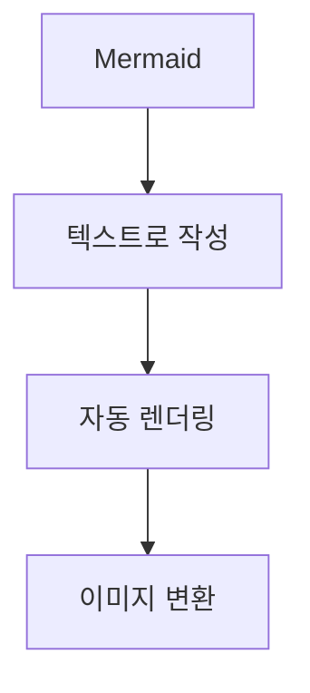
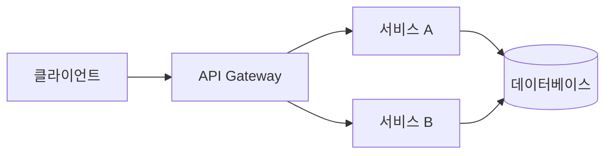
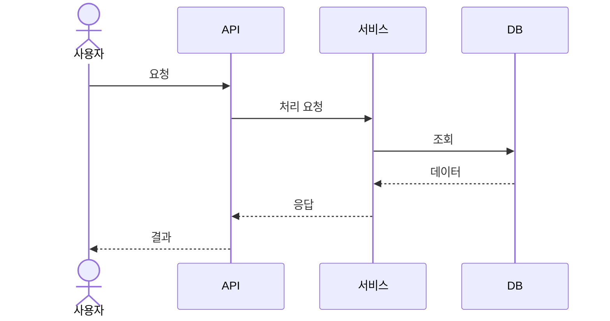
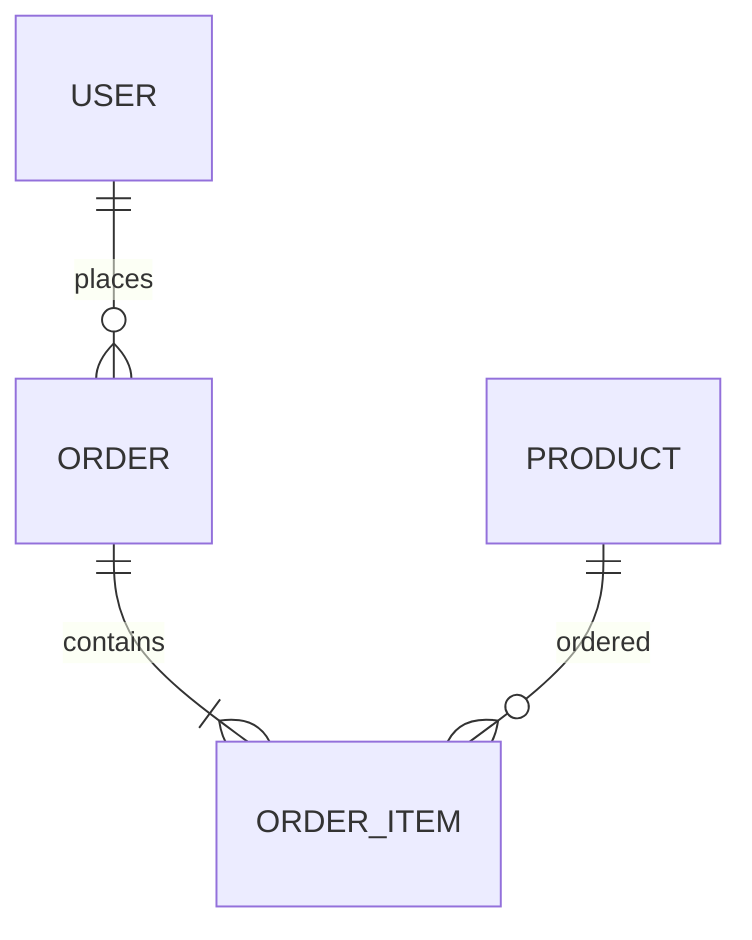

# Mermaid 다이어그램 기초

Mermaid 문법을 사용하여 시스템 아키텍처, API 흐름, 데이터 모델을 시각화하는 방법을 배웁니다.

## Mermaid란?

Markdown으로 다이어그램을 작성할 수 있는 도구입니다.

## 지원되는 다이어그램

| 유형 | 백엔드 활용 | 예시 |
|------|-------------|------|
| **flowchart** | 프로세스 흐름 | 주문 처리 흐름 |
| **sequenceDiagram** | API 호출 순서 | 결제 API 흐름 |
| **erDiagram** | 데이터 모델 | ERD |
| **graph** | 아키텍처 | 마이크로서비스 |
| **gantt** | 프로젝트 일정 | 개발 계획 |
| **stateDiagram** | 상태 머신 | 주문 상태 |

## 기초 문법

### Flowchart

### Sequence Diagram

### ERD

---

## 다음 단계

백엔드 다이어그램 활용:

→ [[17-mermaid-backend|백엔드 다이어그램]]
