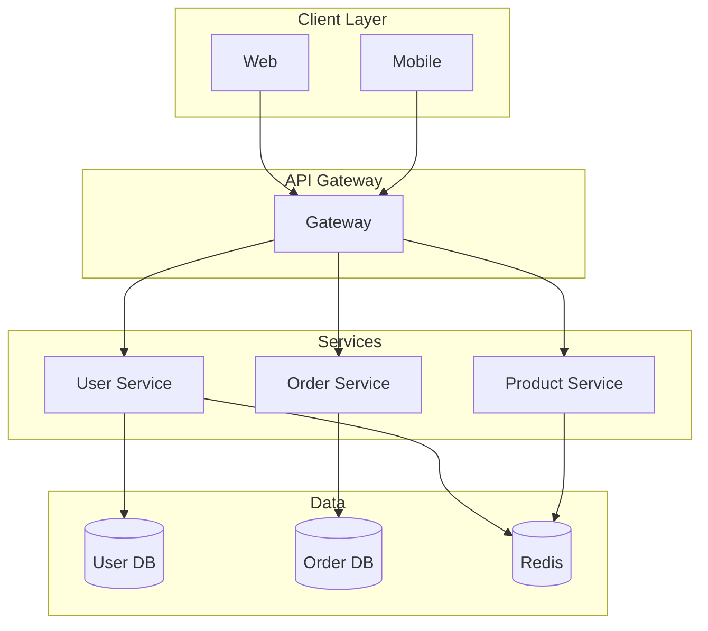
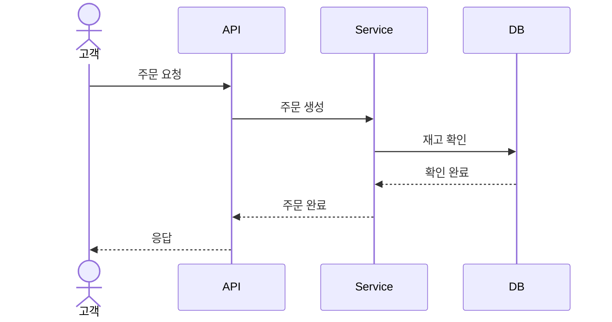
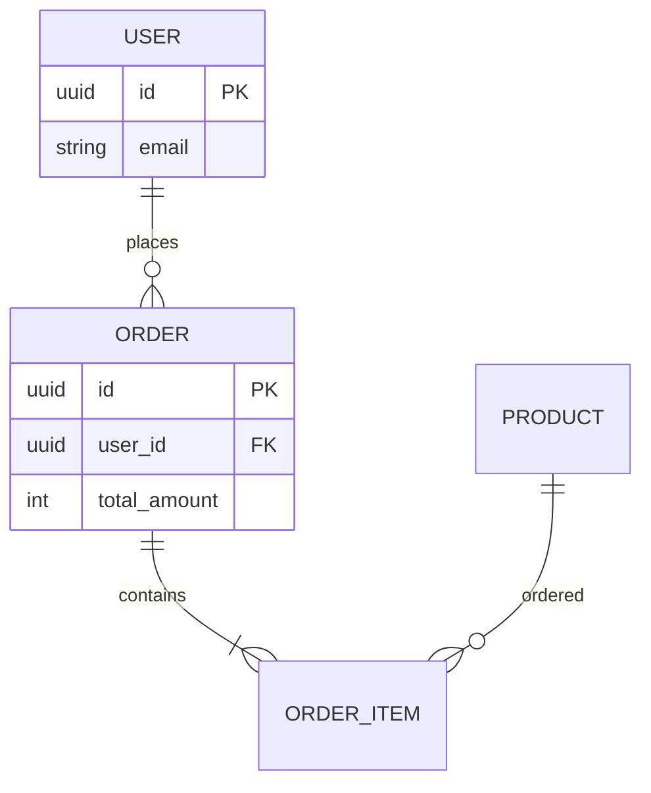

# 백엔드 다이어그램

백엔드 개발에 필수적인 다이어그램을 Mermaid로 작성하는 방법을 배웁니다.

## 시스템 아키텍처

```mermaid
graph TB
    subgraph "Client Layer"
        W[Web]
        M[Mobile]
    end

    subgraph "API Gateway"
        GW[Gateway]
    end

    subgraph "Services"
        U[User Service]
        O[Order Service]
        P[Product Service]
    end

    subgraph "Data"
        UDB[(User DB)]
        ODB[(Order DB)]
        R[(Redis)]
    end

    W --> GW
    M --> GW
    GW --> U
    GW --> O
    GW --> P

    U --> UDB
    O --> ODB
    U --> R
    P --> R
```

## API 시퀀스

```mermaid
sequenceDiagram
    actor C as 고객
    participant A as API
    participant S as Service
    participant D as DB

    C->>A: 주문 요청
    A->>S: 주문 생성
    S->>D: 재고 확인
    D-->>S: 확인 완료
    S-->>A: 주문 완료
    A-->>C: 응답
```

## ERD

```mermaid
erDiagram
    USER ||--o{ ORDER : places
    ORDER ||--|{ ORDER_ITEM : contains
    PRODUCT ||--o{ ORDER_ITEM : ordered

    USER {
        uuid id PK
        string email
    }

    ORDER {
        uuid id PK
        uuid user_id FK
        int total_amount
    }
```

---

→ [[18-smart-notes|Smart Notes 작성법]]
