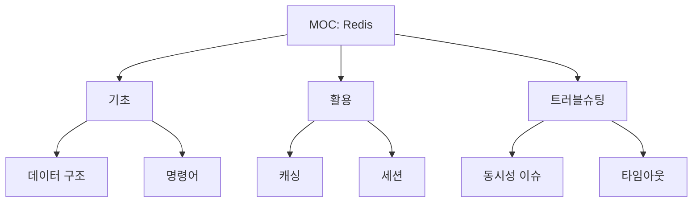

# MOC (Map of Content) 구축

지식의 지도를 만들어 빠르게 탐색하는 방법을 배웁니다.

## MOC란?

노트들의 목차(인덱스)입니다.



## MOC 예시

```markdown
# MOC: Redis

## 기초
- [[Redis/데이터-구조]]
- [[Redis/명령어]]
- [[Redis/설정]]

## 활용
- [[캐싱-전략]]
- [[분산-락]]
- [[Pub-Sub]]

## 트러블슈팅
- [[동시성-이슈]]
- [[타임아웃-최적화]]
- [[메모리-누수]]

## 관련 MOC
- [[MOC/데이터베이스]]
- [[MOC/성능-튜닝]]
```

## Claude로 MOC 생성

```markdown
"Claude, Redis 관련 모든 노트를
찾아서 MOC를 만들어줘.
카테고리별로 정리해서"
```

---

→ Part 6: 실전 워크플로우
