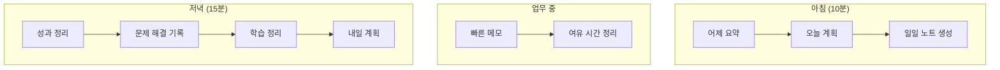

# 일일 루틴

지식 관리를 습관으로 만드는 일일 루틴을 설정합니다.

## 루틴 구성



## 아침 루틴

### 1. 어제 회고 (3분)

```markdown
Claude:
"어제(2025-01-09) 한 일을 3가지로 요약해줘"
```

### 2. 오늘 계획 (5분)

```markdown
Claude:
"어제 미완료한 것 + 오늘 해야 할 것으로
오늘 일일 노트를 만들어줘"
```

### 3. 우선순위 설정 (2분)

```markdown
- [ ] 🔥 긴급 + 중요
- [ ] ⭐ 중요하지만 급하지 않음
- [ ] 📅 급하지만 중요하지 않음
```

## 업무 중 루틴

### 빠른 메모

```markdown
# Inbox/quick-note.md
## 14:30
Redis 타임아웃 발생, 임시 조치 완료
```

## 저녁 루틴

### 정리 체크리스트

```markdown
- [ ] 완료한 작업 체크
- [ ] 해결한 문제 있으면 트러블슈팅 문서화
- [ ] 배운 것 있으면 학습 노트
- [ ] 내일 계획 수립
- [ ] 관련 노트 백링크
```

---

## 다음 단계

프로젝트별 루틴:

→ [[21-project-lifecycle|프로젝트 라이프사이클]]
