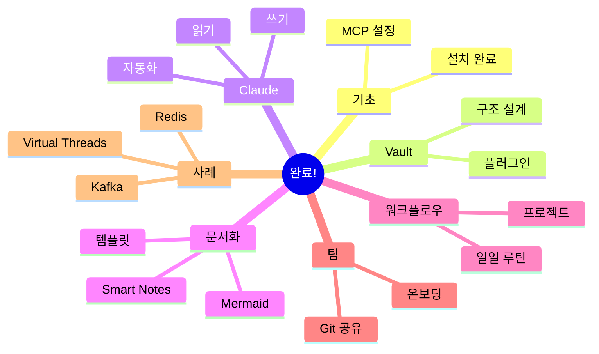

# Virtual Threads 학습 사례

새로운 기술을 학습하고 적용하는 과정을 보여줍니다.

## 학습 동기

```markdown
# 학습 큐

## Virtual Threads
- Java 21 새로운 기능
- 동시성 처리 혁신
- 프로젝트 적용 가능성
```

## 1단계: 문헌 메모

```markdown
## 출처: Oracle 블로그

"Virtual Threads는 JDK 21에서
표준 기능으로 제공됩니다.

기존: Platform Thread 4천개 = 1GB
Virtual Threads: 100만개 = 1GB"
```

## 2단계: 실습

```kotlin
// 기존 방식
Executors.newFixedThreadPool(200).submit {
    blockingOperation()  // 스레드 블로킹
}

// Virtual Threads
Executors.newVirtualThreadPerTaskExecutor().submit {
    blockingOperation()  // 가상 스레드 블로킹
}
```

### 벤치마크

```markdown
| 작업 | Platform Thread | Virtual Thread |
|------|-----------------|----------------|
| 1000 동시 요청 | 2,500ms | 800ms |
| 메모리 사용 | 1.2GB | 200MB |
```

## 3단계: 영구 메모

```markdown
# Virtual Threads (Project Loom)

## 핵심 개념
가상 스레드는 OS 스레드가 아닌
JVM이 관리하는 경량 스레드다.

## 장점
1. 메모리 효율적 (100:1)
2. 블로킹 API 사용 가능
3. 수백만 개의 동시 작업

## 한계
- CPU 연산에는 병렬성 없음
- ThreadLocal 사용 주의

## 적용
- I/O 집약적 작업
- 마이크로서비스 간 통신
- 비동기 처리

## 코드
```kotlin
val executor = Executors.newVirtualThreadPerTaskExecutor()

repeat(10_000) {
    executor.submit {
        httpClient.call(url)  // 블로킹 OK
    }
}
```

## 관련
- [[Java/Concurrency]]
- [[Reactive-Programming]]
```

## 4단계: 프로젝트 적용

```markdown
# 적용 계획

## 타겟
- 외부 API 호출 서비스
- 배치 작업

## 일정
- PoC: 1주
- 도입: 2주
```

## 결과

- 응답 시간 40% 개선
- 메모리 사용량 80% 감소
- 코드 간결화

---

## 가이드 완료!

축하합니다! 전체 가이드를 완료했습니다.



## 다음 단계

1. Vault 생성
2. 첫 노트 작성
3. 루틴 확립
4. 팀 공유

Happy Note-taking! 📝
