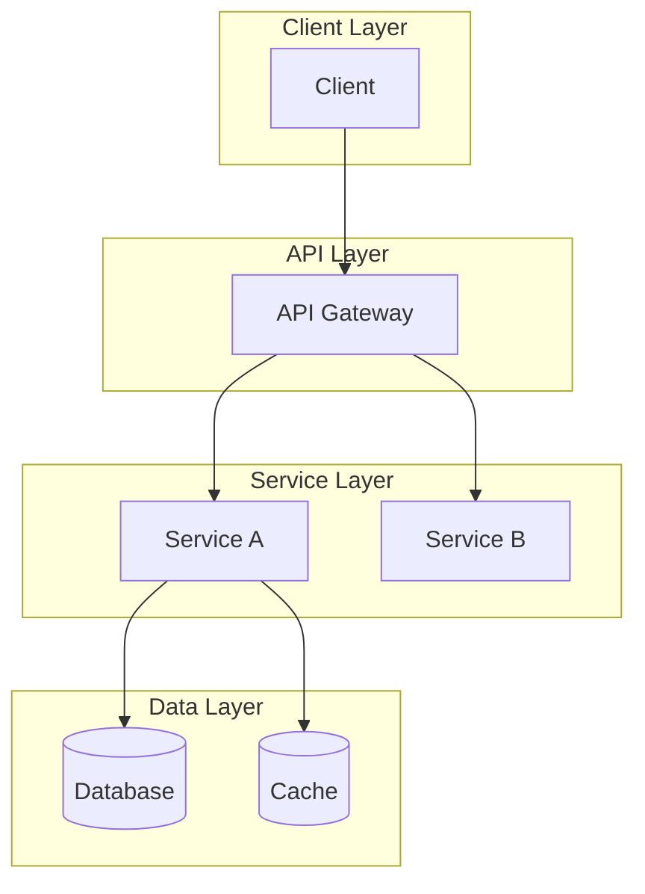
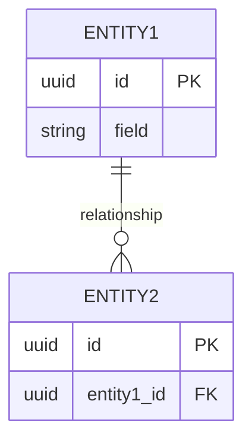
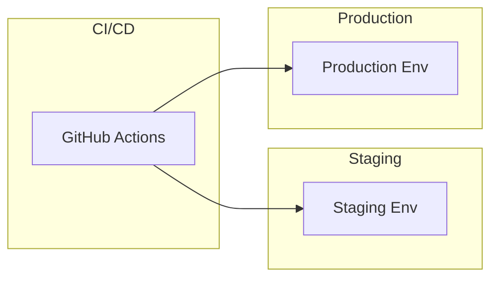


# {{system_name}} 설계

## 1. 개요

### 1.1 목적
{{purpose}}

### 1.2 범위
{{scope}}

### 1.3 제약 사항
{{constraints}}

## 2. 요구사항

### 2.1 기능 요구사항
| 기능 | 설명 | 우선순위 |
|------|------|----------|
| {{feature_1}} | {{description}} | {{priority}} |

### 2.2 비기능 요구사항
| 항목 | 목표 | 측정 방법 |
|------|------|----------|
| 성능 | {{performance_goal}} | {{measurement}} |
| 가용성 | {{availability}} | {{sla}} |
| 확장성 | {{scalability}} | {{metric}} |
| 보안 | {{security}} | {{standard}} |

## 3. 아키텍처

### 3.1 전체 구조

### 3.2 컴포넌트 상세
{{component_details}}

## 4. 데이터 모델

### 4.1 ERD

### 4.2 스키마
{{schema_details}}

## 5. API 설계

### 5.1 API 목록
| API | Method | Endpoint | 설명 |
|-----|--------|----------|------|
| {{api_1}} | {{method}} | {{path}} | {{description}} |

### 5.2 주요 API 상세
{{api_details}}

## 6. 기술 스택

| 계층 | 기술 | 사유 |
|------|------|------|
| 언어 | {{language}} | {{reason}} |
| 프레임워크 | {{framework}} | {{reason}} |
| 데이터베이스 | {{database}} | {{reason}} |
| 메시지 큐 | {{message_queue}} | {{reason}} |
| 캐시 | {{cache}} | {{reason}} |

## 7. 배포 구조

## 8. 모니터링

### 8.1 메트릭
- {{metric_1}}
- {{metric_2}}

### 8.2 알림
- {{alert_1}}
- {{alert_2}}

## 9. 고려사항 및 리스크

| 리스크 | 영향 | 완화 계획 |
|--------|------|----------|
| {{risk}} | {{impact}} | {{mitigation}} |

## 10. 구현 계획

| 단계 | 작업 | 예상 기간 | 담당자 |
|------|------|-----------|--------|
| {{phase}} | {{task}} | {{duration}} | {{owner}} |

## 참고 자료
- [{{reference}}]({{url}})
- [[{{related_note_1}}]]
- [[{{related_note_2}}]]

## 변경 이력
| 일자 | 버전 | 변경 내용 | 작성자 |
|------|------|----------|--------|
| {{date}} | {{version}} | {{changes}} | {{author}} |

