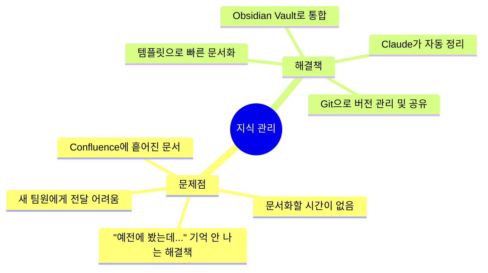

# 백엔드 개발자를 위한 Claude Code + Obsidian 지식 관리법

> **AI와 함께 구축하는 제2의 뇌**

이 가이드는 백엔드 개발자가 Claude Code와 Obsidian을 활용해 체계적인 지식 관리 시스템을 구축하는 방법을 안내합니다.

## 🎯 타겟 독자

- Obsidian과 Claude Code의 기본 사용법을 알지만, 체계적인 방법론이 필요한 분
- 백엔드 개발자로서 트러블슈팅, 시스템 설계, 기술 학습을 효율적으로 관리하고 싶은 분
- 팀으로 확장 가능한 지식 공유 시스템을 구축하고 싶은 분

## 📚 가이드 구성

### [Part 1: 기초 다지기](Part1-Basics/)
이 도구들을 왜 사용해야 하는지, 어떻게 시작하는지 배웁니다.

| 노트 | 내용 | 시간 |
|------|------|------|
| [왜 Claude Code + Obsidian인가?](Part1-Basics/01-why-claude-obsidian/) | 백엔드 개발자의 지식 관리 난제와 해결책 | 10분 |
| [설치 및 초기 설정](Part1-Basics/02-installation/) | MCP 서버 설정까지 완벽 가이드 | 20분 |
| [MCP 서버 심화](Part1-Basics/03-mcp-deep-dive/) | MCP 개념과 고급 설정 | 15분 |
| [첫 노트 작성하기](Part1-Basics/04-first-steps/) | 실전 첫 경험 | 10분 |

### [Part 2: Vault 구조 설계](Part2-Structure/)
백엔드 개발자에게 맞는 지식 저장소를 설계합니다.

| 노트 | 내용 | 시간 |
|------|------|------|
| [Vault 설계](Part2-Structure/05-vault-design/) | PARA Method와 기술 스택별 분류 | 15분 |
| [필수 플러그인](Part2-Structure/06-essential-plugins/) | REST API, Dataview, Excalidraw | 20분 |
| [폴더 구조](Part2-Structure/07-folder-structure/) | 실제 백엔드 팀을 위한 구조 | 10분 |

### [Part 3: Claude Code 연동](Part3-Integration/)
AI와 함께 노트를 읽고 쓰는 방법을 배웁니다.

| 노트 | 내용 | 시간 |
|------|------|------|
| [Claude로 노트 읽기](Part3-Integration/08-claude-reading/) | 검색, 질의, 지식 추출 | 15분 |
| [Claude로 노트 쓰기](Part3-Integration/09-claude-writing/) | 자동 생성, 템플릿 적용 | 20분 |
| [자동화 워크플로우](Part3-Integration/10-automation/) | 일일 정리, 주간 회고 | 15분 |

### [Part 4: 템플릿 활용](Part4-Templates/)
재사용 가능한 문서 템플릿을 만듭니다.

| 노트 | 내용 | 시간 |
|------|------|------|
| [템플릿 개요](Part4-Templates/11-templates-overview/) | 템플릿 사용법과 커스터마이징 | 10분 |
| [일일 기록 템플릿](Part4-Templates/12-template-daily/) | Daily Note, 주간 회고 | 15분 |
| [트러블슈팅 템플릿](Part4-Templates/13-template-troubleshooting/) | 문제 해결 문서화 | 15분 |
| [API 설계 템플릿](Part4-Templates/14-template-api/) | API 명세서 작성 | 20분 |
| [시스템 설계 템플릿](Part4-Templates/15-template-design/) | 아키텍처 문서화 | 20분 |

### [Part 5: 문서화 기법](Part5-Methodology/)
시각화와 스마트 노트 작성법을 배웁니다.

| 노트 | 내용 | 시간 |
|------|------|------|
| [Mermaid 기초](Part5-Methodology/16-mermaid-basics/) | 다이어그램 문법 | 15분 |
| [백엔드 다이어그램](Part5-Methodology/17-mermaid-backend/) | 아키텍처, 시퀀스, ERD | 25분 |
| [Smart Notes](Part5-Methodology/18-smart-notes/) | Zettelkasten 방법론 | 20분 |
| [MOC 구축](Part5-Methodology/19-moc-method/) | 지도 만들기와 인덱싱 | 15분 |

### [Part 6: 실전 워크플로우](Part6-Workflow/)
실제 업무에 적용하는 루틴을 만듭니다.

| 노트 | 내용 | 시간 |
|------|------|------|
| [일일 루틴](Part6-Workflow/20-daily-routine/) | 아침/저녁 루틴과 Claude 활용 | 15분 |
| [프로젝트 라이프사이클](Part6-Workflow/21-project-lifecycle/) | 설계-개발-회고 | 20분 |
| [학습 사이클](Part6-Workflow/22-learning-cycle/) | 학습-정리-재구성 | 15분 |

### [Part 7: 팀 협업](Part7-Teamwork/)
팀으로 확장하는 방법을 배웁니다.

| 노트 | 내용 | 시간 |
|------|------|------|
| [팀 Vault 구축](Part7-Teamwork/23-team-vault/) | Git 공유와 코드 리뷰 | 20분 |
| [온보딩 자동화](Part7-Teamwork/24-onboarding/) | 신규 입사자 가이드 | 15분 |

### [Part 8: 실전 사례](Part8-Examples/)
실제 프로젝트 사례를 학습합니다.

| 노트 | 내용 | 시간 |
|------|------|------|
| [Redis 동시성 이슈](Part8-Examples/25-case-redis/) | 트러블슈팅 사례 | 15분 |
| [Kafka 도입 검토](Part8-Examples/26-case-kafka/) | 기술 선택 문서 | 15분 |
| [Virtual Threads 학습](Part8-Examples/27-case-virtual-threads/) | 기술 학습 노트 | 15분 |

## 🚀 빠른 시작

**최소 경로 (2시간)**
1. [왜 Claude Code + Obsidian인가?](Part1-Basics/01-why-claude-obsidian/)
2. [설치 및 초기 설정](Part1-Basics/02-installation/)
3. [Vault 설계](Part2-Structure/05-vault-design/)
4. [Claude로 노트 쓰기](Part3-Integration/09-claude-writing/)
5. [트러블슈팅 템플릿](Part4-Templates/13-template-troubleshooting/)
6. [일일 루틴](Part6-Workflow/20-daily-routine/)

## 📁 템플릿 모음

즉시 사용 가능한 템플릿 6개를 제공합니다:

| 템플릿 | 용도 | 링크 |
|--------|------|------|
| Daily Note | 일일 기록과 태스크 관리 | [Daily Note](Templates/daily-note.html) |
| Weekly Review | 주간 회고 | [Weekly Review](Templates/weekly-review.html) |
| Troubleshooting | 문제 해결 문서화 | [Troubleshooting](Templates/troubleshooting.html) |
| API Spec | API 명세서 | [API Spec](Templates/api-spec.html) |
| System Design | 시스템 설계 | [System Design](Templates/system-design.html) |
| Tech Study | 기술 학습 | [Tech Study](Templates/tech-study.html) |

## 🔧 전제 조건

이 가이드를 따라하기 위해 필요한 것들:

- [x] Obsidian 설치됨 (v1.0+)
- [x] Claude Code 설치됨
- [ ] Obsidian Local REST API 플러그인 설치
- [ ] MCP 서버 설정

## 💡 핵심 개념

### Claude Code + Obsidian = 완벽한 조합

| Claude Code | Obsidian |
|-------------|----------|
| AI가 노트를 읽고 이해 | 지식을 구조화하고 연결 |
| 자동으로 정리하고 요약 | 백링크로 관계 형성 |
| 검색과 질의 | 빠른 전체 텍스트 검색 |
| 템플릿 적용 | 재사용 가능한 포맷 |

### 백엔드 개발자의 지식 관리 문제

## 📖 학습 팁

1. **실전 위주**: 이론보다 실제 예제를 따라해보세요
2. **점진적 도입**: 한 번에 다 하려 하지 말고, 하나씩 적용해보세요
3. **커스터마이징**: 템플릿과 구조를 본인 스타일에 맞게 수정하세요
4. **지속성**: 완벽하려 하지 말고, 꾸준히 기록하는 것이 중요합니다

## 🔗 관련 자료

- [Claude Code 공식 문서](https://docs.anthropic.com/claude-code)
- [Obsidian 공식 문서](https://help.obsidian.md/)
- [MCP 프로토콜 사양](https://modelcontextprotocol.io/)
- [Zettelkasten 방법론](https://zettelkasten.de/)

---

**다음 단계**: [왜 Claude Code + Obsidian인가?](Part1-Basics/01-why-claude-obsidian/) 편으로 계속하세요
